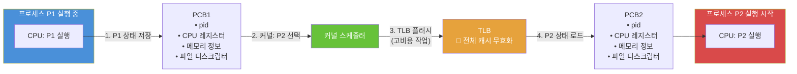
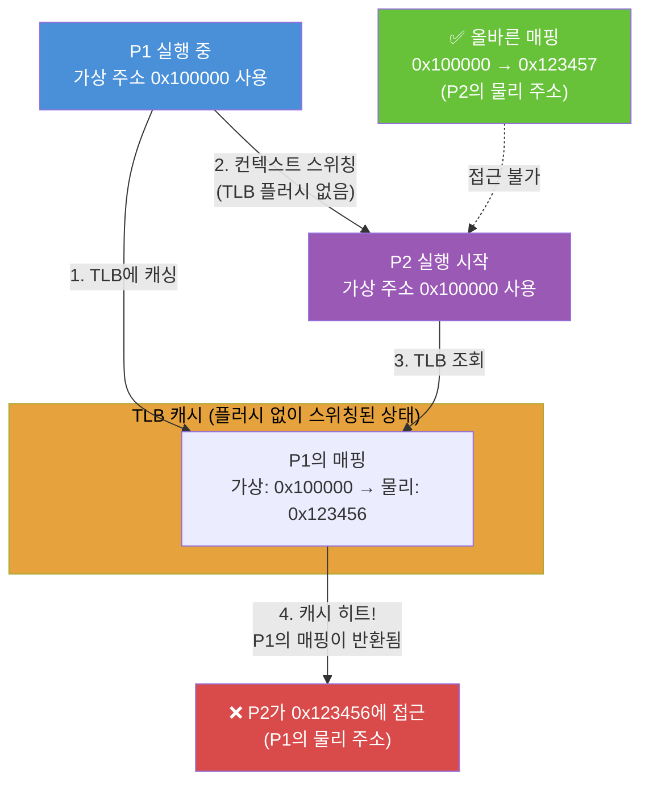
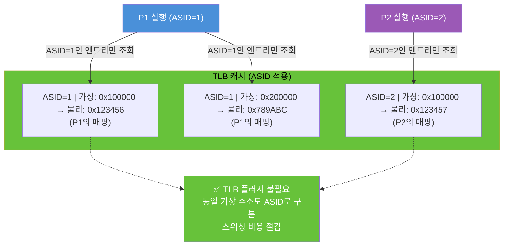
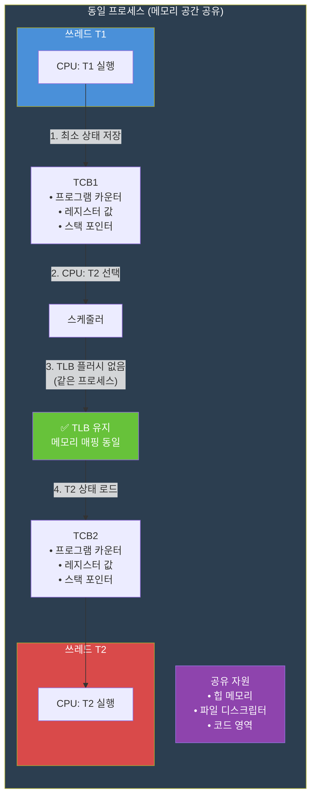

# 프로세스와 쓰레드 비용

## 프로세스와 쓰레드 컨텍스트 스위칭

### 프로세스 컨텍스트 스위칭

P1 -> P2로 스위칭

1. 모든 정보를 PCB1에 저장
    * pid
    * cpu 레지스터
    * 메모리 정보
    * 파일 디스크립터 테이블
    * ...
2. 커널의 cpu가 P2를 선택
3. TLB 플러시 -> 고비용 작업
4. P2에 있던 정보를 cpu에 로드하여 작업 수행

**TLB**

* 가상 주소를 물리 주소로 변환하는 정보를 캐싱하는 하드웨어 장치
* 프로세스는 같은 가상 메모리 주소를 갖지만, 실제 메모리 매핑 주소는 다름
    * 각 프로세스는 독립적이나 메모리 레이아웃은 동일함

컨텍스트 스위칭 시 TLB 플러시가 없다면 다음과 같은 상황에서 문제가 발생하게 된다:

1. P1 실행중 (가상 주소 0x100000)
2. 0x100000 : 0x123456으로 TLB에 캐싱
3. 컨텍스트 스위칭
4. P2 실행 준비 (가상 주소 0x100000)
5. P2의 가상 주소로 물리 주소로 찾아가려고 TLB를 조회
6. P1의 주소가 아직 남아있기 때문에 0x123457이 아닌 0x123456로 접근
7. P2는 0x100000 : 0x123456로 TLB에서 매핑되어버림
8. 캐시 히트가 발생하므로 P2는 자신의 매핑 정보를 TLB에 담을 수 없고,
9. 설령 매핑 정보를 담는다 하더라도 동일한 key(p1, p2의 가상주소)이기 때문에 이상한 주소로 접근할 가능성 존재

결국 TLB 플러시라는 오버헤드를 줄이기 위해 ASID(Address Space Identifier)라는 구분자를 하나 더 두는 구조가 생김

### 쓰레드 컨텍스트 스위칭

1. 프로그램 카운터, 레지스터 값, 스택 포인터를 T1 TCB에 저장
2. cpu가 T2 선택
3. 프로세스는 유지하면서 쓰레드만 스위칭 하기 때문에(TLB 플러시 필요없음) 프로세스에 비해 스위칭이 빠름
4. T2의 정보를 로드하여 동작

## 컨텍스트 스위칭 시 왜 비용이 더 큰가?

* TLB 캐시 플러시
* 프로세스는 프로그램을 구동시키기 위해 독립적으로 메모리를 할당받는다
    * 스위칭 시 cpu가 알고있어야 하는 아래의 값들이 변경되어야 함
        * 페이지 테이블 (메모리)
        * 레지스터 값
* 쓰레드는 프로세스 내에서 동작하여 페이지 테이블, 레지스터 값이 변경되지 않으므로 더 낮은 비용

그러면 P1.T1 -> P2.T2로 스위칭되면 어떻게 되는건가?

pod에서는 1개의 프로세스(was)만 있어 P1.T1 -> P1.T2와 같이 스위칭이 발생하여 효율적인 비용 처리가 될 것 같으나 만약 n개의 프로세스가 존재하는 환경에서는 어떻게 되는 것인가?

=> 다른 프로세스로 전환되는 것이기 때문에 프로세스 스위칭

---

## 비교 요약

| 항목 | 프로세스 스위칭 | 스레드 스위칭 |
|------|:-------------:|:-----------:|
| 메모리 공간 | 독립 (각자 힙, 스택) | 공유 (같은 힙, 각자 스택) |
| TLB 플러시 | 필요 (고비용) | 불필요 |
| 저장/복원 범위 | PCB 전체 (레지스터, 메모리 정보, 파일 디스크립터 등) | TCB 일부 (레지스터, 스택 포인터, PC) |
| 비용 | 높음 | 낮음 |
| 캐시 효율 | 스위칭 후 캐시 미스 높음 | 공유 메모리 덕에 캐시 히트 유지 |

## 실무 관점

* **WAS(Tomcat)**: 하나의 프로세스 내에서 스레드 풀을 운용 → 스레드 스위칭만 발생하여 효율적
* **컨테이너(Pod)**: 보통 1개의 메인 프로세스(JVM)만 실행 → P1.T1 → P1.T2 스위칭
* **가상 스레드(Java 21)**: OS 스레드가 아닌 JVM 레벨 스레드로 스위칭 비용을 더욱 낮춤
