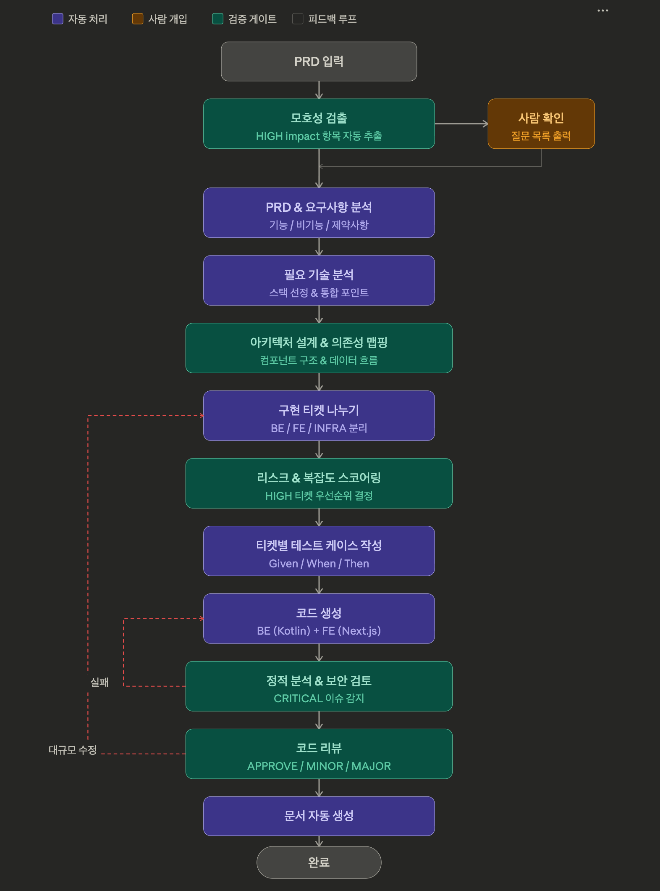
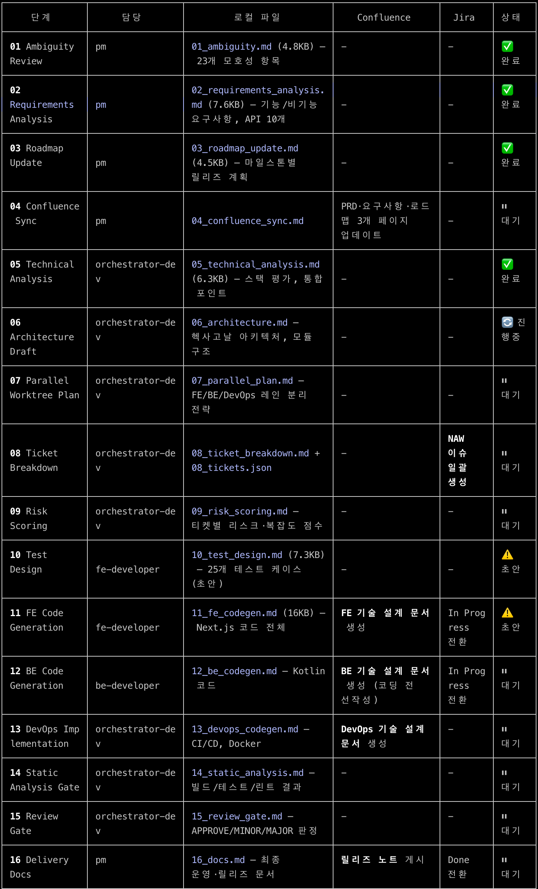
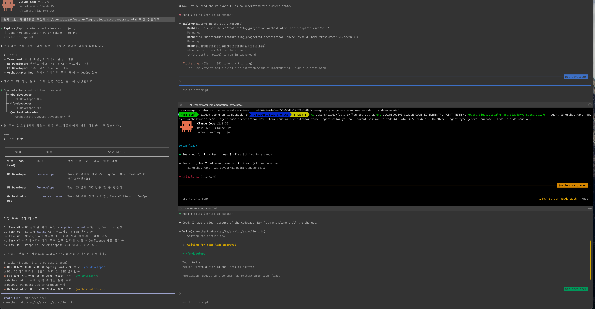
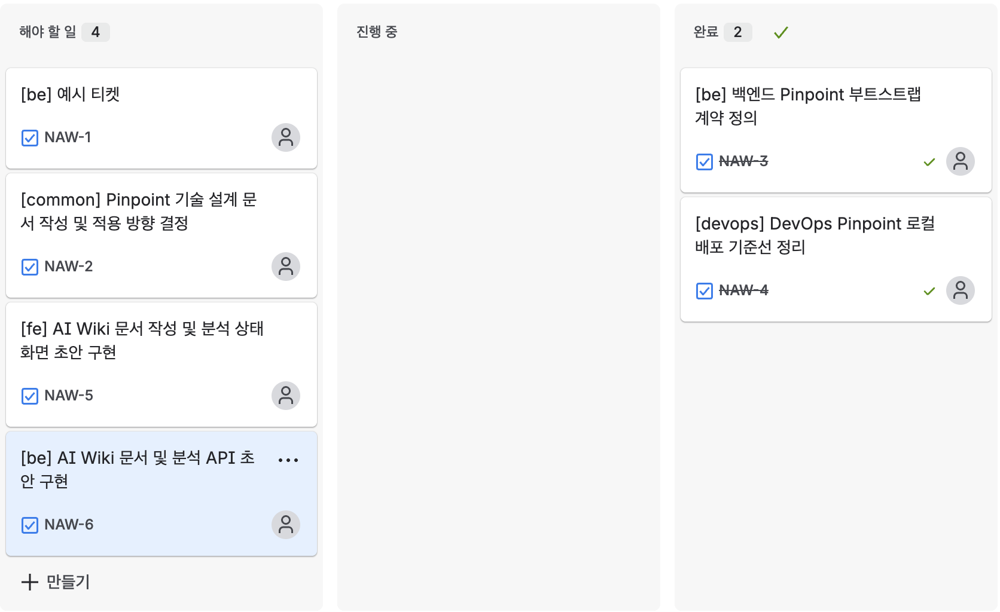
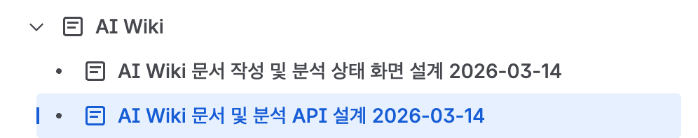
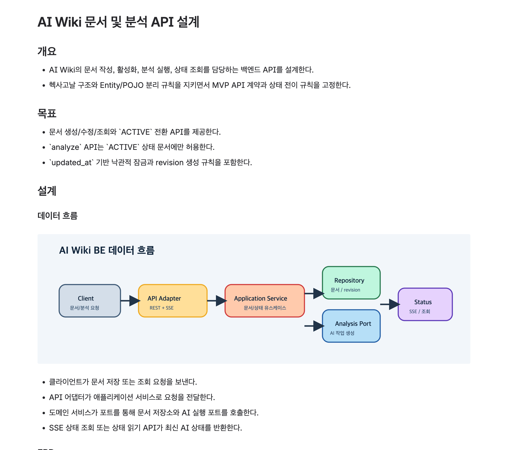

# [AI] AI 오케스트레이션 (Claude Agent Team)

## AI 오케스트레이션이란

AI 오케스트레이션은 여러 AI 모델, 애플리케이션, 데이터 소스, 에이전트들을 워크플로 안에서 "유기적으로 연결, 조정 관리하는 기술"이다. 워크플로는 파이프라인이며, 단계별로 작업을 순차적 또는 병렬적으로 수행한다.

초기 AI 서비스는 단순한 질문-답변 반복 구조였으나, 복합적 작업을 위해 AI 오케스트레이션이 등장했다.

## AI 오케스트레이션 프레임워크

### CrewAI

여러 AI 모델을 팀처럼 구성하여 협업하게 하는 프레임워크이다.

**주요 구성요소:**
- **에이전트**: 역할(Role), 목표(Goal), 배경(Backstory)을 가진 팀원
- **태스크**: 에이전트가 수행할 업무
- **도구**: 검색 엔진, DB 조회 등 실제 액션
- **크루**: 모든 것을 조율하는 팀

**작업 예시:**
- 에이전트 A (리서처): 최신 뉴스 검색 및 요약
- 에이전트 B (필자): 요약본을 블로그 글로 작성
- 에이전트 C (편집자): 오타 확인 및 검수

### LangChain

AI 모델을 다양한 데이터 소스나 도구와 연결하여 작업을 수행한다.

**주요 구성요소:**
- Model I/O
- Retrieval (RAG)
- Chains
- Agents
- Memory
- Callbacks

### Claude Agent Team

Claude Code에서 제공하는 기능으로, 하위 팀원들이 서로 의견을 나누고 작업을 공유할 수 있다.

**주요 구성요소:**
- **팀리더**: 팀 관리 및 작업 조율
- **팀원들**: 할당된 작업 수행
- **작업 목록**: 공유 작업 항목
- **메일박스**: 에이전트간 통신 시스템

## AI Wiki 프로젝트

### PRD 한 줄 정의
"사용자는 기록에 집중하고, AI는 요약·태깅·임베딩·검색 준비를 담당한다."

### MVP 목표
1. Markdown 문서를 계층형으로 저장 및 수정
2. 문서를 ACTIVE로 전환하면 AI 파이프라인이 비동기 실행
3. SSE로 처리 상태 실시간 확인
4. 제목/본문/태그 기준 검색

### 문서 상태
- DRAFT
- ACTIVE
- DELETED

### AI 상태
- NOT_STARTED
- PENDING
- PROCESSING
- COMPLETED
- FAILED

## 프로세스 정의 및 적용

### 파이프라인 단계
1. PRD 요구사항 분석
2. 필요 기술 스택 분석
3. 구현 티켓 나누기
4. 티켓별 테스트 케이스 작성
5. 코드 생성
6. 코드 리뷰

### 역할 정의
- PM: 요구사항 정의
- Architect: 시스템 설계
- FE: UI/UX 구현
- BE: API, DB, 비즈니스 로직
- QA: 테스트 작성 및 실행
- Reviewer: 코드 리뷰

### 도구 및 형상관리
- Jira: 티켓 관리
- Confluence: 문서 관리
- Git worktree: 각 에이전트별 형상관리

## 산출물

### 파이프라인별 산출물

- 모호성 질문 목록
- 최신 PRD/로드맵
- 멀티 모듈 아키텍처 초안
- 구현 티켓 목록
- 리뷰 포인트
- 최종 기술 문서

## 주요 학습 및 후기

### 작업 완료 기준 정의의 중요성
작업 완료의 기준을 명확히 정의하지 않으면 중간에 멈추고 "다음 작업을 진행할까?"라는 질문을 반복하게 된다.

### 명확한 목표 설정 필요
초기에 AI가 자신의 작업 대상을 잘못 이해하여 잘못된 작업을 진행했다. 파이프라인을 명시적으로 고정시켜야 한다.

### 파이프라인 준수의 중요성
정의한 파이프라인을 따르도록 명시하지 않으면 에이전트들이 각자 작업을 수행하기 시작한다.
