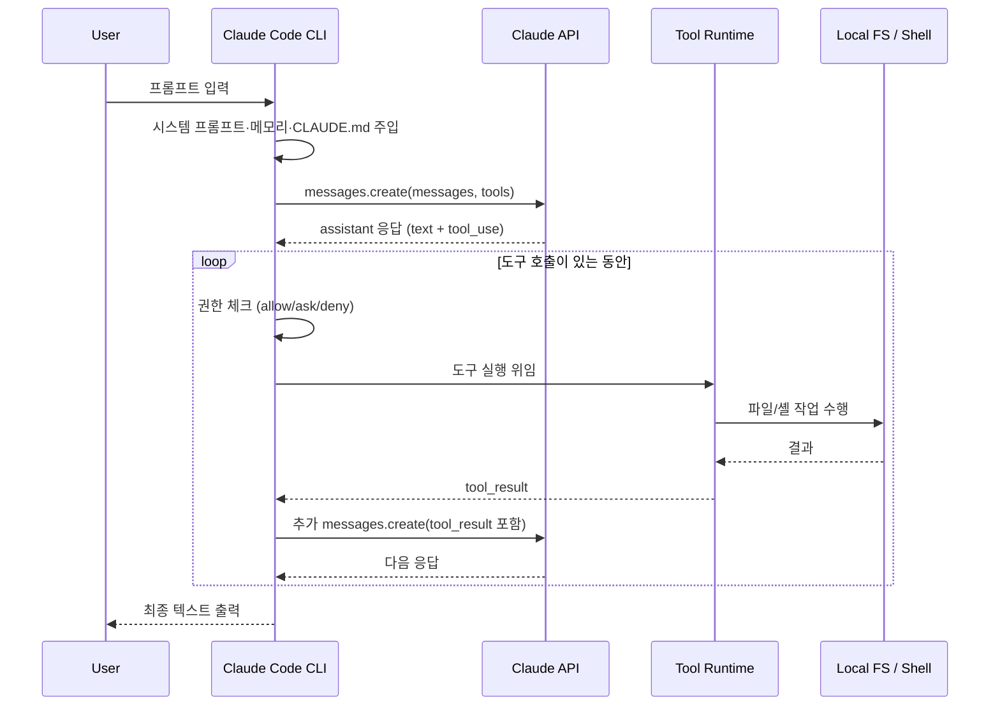

# 클로드 코드 실행

## 클로드 코드란
---
클로드 코드(Claude Code)는 **LLM(Claude) + 도구(Tool) + 권한 시스템 + 컨텍스트 관리자**가 결합된 에이전트형 CLI다. 사용자의 자연어 지시를 받아 파일을 읽고, 코드를 수정하고, 셸 명령을 실행해 소프트웨어 엔지니어링 작업을 자율적으로 수행한다.

LLM 그 자체는 텍스트만 생성하지만, 클로드 코드는 그 위에 "도구를 호출하고, 결과를 다시 모델에 던지는 루프"를 얹어 실제 파일 시스템·셸·외부 API와 상호작용하게 만든다.

### 실행 환경

| 환경 | 실행 방식 |
|---|---|
| **CLI 모드** | 터미널에서 `claude` (대화형) 또는 `claude -p "..."` (one-shot) |
| **IDE 확장** | VS Code / JetBrains 내부에서 동일 엔진 구동, 선택 영역(`ide_selection`)이 컨텍스트로 전달 |
| **Web** | claude.ai/code에서 호스팅 환경으로 동일 모델·도구 사용 |
| **Agent SDK** | 동일 엔진을 라이브러리로 임베드해 커스텀 에이전트 구축 |

## 구조
---
클로드 코드는 사용자 → CLI → 모델 → 도구 → 로컬 시스템으로 이어지는 다층 구조로 동작한다.

```
┌─────────────────────────────────────────────────────────────────┐
│                         User (Terminal / IDE)                    │
└───────────────────────────┬─────────────────────────────────────┘
                            │ 자연어 프롬프트 / 슬래시 명령
                            ▼
┌─────────────────────────────────────────────────────────────────┐
│                       Claude Code CLI                            │
│  ┌───────────────┐  ┌──────────────┐  ┌─────────────────────┐  │
│  │ Session/State │  │ Context Mgr  │  │ Permission System   │  │
│  │  - 대화 이력  │  │  - 압축/요약 │  │  - allow/deny/ask   │  │
│  │  - TODO       │  │  - 토큰 예산 │  │  - settings.json    │  │
│  └───────────────┘  └──────────────┘  └─────────────────────┘  │
│  ┌───────────────────────────────────────────────────────────┐  │
│  │                  Tool Runtime (Loop)                       │  │
│  │   Read / Write / Edit / Bash / Grep / Glob / Agent / ...   │  │
│  └───────────────────────────────────────────────────────────┘  │
│  ┌───────────────────────────────────────────────────────────┐  │
│  │                  Extension Surfaces                        │  │
│  │   Hooks · Skills · Subagents · MCP Servers · Plugins       │  │
│  └───────────────────────────────────────────────────────────┘  │
└───────────────┬───────────────────────────────────┬─────────────┘
                │ HTTPS (Messages API)               │ 로컬 I/O
                ▼                                    ▼
        ┌──────────────────┐               ┌──────────────────┐
        │  Anthropic API   │               │ Local Filesystem │
        │  (Claude Model)  │               │  Shell · Git     │
        └──────────────────┘               └──────────────────┘
```

### 핵심 구성요소

| 구성요소 | 역할 | 자세히 |
|---|---|---|
| **Claude 모델** | 추론·계획·코드 생성 담당. Opus/Sonnet/Haiku 중 선택 | [모델](#모델) |
| **Tool Runtime** | 모델이 요청한 도구(Read/Edit/Bash 등)를 실제로 실행 | [tools 섹션](#tools-도구-카탈로그) |
| **Permission System** | 도구 호출마다 허용/거부/사용자 확인을 판정 | [권한 시스템](#권한-시스템) |
| **Context Manager** | 토큰 한도 안에서 대화·파일·도구 결과를 관리 | [컨텍스트 관리](#컨텍스트-관리) |
| **Hooks** | 특정 이벤트(SessionStart, PreToolUse 등)에 셸 스크립트 자동 실행 | [확장 메커니즘](#확장-메커니즘) |
| **Skills** | 도메인 지식·절차를 캡슐화한 모듈(`/<skill-name>`으로 호출) | [확장 메커니즘](#확장-메커니즘) |
| **Subagents** | 독립 컨텍스트에서 병렬·격리 실행되는 보조 에이전트 | [확장 메커니즘](#확장-메커니즘) |
| **MCP Servers** | 외부 시스템(Notion, Jira, GitHub 등)을 도구로 노출하는 표준 프로토콜 | [확장 메커니즘](#확장-메커니즘) |

#### 구성요소 간 협력

여덟 개의 구성요소는 한 도구 호출 안에서 다음 순서로 협력한다.

```
사용자 입력
   │
   ▼
[Context Manager] 시스템 프롬프트·메모리·CLAUDE.md·Skill 본문을 조립
   │
   ▼
[Claude 모델] 추론 → tool_use 블록 생성
   │
   ▼
[Permission System] allow/deny/ask 판정
   │
   ▼
[Hooks::PreToolUse] 결정론적 가드 실행
   │
   ▼
[Tool Runtime] 실제 도구 실행
   │   ├── 로컬: Read/Edit/Bash
   │   ├── 격리: Agent → Subagent
   │   └── 외부: mcp__* → MCP Server
   │
   ▼
[Hooks::PostToolUse] 후처리 (린트/포맷/로깅)
   │
   ▼
[Context Manager] tool_result를 messages에 누적 + 필요 시 압축
   │
   ▼
[Claude 모델] 다음 행동 결정 (루프 반복 또는 end_turn)
```

각 구성요소는 책임이 분리되어 있다. 모델은 "무엇을 할지"만 결정하고, 실행·검증·기록은 다른 컴포넌트가 맡는다. 이 분리 덕에 LLM의 비결정성을 결정론적 통제로 감쌀 수 있다.

## 동작 흐름
---
한 번의 사용자 프롬프트가 들어왔을 때, 클로드 코드는 다음 라이프사이클로 처리한다.



### 에이전트 루프

클로드 코드의 동작은 **`while (도구 호출이 있다) { 실행하고 다시 모델에 던진다 }`** 루프다. 의사 코드로 표현하면 다음과 같다.

```pseudo
messages = [system_prompt, user_input]
loop:
    response = anthropic.messages.create(
        model = "claude-opus-4-7",
        system = system_prompt,
        messages = messages,
        tools = AVAILABLE_TOOLS,
    )
    messages.append(response)

    if response.stop_reason == "end_turn":
        break

    if response.has_tool_use():
        for tool_call in response.tool_calls:
            check_permission(tool_call)         // ① 권한
            run_hook("PreToolUse", tool_call)   // ② 훅
            result = execute_tool(tool_call)    // ③ 실행
            run_hook("PostToolUse", result)     // ④ 훅
            messages.append(tool_result(result))
```

모델은 한 번에 작업을 끝내지 않고 **"생각 → 도구 호출 → 결과 관찰 → 다시 생각"** 을 반복한다. 도구 결과를 새 입력으로 받아 다음 행동을 결정하기 때문에, 외부 상태에 반응적으로 동작할 수 있다.

### 사용자가 Enter를 누르는 순간에 벌어지는 일

1. 입력이 `UserPromptSubmit` 훅을 통과한다.
2. 시스템 프롬프트 + 메모리 + CLAUDE.md + 도구 스키마가 캐시 prefix로 모델에 전송된다.
3. 모델이 `text` + `tool_use` 블록을 스트리밍으로 반환한다.
4. CLI는 `tool_use`마다 권한 평가 → `PreToolUse` 훅 → 도구 실행 → `PostToolUse` 훅을 수행한다.
5. 도구 결과를 `tool_result`로 묶어 다음 API 호출에 첨부한다.
6. 모델이 `end_turn`을 낼 때까지 3~5단계를 반복한다.
7. 최종 텍스트가 사용자 화면에 렌더링되고 `Stop` 훅이 실행된다.
8. (옵션) 메모리·세션 요약이 디스크에 저장된다.

## Messages API 파라미터
---
앞의 의사 코드에서 본 `anthropic.messages.create(system, messages, tools)`는 Anthropic Claude API의 핵심 호출이다. 클로드 코드의 에이전트 루프는 사실상 이 세 파라미터를 조립하고 응답을 받는 일을 반복한다.

```
┌───────────────────────────────────────────────┐
│  anthropic.messages.create(                   │
│      model = "claude-opus-4-7",               │
│      system = "<페르소나·규칙·메모리>",        │  ← 거의 안 바뀜 (캐시됨)
│      messages = [user, assistant, user, ...], │  ← 매 턴마다 누적
│      tools = [Read, Edit, Bash, mcp__..., ...]│  ← 거의 안 바뀜 (캐시됨)
│  )                                            │
└───────────────────────────────────────────────┘
```

| 파라미터 | 성격 | 변동성 |
|---|---|---|
| `system` | 모델에게 "너는 누구고 어떻게 행동해야 하는지" | 세션 동안 거의 고정 |
| `messages` | 모델에게 "지금까지 무슨 일이 있었는지" | 매 턴마다 증가 |
| `tools` | 모델에게 "무엇을 할 수 있는지" | 세션 동안 거의 고정 |


### 모델

전체 시스템의 두뇌다. 사용자 입력과 도구 결과를 받아 다음 행동(텍스트 응답 또는 `tool_use` 블록)을 결정한다.

모델은 **stateless**라는 점이 중요하다. CLI는 매 호출마다 `system + messages + tools` 전체를 다시 전송한다. "이전 응답을 기억한다"는 환상은 클라이언트가 messages 배열을 누적해 보내주기 때문에 생긴다.

| 모델 | 강점 | 권장 용도 |
|---|---|---|
| `claude-opus-4-7` | 가장 깊은 추론, 1M 컨텍스트 | 아키텍처 결정, 복잡한 리팩토링, 다단계 디버깅 |
| `claude-sonnet-4-6` | 균형 잡힌 품질·속도 | 일반 구현, 코드 리뷰, 대부분의 일상 작업 |
| `claude-haiku-4-5` | 가장 빠르고 저렴 | 파일 탐색, 키워드 검색, 요약 |

모델은 한 응답에 여러 `tool_use` 블록을 동시에 낼 수 있다. CLI는 의존성이 없으면 이를 병렬 실행해 라운드 트립을 줄인다. "한 메시지에 Read 3개를 동시에 호출" 같은 동작이 가능한 이유다.

### system: 시스템 프롬프트와 메모리
`system` 파라미터의 정체와, 그 안에 들어가는 영속적 자원인 **메모리**까지 함께 다룬다. 둘은 자주 혼동되지만 **메모리가 시스템 프롬프트의 한 레이어로 들어가는 포함 관계**다.

### 시스템 프롬프트

매 API 호출에 `system` 필드로 들어가는 **하나의 큰 텍스트 덩어리**다. 모델에게 "너는 누구고, 어떤 환경에서, 어떤 규칙으로 행동해야 하는지" 를 알려준다.

```python
anthropic.messages.create(
    model = "claude-opus-4-7",
    system = """<여기에 들어가는 텍스트 전체가 '시스템 프롬프트'>""",
    messages = [...],
    tools = [...]
)
```

CLI는 세션 시작 시 다음 레이어들을 차곡차곡 쌓아 system 텍스트를 만든다.

```
┌────────────────────────────────────────┐
│  시스템 프롬프트 (한 덩어리 텍스트)      │
├────────────────────────────────────────┤
│ 1. 내장 시스템 프롬프트                  │ ← Claude Code 바이너리에 하드코딩
│    "You are Claude Code..."             │
├────────────────────────────────────────┤
│ 2. 환경 정보                            │ ← 실시간 스캔
│    cwd, git 상태, OS, 플랫폼            │
├────────────────────────────────────────┤
│ 3. CLAUDE.md                            │ ← 프로젝트 규칙 (메모리의 일종)
├────────────────────────────────────────┤
│ 4. MEMORY.md                            │ ← 사용자 메모리 인덱스
├────────────────────────────────────────┤
│ 5. 도구 스키마                          │ ← Read, Edit, Bash, MCP 도구
├────────────────────────────────────────┤
│ 6. 슬래시 스킬 목록 (description만)     │ ← 설치된 skills
├────────────────────────────────────────┤
│ 7. 세션 컨텍스트                        │ ← SessionStart 훅이 주입
│    "Previous session summary: ..."      │
└────────────────────────────────────────┘
       │
       ▼
  프롬프트 캐시 prefix에 올라감 (5분 TTL)
```

이 구조 덕분에 같은 모델이라도 어떤 프로젝트에서 실행되느냐에 따라 전혀 다른 동작을 보인다. CLAUDE.md에 "이 프로젝트는 Kotlin Spring Boot이며 LocalDateTime 사용 금지"가 적혀 있으면, 모델은 첫 응답부터 그 규칙을 따른다.

### 메모리: 시스템 프롬프트의 레이어

**메모리는 디스크에 저장되어 세션 간 살아남는 텍스트 파일들**의 집합이다. 시스템 프롬프트와 달리 영속적이고, 모델이나 사용자가 직접 편집한다.

```
[디스크]                              [메모리(RAM)]

~/.claude/.../MEMORY.md  ──┐
~/.claude/.../*.md         │
                           ├─ 세션 시작 시 합쳐짐 ──► 시스템 프롬프트
<프로젝트>/CLAUDE.md         │                          ├── ... 기타 레이어
                           │                          ├── CLAUDE.md 내용
환경 정보 (실시간)           ──┘                          ├── MEMORY.md 내용
내장 프롬프트 (바이너리)   ───────────────────────────►    └── ...
                                                          │
                                                          ▼
                                                    API messages.create()
                                                          │
                                                          ▼
                                                    [세션 종료 시 휘발]
                                                    (다음 세션에서 다시 조립)
```

시스템 프롬프트는 매번 새로 조립되지만, 그 안에 들어갈 메모리 내용은 디스크에 영속적으로 보관되어 다음 조립에 다시 사용된다.

| 항목 | 시스템 프롬프트 | 메모리 |
|---|---|---|
| **수명** | 세션 동안만 | 영구 |
| **저장 위치** | RAM (API 호출에 실려 가는 텍스트) | 디스크 (`.md` 파일) |
| **변동성** | 세션 시작 시 1회 조립, 이후 안정 | 모델이 갱신 시 수정 |
| **누가 만드나** | CLI가 자동 조립 | 모델(auto memory) 또는 사용자 |
| **세션 종료 시** | 사라짐 | 그대로 보존 |
| **다음 세션** | 새로 조립 | 그대로 불러옴 |

메모리의 4가지 타입(user/feedback/project/reference), `MEMORY.md` 인덱스 원칙, CLAUDE.md와의 비교, "무엇을 어디에 적어야 하나" 같은 운영 가이드는 [claude_memory.md](claude_memory.md)에서 다룬다.

### messages: 대화 이력과 도구 호출
`messages` 파라미터는 `user` / `assistant` 역할이 번갈아 나오는 배열이다. 도구 호출과 결과도 모두 이 안에 들어간다.

```python
messages = [
    {"role": "user", "content": "src/main.kt 파일 읽어줘"},

    {"role": "assistant", "content": [
        {"type": "text", "text": "파일을 읽겠습니다."},
        {"type": "tool_use", "id": "toolu_01", "name": "Read",
         "input": {"file_path": "/Users/biuea/src/main.kt"}}
    ]},

    {"role": "user", "content": [
        {"type": "tool_result", "tool_use_id": "toolu_01",
         "content": "1\tfun main() {\n2\t    println(\"hi\")\n3\t}"}
    ]},

    {"role": "assistant", "content": [
        {"type": "text", "text": "3줄짜리 Hello World 코드입니다."}
    ]},
]
```

### 메시지 블록 타입

| 블록 타입 | 출현 위치 | 의미 |
|---|---|---|
| `text` | user / assistant | 일반 텍스트 |
| `tool_use` | assistant | 모델이 도구를 호출하겠다는 의사 |
| `tool_result` | user | 도구 실행 결과를 모델에 돌려줌 |
| `image` | user | 이미지 입력 (스크린샷 등) |

핵심은 **도구 호출(`tool_use`)도 assistant 메시지의 한 종류**이고, **도구 결과(`tool_result`)도 user 메시지의 한 종류**라는 점이다. 도구 호출·결과까지 전부 messages 배열에 누적되어 다음 호출에 그대로 다시 전송된다. 이게 모델이 "이전 대화를 기억하는 것처럼" 동작하는 진짜 이유다.

### tool_use: 모델의 호출 의도

`tool_use`는 **모델이 "이 도구를 이렇게 호출하고 싶다"는 의사를 표현하는 메시지 블록**이다. 모델 자체는 도구를 실행하지 않는다 — 단지 호출 의도를 구조화된 형태로 내보낼 뿐이고, 실제 실행은 Tool Runtime이 한다.

#### 호출 단위지 실행 단위가 아니다

```
┌─────────────┐    tool_use     ┌──────────────┐   실행    ┌──────────┐
│   모델      │ ──────────────► │ Tool Runtime │ ────────► │ 파일/셸  │
│ (호출 의도) │                  │  (실행 주체) │           │ (실제 작업)│
└─────────────┘ ◄────────────── └──────────────┘ ◄──────── └──────────┘
                  tool_result
```

| 단위 | 어디서 만들어지나 | 역할 |
|---|---|---|
| `tool_use` | 모델이 생성 | "이 도구를 이 인자로 호출하고 싶다"는 **의사 표현** |
| Tool Runtime 호출 | CLI가 dispatch | tool_use를 실제 함수에 매핑 |
| 함수 실행 | OS/네트워크 | 진짜 부수효과 발생 (파일 쓰기, 셸 실행, API 호출) |
| `tool_result` | CLI가 생성 | 실행 결과를 모델에 돌려주는 메시지 블록 |

#### 필드 구조

| 필드 | 의미 |
|---|---|
| `type` | 항상 `"tool_use"` |
| `id` | 이 호출의 고유 식별자. 나중에 `tool_result`가 이 id로 매칭됨 |
| `name` | 호출할 도구 이름 (`tools` 배열에 등록된 것 중 하나) |
| `input` | 도구의 `input_schema`를 따르는 인자 객체 |

`id`가 핵심이다. 한 응답에 `tool_use`가 3개 있으면 그 뒤에 오는 user 메시지는 같은 id 3개의 `tool_result`를 담아 보내야 한다.

#### 라이프사이클

```
모델 응답:
  assistant content = [
    text "파일 읽겠습니다",
    tool_use { id: "toolu_01", name: "Read", input: {...} }
  ]
  stop_reason = "tool_use"     ← 도구 호출 대기 상태
        │
        ▼
Tool Runtime
  ├── 권한 체크
  ├── PreToolUse 훅
  ├── 실제 실행 (fs.readFile)
  └── PostToolUse 훅
        │
        ▼
클라이언트가 다음 호출에 첨부:
  user content = [
    tool_result { tool_use_id: "toolu_01", content: "1\tfun main()..." }
  ]
        │
        ▼
모델 응답 (도구 결과 본 뒤 다음 행동):
  assistant content = [
    text "3줄짜리 Hello World입니다",
  ]
  stop_reason = "end_turn"     ← 루프 종료
```

`stop_reason`이 `"tool_use"`면 클라이언트는 도구를 실행하고 결과를 첨부해 다시 호출하고, `"end_turn"`이면 루프를 종료하고 사용자에게 응답을 표시한다.

#### 병렬 도구 호출

모델은 한 응답에 여러 `tool_use`를 동시에 낼 수 있다. 의존성이 없으면 클로드 코드는 이들을 **병렬 실행**한다.

```json
"content": [
  { "type": "tool_use", "id": "t1", "name": "Read", "input": {...} },
  { "type": "tool_use", "id": "t2", "name": "Read", "input": {...} },
  { "type": "tool_use", "id": "t3", "name": "Grep", "input": {...} }
]
```

→ Read 2번 + Grep 1번이 동시에 실행되고, 세 결과를 모아 한 번에 다음 호출에 첨부한다. 라운드 트립이 1번으로 줄어드는 효과가 있어, "한 메시지에 여러 도구를 모아 호출하라"는 시스템 프롬프트 지침이 여기서 나온다.

### tool_use ↔ tool_result 짝짓기 규칙

```
assistant 메시지의 tool_use { id: "X" }
                          │
                          │  같은 id로 매칭
                          ▼
user 메시지의 tool_result { tool_use_id: "X" }
```

- `tool_use`가 N개 있으면 다음 user 메시지에 같은 id의 `tool_result`가 **반드시 N개** 있어야 한다.
- 누락되면 API가 에러를 반환한다.
- 순서는 무관하다(id로 매칭하므로).
- 도구가 실패해도 `tool_result`를 보내야 한다 — `is_error: true` 플래그를 붙여서.

```json
{
  "type": "tool_result",
  "tool_use_id": "toolu_01",
  "content": "Error: file not found",
  "is_error": true
}
```

호출 단위와 실행 단위가 1:1로 매칭되지 않는 경우도 있다.

| 시나리오 | tool_use | 실행 | tool_result |
|---|---|---|---|
| 정상 | 1개 | 1번 | 1개 (성공) |
| 권한 거부 | 1개 | **0번** | 1개 (`is_error: true`) |
| PreToolUse 훅 차단 (exit 2) | 1개 | **0번** | 1개 (`is_error: true`) |
| 사용자가 ask에 거절 | 1개 | **0번** | 1개 (`is_error: true`) |
| 도구 실행 중 예외 | 1개 | 1번 (실패) | 1개 (`is_error: true`) |

실행 여부와 무관하게 짝은 맞춰져야 한다.

### tools: 도구 카탈로그
`tools` 파라미터는 모델이 호출할 수 있는 도구를 **JSONSchema** 형태로 광고한 배열이다. 모델은 이 카탈로그만 보고 어떤 도구를 어떻게 부를지 판단한다.

### 도구 정의 (JSONSchema)

각 도구는 `name` + `description` + `input_schema`로 정의된다.

```json
{
  "name": "Edit",
  "description": "Performs exact string replacements in files.",
  "input_schema": {
    "type": "object",
    "properties": {
      "file_path":  { "type": "string" },
      "old_string": { "type": "string" },
      "new_string": { "type": "string" }
    },
    "required": ["file_path", "old_string", "new_string"]
  }
}
```

내장 도구뿐 아니라 MCP 서버가 노출한 도구도 동일 포맷으로 합쳐진다.

```json
{
  "name": "mcp__github__create_pull_request",
  "description": "GitHub 저장소에 새 PR을 생성한다",
  "input_schema": { ... }
}
```

모델은 `description`을 읽고 어떤 도구를 쓸지 판단하고, `input_schema`를 보고 어떤 인자를 줄지 결정한다. 실제 함수 구현은 모델이 모른다 — 그건 Tool Runtime이 담당한다.

### 주요 내장 도구

| 도구 | 분류 | 비고 |
|---|---|---|
| `Read` | 파일 IO | cat -n 형식, 라인 오프셋 지원 |
| `Edit` | 파일 IO | 정확한 문자열 치환, 사전 Read 필수 |
| `Write` | 파일 IO | 전체 덮어쓰기 |
| `Bash` | 셸 | 작업 디렉토리 유지, 백그라운드 실행 가능 |
| `Grep` / `Glob` | 검색 | ripgrep 기반 |
| `Agent` | 위임 | 서브에이전트 호출, 컨텍스트 격리 |
| `WebFetch` / `WebSearch` | 외부 | 도메인 화이트리스트·요약 캐시 |
| `TodoWrite` | 상태 | 작업 목록 관리, UI에 노출 |
| `MCP tools` | 확장 | `mcp__<server>__<tool>` 네이밍 |

### Tool Runtime

모델이 만든 `tool_use` 블록을 받아 실제 함수로 매핑·실행하고, 결과를 `tool_result`로 다시 모델에 돌려주는 컴포넌트다.

```
모델 응답:
  tool_use { name: "Edit", input: { file_path, old_string, new_string } }
       │
       ▼
Tool Runtime
  ├── 권한 체크 (Permission System)
  ├── PreToolUse 훅 실행
  ├── 실제 함수 호출 (fs.writeFile 등)
  ├── PostToolUse 훅 실행
  └── 결과 가공 (잘림, 라인번호 부착 등)
       │
       ▼
모델 다음 입력:
  tool_result { tool_use_id, content }
```

Tool Runtime은 단순 실행기가 아니라 **결과 후처리**도 담당한다.

- `Read`의 출력에 라인 번호(`cat -n` 형식)를 붙인다.
- 큰 출력은 잘라내고 "오프셋으로 다시 읽어라" 안내를 추가한다.
- `Bash`의 작업 디렉토리·환경 변수를 세션 간 유지한다.
- `Edit` 전에 같은 파일을 `Read`한 적이 없으면 에러를 반환한다(레이스 방지).

이 후처리 덕에 모델은 "파일을 읽고 → 수정한다"는 자연스러운 흐름을 따를 수 있다.

## 권한 시스템
---
모든 도구 호출은 권한 시스템을 거친다. 패턴 기반 규칙으로 자동 허용·자동 거부·사용자 확인을 결정한다.

### 평가 순서

```
tool_use
   │
   ▼
┌────────────────────────────┐
│ 1. deny 패턴 매칭?         │ ── Yes ──► 즉시 거부 (모델에 에러 반환)
└────────────────────────────┘
   │ No
   ▼
┌────────────────────────────┐
│ 2. allow 패턴 매칭?        │ ── Yes ──► 즉시 실행
└────────────────────────────┘
   │ No
   ▼
┌────────────────────────────┐
│ 3. ask (사용자에게 물음)   │
└────────────────────────────┘
```

같은 명령이 deny와 allow에 모두 있으면 **deny가 이긴다**. fail-safe 원칙이며, 평가 단계를 거꾸로 뒤집을 수 없다.

```json
{
  "permissions": {
    "allow": ["Bash(git push:*)"],
    "deny":  ["Bash(git push:*)"]
  }
}
```

→ `git push origin main` 호출 시: **deny가 먼저 매칭되어 거부됨.** allow는 평가조차 되지 않는다.

### Permission Mode

권한 시스템 위에 한 층 더 올라가서 전역 정책을 결정한다.

| 모드 | 동작 |
|---|---|
| `default` | 규칙 기반 평가, 매칭 실패 시 사용자에게 물음 |
| `acceptEdits` | 파일 수정류는 자동 허용, 위험 명령은 여전히 확인 |
| `bypassPermissions` | 모든 도구 자동 허용 (자동화 환경 전용) |
| `plan` | 변경 도구 전면 차단, 읽기·계획만 수행 |

`bypassPermissions` 모드에서도 deny는 여전히 작동한다.

> 운영 패턴 — broad allow + narrow deny, 스코프 우선순위(managed > user > project > local), 권장 정책 템플릿, 훅과의 조합은 [claude_permissions.md](claude_permissions.md)에서 다룬다.

## 컨텍스트 관리
---
모델별 컨텍스트 윈도우(예: 1M 토큰)는 무한이 아니다. Context Manager는 토큰 예산을 관리하고, 임계치에 도달하면 압축한다.

### Context Manager의 역할

세 가지 일을 한다.

1. **Prefix 캐싱**: 시스템 프롬프트·도구 스키마처럼 거의 변하지 않는 prefix를 프롬프트 캐시에 올린다. 5분 TTL 안에 재호출하면 그 부분은 다시 토큰으로 계산되지 않는다.
2. **자동 압축**: 컨텍스트가 임계치(예: 95%)에 도달하면 이전 턴들을 LLM으로 요약해 짧은 시스템 메시지로 대체한다. 사용자 화면에 `[Compaction occurred at HH:MM]` 같은 표시가 뜬다.
3. **도구 결과 조절**: 큰 도구 출력(파일 전체, 긴 로그)은 잘라내고 "필요하면 오프셋으로 다시 읽어라"라고 안내한다.

압축이 일어나면 세부 사항이 손실될 수 있다. 장기 작업에서는 `TodoWrite`로 진행 상태를 외부화하거나, 서브에이전트에 위임해 메인 컨텍스트를 보호하는 전략이 필요하다.

> 토큰 비용 모델 — 프롬프트 캐시 TTL(5분), Long-context 가격 임계치(200K), 자동 압축 임계치(~95%)의 결합 효과(25배 격차)와 실전 권장 패턴은 [claude_token_cost.md](claude_token_cost.md)에서 다룬다.

## 확장 메커니즘
---
클로드 코드는 핵심 루프에 네 가지 확장점을 제공한다. 각각은 독립적으로 모델 동작을 변경한다.

### Hooks

CLI 이벤트에 반응해 셸 명령을 실행하는 **결정론적** 자동화 지점이다. 모델의 판단과 무관하게 항상 실행되므로 정책 강제·금지어 차단 같은 통제에 적합하다.

| 이벤트 | 트리거 시점 | 용도 |
|---|---|---|
| `SessionStart` | 세션 시작 | 이전 요약 주입, env 점검 |
| `UserPromptSubmit` | 사용자 입력 직후 | 금지어 차단, 메타데이터 첨부 |
| `PreToolUse` | 도구 실행 직전 | 위험 명령 가드 |
| `PostToolUse` | 도구 실행 직후 | 로깅, 포맷팅, 린트 |
| `Stop` | 응답 종료 | 알림, 메모리 갱신 |

```json
{
  "hooks": {
    "PreToolUse": [
      {
        "matcher": "Bash",
        "hooks": [
          { "type": "command", "command": "/path/to/block-dangerous.sh" }
        ]
      }
    ]
  }
}
```

훅의 stdout은 모델에 사용자 입력처럼 주입되고, exit code 2는 도구 실행을 차단한다. 자세한 내용은 [claude_hook.md](claude_hook.md)에서 다룬다.

### Skills

`SKILL.md` + 보조 스크립트로 묶인 절차·지식 모듈이다. `/<skill-name>`이 호출되면 SKILL.md 본문이 **시스템 프롬프트에 합쳐져** 한 턴 동안 모델 행동을 지배한다.

```
.claude/skills/kotlin-spring-impl/
  ├── SKILL.md            ← 호출 시 시스템 프롬프트에 주입되는 본문
  ├── scripts/            ← 모델이 명시적으로 참조할 수 있는 스크립트
  └── references/         ← 보조 문서
```

훅이 "동작을 강제"한다면, Skill은 "지식·절차를 캡슐화"한다. 자세한 내용은 [claude_skill.md](claude_skill.md)에서 다룬다.

### Subagents

`Agent` 도구로 호출하는 별도 컨텍스트의 LLM 호출이다. 메인 에이전트와 **완전히 분리된 메시지 배열**을 가지고, 작업이 끝나면 결과 요약만 메인에 반환한다.

```
메인 에이전트 컨텍스트
  ├── 시스템 프롬프트
  ├── 사용자 대화
  └── Agent("Explore", "find all usages of UserRepository")
         │
         ▼
       서브에이전트 컨텍스트 (격리됨)
         ├── 자체 시스템 프롬프트
         ├── 자체 도구 목록
         ├── 자체 메시지 배열 (수십 번의 Grep/Read)
         └── 결과: "다음 5개 파일에서 사용됨: ..."
              │
              ▼
       메인에는 이 요약만 들어옴
```

장점은 **컨텍스트 보호**(수많은 파일 탐색 결과가 메인 컨텍스트를 오염시키지 않음)와 **병렬 실행**(한 메시지에 여러 `Agent` 호출 동시에 띄움) 두 가지다. 자세한 내용은 [claude_agent.md](claude_agent.md)에서 다룬다.

### MCP (Model Context Protocol)

외부 시스템을 도구로 노출하는 표준 프로토콜이다. MCP 서버가 광고한 도구를 클로드 코드가 자동으로 `mcp__<server>__<tool>` 이름으로 모델에 노출한다.

```
Claude Code (MCP Client)
  ├── mcp__github__create_pull_request    → GitHub MCP Server
  ├── mcp__github__list_pull_requests
  ├── mcp__notion__create_page            → Notion MCP Server
  └── mcp__atlassian__createJiraIssue     → Atlassian MCP Server
```

모델 입장에서는 `Read`나 `Bash`와 동일한 도구다. 자세한 내용은 [mcp.md](mcp.md)에서 다룬다.

## 안전 장치
---
도구가 실제 파일·셸·외부 API를 건드리는 만큼, 클로드 코드는 여러 층의 안전장치를 둔다.

| 장치 | 역할 |
|---|---|
| **권한 시스템** | 도구 단위로 allow/ask/deny |
| **샌드박싱** | Bash는 사용자 환경에서 실행되지만 위험 옵션(`rm -rf /`, `git push --force` 등)은 보수적 처리 권장 |
| **URL/도메인 화이트리스트** | WebFetch 도메인 제한 |
| **읽기 우선 정책** | Edit/Write 전에 Read 강제 (race 방지) |
| **훅에 의한 정책 강제** | PreToolUse에서 정규식 기반 차단 |
| **계획 모드(plan mode)** | 변경 도구를 막고 계획만 수립 |

이 장치들은 서로 보완적이다. 권한 규칙(정적 매칭) + 훅(런타임 검증) + 모드(전역 정책)가 함께 동작해야 실수와 악의적 입력 모두를 막을 수 있다.

## 거시 × 미시 매핑
---
클로드 코드의 능력(거시)과 그것을 만드는 메커니즘(미시)을 한 줄로 매핑하면 다음과 같다.

| 거시 관점의 능력 | 미시적으로 무엇이 만드는가 |
|---|---|
| 코드베이스를 이해한다 | Read/Grep/Glob + CLAUDE.md + 서브에이전트 탐색 |
| 안전하게 수정한다 | 사전 Read 강제 + 정확한 문자열 치환 Edit + 권한 시스템 |
| 터미널 작업을 자동화한다 | Bash 도구 + 작업 디렉토리 상태 유지 + 백그라운드 프로세스 |
| 팀 컨벤션을 지킨다 | CLAUDE.md + Hooks(린트/포맷) + Skill(절차화) |
| 외부 시스템과 연동 | MCP 서버 + 동적 도구 등록 |
| 장기 작업을 끌고 간다 | TodoWrite + 컨텍스트 압축 + 세션 메모리 |
| 병렬 실행 | Agent 도구 + 서브에이전트 격리 컨텍스트 |
| 세션 간 기억 유지 | MEMORY.md + CLAUDE.md + SessionStart 훅의 요약 주입 |

## 정리
---
- 클로드 코드는 **LLM을 두뇌, 도구를 손, 권한·훅·메모리를 신경계로 가진 에이전트 CLI**다.
- 동작의 본질은 **"메시지 ↔ 도구 호출"을 반복하는 결정적 루프**이며, JSONSchema 기반 도구 인터페이스·권한 시스템·훅·MCP가 그 루프를 안전하고 확장 가능하게 만든다.
- API 수준에서 보면 `system + messages + tools` 세 파라미터의 조립·전송·응답 처리가 전부다. `system`에는 시스템 프롬프트와 메모리가, `messages`에는 도구 호출(`tool_use`)과 결과(`tool_result`)가, `tools`에는 JSONSchema 카탈로그가 들어간다.
- 클로드 코드를 잘 쓰는 길은 결국 다음 세 가지 설계로 귀결된다.
  1. **컨텍스트를 어떻게 채울 것인가** — CLAUDE.md, 메모리, Skill
  2. **도구 행동을 어떻게 통제할 것인가** — 권한, 훅
  3. **무엇을 자동화에 넘기고 무엇을 사람이 확인할 것인가** — 모드 선택, 서브에이전트 분담

## 함께 보기
---

| 문서 | 다루는 범위 |
|---|---|
| [claude_memory.md](claude_memory.md) | 메모리 4타입, MEMORY.md 인덱스, CLAUDE.md 비교, auto memory 정책 |
| [claude_permissions.md](claude_permissions.md) | broad allow + narrow deny 패턴, 스코프 우선순위, 권장 정책 템플릿 |
| [claude_token_cost.md](claude_token_cost.md) | 5분 TTL · 200K · 95% 압축 임계치, 25배 비용 격차, 세션 운영 패턴 |
| [claude_agent.md](claude_agent.md) | 서브에이전트·에이전트 팀 설계와 호출 |
| [claude_hook.md](claude_hook.md) | 훅 5종, 결정론적 자동화·정책 강제 |
| [claude_skill.md](claude_skill.md) | Skill 정의·로딩, 절차·지식 캡슐화 |
| [mcp.md](mcp.md) | MCP 프로토콜, 외부 시스템 도구 노출 |
