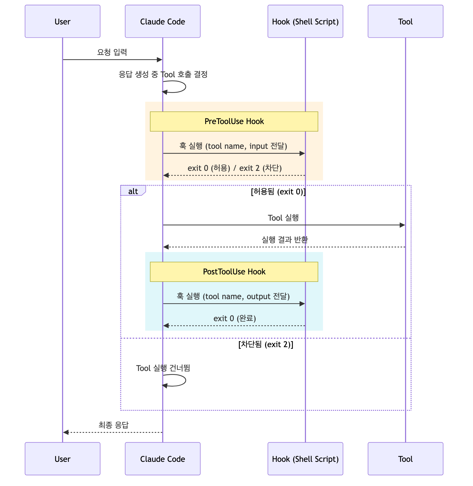
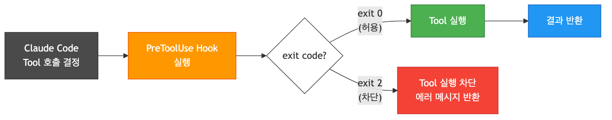
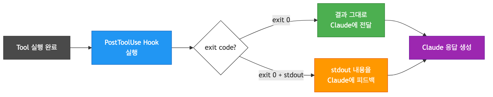
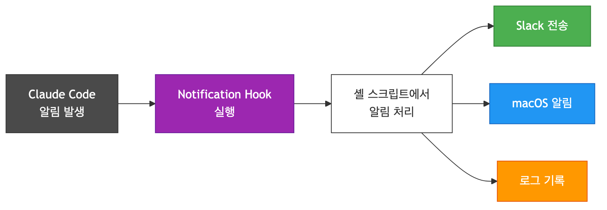
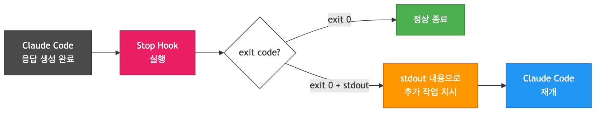

# [AI] Claude Hook

## Claude Hook이란

Claude Code는 AI가 도구(Tool)를 호출하거나 응답을 완료하는 등 특정 이벤트가 발생할 때, 사용자가 정의한 셸 스크립트를 자동으로 실행할 수 있는 이벤트 기반 확장 메커니즘을 제공한다. 이것이 Claude Hook이다.

훅은 Claude Code의 동작을 가로채고(intercept), 검증하고(validate), 확장(extend)할 수 있게 해주는 일종의 미들웨어이다. 프레임워크의 라이프사이클 훅과 유사하게, Claude Code의 실행 흐름에 사용자 로직을 주입하는 구조이다.

### 전체 라이프사이클



---

## 언제 사용하는가

훅은 Claude Code의 동작을 자동화하거나 제어해야 할 때 사용한다.

- **보안 정책 적용**: 특정 명령어나 파일 접근을 사전에 차단
- **코드 품질 강제**: 파일 저장 후 자동으로 린트/포맷 실행
- **알림 자동화**: 작업 완료 시 Slack, macOS 알림 등으로 통지
- **로깅/감사**: 어떤 도구가 어떤 인자로 호출되었는지 기록
- **워크플로우 확장**: 응답 완료 후 추가 작업을 자동으로 지시

---

## Hook 유형

Claude Code는 4가지 이벤트 훅을 제공한다.

| Hook | 시점 | 용도 |
|------|------|------|
| `PreToolUse` | Tool 실행 **전** | 차단, 검증, 입력 로깅 |
| `PostToolUse` | Tool 실행 **후** | 결과 검증, 린트, 피드백 |
| `Notification` | 알림 발생 시 | 외부 알림 전송 |
| `Stop` | 응답 생성 완료 시 | 추가 작업 지시, 검증 |

---

## PreToolUse

Tool이 실행되기 전에 호출된다. 입력을 검증하거나, 특정 조건에서 실행을 차단할 수 있다.



- **exit 0**: 허용, Tool 정상 실행
- **exit 2**: 차단, Tool 실행 건너뜀 (stderr가 에러 메시지로 전달)

### 적용 예시: 위험한 명령어 차단

```json
{
  "hooks": {
    "PreToolUse": [
      {
        "matcher": "Bash",
        "hooks": [
          {
            "type": "command",
            "command": "/Users/biuea/.claude/hooks/block_dangerous_cmd.sh"
          }
        ]
      }
    ]
  }
}
```

```bash
#!/bin/bash
# block_dangerous_cmd.sh
# stdin으로 JSON 입력을 받는다 (tool_name, tool_input)

INPUT=$(cat)
COMMAND=$(echo "$INPUT" | jq -r '.tool_input.command')

# rm -rf, drop table 등 위험 명령어 차단
if echo "$COMMAND" | grep -qiE '(rm\s+-rf\s+/|drop\s+table|truncate\s+table)'; then
    echo "위험한 명령어가 감지되어 차단되었습니다: $COMMAND" >&2
    exit 2
fi

exit 0
```

---

## PostToolUse

Tool 실행이 완료된 후에 호출된다. 결과를 검증하거나, 후처리 작업을 수행할 수 있다. stdout으로 출력한 내용은 Claude에게 피드백으로 전달된다.



### 적용 예시: 파일 저장 후 자동 포맷

```json
{
  "hooks": {
    "PostToolUse": [
      {
        "matcher": "Write|Edit",
        "hooks": [
          {
            "type": "command",
            "command": "/Users/biuea/.claude/hooks/auto_format.sh"
          }
        ]
      }
    ]
  }
}
```

```bash
#!/bin/bash
# auto_format.sh
# 파일 수정 후 자동으로 prettier 실행

INPUT=$(cat)
FILE_PATH=$(echo "$INPUT" | jq -r '.tool_input.file_path')

# 파일 확장자 확인
case "$FILE_PATH" in
    *.ts|*.tsx|*.js|*.jsx|*.json)
        npx prettier --write "$FILE_PATH" 2>/dev/null
        echo "포맷 완료: $FILE_PATH"
        ;;
    *.kt|*.java)
        ktlint --format "$FILE_PATH" 2>/dev/null
        echo "포맷 완료: $FILE_PATH"
        ;;
esac

exit 0
```

---

## Notification

Claude Code가 사용자에게 알림을 보낼 때 호출된다. 외부 시스템으로 알림을 전달하는 용도로 사용한다.



### 적용 예시: Slack 알림 전송

```json
{
  "hooks": {
    "Notification": [
      {
        "matcher": "",
        "hooks": [
          {
            "type": "command",
            "command": "/Users/biuea/.claude/hooks/notify_slack.sh"
          }
        ]
      }
    ]
  }
}
```

```bash
#!/bin/bash
# notify_slack.sh
# Claude 알림을 Slack 채널로 전달

INPUT=$(cat)
MESSAGE=$(echo "$INPUT" | jq -r '.message')
SLACK_WEBHOOK_URL="https://hooks.slack.com/services/YOUR/WEBHOOK/URL"

curl -s -X POST "$SLACK_WEBHOOK_URL" \
    -H 'Content-type: application/json' \
    -d "{\"text\": \"Claude Code 알림: $MESSAGE\"}" \
    > /dev/null

exit 0
```

---

## Stop

Claude Code가 응답 생성을 완료했을 때 호출된다. stdout으로 내용을 출력하면 Claude가 해당 내용을 추가 지시로 받아들여 작업을 이어간다.



### 적용 예시: 응답 완료 후 자동 검증

```json
{
  "hooks": {
    "Stop": [
      {
        "matcher": "",
        "hooks": [
          {
            "type": "command",
            "command": "/Users/biuea/.claude/hooks/post_verify.sh"
          }
        ]
      }
    ]
  }
}
```

```bash
#!/bin/bash
# post_verify.sh
# 코드 변경 사항이 있으면 타입체크 실행 후 피드백

INPUT=$(cat)
STOP_REASON=$(echo "$INPUT" | jq -r '.stop_reason')

if [ "$STOP_REASON" = "end_turn" ]; then
    # 변경된 ts 파일이 있는지 확인
    CHANGED=$(git diff --name-only | grep -E '\.tsx?$')

    if [ -n "$CHANGED" ]; then
        RESULT=$(npx tsc --noEmit 2>&1)
        if [ $? -ne 0 ]; then
            echo "타입 에러가 발견되었습니다. 수정해주세요:"
            echo "$RESULT"
        fi
    fi
fi

exit 0
```

---

## 설정 위치

훅은 `settings.json`에 정의하며, 적용 범위에 따라 3단계로 관리된다.

| 범위 | 경로 | 우선순위 |
|------|------|----------|
| 프로젝트 | `.claude/settings.json` | 높음 |
| 사용자 | `~/.claude/settings.json` | 중간 |
| 시스템 | `/etc/claude/settings.json` | 낮음 |

프로젝트 레벨의 훅이 가장 먼저 적용되며, 같은 이벤트에 여러 훅이 등록된 경우 모두 순차적으로 실행된다.

### stdin 입력 구조

모든 훅은 stdin을 통해 JSON 형태의 컨텍스트를 전달받는다.

```json
{
  "session_id": "세션 ID",
  "tool_name": "Bash",
  "tool_input": {
    "command": "ls -la"
  }
}
```

### exit code 규칙

| exit code | 의미 |
|-----------|------|
| 0 | 정상 (허용, stdout은 피드백으로 전달) |
| 2 | 차단 (PreToolUse에서만 유효, stderr가 에러 메시지) |
| 그 외 | 훅 실행 실패 (무시되고 정상 진행) |
