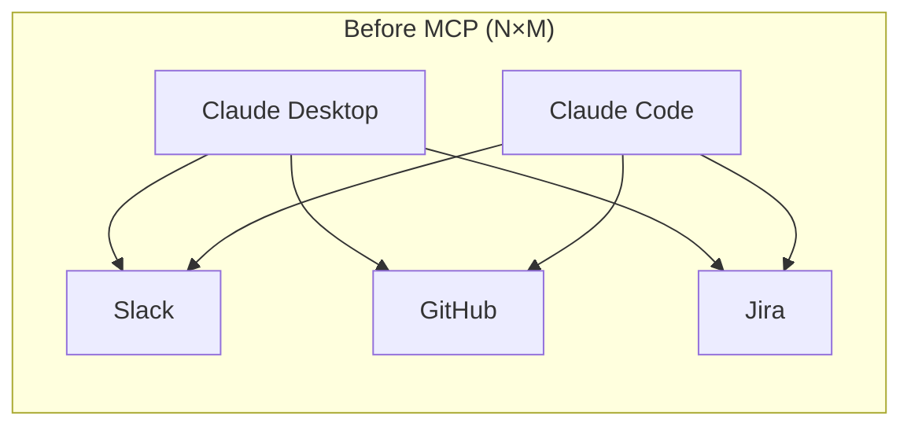
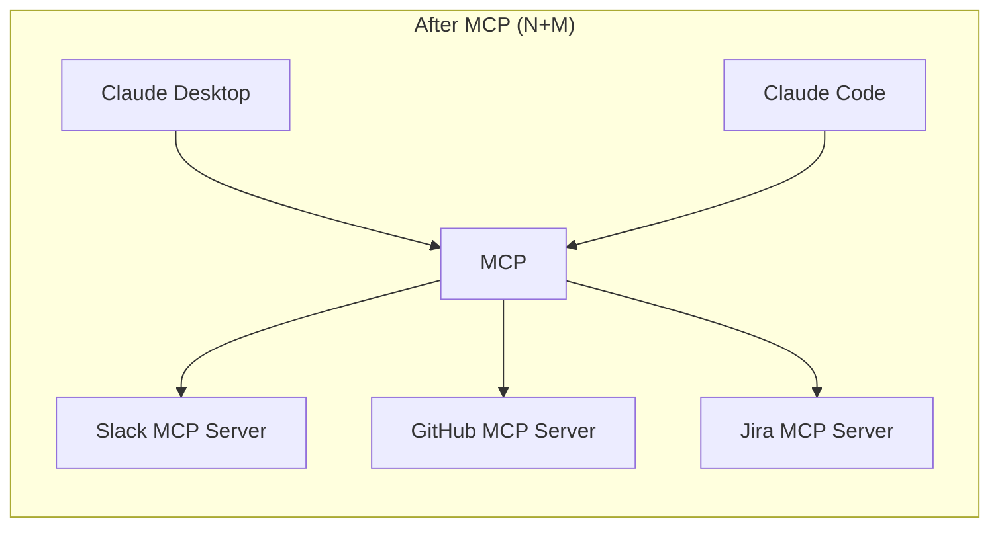

# MCP (Model Context Protocol)

## MCP 란?
---
MCP는 Anthropic이 설계한 오픈 표준으로, AI 모델이 외부 도구·데이터 소스와 통신하는 방식을 정의한다.

비유하자면 AI 세계의 USB-C다. USB-C가 기기와 주변기기를 표준화된 방식으로 연결하듯, MCP는 AI 모델과 외부 시스템을 표준화된 방식으로 연결한다. 덕분에 Slack, GitHub, DB, 파일 시스템 등 어떤 시스템이든 MCP Server로 감싸면 AI가 동일한 방식으로 호출할 수 있다.

### MCP를 사용하는 이유

MCP 이전에는 각 AI 앱이 외부 시스템과 연결할 때 각자 다른 방식으로 구현했다. 이는 두 가지 문제를 만들었다.

1. **N×M 문제**: AI 앱 N개와 외부 시스템 M개를 연결하려면 N×M개의 통합 코드가 필요
2. **재사용 불가**: 한 앱에서 만든 Slack 연동 코드를 다른 앱에서 그대로 쓸 수 없음





MCP는 이를 N+M 문제로 줄인다. 외부 시스템은 MCP Server를 한 번만 구현하면 되고, AI 앱은 MCP Client를 한 번만 구현하면 어떤 MCP Server와도 연결된다.

### MCP 구조

MCP는 Client-Server 구조로 동작한다.

```
Host (Claude Desktop / Claude Code)
  └── MCP Client
        ├── MCP Server A  (Slack)
        ├── MCP Server B  (GitHub)
        └── MCP Server C  (Local File System)
```

| 구성요소 | 역할 |
|---|---|
| **Host** | AI가 동작하는 애플리케이션 (Claude Desktop, IDE 등) |
| **MCP Client** | Host 안에 내장되어 MCP Server와 통신하는 클라이언트 |
| **MCP Server** | 외부 시스템(Slack, DB 등)을 MCP 프로토콜로 노출하는 서버 |

MCP Server가 AI에게 제공할 수 있는 것은 세 가지다.

- **Tools**: AI가 호출할 수 있는 함수 (메시지 전송, 파일 생성 등)
- **Resources**: AI가 읽을 수 있는 데이터 (파일, DB 레코드 등)
- **Prompts**: 특정 작업을 위해 미리 정의된 프롬프트 템플릿

통신 방식은 로컬 프로세스와는 stdio, 원격 서버와는 HTTP/SSE를 사용한다.

### MCP Client

MCP Client는 Host(Claude Desktop, Claude Code 등) 안에 내장된 컴포넌트다. AI 모델이 "이 도구를 쓰겠다"고 판단하면, 실제 MCP Server와의 통신은 MCP Client가 대신 처리한다.

1. **도구 목록 조회 (Tool Discovery)**: 연결된 MCP Server들에게 "너 뭘 할 수 있어?"를 물어봐서 사용 가능한 Tools 목록을 AI에게 전달한다.
2. **도구 호출 중계**: AI가 특정 Tool 호출을 결정하면, 해당 MCP Server로 요청을 전달하고 결과를 받아 AI에게 돌려준다.
3. **연결 관리**: MCP Server와의 연결을 유지하고, 여러 Server를 동시에 관리한다.

MCP Client는 이 과정에서 AI와 외부 시스템 사이의 우편배달부 역할을 한다. AI는 MCP Client를 통해 Slack인지 GitHub인지 상관없이 동일한 방식으로 외부 시스템을 사용한다.

**흐름 예시** — "오늘 머지된 PR 목록 보여줘"

```
1. 사용자 메시지 입력
2. Claude가 사용 가능한 Tool 목록 확인
   → MCP Client가 GitHub MCP Server에서 조회해온 목록:
      - list_pull_requests(repo, state, since)
      - create_pull_request(title, body, branch)
      - ...

3. Claude가 list_pull_requests 호출 결정
4. MCP Client → GitHub MCP Server: 호출 요청 전달
5. GitHub MCP Server → GitHub API: 실제 API 호출
6. 결과가 MCP Client → Claude로 반환
7. Claude가 결과를 자연어로 정리해서 응답
```

### Tools

Tool은 MCP Client와 MCP Server 사이의 계약(Contract)이다. "이 이름으로 이 인자를 보내면 이걸 해준다"는 약속을 Claude가 읽을 수 있는 형태(`name` + `description` + `inputSchema`)로 표현한 것이다. MCP Client는 이 규격을 읽어 Claude에게 전달하고, Claude의 판단이 내려지면 MCP Server에 Tool 호출을 요청한다.

각 Tool은 다음 세 가지로 정의된다.

```json
{
  "name": "create_pull_request",
  "description": "GitHub 저장소에 새 PR을 생성한다",
  "inputSchema": {
    "type": "object",
    "properties": {
      "title":  { "type": "string" },
      "body":   { "type": "string" },
      "branch": { "type": "string" }
    },
    "required": ["title", "branch"]
  }
}
```

AI는 `description`을 읽고 어떤 Tool을 쓸지 판단하고, `inputSchema`를 보고 어떤 인자를 넘길지 결정한다. 실제 API를 어떻게 호출하는지는 전혀 모른다. 그 구현 세부사항은 MCP Server 안에 캡슐화되어 있다.

Tool은 내부적으로 기존 API를 호출하는 래퍼다. GitHub이 새 API를 추가해도, MCP Server에 해당 Tool을 따로 구현해줘야 Claude가 사용할 수 있다.

```
create_pull_request (Tool)
  └── MCP Server 내부 → GitHub REST API POST /pulls 호출
```

**Tool 예시**

| MCP Server | Tool 이름 | 하는 일 |
|---|---|---|
| GitHub | `list_pull_requests` | 저장소 PR 목록 조회 |
| GitHub | `create_pull_request` | PR 생성 |
| GitHub | `merge_pull_request` | PR 머지 |
| Slack | `slack_send_message` | 채널에 메시지 전송 |
| Slack | `slack_read_channel` | 채널 메시지 읽기 |
| File System | `read_file` | 파일 내용 읽기 |
| File System | `write_file` | 파일 내용 쓰기 |
| Jira | `createJiraIssue` | 이슈 생성 |
| Jira | `transitionJiraIssue` | 이슈 상태 변경 |

### MCP Server

MCP Server는 외부 시스템(Slack, GitHub, DB 등)을 MCP 프로토콜로 감싸서 AI가 사용할 수 있게 노출하는 서버다. 어댑터 패턴처럼, 기존 API를 변경하지 않고 MCP 인터페이스로 변환한다.

```
GitHub MCP Server
  ├── Tools
  │     ├── list_pull_requests(repo, state)   → GitHub REST API GET /pulls
  │     ├── create_pull_request(title, body)  → GitHub REST API POST /pulls
  │     └── merge_pull_request(pr_number)     → GitHub REST API PUT /pulls/merge
  │
  ├── Resources
  │     ├── github://repo/README.md           → 파일 내용 조회
  │     └── github://repo/issues/123          → 이슈 상세 조회
  │
  └── Prompts
        └── "PR 리뷰 요청" 템플릿
```

MCP Server는 API와 별도로 관리되는 독립적인 프로젝트다. GitHub이 새 API를 추가하더라도 MCP Server에 Tool을 추가하는 작업을 따로 해줘야 Claude가 그 기능을 사용할 수 있다. 그래서 요즘은 Slack, GitHub, Notion 같은 서비스가 직접 공식 MCP Server를 만들어 배포하는 방향으로 가고 있다.

**로컬 MCP Server vs 원격 MCP Server**

| | 로컬 MCP Server | 원격 MCP Server |
|---|---|---|
| **실행 위치** | 사용자 PC에서 직접 실행 | 외부 서버에서 실행 |
| **Transport** | stdio (표준 입출력) | HTTP/SSE |
| **예시** | 파일 시스템, 로컬 DB | Slack, GitHub, Notion |
| **인증** | 불필요 (로컬이므로) | API Key, OAuth 등 필요 |

로컬 MCP Server는 stdio를 사용해 네트워크 없이 프로세스 간 통신만으로 동작한다.

```
MCP Client → (stdio) → File System MCP Server
                              ↓
                        실제 파일 읽기 (fs.readFile)
                              ↓
                        내용 반환 → MCP Client → Claude
```

원격 MCP Server는 HTTP/SSE를 사용한다.

> **왜 SSE인가?**
> 원격 작업은 결과가 오래 걸릴 수 있다 (빌드 실행, 대용량 파일 생성 등).
> 일반 HTTP 요청-응답은 응답이 올 때까지 커넥션을 붙잡아야 하지만,
> SSE는 서버가 준비되는 즉시 스트리밍으로 결과를 밀어줄 수 있어 커넥션 낭비 없이 실시간 처리가 가능하다.
> AI가 긴 작업의 중간 진행 상황(로그 등)도 스트리밍으로 받아볼 수 있다는 점도 이유 중 하나다.

```
MCP Client → (HTTP/SSE) → Slack MCP Server (외부 서버)
                                  ↓
                            Slack API 호출 (Bearer Token 인증)
                                  ↓
                            전송 결과 반환 → MCP Client → Claude
```

## API vs MCP
---

Tool은 결국 내부에서 API를 호출한다. 그렇다면 API와 Tool은 같은 것인가?

```
create_pull_request (Tool)
  └── 내부적으로 → GitHub REST API POST /pulls 호출
```

Tool은 API 위에 얹힌 **AI용 래퍼**다. API 자체가 바뀌는 게 아니라, AI가 그 API를 스스로 발견하고 호출할 수 있도록 description과 schema를 붙여서 포장한 것이다.

| | REST API | MCP Tool |
|---|---|---|
| **호출 주체** | 개발자가 코드로 직접 호출 | AI가 스스로 판단해서 호출 |
| **발견 방식** | 사람이 문서 읽고 파악 | AI가 런타임에 목록 자동 조회 |
| **인터페이스** | 사람이 이해하는 엔드포인트 | AI가 이해하는 description + schema |
| **표준화** | 없음 (각 서비스마다 다름) | MCP 스펙으로 통일 |

REST API는 사람이 설계하고 사람이 호출하는 인터페이스다. MCP Tool은 AI가 동적으로 발견하고 AI가 호출하는 인터페이스다.

## 예시
---

Claude Code에서 GitHub MCP Server를 연결하면 다음과 같이 동작한다.

```
사용자: "biuea 브랜치를 main으로 PR 만들어줘"

Claude 내부 판단:
  → 사용 가능한 Tool 목록 확인
  → create_pull_request Tool 선택
  → 인자 구성: title="biuea 브랜치 변경사항", branch="biuea"

MCP Client → GitHub MCP Server → GitHub API POST /pulls
→ PR URL 반환
→ Claude: "PR을 생성했습니다: https://github.com/.../pull/42"
```

개발자는 GitHub API 연동 코드를 직접 작성하지 않아도 된다. MCP Server가 이미 그 역할을 하고 있고, Claude는 필요할 때 알아서 호출한다.

**배달의민족이 MCP Server를 제공한다면**

배달의민족이 아래와 같은 Tool을 노출하는 MCP Server를 만들었다고 가정하면:

```
배민 MCP Server
  └── Tools
        ├── search_restaurants(location, category)
        ├── get_menu(restaurant_id)
        ├── place_order(restaurant_id, items, address)
        ├── get_order_status(order_id)
        └── get_coupons()
```

Claude로 이런 것들이 가능해진다.

```
사용자: "지금 강남역 근처 치킨집 중에 별점 높은 데서 후라이드 한 마리 시켜줘.
        쿠폰 있으면 써줘."

Claude 내부 판단:
  1. get_coupons() 호출 → 사용 가능한 쿠폰 목록 확인
  2. search_restaurants(location="강남역", category="치킨") 호출
     → 별점 순 정렬해서 상위 가게 선택
  3. get_menu(restaurant_id=...) 호출 → 후라이드 메뉴 확인
  4. place_order(items=["후라이드"], coupon_id=...) 호출

→ Claude: "별점 4.8의 '굽네치킨 강남점'에서 후라이드 한 마리를
           3,000원 쿠폰 적용해 18,000원에 주문했습니다. 예상 도착 30분."
```

사용자는 앱을 열거나 메뉴를 탐색하지 않아도 된다. Claude가 맥락을 이해하고 여러 Tool을 순서대로 조합해 처리한다.