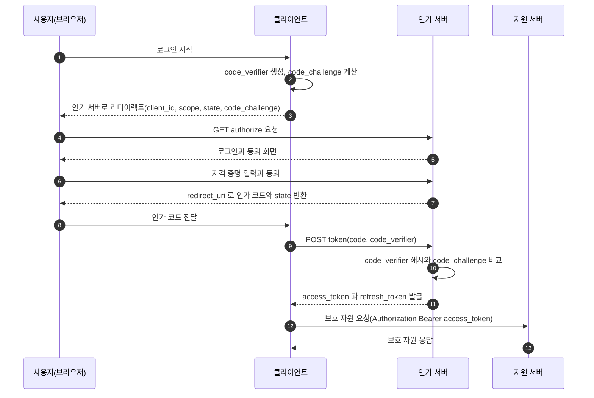
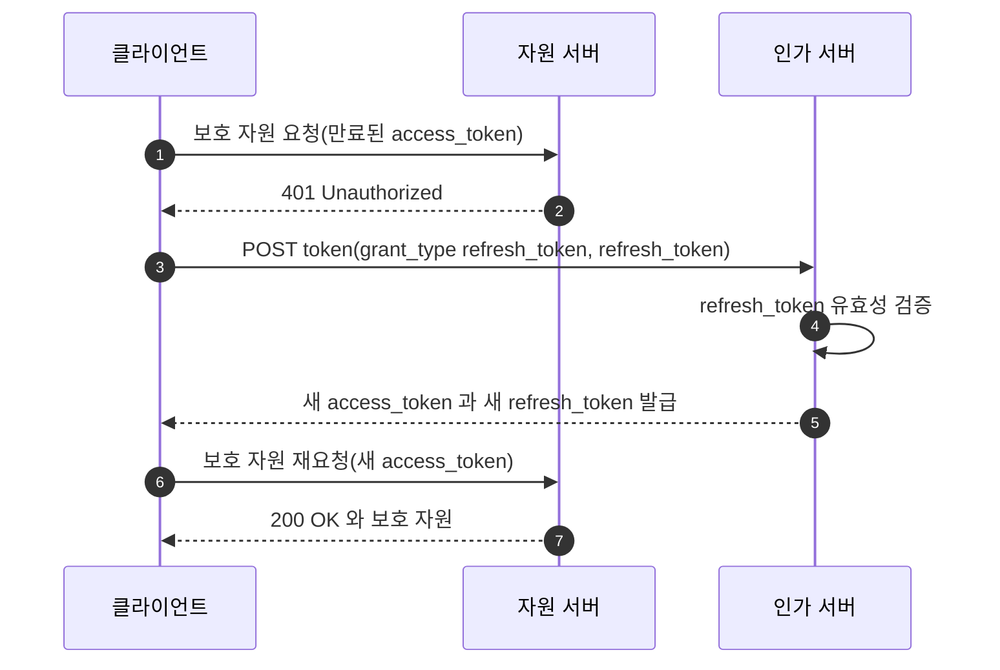
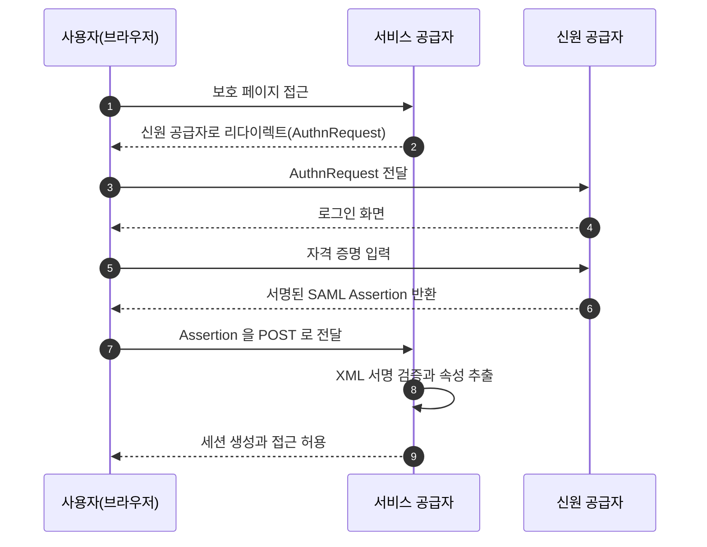

# [인증] OAuth 2.0 동작 원리와 토큰 기반 인가

## 개요

---

OAuth 2.0(Open Authorization 2.0)은 제3자 애플리케이션이 사용자를 대신해 보호 자원에 접근하도록 권한을 위임하는 인가(Authorization) 프레임워크다. 쇼핑몰이 토스로 로그인을 붙여 사용자의 토스 계정으로 로그인하고, 동의받은 이름과 연락처만 받아오는 장면이 전형적인 사례다.

이전에는 이런 위임을 하려면 사용자가 쇼핑몰에 토스 아이디와 비밀번호를 직접 넘겨야 했다. 그러면 쇼핑몰이 비밀번호 원문을 보관하게 되고, 권한을 좁힐 수 없어 이름만 받으면 되는 쇼핑몰이 송금 권한까지 갖는다. 위임을 끊으려면 비밀번호를 바꿔야 해서 그 비밀번호를 쓰던 다른 앱까지 함께 끊긴다.

OAuth 2.0은 비밀번호 대신 토큰(Token)을 발급해 이 문제를 푼다. 사용자는 인가 서버(Authorization Server)에서만 로그인하고, 제3자 앱은 범위가 제한된 접근 토큰(Access Token)만 받는다. 토큰에는 만료 시간과 권한 범위가 있어, 유출되어도 피해가 한정되고 언제든 개별 철회할 수 있다.

- Resource Owner: 자원의 주인. 보통 사람인 사용자
- Client: 자원에 접근하려는 제3자 애플리케이션
- Authorization Server: 사용자를 인증하고 토큰을 발급하는 서버
- Resource Server: 보호 자원을 보관하고 토큰을 검증해 응답하는 서버
- Access Token: 자원 접근을 위한 단기 토큰. 만료 시간과 권한 범위(Scope) 포함
- Refresh Token: Access Token 재발급용 장기 토큰
- Scope: 토큰에 부여된 권한 범위. `user.name`, `user.phone` 등
- Grant: 클라이언트가 토큰을 얻는 방식

OAuth 2.0은 인가에 집중하며, 로그인 신원 확인까지 필요하면 그 위에 얹은 OIDC(OpenID Connect)를 쓴다.

## 네 가지 역할

---

OAuth 2.0은 네 역할이 토큰을 주고받으며 동작한다.

- 자원 소유자(Resource Owner): 보호 자원의 주인. 보통 사람인 사용자이며, 누가 접근할지 동의한다.
- 클라이언트(Client): 자원 소유자를 대신해 자원에 접근하려는 애플리케이션이다.
- 인가 서버(Authorization Server): 사용자를 인증하고 동의를 받아 토큰을 발급한다.
- 자원 서버(Resource Server): 보호 자원을 보관하고, 토큰을 검증해 권한 범위 안에서만 자원을 내어준다.

클라이언트는 시크릿을 안전하게 보관할 수 있으면 컨피덴셜(Confidential), SPA나 모바일 앱처럼 그럴 수 없으면 퍼블릭(Public) 클라이언트로 나뉜다.

자원 소유자가 클라이언트에 접근을 위임하면, 클라이언트는 인가 서버에서 토큰을 받아, 그 토큰으로 자원 서버의 보호 자원에 접근한다. 핵심은 클라이언트가 사용자의 비밀번호를 한 번도 보지 않는다는 점이다. 로그인은 오직 인가 서버에서만 일어난다.

## 인가 그랜트

---

그랜트(Grant)는 클라이언트가 Access Token을 얻는 방식이다. 클라이언트 유형과 보안 요구에 따라 적합한 그랜트가 다르다.

| 그랜트 | 사용 주체 | 현재 권장 여부 |
| --- | --- | --- |
| Authorization Code + PKCE | 웹/모바일/SPA 클라이언트 | 권장. 사실상 표준 |
| Client Credentials | 사용자 없는 서버 간 통신 | 권장 |
| Refresh Token | 토큰 재발급 | 권장(회전 적용) |
| Resource Owner Password | 신뢰된 자사(first-party) 앱 | 비권장 |
| Implicit | 과거 SPA | 폐기. 사용 금지 |

### Authorization Code + PKCE

인가 코드 그랜트는 가장 널리 쓰인다. 토큰을 브라우저에 바로 노출하지 않고, 일회용 인가 코드(Authorization Code)를 먼저 주고받은 뒤, 그 코드를 서버 간 통신으로 토큰과 교환한다. 인가 코드는 주소창과 리다이렉트 과정에 노출되지만, 코드만으로는 토큰을 받을 수 없어 위험이 낮다.

여기에 PKCE(Proof Key for Code Exchange)를 더하면 퍼블릭 클라이언트도 안전하다.

- 클라이언트가 매 요청마다 임의의 코드 검증자(code_verifier)를 만든다.
- 그 해시인 코드 챌린지(code_challenge)만 인가 요청에 실어 보낸다.
- 토큰 교환 시 원본 code_verifier를 제출하면 인가 서버가 해시를 다시 계산해 대조한다.
- 인가 코드가 탈취되어도 공격자는 code_verifier를 모르므로 토큰을 받지 못한다.



요청에 함께 보내는 state 파라미터는 CSRF(Cross-Site Request Forgery) 방어 장치다. 클라이언트가 임의 값을 만들어 보내고, 인가 서버가 돌려준 값이 처음 값과 같은지 확인한다. 다르면 공격자가 끼워 넣은 콜백이므로 거절한다.

### Client Credentials

서버 간 통신에 쓴다. 가맹점 서버가 토스 정산 API를 호출하는 경우처럼, 자원 소유자가 곧 클라이언트 자신일 때다. client_id와 client_secret만으로 토큰을 받으므로 컨피덴셜 클라이언트에서만 사용한다.

```bash
curl -X POST https://oauth2.toss.im/token \
  -d "grant_type=client_credentials" \
  -d "client_id=mall-server" \
  -d "client_secret=$CLIENT_SECRET" \
  -d "scope=settlement.read"
```

### Refresh Token

Access Token은 유출 피해를 줄이려고 수명을 짧게(수 분에서 한 시간) 잡는다. 짧은 수명 탓에 자주 다시 로그인하는 불편을 막으려고, 인가 서버는 함께 발급한 리프레시 토큰(Refresh Token)으로 Access Token을 재발급한다.



재발급 때 Refresh Token도 새로 바꿔 주는 것을 리프레시 토큰 회전(Refresh Token Rotation)이라 한다. 회전을 적용하면 과거 Refresh Token이 즉시 무효가 되어, 탈취된 토큰이 재사용되는 순간을 탐지할 수 있다.

## 토큰의 형태와 검증

---

Access Token은 형태에 따라 두 종류로 나뉜다. 불투명 토큰(Opaque Token)은 의미 없는 임의 문자열이라, 자원 서버가 인가 서버에게 매번 유효성을 물어야 한다. 자체 포함 토큰(Self-contained Token)은 토큰 안에 권한 정보가 들어 있어, 자원 서버가 서명만 검증하면 인가 서버에 묻지 않아도 된다. 후자의 표준이 JWT(JSON Web Token)다.

JWT는 점(.)으로 이은 세 부분으로 구성된다.

- **헤더(Header)**: 서명 알고리즘 (`alg`, `typ`)
- **페이로드(Payload)**: 클레임(Claim)이라 부르는 권한 정보
- **서명(Signature)**: 위변조를 막는 검증값

각 부분은 Base64Url로 인코딩된다. 헤더와 페이로드는 누구나 디코딩해 읽을 수 있다. 서명은 키를 모르면 위조할 수 없게 막는 장치일 뿐 내용을 가리는 암호화가 아니므로, 비밀번호 같은 민감 정보를 넣으면 안 된다.

```json
{ "alg": "RS256", "typ": "JWT" }
{
  "iss": "https://oauth2.toss.im",
  "sub": "toss-user-1024",
  "aud": "toss-user-api",
  "scope": "user.name user.phone",
  "exp": 1750400000
}
```

| 구분 | JWT (자체 포함) | 불투명 토큰 |
| --- | --- | --- |
| 검증 방식 | 자원 서버가 서명 검증 | 인가 서버에 introspection |
| 인가 서버 의존 | 없음 | 매 요청 질의 |
| 즉시 폐기 | 어려움 | 가능 |
| 내용 노출 | 디코딩으로 읽힘 | 불투명 |

## 스코프와 동의

---

스코프(Scope)는 토큰에 부여되는 권한의 범위다. 클라이언트가 필요한 스코프를 요청하면, 인가 서버는 동의(Consent) 화면에서 어떤 권한을 넘기는지 사용자에게 보여주고 동의를 받는다. 사용자가 일부만 허용하면 토큰의 권한도 그만큼 좁아진다.

처음부터 모든 권한을 받지 않고 새 기능을 쓰는 시점에 추가로 요청하는 방식을 점진적 인가(Incremental Authorization)라 한다. 넓은 권한을 한 번에 요구하면 사용자가 동의를 망설이고 유출 시 피해도 커진다. 자원 서버는 토큰에 실제로 담긴 스코프를 기준으로 접근을 판단해야 한다.

## 다른 인증 방식과의 비교

---

### OAuth 1.0

OAuth 1.0도 비밀번호를 넘기지 않고 위임한다는 아이디어는 같지만, 안전성을 서명으로 보장했다. 클라이언트가 요청 파라미터를 정규화하고 시크릿을 키로 삼아 HMAC-SHA1으로 서명한 값을 매 요청에 붙이면, 자원 서버가 같은 방식으로 다시 계산해 대조한다.

클라이언트마다 파라미터 정규화와 서명 계산을 정확히 구현해야 하고 작은 차이에도 서명이 어긋난다. OAuth 2.0은 이 서명을 걷어내고 전송 보안을 TLS(Transport Layer Security)에 맡겨 단순해졌다. 대신 HTTPS가 깨지면 토큰이 그대로 노출된다.

| 구분 | OAuth 1.0 | OAuth 2.0 |
| --- | --- | --- |
| 무결성 보장 | 요청 서명(HMAC-SHA1) | TLS(HTTPS) |
| 구현 복잡도 | 높음 | 낮음 |
| 역할 분리 | 미분리 | 인가와 자원 서버 분리 |
| 그랜트 | 단일 흐름 | 다중 그랜트 |

### 전통적 인증 방식

세션과 쿠키, HTTP Basic 인증, API 키(API Key)는 자사 서비스 안에서 호출자를 식별하는 방식이라 제3자 위임 모델이 아니다. OAuth는 비밀번호를 공유하지 않으면서 외부 앱에 범위가 제한된 권한을 위임할 때 진가를 발휘한다. 자사 단일 서비스의 로그인이라면 세션과 쿠키가 더 단순하다.

| 방식 | 제3자 위임 | 권한 범위 | 만료와 철회 |
| --- | --- | --- | --- |
| 세션과 쿠키 | 불가 | 전체 | 세션 만료 |
| HTTP Basic 인증 | 불가 | 전체 | 어려움 |
| API 키 | 부분 | 약함 | 키 폐기 |
| OAuth 2.0 | 가능 | scope 단위 | 토큰 만료와 철회 |

### 자체 구축 JWT

많은 서비스가 OAuth 없이 자사 서버에서 로그인하고 JWT를 직접 발급해 쓴다. 한 서버가 인증, 발급, 검증을 모두 수행하는 구조다.

발급을 인가 서버로 모으면 여러 자원 서버가 같은 토큰을 신뢰해 자연스럽게 SSO(Single Sign-On)가 된다. 제3자 위임, 스코프와 동의, 토큰·키 회전(JWK Set)도 표준 절차로 제공된다. 반대로 자체 구축 JWT는 인가 서버를 따로 운영하지 않아 단순하고 운영 비용이 낮다.

| 항목 | 자체 구축 JWT | OAuth 2.0 |
| --- | --- | --- |
| 적합 대상 | 자사 단일 서비스 | 제3자 위임과 다중 서비스 |
| 책임 | 한 서버가 전부 | 인가와 자원 분리 |
| SSO | 별도 설계 | 자연스럽게 지원 |
| 운영 비용 | 낮음 | 높음 |

외부 연동이나 소셜 로그인, 여러 서비스 SSO가 필요해지면 OAuth와 OIDC가 필요하다.

### SSO와 SAML, OIDC

SSO(Single Sign-On)는 한 번 로그인하면 여러 서비스를 다시 로그인하지 않고 쓰는 방식이다. 구글 계정 하나로 Gmail, YouTube, Drive에 모두 들어가는 것이 대표적이다. SAML과 OIDC는 이 SSO를 구현하는 두 가지 표준이다.

기업 SSO에서 SAML(Security Assertion Markup Language) 2.0은 XML로 인증 정보를 교환하는 프로토콜이다. 신원 공급자(Identity Provider)가 사용자를 인증해 서명된 어설션(Assertion)을 발급하면, 서비스 공급자(Service Provider)가 그 보증을 받아 사용자를 들여보낸다. 직원이 사내 포털에 한 번 로그인하면 메일, 그룹웨어, 위키에 다시 로그인하지 않는 사내 SSO가 전형적인 예다.



OIDC(OpenID Connect)는 OAuth 2.0 + 로그인(JWT)이다. OAuth만으로는 토큰을 가진 사람이 누구인지 표준으로 알 수 없는데, OIDC는 ID Token이라는 JWT를 하나 더 발급해 사용자가 누구인지(이름, 이메일 등)를 담아 준다. 토스로 로그인, 구글로 로그인 같은 소셜 로그인이 바로 OIDC다.

SAML과 OIDC는 인증과 SSO라는 목적이 같지만 결이 다르다. SAML은 XML과 브라우저 리다이렉트에 기반해 사내 직원용 SSO에 강하고, OIDC는 JSON과 JWT에 기반해 외부 사용자 소셜 로그인과 모바일에 강하다.

| 구분 | SAML 2.0 | OAuth 2.0 | OIDC |
| --- | --- | --- | --- |
| 목적 | 인증(SSO) | 인가 | 인증 |
| 형식 | XML 어설션 | 토큰 | JWT(ID Token) |
| 주 사용처 | 기업 SSO | API 위임 | 소셜 로그인과 SSO |
| 모바일과 SPA | 부적합 | 적합 | 적합 |
