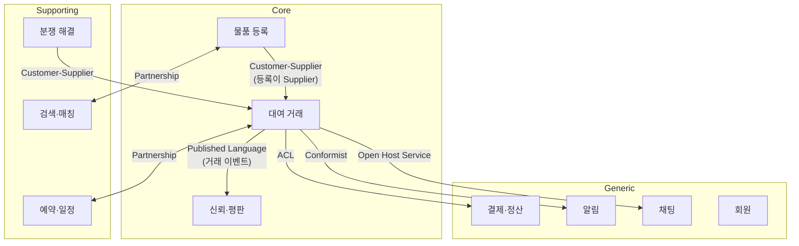
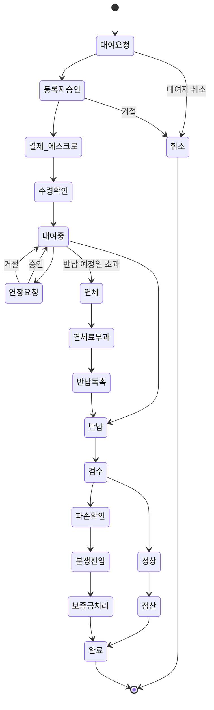

# ddd 전략적 설계

## 전략적 설계?
---
소프트웨어 시스템을 도메인 관점에서 큰 그림을 그리는데 초점을 맞출 필요가 있다. 전략적 설계는 시스템 전체의 구조와 팀 간 협업을 다룬다. 팀에는 다양한 구성원이 존재하고, 이들이 각 업무에서 사용하는 그리고 소통하는 언어는 전부 다르다. 따라서 이들이 소통하기 위한 업무를 통일할 필요가 있다.

### 서로 간의 의사소통도구 (유비쿼터스 언어)
유비쿼터스 언어는 전략적 설계를 위한 기초이다. 개발자, 도메인 전문가, pm, 디자이너 등 다양한 직군의 사람들은 동일한 언어를 사용하여 소프트웨어를 구축해야한다. 가령 이커머스에서 주문에 대해 마케팅팀은 구매 요청, 물류팀은 배송 지시서 등으로 서로의 언어로 대화할 경우 오해가 생기며, 미스가 생기기 마련이다. 

따라서 특정한 맥락에서 사용될 수 있는 용어를 통일하고, 이 언어로 소통하며 코드로 구현하는 것이 유비쿼터스 언어의 목표이다.

## 바운디드 컨텍스트
---
### 무엇을 어떻게 나눌 것인가?
앞서 유비쿼터스 언어는 특정한 맥락에서 사용될 수 있는 용어로 지칭하였다. 그러면 이 특정한 맥락은 무엇일까?

배달 이커머스라는 큰 맥락이 있다고 가정하면, 모든 이해관계자가 배달이라는 하나의 키워드를 가지고 유비쿼터스 언어를 정의하고 업무를 진행하기엔 양이 너무 방대하다. 따라서 이 안에서 특정한 맥락을 자르고, 인원을 분배하여 분할하고 업무를 처리해야 효율적이라 할 수 있다. 이 특정한 맥락은 바운디드 컨텍스트라 불리며, 명확한 경계이다.

가령 이커머스에서 배송 컨텍스트에서의 상품, 전시 컨텍스트에서의 상품이 존재한다고 했을 때 이들을 하나의 상품으로 간주하고 모델로 합친다면 복잡도가 높아지게 된다. 배송, 전시 컨텍스트에서 상품을 건드려야하기 때문이다.

따라서 동일한 모델일지라도 각 컨텍스트에서 자체적으로 다르게 모델링하여 그들만의 유비쿼터스언어로 도메인을 정의하는 것이 중요하다.

### 컨텍스트 맵
여러 바운디드 컨텍스트들은 결과적으로 서로 협력하여 제품을 정의하고 구성해나간다. 서로 어떤 관계로 연결되는지가 굉장히 중요하고 패턴들은 다음과 같다.

#### 1. Parternership
팀 간 대등한 관계어서 조율한다. 한 쪽의 변경이 다른 쪽에 영향을 주므로 긴밀한 협업을 해야하며, 인터페이스를 공동으로 설계한다.

> 예) 주문팀과 결제팀이 "주문-결제" 연동 API를 공동 설계하고, 한쪽이 스펙을 변경할 때 반드시 양측 합의 후 배포한다.

* **트레이드오프**: 최고의 협업 품질을 얻지만, 양 팀의 배포 주기가 강하게 결합된다. 한쪽이 바빠지면 다른 쪽도 블로킹되므로, 팀 규모가 커지면 유지하기 어렵다.

#### 2. Shared Kernal
두 컨텍스트가 도메인 모델의 일부를 공유한다. 교집합이 되는 부분은 합의 없이 변경할 수 없기 때문에 이 영역은 최소한으로 유지하는 것이 좋다.

> 예) 주문 컨텍스트와 배송 컨텍스트가 `Address` 값 객체를 공유 라이브러리(`common-domain`)로 관리한다. 주소 형식을 바꾸려면 양 팀 합의가 필요하다.

* **트레이드오프**: 중복 코드를 제거할 수 있지만, 공유 영역이 커질수록 변경 시 양 팀 조율 비용이 급증한다. 공유 커널이 사실상 모놀리스로 회귀하는 경우도 있다.

#### 3. Customer - Supplier
상위 조직이 하위 조직에게 서비스를 제공한다. 하위 조직의 요구사항을 들어줄 순 있지만, 우선순위 결정권은 상위 조직에게 있다.

> 예) 상품 컨텍스트(Supplier)가 상품 정보 API를 제공하고, 전시 컨텍스트(Customer)가 이를 소비한다. 전시팀이 "할인율 필드 추가"를 요청할 수 있지만, 상품팀의 로드맵에 따라 반영 시기가 결정된다.

* **트레이드오프**: 역할이 명확하여 의사결정이 빠르지만, 하위 팀의 긴급 요구가 상위 팀 우선순위에 밀려 병목이 될 수 있다.

#### 4. Confirmist
하위 조직이 상위 조직의 모델을 그대로 따르는 패턴이다.

> 예) PG사(토스페이먼츠 등)가 제공하는 결제 응답 모델을 우리 결제 컨텍스트가 그대로 수용한다. PG사의 모델을 바꿀 협상력이 없으므로, 그들의 스펙에 맞추는 수밖에 없다.

* **트레이드오프**: 구현 비용이 가장 낮지만(변환 없이 수용), 외부 모델에 완전히 종속된다. 상위 측이 breaking change를 하면 우리 도메인 전체가 영향을 받는다.

#### 5. Anti-Corruption Layer
하위 조직이 상위 조직 변경 사항에 대한 영향을 최소화하고자 컨버팅 레이어를 두는 패턴이다. 특히 레거시 시스템과 통합할 때 상위 조직의 도메인을 자신의 도메인으로 컨버팅해주므로 오염이 되지 않는다.

> 예) 레거시 ERP의 주문 데이터(`ORD_NO`, `CUST_CD`)를 신규 주문 컨텍스트의 도메인 모델(`OrderId`, `CustomerId`)로 변환하는 어댑터 계층을 둔다. ERP 스키마가 변경되어도 어댑터만 수정하면 된다.

* **트레이드오프**: 외부 변경으로부터 도메인을 보호하지만, 변환 계층의 개발·유지 비용이 든다. Conformist보다 초기 투자가 크지만, 장기적으로 도메인 순수성을 지킨다.

#### 6. Open Host Service
상위 조직에서 잘 정의된 API를 제공하여 여러 하위 조직은 이 API를 이용한다.

> 예) 회원 컨텍스트가 REST API(`GET /members/{id}`)를 공개하고, 주문·배송·마케팅 등 여러 컨텍스트가 동일한 API를 호출하여 회원 정보를 조회한다.

* **트레이드오프**: 여러 소비자에게 일관된 인터페이스를 제공하지만, API 버전 관리 부담이 생긴다. 소비자가 많아질수록 하위 호환성을 깨기 어려워진다.

#### 7. Published Language
공개 호스트 서비스와 함께 사용되며, 컨텍스트 간 데이터 교환을 위해 json, xml, protocal buffer과 같은 표준 형식을 이용한다.

> 예) 주문 이벤트를 Kafka로 발행할 때 Avro 스키마를 Schema Registry에 등록하고, 배송·정산 등 소비자 컨텍스트가 동일한 스키마로 역직렬화한다.

* **트레이드오프**: 표준 형식으로 느슨한 결합을 달성하지만, 스키마 진화(evolution) 관리가 필요하다. 스키마 호환성 정책을 잘못 잡으면 소비자 전체가 깨질 수 있다.

#### 8. Separate Ways
공통된 모델이 있을지라도 아예 통합하지않고, 각 컨텍스트가 독립적으로 같은 모델을 구현한다.

> 예) 주문 컨텍스트와 CS 컨텍스트 모두 "고객 정보"가 필요하지만, 통합 비용이 크므로 각자 자체 고객 테이블을 두고 독립적으로 관리한다.

* **트레이드오프**: 완전한 자율성을 얻지만, 데이터 정합성이 깨질 수 있다. 고객이 이름을 변경하면 한쪽만 반영되는 문제가 발생한다.

#### 9. Big Ball of Mud
모든 것을 한 데 섞인 채로 정의되는 패턴이다. 이상적이진 않지만, 현실에선 주로 있는 패턴이다.

> 예) 초기 스타트업의 모놀리스에서 주문·결제·배송·회원 로직이 하나의 `OrderService`에 뒤섞여 있고, 어디서부터 어디까지가 경계인지 구분할 수 없는 상태.

* **트레이드오프**: 초기 개발 속도는 가장 빠르지만, 시간이 지날수록 변경 비용이 기하급수적으로 증가한다. 리팩터링 시점을 놓치면 재작성(rewrite)만이 답이 된다.

## 하위 도메인
도메인을 분석적으로 분류하는 개념이다. 바운디드 컨텍스트가 해결 공간이라면 하위 도메인은 문제 공간(무엇을 해결할 것인가)이다.

하위 도메인을 올바르게 분류하는 것이 중요한 이유는, 분류에 따라 투자할 자원의 양과 설계 수준이 달라지기 때문이다. 핵심이 아닌 곳에 과도한 자원을 쏟거나, 핵심인데 외부 솔루션에 의존하면 비즈니스 경쟁력을 잃게 된다.

---
### 핵심 도메인
비즈니스의 핵심 경쟁력이 있는 영역이다. 많은 자원을 투입해야하며, 외부 솔루션을 이용하지 않고 자체적인 개발이 필요하다. 이 영역이 경쟁사와의 차별점이므로, 가장 숙련된 개발자를 배치하고 DDD 전술적 설계(Aggregate, Domain Event 등)를 적극 적용한다.

핵심 도메인은 시간이 지나면서 바뀔 수 있다. 시장 환경이 변하거나 경쟁사가 따라잡으면, 기존 핵심이 지원 또는 일반으로 내려갈 수 있다. 따라서 주기적으로 "우리의 핵심은 무엇인가"를 재평가해야 한다.

> 예) 배달의민족의 "배달 매칭 알고리즘" — 라이더와 주문을 최적으로 매칭하는 로직이 곧 경쟁력이므로, 자체 개발하고 최고 인력을 배치한다.

### 지원 도메인
비즈니스에 맞춤화가 필요한 영역이다. 범용 솔루션으론 해결이 되진 않지만, 비즈니스를 위해 차별화된 요소는 아니다. 핵심 도메인이 제대로 동작하기 위해 반드시 있어야 하지만, 여기서 경쟁 우위가 나오지는 않는다.

설계 수준은 적절하게 유지한다. 복잡한 전술적 패턴보다는 트랜잭션 스크립트나 단순한 레이어드 아키텍처로 충분한 경우가 많다. 외부 인력이나 주니어 개발자에게 맡기기에도 적합한 영역이다.

> 예) 쿠팡의 "재고 관리 시스템" — 쿠팡 물류센터에 맞춘 커스텀이 필요하지만, 재고 관리 자체가 경쟁 우위는 아니다.

### 일반 도메인
어느 비즈니스에서건 공통적으로 필요한 영역이다. 누구나 필요하기 때문에 잘 만들어진 기존 솔루션을 구매하거나 오픈 소스를 이용하는 것이 합리적이다.

직접 구현하면 비용만 들고 차별화에 기여하지 않는다. 다만 일반 도메인이라고 해서 단순한 것은 아니다. 오히려 매우 복잡할 수 있지만(예: 회계 시스템), 이미 잘 만들어진 솔루션이 존재하므로 직접 만들 이유가 없는 것이다.

> 예) 인증/인가 — 거의 모든 서비스에 필요하므로 Keycloak, Auth0 같은 솔루션을 도입하는 것이 직접 구현보다 합리적이다.

### 하위 도메인 분류 판별 기준

| 질문 | 핵심 | 지원 | 일반 |
|------|------|------|------|
| 이것으로 경쟁 우위를 얻는가? | O | X | X |
| 기성 솔루션으로 대체 가능한가? | X | X | O |
| 우리 비즈니스에 맞춘 커스텀이 필요한가? | O | O | X |
| 최고 인력을 배치해야 하는가? | O | X | X |

### Distillation (디스틸레이션)
핵심 도메인을 정제하는 과정이다. 핵심 모델 외의 것을 명확히 분류하여 핵심 모델을 명확하게 만드는 것이 목표이다.

디스틸레이션은 다음 단계를 거친다:
1. **도메인 비전 선언문(Domain Vision Statement)** — 핵심 도메인의 가치와 목표를 한두 문단으로 정의하고, 팀 전체가 공유한다.
2. **핵심 도메인 식별(Highlighted Core)** — 전체 모델에서 핵심에 해당하는 부분을 명시적으로 표시한다.
3. **분리(Segregation)** — 핵심이 아닌 요소를 별도 모듈이나 서비스로 추출하여, 핵심 모델의 복잡도를 낮춘다.

> 예) 배달 매칭 서비스에서 알림 발송, 라이더 위치 추적, 매칭 알고리즘이 뒤섞여 있다면, 알림은 일반 도메인으로, 위치 추적은 지원 도메인으로 분류하여 핵심인 "매칭 알고리즘"만 남긴다.

## 적용 사례: 대여 플랫폼
---
일반 유저와 기업 유저가 자유롭게 물건을 등록하고, 누구나 대여할 수 있는 P2P 대여 마켓플레이스를 DDD 전략적 설계로 풀어본다. 당근마켓이 중고 거래라면, 이 플랫폼은 "대여 거래"에 해당한다.

### 1. 하위 도메인 분류

플랫폼형 대여 서비스는 "대여 흐름" 자체보다 **공급자와 수요자를 연결하는 마켓플레이스**가 핵심이다.

```
┌─────────────────── Core ───────────────────┐
│  물품 등록 (Listing)                        │  ← 공급자가 물건을 올리는 진입점
│  대여 거래 (Rental Transaction)             │  ← 대여 요청~반납까지의 거래 흐름
│  신뢰·평판 (Trust & Reputation)             │  ← 리뷰, 평점, 인증 — 플랫폼 경쟁력의 핵심
└────────────────────────────────────────────┘

┌──────────────── Supporting ────────────────┐
│  검색·매칭 (Search & Discovery)             │  ← 위치·카테고리 기반 물품 탐색
│  예약·일정 (Scheduling)                     │  ← 가용 기간 관리, 충돌 방지
│  분쟁 해결 (Dispute Resolution)             │  ← 파손·미반납 등 이슈 중재
└────────────────────────────────────────────┘

┌──────────────── Generic ──────────────────┐
│  회원 (Identity)                           │  ← 인증/인가, 개인·기업 구분
│  결제·정산 (Payment & Settlement)           │  ← PG 연동, 에스크로, 수수료 정산
│  알림 (Notification)                        │  ← 푸시/문자/채팅 알림
│  채팅 (Messaging)                           │  ← 등록자-대여자 간 1:1 채팅
└────────────────────────────────────────────┘
```

**왜 이렇게 분류했는가:**
* **물품 등록이 Core인 이유** — 플랫폼의 가치는 공급(등록 물품)이 풍부해야 성립한다. 등록 UX, 카테고리 체계, 사진·상태 가이드가 공급량을 좌우한다.
* **신뢰·평판이 Core인 이유** — 낯선 사람에게 내 물건을 맡기는 심리적 장벽이 가장 큰 허들이다. 리뷰, 본인인증, 보증금 정책이 플랫폼 경쟁력을 결정한다.
* **결제·정산이 Generic인 이유** — 에스크로, PG 연동, 수수료 계산은 복잡하지만 차별화 요소가 아니다. 토스페이먼츠 같은 솔루션 위에 구축한다.

### 2. 바운디드 컨텍스트별 모델 차이

같은 "물품"이라도 컨텍스트마다 관심사가 완전히 다르다:

| 컨텍스트 | "물품"의 의미 | 주요 속성 |
|----------|-------------|-----------|
| 물품 등록 | 등록자가 올린 대여 상품 | 제목, 설명, 사진, 카테고리, 대여 조건, 보증금 |
| 대여 거래 | 거래 대상 아이템 | 거래 상태, 대여자, 등록자, 대여 기간, 반납 여부 |
| 검색·매칭 | 검색 결과 문서 | 위치(좌표), 가격대, 평점, 가용 여부 |
| 신뢰·평판 | 평가 대상 | 거래 횟수, 평균 평점, 파손 이력 |

이들을 하나의 `Item` 모델로 합치면, 등록자가 설명을 수정할 때 검색 인덱스 로직이 끼어들고, 거래 상태 변경이 평판 계산에 영향을 주는 등 의존성이 꼬인다.

### 3. 유비쿼터스 언어 정의

P2P 대여 플랫폼에서 혼동되기 쉬운 용어를 통일한다:

| 용어 | 정의 |
|------|------|
| **등록자(Lender)** | 물품을 등록하고 빌려주는 사람. 개인 또는 기업 |
| **대여자(Renter)** | 물품을 빌리는 사람 |
| **리스팅(Listing)** | 등록자가 올린 대여 가능 물품. 하나의 물품이 여러 기간에 걸쳐 대여 가능 |
| **대여 요청(Rental Request)** | 대여자가 리스팅에 대해 보내는 대여 신청. 등록자 승인 전까지 "요청" 상태 |
| **대여 거래(Rental Transaction)** | 승인된 대여 요청이 생성하는 거래. 수령→사용→반납→검수→정산 생명주기를 가짐 |
| **수령 확인(Pickup Confirmation)** | 대여자가 물품을 인수했음을 양측이 확인. 에스크로 시작 시점 |
| **반납(Return)** | 물품을 돌려주는 행위. 등록자의 검수 후 거래 완료 또는 분쟁으로 분기 |
| **검수(Inspection)** | 반납 후 등록자가 물품 상태를 확인. 파손 시 분쟁 프로세스 진입 |
| **보증금(Deposit)** | 파손·분실 시 보상을 위해 대여자가 예치하는 금액 |
| **정산(Settlement)** | 거래 완료 후 대여료에서 플랫폼 수수료를 제하고 등록자에게 지급 |

### 4. 컨텍스트 맵



**패턴 선택 근거:**
* **물품 등록 ↔ 검색·매칭: Partnership** — 등록 시 검색 인덱스가 갱신되고, 검색 결과가 등록 노출 정책에 영향을 준다. 양방향 조율이 필요하다.
* **물품 등록 → 대여 거래: Customer-Supplier** — 대여 거래는 리스팅 정보(가격, 조건)를 소비하지만, 등록 컨텍스트가 모델 변경 주도권을 가진다.
* **대여 거래 ↔ 예약·일정: Partnership** — 대여가 확정되면 일정이 블로킹되고, 일정 충돌 시 대여 요청이 거절된다. 양방향 의존.
* **대여 거래 → 신뢰·평판: Published Language** — 거래 완료·파손·연체 등의 이벤트를 표준 형식(도메인 이벤트)으로 발행하고, 평판 컨텍스트가 구독하여 점수를 갱신한다. 느슨한 결합으로 거래 흐름에 영향을 주지 않는다.
* **대여 거래 → 결제·정산: ACL** — PG사의 에스크로 모델을 대여 도메인의 `PaymentResult`, `SettlementRequest`로 변환한다. PG사 교체 시 어댑터만 수정.
* **분쟁 해결 → 대여 거래: Customer-Supplier** — 분쟁 결과(환불, 보증금 차감)가 거래 상태를 변경하지만, 분쟁 프로세스의 판단 기준은 거래 컨텍스트가 제공하는 데이터에 의존한다.
* **알림: Conformist** — 거래 이벤트를 그대로 수용하여 알림 발송.
* **채팅: Open Host Service** — 채팅 서비스가 범용 메시징 API를 제공하고, 대여 거래 컨텍스트가 "거래 관련 채팅방 생성"을 요청한다.

### 5. 대여 거래 생명주기

P2P 대여는 일반 이커머스와 달리 **수령→반납→검수**라는 물리적 핸드오프가 존재한다:



### 6. 디스틸레이션 적용

초기에 모든 것이 하나로 섞여 있다면:

```
Before (Big Ball of Mud):
  RentalPlatformService
    ├── 물품 등록/수정/삭제
    ├── 검색 (Elasticsearch 직접 호출)
    ├── 대여 요청/승인/거절
    ├── 반납/검수/분쟁
    ├── 리뷰/평점 계산
    ├── PG 연동/에스크로/정산
    ├── 채팅
    └── 알림 발송

After (Distillation):
  Core:
    물품 등록 컨텍스트 — 등록 UX, 카테고리 체계, 물품 상태 관리
    대여 거래 컨텍스트 — 요청~정산까지의 거래 생명주기
    신뢰·평판 컨텍스트 — 리뷰, 평점, 본인인증, 신뢰 지표

  Supporting:
    검색·매칭 컨텍스트 — Elasticsearch 기반, 위치·필터 검색
    예약·일정 컨텍스트 — 가용 기간 관리, 충돌 방지
    분쟁 해결 컨텍스트 — 파손/미반납 중재, 보증금 처리

  Generic:
    결제·정산 → PG 에스크로 + ACL
    알림 → 이벤트 기반 발송
    채팅 → 범용 메시징 서비스
    회원 → OAuth + 본인인증
```

핵심인 물품 등록·대여 거래·신뢰에 DDD 전술적 설계(Aggregate, Domain Event)를 집중 적용하고, 검색·분쟁은 적절한 수준으로, 결제·알림은 외부 솔루션 기반으로 구축하여 투자 대비 효과를 극대화한다.
