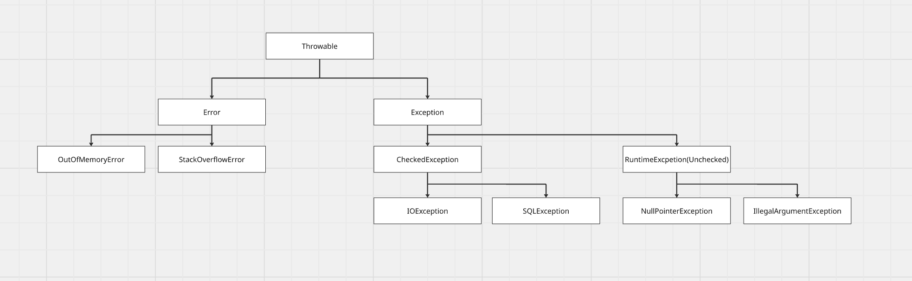

# 자바의 예외

자바의 예외(Exception)는 프로그램 실행 중 발생하는 비정상적인 상황을 나타내는 객체이다.

## 계층 구조
---


## 주요 분류

### Checked Exception

- 컴파일러가 예외처리를 강제 (try-catch 또는 throws 선언 필수)
- 외부 요인으로 발생 가능한 예외 (파일 I/O, 네트워크 등)
- 예: `IOException`, `SQLException`, `ClassNotFoundException`

### Unchecked Exception (RuntimeException)

- 컴파일러가 체크하지 않음
- 주로 프로그래머의 실수로 발생
- 예: `NullPointerException`, `ArrayIndexOutOfBoundsException`, `IllegalArgumentException`

### Error

- JVM 레벨의 심각한 문제, 애플리케이션에서 복구 불가
- 예: `OutOfMemoryError`, `StackOverflowError`

## 처리 방법

```java
try {
    // 예외 발생 가능 코드
} catch (SpecificException e) {
    // 예외 처리
} finally {
    // 항상 실행 (리소스 정리)
}

// try-with-resources (AutoCloseable 자동 close)
try (FileReader fr = new FileReader("file.txt")) {
    // ...
}
```


## 스택 트레이스 (Stack Trace)
---
스택 트레이스는 예외가 발생한 시점의 **메서드 호출 경로**를 역순으로 기록한 정보이다. 어떤 메서드에서 예외가 시작되어 어떤 경로로 전파되었는지 추적할 수 있게 해준다.

### 구성 요소

예외 발생 시 JVM은 현재 스레드의 **호출 스택(Call Stack)** 을 스냅샷으로 캡처한다. 각 스택 프레임에는 다음의 정보가 담긴다.

- 클래스명 (FQCN)
- 메서드명
- 파일명
- 라인 번호

### 예시

```java
public class Main {
    public static void main(String[] args) {
        methodA();
    }
    static void methodA() { methodB(); }
    static void methodB() { methodC(); }
    static void methodC() {
        throw new RuntimeException("문제 발생!");
    }
}
```

출력:

```
Exception in thread "main" java.lang.RuntimeException: 문제 발생!
    at Main.methodC(Main.java:9)
    at Main.methodB(Main.java:7)
    at Main.methodA(Main.java:6)
    at Main.main(Main.java:4)
```

가장 위가 **예외가 실제 발생한 지점**이고, 상위 호출자는 아래로 내려간다.

## 읽는 순서

```
at Main.methodC(Main.java:9)   ← 여기서 throw (근본 원인 위치)
at Main.methodB(Main.java:7)   ← methodC를 호출한 곳
at Main.methodA(Main.java:6)   ← methodB를 호출한 곳
at Main.main(Main.java:4)      ← 진입점
```

## Caused by (원인 체인)

예외가 다른 예외를 감싸서 던져질 때 `Caused by`(에러 발생 원인)로 원인이 연결된다.

```
java.lang.RuntimeException: 상위 래핑
    at Service.run(Service.java:20)
    ...
Caused by: java.sql.SQLException: connection refused
    at Repository.query(Repository.java:45)
    ...
```

## 획득 방법

```java
try {
    // ...
} catch (Exception e) {
    e.printStackTrace();                           // stderr 출력
    StackTraceElement[] trace = e.getStackTrace(); // 프로그래매틱 접근
    logger.error("에러 발생", e);                   // 로거 (권장)
}
```

## 스레드 스택과 스택 프레임
---
스택 트레이스는 **JVM 메모리 구조의 스레드 스택**과 **스택 프레임**을 먼저 엮어서 봐도 좋다.

### 스레드와 스택의 관계

JVM에서 **스레드 하나당 독립적인 JVM Stack(스레드 스택)** 이 하나씩 할당된다.

```
┌─────────────────────────────────────────┐
│              JVM 메모리                   │
├──────────────┬──────────────────────────┤
│  Heap        │ Method Area (Metaspace)  │ ← 모든 스레드 공유
├──────────────┴──────────────────────────┤
│ Thread-1 Stack │ Thread-2 Stack │ ...    │ ← 스레드별 독립
│                │                │         │
│ [Frame]        │ [Frame]        │         │
│ [Frame]        │ [Frame]        │         │
│ [Frame]        │                │         │
└────────────────┴────────────────┴────────┘
```

- **Heap / Method Area**: 모든 스레드 공유
- **JVM Stack**: 스레드별로 독립적으로 가지기 때문에 스택 트레이스도 **스레드마다 따로** 존재

`-Xss` 옵션으로 스레드당 스택 크기를 조정하며, 이 크기를 초과하면 `StackOverflowError`가 발생한다.

### 스택 프레임(Stack Frame)이란

**메서드 하나가 호출될 때마다 생성되는 단위**로, 스레드 스택에 push된다. 메서드가 리턴되면 pop되어 사라진다.

각 스택 프레임의 내부 구조:

```
┌─────────────────────────────┐
│      Stack Frame            │
├─────────────────────────────┤
│ Local Variables (지역변수)    │ ← 매개변수, 지역변수, this 참조
├─────────────────────────────┤
│ Operand Stack (피연산자 스택) │ ← 바이트코드 연산용 임시 공간
├─────────────────────────────┤
│ Frame Data                  │ ← 상수 풀 참조, 반환 주소 등
└─────────────────────────────┘
```

### 메서드 호출 → 프레임 push/pop

```java
void main() {
    methodA();   // Frame A push
}
void methodA() {
    methodB();   // Frame B push
}
void methodB() {
    throw new RuntimeException(); // 여기서 예외!
}
```

**예외 발생 직전 스레드 스택의 모습:**

```
Thread "main" Stack
┌──────────────────┐
│ Frame: methodB   │ ← top (현재 실행 중, 예외 발생 지점)
├──────────────────┤
│ Frame: methodA   │
├──────────────────┤
│ Frame: main      │ ← bottom
└──────────────────┘
```

### 스택 트레이스 = 스택 프레임의 스냅샷

예외가 발생하면 JVM이 **현재 스레드 스택에 쌓인 모든 프레임을 위에서부터 훑어** 각 프레임의 `클래스명.메서드명(파일명:라인)` 을 뽑아낸 것이 바로 스택 트레이스이다.

```
at Main.methodB(Main.java:10)   ← Frame B (top)
at Main.methodA(Main.java:6)    ← Frame A
at Main.main(Main.java:3)       ← Frame main (bottom)
```

즉, 스택 트레이스의 **한 줄 = 스택 프레임 하나**이다.

```java
StackTraceElement[] trace = e.getStackTrace();
// trace[0] = 최상단 프레임 (예외 발생 지점)
// trace[n] = 최하단 프레임 (스레드 진입점)
```

### 멀티스레드에서의 의미

각 스레드는 독립된 스택을 가지므로, 스택 트레이스도 스레드마다 독립적이다.

```
Exception in thread "worker-1" java.lang.RuntimeException: ...
    at Worker.run(Worker.java:15)
    ...
```

`thread "worker-1"` 부분이 어느 스레드의 스택에서 추출된 트레이스인지 알려주는 표시이다. 스레드 덤프(`jstack`)도 결국 **모든 스레드의 스택 프레임을 덤프한 것**이다.
