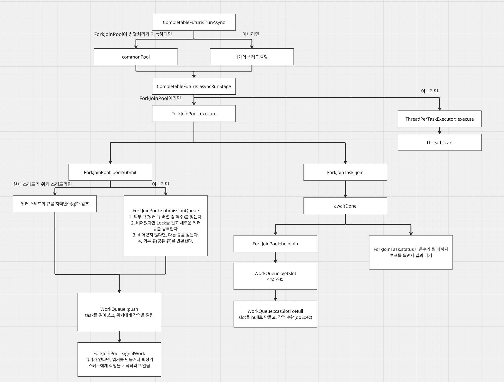
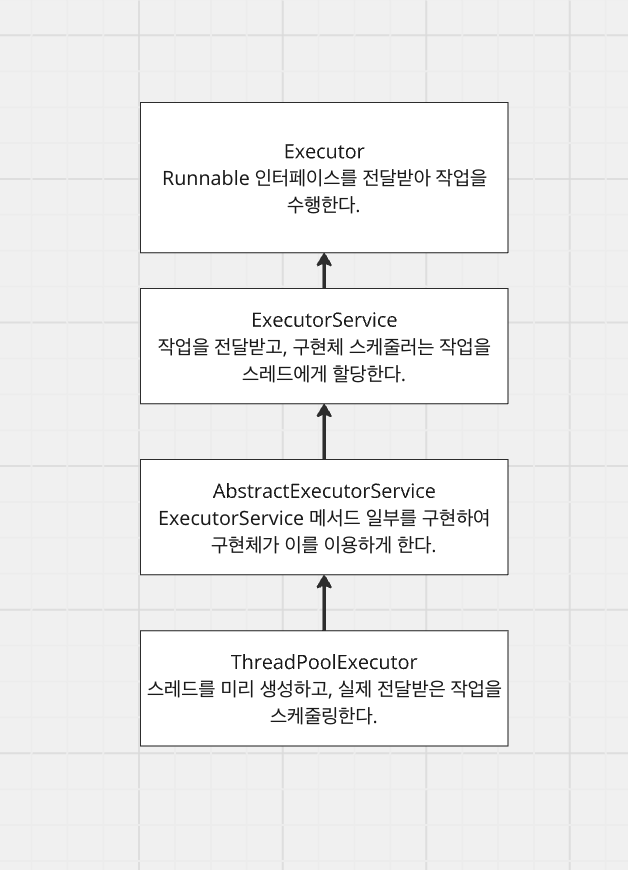

# [Java, Kotlin] ForkJoinPool

- **Tags:** #Java #Kotlin #ForkJoinPool #ParallelStream #CompletableFuture #ExecutorService #CountDownLatch

---
### 무엇을 배웠는가?
ForkJoinPool은 큰 작업을 작은 작업으로 분할하고(분할 정복), 여러 워커 스레드가 병렬로 처리해 최종 결과를 합치는 방식이라는 점을 학습했습니다.

또한 병렬 처리에서 자주 같이 언급되는 `ParallelStream`, `CompletableFuture`, `ExecutorService`, `CountDownLatch`가 각각 어떤 목적과 동작 특성을 가지는지 함께 정리했습니다.

---
### 왜 중요하고, 어떤 맥락인가?
대량 데이터 처리나 다중 I/O 호출이 있는 상황에서 병렬 처리는 처리량과 응답 시간을 크게 좌우합니다.

특히 Java 생태계에서는 내부적으로 `ForkJoinPool`(또는 유사한 스레드 풀 메커니즘)이 자주 사용되기 때문에, 단순 API 사용을 넘어서 스레드 분배 방식, 공용 풀 사용 시 부작용, 동기화 포인트를 이해하는 것이 중요합니다.

---
### 상세 내용

#### 1. ForkJoinPool 개념
ForkJoinPool은 `ForkJoinTask` 기반으로 동작합니다.

- `RecursiveTask<T>`: 결과를 반환하는 작업
- `RecursiveAction`: 결과를 반환하지 않는 작업

핵심은 큰 작업을 쪼개고(`fork`), 각 작업 결과를 모으는(`join`) 구조입니다.

#### 2. ForkJoinPool 동작 흐름


* JDK 21 기준

1. `ForkJoinPool.invoke()` 호출로 시작됩니다.
2. 내부 `poolSubmit`이 현재 스레드 상태를 보고 워커 큐 또는 외부 큐를 선택합니다.
3. Task를 큐에 넣고 워커들이 실행을 시작합니다.
4. `join`은 하위 작업 완료를 기다리고 결과를 합칩니다.
5. `helpJoin`으로 대기 작업을 훔쳐서 처리(work stealing)하며 전체 완료를 앞당깁니다.

#### 3. 병렬 처리 관련 도구들

##### 3-1. ParallelStream
컬렉션을 `parallelStream()`으로 변환하면 병렬 처리가 수행되며, 기본적으로 `ForkJoinPool.commonPool()`을 사용합니다.

공용 풀을 공유하기 때문에 다른 병렬 작업과 스레드 경합이 생길 수 있습니다.


1. `parallelStream()`으로 병렬 스트림 생성
2. 내부 파이프라인 + `Spliterator`로 데이터 분할
3. 최종 연산 시점에 `ForkJoinTask`로 병렬 실행

##### 3-2. CompletableFuture
`runAsync`(반환값 없음), `supplyAsync`(반환값 있음)로 비동기 실행을 구성하고,
`thenCompose`, `thenCombine`, `allOf`, `anyOf` 등으로 흐름을 조합합니다.



1. 비동기 작업 제출
2. 실행 전략으로 ForkJoinPool 또는 단일 스레드 사용
3. 조합/대기/후속 처리로 전체 플로우 구성

##### 3-3. ExecutorService
사전에 만든 스레드 풀에 작업을 분배해 병렬 처리합니다.
구현체(고정 풀, 캐시 풀 등)에 따라 스케줄링/자원 사용 특성이 달라집니다.



##### 3-4. CountDownLatch
여러 스레드의 작업 완료를 동기화할 때 사용합니다.
카운트를 감소시키다가 0이 되면 `await()` 대기 스레드가 진행합니다.


1. 목표 작업 수로 `CountDownLatch(count)` 생성
2. 각 작업 완료 시 `countDown()` 호출
3. 메인 스레드 `await()`로 전체 완료 시점 동기화

#### 4. 예제
```kotlin
object ParallelProcessingExample {

    class SumTask(
        private val numbers: LongArray,
        private val start: Int,
        private val end: Int,
    ) : RecursiveTask<Long>() {

        companion object {
            const val THRESHOLD = 10_000
        }

        override fun compute(): Long {
            if (end - start <= THRESHOLD) {
                var sum = 0L
                for (i in start until end) {
                    sum += numbers[i]
                }
                return sum
            }

            val mid = (start + end) / 2
            val left = SumTask(numbers, start, mid)
            val right = SumTask(numbers, mid, end)

            left.fork()
            val rightResult = right.compute()
            val leftResult = left.join()

            return leftResult + rightResult
        }
    }

    fun forkJoinPoolExample() {
        val numbers = LongArray(1_000_000) { it + 1L }
        val pool = ForkJoinPool()
        val result = pool.invoke(SumTask(numbers, 0, numbers.size))
        println("ForkJoinPool result: $result")
        pool.shutdown()
    }

    fun parallelStreamExample() {
        val numbers = (1L..1_000_000L).toList()
        val result = numbers.parallelStream()
            .filter { it % 2 == 0L }
            .mapToLong { it * it }
            .sum()
        println("ParallelStream result: $result")
    }

    fun completableFutureExample() {
        val userFuture = CompletableFuture.supplyAsync { "user" }
        val orderFuture = CompletableFuture.supplyAsync { "order" }
        CompletableFuture.allOf(userFuture, orderFuture).join()
        println("${userFuture.get()}, ${orderFuture.get()}")
    }

    fun executorServiceExample() {
        val executor = Executors.newFixedThreadPool(4)
        val futures = (1..8).map { idx ->
            executor.submit(Callable { "Task-$idx" })
        }
        futures.forEach { println(it.get()) }
        executor.shutdown()
    }

    fun countDownLatchExample() {
        val workerCount = 5
        val latch = CountDownLatch(workerCount)
        repeat(workerCount) {
            Thread.ofPlatform().start {
                latch.countDown()
            }
        }
        latch.await()
        println("all workers done")
    }
}
```

---
### 요약
- ForkJoinPool은 분할 정복 + work stealing으로 병렬 처리 효율을 높입니다.
- ParallelStream/CompletableFuture는 편리하지만 공용 풀 사용으로 스레드 경합이 생길 수 있습니다.
- ExecutorService는 직접적인 풀 관리가 가능하고, CountDownLatch는 완료 시점 동기화에 유용합니다.
- 병렬 처리 도구는 목적(CPU 연산, I/O, 조합, 동기화)에 맞춰 선택해야 안정적인 성능을 얻을 수 있습니다.

---
### 참조
- CompletableFuture: https://mangkyu.tistory.com/263
- ExecutorService: https://mangkyu.tistory.com/259
- ForkJoinPool: https://upcurvewave.tistory.com/653
