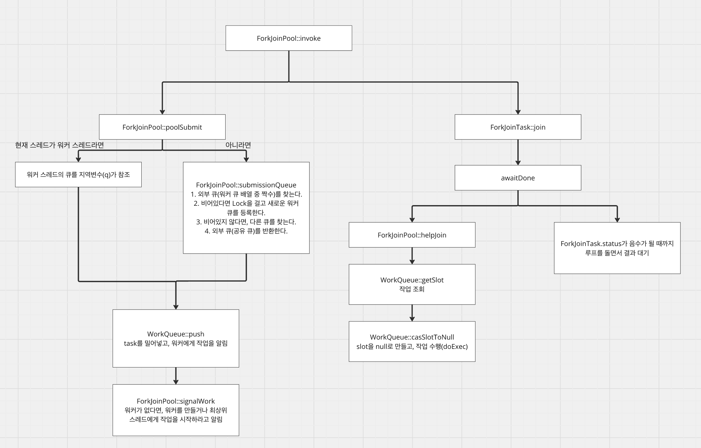
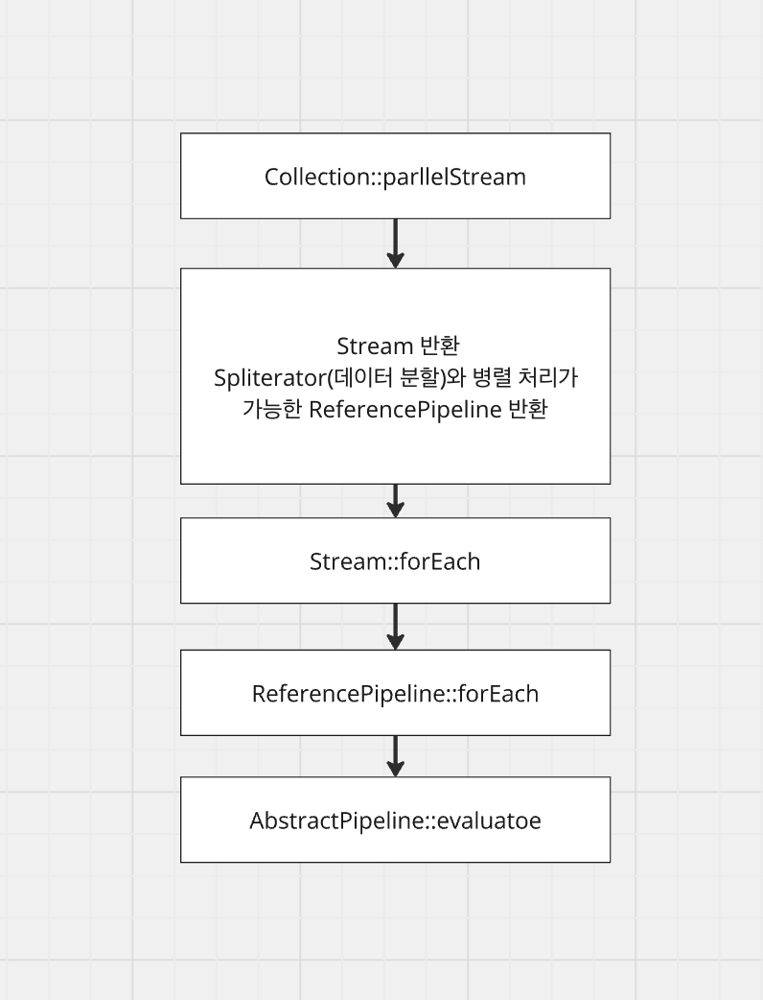
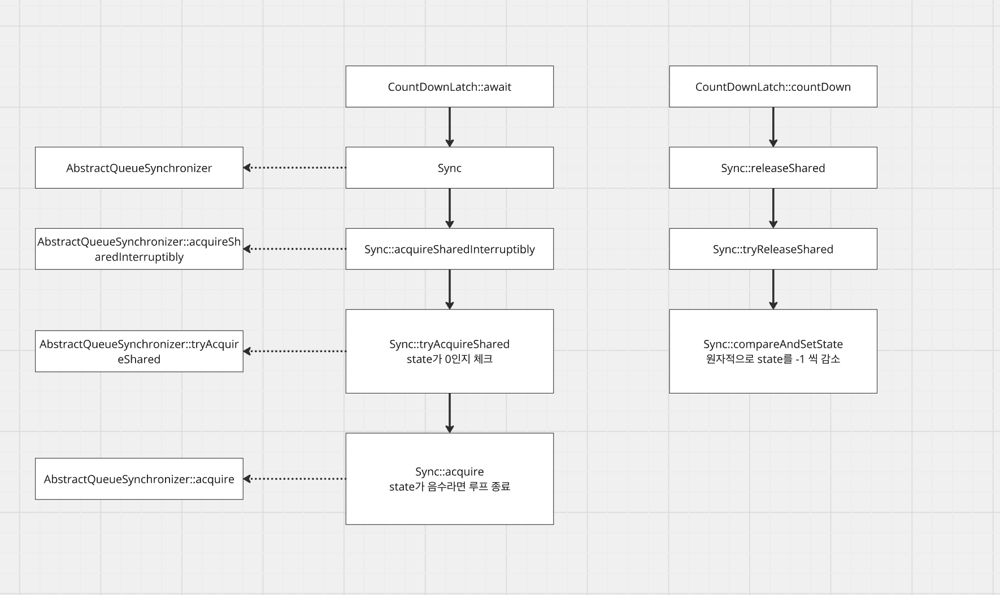

# [Java, Kotlin] ForkJoinPool

## ForkJoinPool?

---

ForkJoinPool은 분할 정복 알고리즘을 이용한다. 큰 작업을 여러 작업으로 잘게 나누어 여러 스레드들이 병렬적으로 작업을 처리하고, 큰 작업을 완료하는 방법이다. 그리고 각 작업을 처리하는 워커들은 유휴 시간을 없애기 위해 큐에 대기중인 작업을 가져와 처리한다.

최초의 큰 하나의 작업을 Task라고 한다. ForkJoinPool에선 이 Task를 RecursiveTask(결과값 반환), RecursiveAction(결과값 반환 x)라는 추상 클래스를 이용하여 구현할 수 있고, 이들이 상속하는 인터페이스는 ForkJoinTask이다. 즉, ForkJoinTask를 이용하여 큰 작업을 정의하고, 병렬 처리를 수행할 수 있다.

## ForkJoinPool 동작 방식

---



* JDK 21 기준

1. ForkJoinPool의 invoke 메소드를 호출하면서 시작된다.

2. poolSubmit 함수를 호출하는데, 이 함수는 현재 스레드가 워커 스레드라면 자신의 작업 큐에 Task를 밀어넣거나 아니라면 외부 큐를 반환한다.

3. 그리고 큐에 Task를 밀어 넣고, ForkJoinPool에 작업을 시작하라고 알린다.

4. join은 작업을 기다리고, 결과를 전달받는 작업이다.

5. helpJoin 메서드를 호출하여 큐에 대기중인 작업을 꺼내어 수행하고, 루프를 돌면서 결과를 대기한다.

## 다양한 병렬 처리 방법

---

ForkJoinPool 외에도 병렬 처리를 할 수 있는 방법들이 존재한다.

### ParallelStream

컬렉션을 Stream 인터페이스로 변환하여 사용할 수 있다. 이 Stream 인터페이스는 병렬로 작업을 처리하고, 이 때 사용되는 병렬 로직은 ForkJoinPool이다.

ForkJoinPool의 common pool을 이용하게 되는데, 다른 ForkJoinPool 작업들과 공통의 pool을 이용할 수 있으므로 의도치 않은 사이드 이펙트가 발생할 수 있다.



1. parallelStream을 만들어 컬렉션을 병렬 스트림 객체로 변환한다.

2. Stream 인터페이스의 구현체인 ReferencePipeline은 병렬처리가 가능하고, 데이터 분할을 담당하는 Spliterator가 설정된다.

3. forEach의 구현 evaluate 메서드가 실행되는데 최종 연산 시점에 ForkJoinTask를 생성하여 실행한다.

### CompletableFuture

CompletableFuture는 ForkJoinPool을 활용하거나 단일 스레드를 이용하여 작업을 실행한다. 그리고 runAsync(결과값 반환 x), supplyAsync(결과값 반환 o)을 통해서 콜백에 대한 결과를 얻을 수 있다.

비동기는 작업에 대한 결과를 기다리지 않고, 다른 작업을 처리하는 방법이다. 이에 따라 우리가 원자성을 보장해야하는 처리라면 각 작업이 완료되었고, 안되었고를 알아야 할 필요가 있다. 이를 위한 CompletableFuture의 장치는 앞선 작업을 연관지어 조합하거나 독립적으로 실행 후 기다리는 방법(thenCompose, thenCombine), 전체 작업이 완료되었음을 기다리는 방법(allOf), 가장 빨리 끝난 결과 콜백을 실행하는 방법(anyOf)등이 존재한다.


1. runAsync or supplyAsync를 실행하여 비동기 처리를 수행한다.

2. 비동기 처리를 위한 작업자 결정이 필요한데, ForkJoinPool이 현재 병렬처리가 가능하다면 해당 메커니즘을 사용하고, 아니라면 1개의 스레드를 생성한다.

3. ForkJoinPool이라면 병렬 처리를 할당하고, 아니라면 생성한 스레드를 이용하여 1개의 독립적인 작업을 처리한다.

### ExecutorService

자바에서는 스레드를 미리 만들어 놓고(스레드 풀), 전달받은 작업들을 미리 생성된 스레드들에게 할당시킬 수 있다. 즉, 각 스레드들이 작업들을 병렬처리할 수 있음을 의미하며 어떤 구현체 스케줄러를 만드냐에 따라 작업 분배 방식이 달라진다.

최상위 인터페이스인 Executor부터 시작해서 이를 상속받을수록 기능이 심화된다. ExecutorService의 경우 작업을 전달받아 관리하는 함수가 선언되어있고, AbstractExecutorService는 구현체들이 필요하다면 사용할 수 있게 일부 함수를 구현해두었다. 만약 필요하다면 실제 구현체들은 새로 오버라이드하여 자신의 로직에 맞게 함수를 구성할 수 있다.


### CountDownLatch

CountDownLatch는 현재 실행중인 스레드들의 작업들이 완료될 때 까지 기다려주는 장치이다. 내부 중첩클래스인 Sync는 AbstractQueueSynchronizer를 구현하여 state를 원자적으로 감소시키면서 스레드들의 작업 완료 여부를 체크한다.

이를 이용하여 병렬적으로 자바 스레드가 작업이 진행되더라도, 유저가 원하는 처리 갯수만큼으로 조절할 수 있고 일종의 백프레셔 혹은 세마포어로 동작한다.



1. 어느만큼의 일을 처리할 것인지 count로 CountDownLatch를 생성한다.

2. 각 스레드들은 CountDownLatch 내부에 구현되어있는 countDown을 원하는 시점(작업)에 호출하여 state를 감소시킨다.

3. await 메소드는 루프를 돌면서 state가 음수가 되면, 작업이 완료되었다고 판단하여 루프를 종료시킨다.

## 예제

---

```kotlin
object ParallelProcessingExample {

    // ========================================
    // 1. ForkJoinPool - 분할 정복으로 합산
    // ========================================

    /**
     * RecursiveTask를 이용한 분할 정복 합산
     * 1~1,000,000 까지의 합을 작은 단위로 쪼개서 병렬 계산
     */
    class SumTask(
        private val numbers: LongArray,
        private val start: Int,
        private val end: Int,
    ) : RecursiveTask<Long>() {

        companion object {
            const val THRESHOLD = 10_000
        }

        override fun compute(): Long {
            if (end - start <= THRESHOLD) {
                var sum = 0L
                for (i in start until end) {
                    sum += numbers[i]
                }
                return sum
            }

            val mid = (start + end) / 2
            val left = SumTask(numbers, start, mid)
            val right = SumTask(numbers, mid, end)

            left.fork()
            val rightResult = right.compute()
            val leftResult = left.join()

            return leftResult + rightResult
        }
    }

    fun forkJoinPoolExample() {
        println("\n=== 1. ForkJoinPool (분할 정복) 예제 ===")

        val numbers = LongArray(1_000_000) { it + 1L }
        val pool = ForkJoinPool()

        val time = measureTimeMillis {
            val result = pool.invoke(SumTask(numbers, 0, numbers.size))
            println("ForkJoinPool 합산 결과: $result")
        }
        println("소요 시간: ${time}ms")
        println("parallelism: ${pool.parallelism}")

        pool.shutdown()
    }

    // ========================================
    // 2. ParallelStream - 병렬 스트림
    // ========================================

    fun parallelStreamExample() {
        println("\n=== 2. ParallelStream 예제 ===")

        val numbers = (1L..1_000_000L).toList()

        // 순차 처리
        val sequentialTime = measureTimeMillis {
            val result = numbers.stream()
                .filter { it % 2 == 0L }
                .mapToLong { it * it }
                .sum()
            println("순차 처리 결과: $result")
        }
        println("순차 소요 시간: ${sequentialTime}ms")

        // 병렬 처리
        val parallelTime = measureTimeMillis {
            val result = numbers.parallelStream()
                .filter { it % 2 == 0L }
                .mapToLong { it * it }
                .sum()
            println("병렬 처리 결과: $result")
        }
        println("병렬 소요 시간: ${parallelTime}ms")
    }

    // ========================================
    // 3. CompletableFuture - 비동기 작업 조합
    // ========================================

    private fun simulateApiCall(apiName: String, delayMs: Long): String {
        Thread.sleep(delayMs)
        return "$apiName 응답 (${delayMs}ms)"
    }

    fun completableFutureExample() {
        println("\n=== 3. CompletableFuture (비동기 조합) 예제 ===")

        val time = measureTimeMillis {
            val userFuture = CompletableFuture.supplyAsync {
                simulateApiCall("유저 API", 300)
            }
            val orderFuture = CompletableFuture.supplyAsync {
                simulateApiCall("주문 API", 500)
            }
            val paymentFuture = CompletableFuture.supplyAsync {
                simulateApiCall("결제 API", 200)
            }

            // 3개 API 모두 완료 대기
            CompletableFuture.allOf(userFuture, orderFuture, paymentFuture).join()

            println("  ${userFuture.get()}")
            println("  ${orderFuture.get()}")
            println("  ${paymentFuture.get()}")
        }
        println("총 소요 시간: ${time}ms (순차면 1000ms, 병렬이라 ~500ms)")

        // thenCombine 예제
        println("\n--- thenCombine 예제 ---")
        val result = CompletableFuture.supplyAsync { 10 }
            .thenCombine(CompletableFuture.supplyAsync { 20 }) { a, b -> a + b }
            .thenApply { "합산 결과: $it" }
            .get()
        println("  $result")
    }

    // ========================================
    // 4. ExecutorService - 스레드 풀
    // ========================================

    fun executorServiceExample() {
        println("\n=== 4. ExecutorService (스레드 풀) 예제 ===")

        val executor = Executors.newFixedThreadPool(4)

        val time = measureTimeMillis {
            val futures = (1..8).map { taskId ->
                executor.submit(Callable {
                    val threadName = Thread.currentThread().name
                    Thread.sleep(200)
                    "Task-$taskId 완료 [$threadName]"
                })
            }

            futures.forEach { println("  ${it.get()}") }
        }
        println("소요 시간: ${time}ms (8개 작업, 4스레드 → ~400ms)")

        executor.shutdown()
        executor.awaitTermination(5, TimeUnit.SECONDS)
    }

    // ========================================
    // 5. CountDownLatch - 동기화 대기
    // ========================================

    fun countDownLatchExample() {
        println("\n=== 5. CountDownLatch (동기화) 예제 ===")

        val workerCount = 5
        val latch = CountDownLatch(workerCount)
        val totalResult = AtomicLong(0)

        val time = measureTimeMillis {
            repeat(workerCount) { i ->
                Thread.ofPlatform().start {
                    val partialResult = (i + 1) * 100L
                    Thread.sleep((100..300).random().toLong())
                    totalResult.addAndGet(partialResult)
                    println("  Worker-$i 완료 (부분 결과: $partialResult)")
                    latch.countDown()
                }
            }

            println("메인 스레드: 모든 워커 완료 대기 중...")
            latch.await()
            println("모든 워커 완료! 최종 결과: ${totalResult.get()}")
        }
        println("소요 시간: ${time}ms")
    }
}
```

## 참조

---

* CompletableFuture: [https://mangkyu.tistory.com/263](https://mangkyu.tistory.com/263)

* ExecutorService: [https://mangkyu.tistory.com/259](https://mangkyu.tistory.com/259)

* ForkJoinPool: [https://upcurvewave.tistory.com/653](https://upcurvewave.tistory.com/653)
