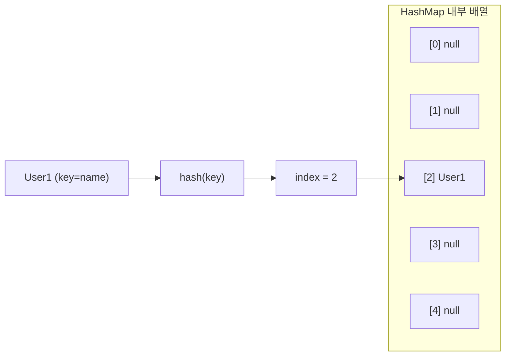
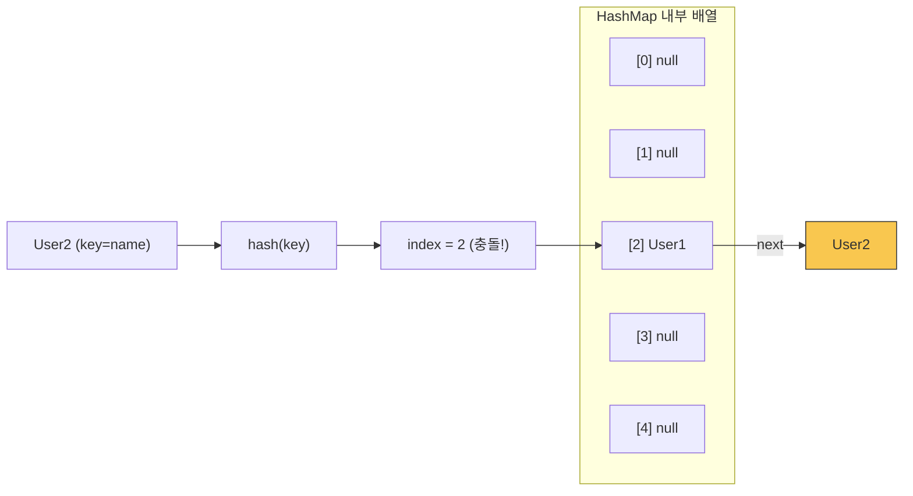
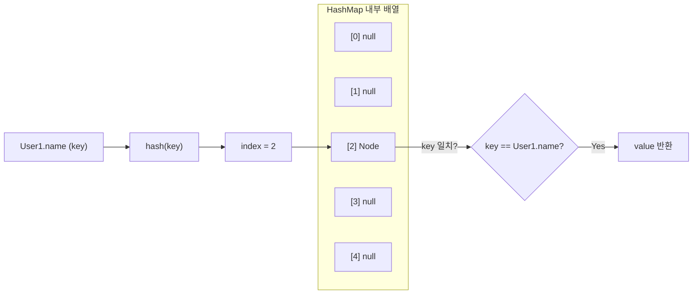
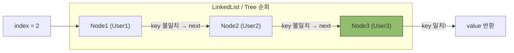

# Map

## Map이란

* key, value로 구성
* key, value는 한 쌍으로만 이루어졌고, key는 중복을 허용하지 않는다
* 해시 함수를 이용하여 그 값을 배열의 인덱스로 활용한다
    * 배열의 인덱스를 알면 왜 빠르게 값을 찾을 수 있는가?
        * 컴퓨터는 아래의 공식으로 주소값을 빠르게 찾아올 수 있기 때문
        * `찾으려는 주소 = 배열의 시작 주소 + (인덱스 x 데이터 하나의 크기)`
        * 예시)
        * 배열의 시작 주소 = 1000
        * 인덱스 = 10
        * 데이터 하나의 크기 = 4
        * 1000 + (4 x 10) = 1040으로 원하는 위치를 바로 알 수 있다
* 해시 테이블의 크기(n)가 작을수록 해시 충돌이 발생할 수 있다
    * 다른 데이터이나 해시 함수의 결과 (index)가 같을 경우
    * linkedlist를 이용하여 같은 index를 가져도 포인터를 이용해 데이터를 조회할 수 있다
        * 다만 최악의 경우 시간복잡도 O(n)
        * Java의 HashMap에서는 포인터가 가리키는 임계치(count)를 넘을 경우 O(log(n))의 시간복잡도를 가진 Tree로 전환한다

## 동작 방법

### PUT

Map에 key, value를 저장하는 방식



1. User1 인스턴스를 HashMap에 저장
2. hash함수를 이용하여 User1 인스턴스의 index를 추출하고, 배열에 담는다
    1. `(테이블 크기(n) - 1) & hash = index`에 이미 값이 존재하는지 확인하고, 존재하지 않으면 담는다
3. User2 인스턴스를 HashMap에 저장한다



4. 만약 hash결과가 User1 인스턴스와 동일하다면 해시 충돌이 발생한다
5. 해시 충돌이 발생한다면 LinkedList 형태로 같은 해시를 가진 노드들의 집합에 추가한다
    1. Node1.next = Node2
    2. 만약 집합의 임계치가 넘는다면 Tree로 변환한다

### GET

key를 이용하여 Map에서 value를 찾는 방식



1. User1.name(key)로 value를 조회
2. hash 함수를 이용하여 index로 데이터를 찾고, key가 일치하는지 확인한다
    1. 일치한다면 value 반환
3. 만약 key가 일치하지 않는다면 해시 충돌이 발생한 케이스이므로 next를 순회한다



4. LinkedList 혹은 Tree로 구성되어있는 next들을 전부 순회하면서 일치하는 key를 찾는다
5. 일치한 key가 있다면 value를 반환한다

---

## Map 구현체 비교

| 구현체 | 순서 보장 | Thread-Safe | Null Key | 시간복잡도 | 특징 |
|--------|:---------:|:-----------:|:--------:|:----------:|------|
| **HashMap** | X | X | O (1개) | O(1) | 가장 범용적, 해시 충돌 시 Tree 전환 |
| **LinkedHashMap** | 삽입 순서 | X | O | O(1) | 삽입 순서 또는 접근 순서 유지 |
| **TreeMap** | 키 정렬 순서 | X | X | O(log n) | Red-Black Tree 기반, 정렬 필요 시 사용 |
| **ConcurrentHashMap** | X | O | X | O(1) | 세그먼트별 잠금으로 높은 동시성 |
| **Hashtable** | X | O | X | O(1) | 전체 잠금, 레거시 (사용 비권장) |

### ConcurrentHashMap vs Hashtable

```java
// Hashtable: 모든 메서드에 synchronized → 전체 테이블 잠금
public synchronized V put(K key, V value) { ... }

// ConcurrentHashMap: 버킷(노드) 단위로 잠금 → 다른 버킷은 동시 접근 가능
// Java 8+: CAS(Compare-And-Swap) + synchronized (노드 단위)
```

### 사용 기준

* **HashMap**: 단일 스레드, 순서 무관, 가장 일반적인 선택
* **LinkedHashMap**: 삽입 순서가 중요할 때 (LRU 캐시 구현에도 활용)
* **TreeMap**: 키 기준 정렬이 필요할 때 (범위 검색, 최소/최대 키)
* **ConcurrentHashMap**: 멀티 스레드 환경에서 동시 읽기/쓰기
