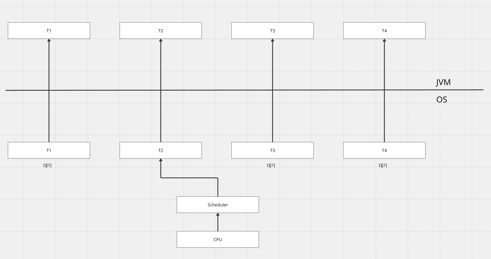
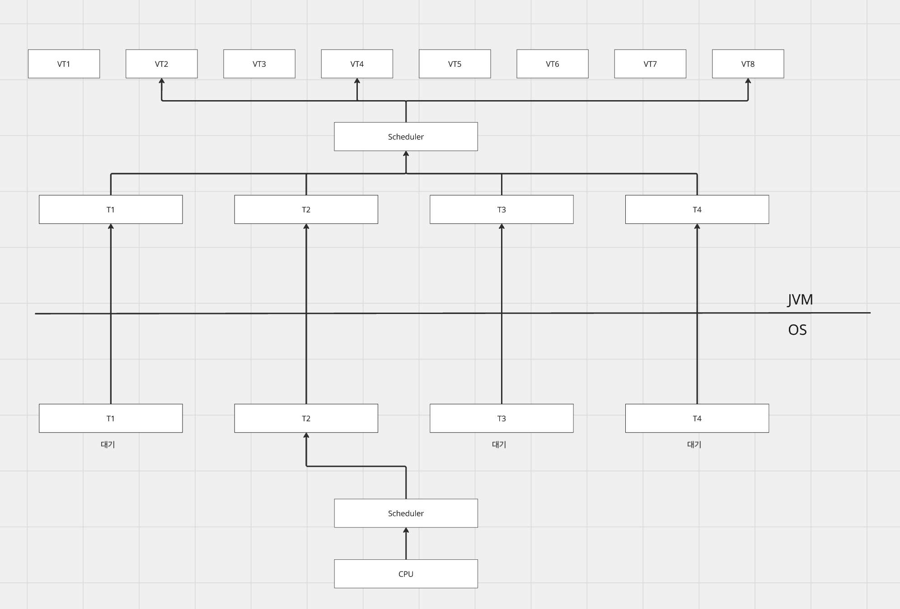
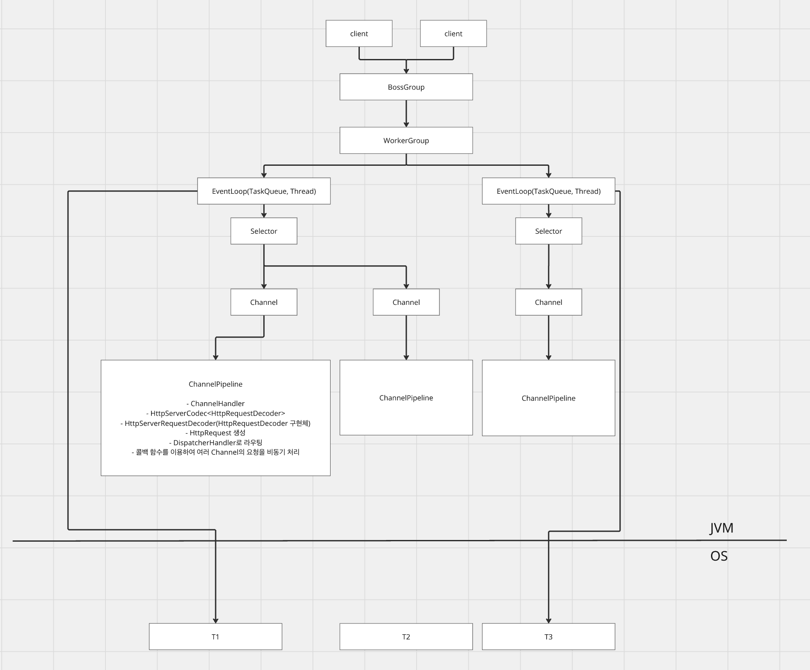
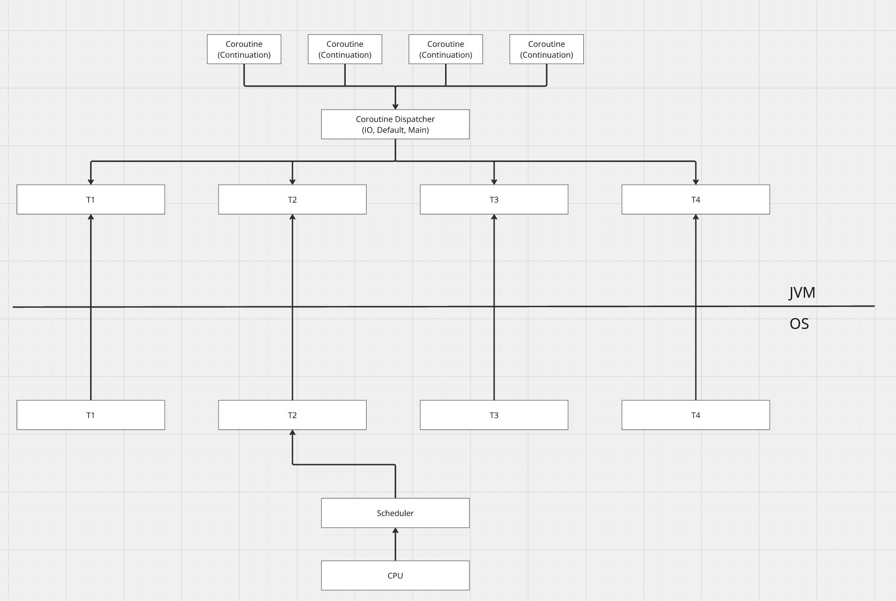
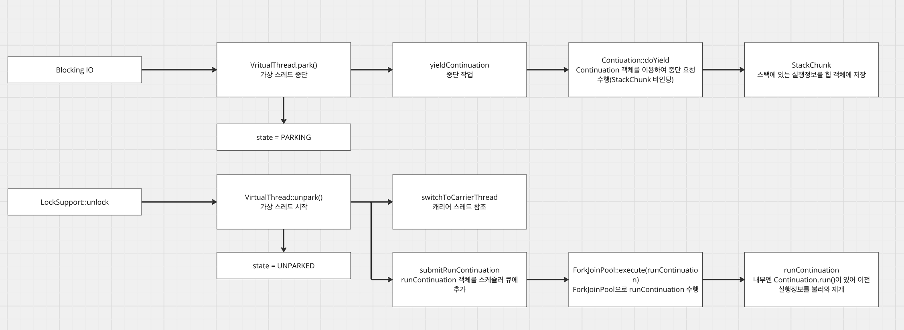

# [Java, Kotlin] 버추얼 스레드

## 버추얼 스레드?

버추얼 스레드는 기존 자바 스레드 모델과 달리 효율적으로 자원을 활용하기 위해 등장하였다. 자바 스레드는 하나의 요청을 처리하기 위해 하나의 스레드가 할당되었고, 그 과정에서 블로킹들이 발생하면, 스레드는 대기를 하며 결과를 얻기까지 자원을 낭비하게 된다. 이를 해소하기 위해 웹 플럭스와 같은 리액티브 프로그래밍, 코루틴을 이용한 방식이 등장했다.

그러면 이와 같은 대안책이 있음에도 불구하고, 버추얼 스레드가 왜 등장했고 왜 필요했을까?

* Java Thread = Carrier Thread

### 왜 필요한가



MVC에서는 하나의 요청을 처리하기 위해서 JVM에서 자바 스레드를 할당하고, 실제 동작을 위해 OS의 스레드와 매핑된다. 그림만 처럼 OS 스레드가 동작하기 위해선 CPU자원을 할당받아야 한다. OS는 스케줄링을 통해 CPU자원을 OS 스레드에 할당하고, 작업을 처리한다. 이 스케줄러를 통해 굉장히 빠르게 스레드를 스위칭하며, 작업을 처리한다.

이 과정에서 스레드는 이전 자신의 작업을 이어나가기 위해 레지스터 값을 CPU에 복원한다. 혹은 최대 스레드 갯수가 넘어갈 경우 스레드를 새로 생성해야 하는데 이는 고비용의 작업이다.

따라서 컨텍스트 스위칭을 위해 OS 레이어에서의 CPU 할당 작업, 새로운 스레드 생성 작업 등과 같은 고비용 작업을 없앨 필요가 생겼고, 이것이 가상 스레드가 나오게 된 배경이다.



버추얼 스레드는 OS 레벨까지 내려가지 않고, JVM 레벨에서 스케줄러 (ForkJoinPool)에 의해 작업이 할당된다. 즉, OS 스레드가 선점한 CPU 자원은 교체되지 않고, JVM 레벨에서 컨텍스트 스위칭이 발생하고, 가상 스레드를 새로 생성하는 비용도 OS, Java Thread보다 훨씬 저비용이기 때문에 자원을 더욱 효율적으로 사용할 수 있게 되었다.

그리고 멤버 변수로 Continuation 객체를 가지게 되는데, 컨텍스트 스위칭이 발생할 경우 현재의 상태와 작업 정보를 저장해놓고, 다음 작업 때 이 객체를 이용하여 이전 작업을 마저 수행할 수 있다.

### 다른 논블로킹(웹플럭스, 코루틴)기술과의 차이점

웹플럭스, 코루틴 모두 효율적으로 자원을 사용하면서 요청을 처리하는 목표로 등장했다. 동일한 목표이지만 서로 다른 구현을 통해서 목표를 달성한다.

#### 웹플럭스



클라이언트는 요청을 수행하고, Netty 웹 서버는 논블로킹 형태로 요청을 처리한다. accept만 처리하는 boss group, 작업을 넘겨받아 처리하는 worker group, 그리고 비즈니스를 라우팅하는 DispatcherHandler, 그리고 콜백 형태의 비동기 처리를 이용하여 차단 없이 처리한다.

이벤트 루프 방법을 통해서 적은 스레드로 많은 요청을 처리할 수 있다. 이 방법은 유휴 자원이 최대한 생기지 않도록 하며, 블로킹 없이 효율적으로 스레드 자원을 사용하게 된다.

#### 코루틴



코루틴 스코프를 만나게 되면, 코루틴들은 Continuation 객체를 주고받으며, 중단과 재개를 반복하며 요청을 처리한다. Continuation는 현재 스코프내에서 처리 도중 중단 지점을 만난다면 어디까지 처리되었는지 상태를 저장하고, 다음 재개 시 이 상태를 이용하여 작업을 이어나간다.

컨텍스트 스위칭에 대한 과정(중단과 재개)을 OS에서 하지 않고, 애플리케이션에서 수행하므로 저비용으로 요청을 처리할 수 있다.

톰캣 환경에서 코루틴을 수행할 경우 1 Request Per 1 Thread이므로 요청 시 커널 스레드와 톰캣 스레드가 매핑된다. 그리고 코루틴 스코프를 만나더라도 디스패처 스레드의 중단과 재개를 수행할 뿐이지 톰캣 스레드는 요청을 완료할 때까지 블로킹이 된다. 즉, 톰캣 환경에서는 코루틴을 쓰더라도 JVM 스레드는 요청이 완료될 때까지 블로킹이 된다.

다만 네티 환경에서 코루틴을 수행할 경우 N Request Per 1 Thread이므로 코루틴 스코프를 만나면, 디스패처 스레드들이 비동기로 로직들을 처리하고 작업을 수행한다. 작업이 완료되면, 콜백 함수에 응답을 반환한다.

### 버추얼 스레드의 이점은 무엇인가?

앞서 웹플럭스는 이벤트 루프 기반, 코루틴은 중단과 재개를 이용한 방법을 통해서 효율적으로 자원을 사용하여 요청을 처리하였고, 버추얼 스레드 또한 Continuation과 낮은 생성 비용을 이용하여 자원을 효율적으로 사용한다. 하지만 실제 코드를 작성할 때 웹플럭스는 MVC에선 사용하지 않았던 Mono, Flux, 콜백 처리 방법 등 그리고 코루틴은 suspend 함수 정의와 코루틴 스코프, 에러 핸들러, 디스패처 서블릿 정의 등 일반적인 자바 코드를 써내려 갈 때에 비해 알아야 할 것이 굉장히 많다.

반면에 버추얼 스레드는 spring.threads.virtual.enabled=true 설정으로 버추얼 스레드 풀로 교체한다던지, VirtualThreadPerTaskExecutor를 정의하여 버추얼 스레드 풀을 이용할 수 있다. 단순 설정만으로도 코드 교체 없이 버추얼 스레드를 이용할 수 있다는 장점이 존재한다.

---

## 버추얼 스레드를 위한 구성과 적용

### Virtual Thread

```java
final class VirtualThread extends BaseVirtualThread {
    // scheduler and continuation
    private final Executor scheduler;
    private final Continuation cont;
    private final Runnable runContinuation;

    // virtual thread state, accessed by VM
    private volatile int state;

    // carrier thread when mounted, accessed by VM
    private volatile Thread carrierThread;
}
```

버추얼 스레드는 주로 위 5개의 멤버 변수를 이용하여 작업을 수행한다.

### scheduler

```java
final class VirtualThread extends BaseVirtualThread {
    private static final ForkJoinPool DEFAULT_SCHEDULER = createDefaultScheduler();

    VirtualThread(Executor scheduler, String name, int characteristics, Runnable task) {
        super(name, characteristics, /*bound*/ false);
        Objects.requireNonNull(task);

        // choose scheduler if not specified
        if (scheduler == null) {
            Thread parent = Thread.currentThread();
            if (parent instanceof VirtualThread vparent) {
                scheduler = vparent.scheduler;
            } else {
                scheduler = DEFAULT_SCHEDULER;
            }
        }

        this.scheduler = scheduler;
        this.cont = new VThreadContinuation(this, task);
        this.runContinuation = this::runContinuation;
    }

    private void submitRunContinuation() {
        try {
            scheduler.execute(runContinuation);
        } catch (RejectedExecutionException ree) {
            submitFailed(ree);
            throw ree;
        }
    }
}
```

스케줄러는 버추얼 스레드 생성 시 설정된다. 기본값으로는 ForkJoinPool이 scheduler에 할당되어 작업을 스케줄링한다. 이 때 버추얼 스레드의 작업은 runContinuation이고, 이 작업을 큐에 추가하여 work stealing 알고리즘에 의해 작업들이 처리된다.

### cont

```java
private static class VThreadContinuation extends Continuation {
    VThreadContinuation(VirtualThread vthread, Runnable task) {
        super(VTHREAD_SCOPE, wrap(vthread, task));
    }
    @Override
    protected void onPinned(Continuation.Pinned reason) {
        if (TRACE_PINNING_MODE > 0) {
            boolean printAll = (TRACE_PINNING_MODE == 1);
            VirtualThread vthread = (VirtualThread) Thread.currentThread();
            int oldState = vthread.state();
            try {
                // avoid printing when in transition states
                vthread.setState(RUNNING);
                PinnedThreadPrinter.printStackTrace(System.out, reason, printAll);
            } finally {
                vthread.setState(oldState);
            }
        }
    }
    private static Runnable wrap(VirtualThread vthread, Runnable task) {
        return new Runnable() {
            @Hidden
            public void run() {
                vthread.run(task);
            }
        };
    }
}
```

버추얼 스레드의 실행 컨텍스트를 저장하고, 복원하는 객체이다. 객체 생성 시 wrap 메서드를 수행하게 되는데, 내부엔 버추얼 스레드 run이 동작한다.

### runContinuation

```java
@ChangesCurrentThread
private void runContinuation() {
    // the carrier must be a platform thread
    if (Thread.currentThread().isVirtual()) {
        throw new WrongThreadException();
    }

    // set state to RUNNING
    int initialState = state();
    if (initialState == STARTED || initialState == UNPARKED || initialState == YIELDED) {
        // newly started or continue after parking/blocking/Thread.yield
        if (!compareAndSetState(initialState, RUNNING)) {
            return;
        }
        // consume parking permit when continuing after parking
        if (initialState == UNPARKED) {
            setParkPermit(false);
        }
    } else {
        // not runnable
        return;
    }

    mount();
    try {
        cont.run();
    } finally {
        unmount();
        if (cont.isDone()) {
            afterDone();
        } else {
            afterYield();
        }
    }
}
```

Continuation 객체의 run을 수행하여 이전 작업을 불러와 재개하는 역할을 한다.

### state

```java
private static final int NEW      = 0;
private static final int STARTED  = 1;
private static final int RUNNING  = 2;     // runnable-mounted

// untimed and timed parking
private static final int PARKING       = 3;
private static final int PARKED        = 4;     // unmounted
private static final int PINNED        = 5;     // mounted
private static final int TIMED_PARKING = 6;
private static final int TIMED_PARKED  = 7;     // unmounted
private static final int TIMED_PINNED  = 8;     // mounted
private static final int UNPARKED      = 9;     // unmounted but runnable

// Thread.yield
private static final int YIELDING = 10;
private static final int YIELDED  = 11;         // unmounted but runnable

private static final int TERMINATED = 99;  // final state

// can be suspended from scheduling when unmounted
private static final int SUSPENDED = 1 << 8;
```

현재 가상스레드의 상태를 나타낸다.

### carrierThread

가상 스레드를 실행시키기 위한 캐리어 스레드 참조변수이다.

### 동작 과정

```java
@Override
void park() {
    assert Thread.currentThread() == this;

    // complete immediately if parking permit available or interrupted
    if (getAndSetParkPermit(false) || interrupted)
        return;

    // park the thread
    boolean yielded = false;
    setState(PARKING);
    try {
        yielded = yieldContinuation();  // may throw
    } finally {
        assert (Thread.currentThread() == this) && (yielded == (state() == RUNNING));
        if (!yielded) {
            assert state() == PARKING;
            setState(RUNNING);
        }
    }

    // park on the carrier thread when pinned
    if (!yielded) {
        parkOnCarrierThread(false, 0);
    }
}
```

가상 스레드는 blocking io를 만나면 park 메서드를 호출하여 가상 스레드를 정지시킨다. 이 정지시키는 과정에서 현재 Continuation Yield -> doYield를 호출하여 현재 스택에 저장되어있는 메서드, 지역 변수등의 정보를 힙 객체로 옮긴다. 즉, 다음 작업 재개 시 힙에 저장되어있는 작업 정보를 불러와 작업을 이어나갈 수 있다.

그리고 yield 과정에서 pinned가 되었다던지, 정지 작업이 안되었다면 parkOnCarrierThread를 호출하여 캐리어 스레드와 함께 정지를 한다.

```java
/**
 * Re-enables this virtual thread for scheduling. If the virtual thread was
 * {@link #park() parked} then it will be unblocked, otherwise its next call
 * to {@code park} or {@linkplain #parkNanos(long) parkNanos} is guaranteed
 * not to block.
 * @throws RejectedExecutionException if the scheduler cannot accept a task
 */
@Override
@ChangesCurrentThread
void unpark() {
    Thread currentThread = Thread.currentThread();
    if (!getAndSetParkPermit(true) && currentThread != this) {
        int s = state();
        boolean parked = (s == PARKED) || (s == TIMED_PARKED);
        if (parked && compareAndSetState(s, UNPARKED)) {
            if (currentThread instanceof VirtualThread vthread) {
                vthread.switchToCarrierThread();
                try {
                    submitRunContinuation(); // Continuation.run()을 호출하는 runContinuation 객체를 스케줄러에 넘김
                } finally {
                    switchToVirtualThread(vthread);
                }
            } else {
                submitRunContinuation();
            }
        } else if ((s == PINNED) || (s == TIMED_PINNED)) {
            // unpark carrier thread when pinned
            synchronized (carrierThreadAccessLock()) {
                Thread carrier = carrierThread;
                if (carrier != null && ((s = state()) == PINNED || s == TIMED_PINNED)) {
                    U.unpark(carrier);
                }
            }
        }
    }
}
```

그리고 작업이 다시 스케줄링에 의해 재개가 되면 unpark() 메서드를 호출하여 가상 스레드를 캐리어 스레드에 마운트시킨다. 그리고 submitRunContinuation을 통해 Continuation 객체의 run 메서드를 수행하여 이전 작업 정보를 불러와 작업을 재개한다.



### 실제 코드에서 버추얼 스레드 적용

#### 버추얼 스레드 팩토리

```kotlin
fun virtualThreadFactoryExample() {
    println("\n=== 버추얼 스레드 팩토리 예제 ===")

    val factory = Thread.ofVirtual()
        .name("VirtualWorker-", 0)
        .factory()

    val threads = List(5) { i ->
        factory.newThread {
            println("[Task-$i] 스레드: ${Thread.currentThread().name}")
            Thread.sleep(200)
            println("[Task-$i] 완료")
        }
    }

    val time = measureTimeMillis {
        threads.forEach { it.start() }
        threads.forEach { it.join() }
    }

    println("총 소요 시간: ${time}ms")
}
```

```
=== 버추얼 스레드 팩토리 예제 ===
[Task-3] 스레드: VirtualWorker-3
[Task-2] 스레드: VirtualWorker-2
[Task-0] 스레드: VirtualWorker-0
[Task-1] 스레드: VirtualWorker-1
[Task-4] 스레드: VirtualWorker-4
[Task-0] 완료
[Task-3] 완료
[Task-1] 완료
[Task-4] 완료
[Task-2] 완료
총 소요 시간: 212ms
```

#### 버추얼 스레드 Executor

```kotlin
fun virtualThreadExecutorExample() {
    println("\n=== 버추얼 스레드 Executor 예제 ===")

    val factory = Thread.ofVirtual()
        .name("VirtualExecutor-", 0)
        .factory()

    Executors.newThreadPerTaskExecutor(factory).use { executor ->
        val time = measureTimeMillis {
            val futures = List(5) {
                executor.submit {
                    println("[$it] 스레드: ${Thread.currentThread().name}")
                    Thread.sleep(100)
                }
            }

            futures.forEach { it.get() }
            println("5개 버추얼 스레드 실행 완료")
        }

        println("총 소요 시간: ${time}ms")
    }
}
```

```
=== 버추얼 스레드 Executor 예제 ===
[0] 스레드: VirtualExecutor-0
[1] 스레드: VirtualExecutor-1
[4] 스레드: VirtualExecutor-4
[2] 스레드: VirtualExecutor-2
[3] 스레드: VirtualExecutor-3
5개 버추얼 스레드 실행 완료
총 소요 시간: 106ms
```

#### spring.virtual.threads.enabled = true

```properties
spring.threads.virtual.enabled=true
```

```kotlin
@RestController
class VirtualThreadController {
    // Spring Boot에서 spring.virtual.threads.enabled=true 설정 시
    // 모든 @Async, Web 요청이 버추얼 스레드로 처리됩니다.
    @GetMapping("/virtual-thread-test")
    fun virtualThreadTest(): String {
        return "스레드: ${Thread.currentThread().name}, isVirtual: ${Thread.currentThread().isVirtual}"
    }
}
```

```
스레드: tomcat-handler-0, isVirtual: true
```

spring.threads.virtual.enabled는 톰캣 스레드를 버추얼 스레드풀로 교체하는 것이기 때문에 http 요청을 통해서 서블릿을 할당 받아야 의도했던 값을 출력할 수 있다.

---

## 예제와 테스트

### 10000건 대상 동시 요청 500

| 환경 | 평균 응답 시간 | 최소 응답 시간 | 최대 응답 시간 |
|------|----------------|----------------|----------------|
| 톰캣 mvc | 255.97 | 124 | 352 |
| 네티 웹플럭스 | 104.62 | 100 | 175 |
| 톰캣 mvc + 코루틴 | 110.21 | 100 | 283 |
| 네티 웹플럭스 + 코루틴 | 108.25 | 100 | 264 |
| 톰캣 mvc + 버추얼 스레드 | 107.27 | 100 | 204 |
| 네티 웹플럭스 + 버추얼 스레드 | 104.83 | 100 | 221 |
| 톰캣 mvc + 코루틴 + 버추얼 스레드 | 108.67 | 100 | 234 |
| 네티 웹플럭스 + 코루틴 + 버추얼 스레드 | 110.00 | 100 | 278 |

### 10000건 대상 동시 요청 1000

| 환경 | 평균 응답 시간 | 최소 응답 시간 | 최대 응답 시간 |
|------|----------------|----------------|----------------|
| 톰캣 mvc | 494.16 | 102 | 610 |
| 네티 웹플럭스 | 108.48 | 100 | 226 |
| 톰캣 mvc + 코루틴 | 114.44 | 100 | 326 |
| 네티 웹플럭스 + 코루틴 | 117.43 | 100 | 482 |
| 톰캣 mvc + 버추얼 스레드 | 129.26 | 100 | 761 |
| 네티 웹플럭스 + 버추얼 스레드 | 106.63 | 100 | 227 |
| 톰캣 mvc + 코루틴 + 버추얼 스레드 | 116.66 | 100 | 318 |
| 네티 웹플럭스 + 코루틴 + 버추얼 스레드 | 120.37 | 100 | 524 |

### 10000건 대상 동시 요청 2000

| 환경 | 평균 응답 시간 | 최소 응답 시간 | 최대 응답 시간 |
|------|----------------|----------------|----------------|
| 톰캣 mvc | 941.00 | 112 | 5,021 |
| 네티 웹플럭스 | 143.73 | 100 | 306 |
| 톰캣 mvc + 코루틴 | 391.81 | 100 | 7,980 |
| 네티 웹플럭스 + 코루틴 | 120.36 | 100 | 294 |
| 톰캣 mvc + 버추얼 스레드 | 358.65 | 100 | 7,945 |
| 네티 웹플럭스 + 버추얼 스레드 | 116.29 | 100 | 232 |
| 톰캣 mvc + 코루틴 + 버추얼 스레드 | 133.81 | 100 | 332 |
| 네티 웹플럭스 + 코루틴 + 버추얼 스레드 | 212.51 | 100 | 4,139 |

### 톰캣 mvc

톰캣 환경에선 동시 요청이 늘어날수록 느려지는 양상을 보인다. 스레드 풀의 기본 스레드 갯수는 200개인데, 동시 접속이 늘어남에 따라 이후의 요청들이 대기 큐에서 대기한다. 이에 따라 선형적으로 동시 요청 처리가 늘어지는 모습을 보인다.

### 네티 웹플럭스

네티는 이벤트 루프 모델이고, 동시 접속이 아무리 늘어나도 커넥션을 전부 맺고 논블로킹으로 콜백 응답을 받기 때문에 이런 무작정 동시 요청 상황에서는 큰 차이가 발생하지 않는다.

### 톰캣 mvc + 코루틴

자바 스레드는 블로킹 io 시 코루틴들을 교체하며 계속해서 요청을 처리한다. 그리고 일정 시간 후에 응답값을 받아 클라이언트에게 반환하는 논블로킹 형식이다. 그럼에도 2,000명 동시 요청에서 max가 급증한 이유는 아무리 요청을 논블로킹으로 처리하더라도 실제 코루틴을 처리하는 자바 스레드의 갯수가 부족하여 대기 큐에서 밀리기 때문이다.

### 네티 웹플럭스 + 코루틴

네티 웹플럭스 단독과 비슷한데, 이벤트 루프 기반으로 클라이언트의 요청을 콜백 형태로 응답받기 때문에 병목이 없어 큰 차이가 존재하지 않는다.

### 톰캣 mvc + 버추얼 스레드

톰캣 mvc + 코루틴과 마찬가지로 블로킹이 되면, 다른 버추얼 스레드가 캐리어 스레드에 마운트되어 요청을 처리한다. 하지만 캐리어 스레드의 절대적인 수가 부족하기 때문에 이후 요청들이 대기 큐에서 밀리게 된다.

### 네티 웹플럭스 + 버추얼 스레드

네티가 이미 논블로킹이기 때문에 버추얼 스레드를 쓰더라도 마찬가지로 다른 환경과 결과에서 큰 차이를 보이지 않는다.

### 톰캣 mvc + 코루틴 + 버추얼 스레드

톰캣 mvc + 코루틴보다 동시 요청 2,000에서 큰 개선점을 보여주었는데 앞서 문제점이었던 실제 처리하는 자바 스레드의 부족 문제를 버추얼 스레드로 교체되어 대기 큐에서의 문제를 해결해주었다. 때문에 동시 요청 처리량을 크게 개선할 수 있었다.

### 네티 웹플럭스 + 코루틴 + 버추얼 스레드

이전 환경들에 비해 max값이 크게 늘었다. 네티는 이미 이벤트 루프를 쓰고 있지만, 요청을 처리하기 위해 코루틴 객체와 버추얼 스레드를 계속해서 생성하므로 힙 사용량이 늘어나고 이를 GC하기 위해 순간적인 max값이 늘게 되었다.

---

## 참조

- 버추얼 스레드
  - https://techblog.lycorp.co.jp/ko/about-java-virtual-thread-1
  - https://techblog.lycorp.co.jp/ko/about-java-virtual-thread-2
  - https://d2.naver.com/helloworld/1203723

- 웹플럭스
  - https://tech.hancom.com/webflux-project-reactor-webhwp/
  - https://mark-kim.blog/netty_deepdive_1/
