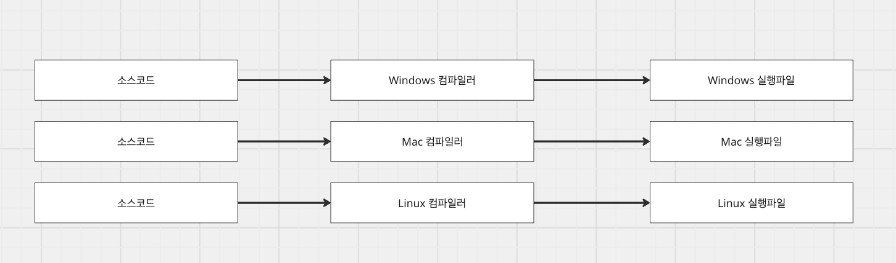
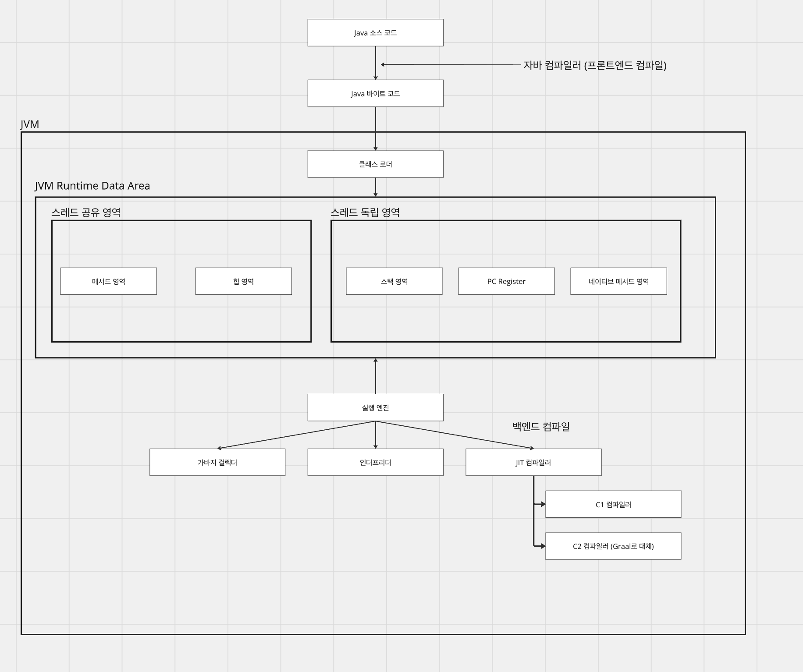
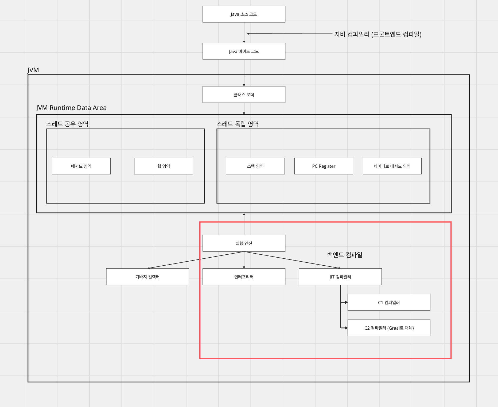
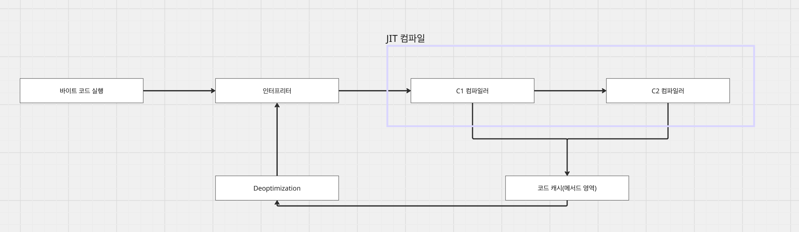

# [Java] Java 컴파일러

## Java 컴파일러

---

### Java 탄생 배경

c계열의 언어로 작성된 소프트웨어는 OS에 종속적이고, 동일한 소스코드일지라도 OS마다 컴파일을 따로 수행해주어야 했다. 그리고 이 결과물(실행파일)을 이용하여 소프트웨어를 실행했다.

이런 OS 종속적인 문제를 해결하기 위해 Write Once, Run Anywhere라는 철학으로 Java가 만들어지게 되었다.



### Java 컴파일러

Java 컴파일러는 프론트 컴파일러로 JVM이 플랫폼 독립적으로 운영되기 위해 java 코드를 중간언어격인 바이트 코드로 변환하는 역할을 한다. 때문에 프론트 컴파일러는 코드 최적화를 하기 보다는 java 코드가 문법적으로 문제는 없는지, 논리적으로 변수, 메서드, 인스턴스가 올바른 곳에 위치해 있는지를 체크한다. 이 과정을 위해서 구문 검사, 분석, 추상 구문 트리 구성등의 과정을 거치게 된다.

생성된 바이트코드를 플랫폼 위에서 실제로 실행시키기 위해선 기계어로의 번역이 필요하다. JVM의 실행 엔진엔 인터프리터가 존재하는데 이 역할을 담당한다. 바이트코드를 한줄씩 읽어서 기계어로 번역하고, 바로 코드를 읽고 실행하기 때문에 빠른 실행을 보여준다. 하지만 코드가 많아지면 많아질수록 한줄씩 읽고 번역하는 과정은 성능을 저하시키게 된다.

이 성능 저하를 막기 위해 컴파일러를 활용하는데, 이를 백엔드 컴파일이라고 한다. 백엔드 컴파일은 자주 쓰이는 코드를 컴파일하여 네이티브 코드로 변환하여 메서드 영역의 코드 캐시에 저장해두었다가 필요한 순간에 사용하여 성능상의 이점을 얻을 수 있다.

Java 컴파일러는 복합적인 내부 구성을 통해서 코드를 최적화시키고, 실행까지 수행한다.



## 프론트엔드 컴파일

---

### javac

javac는 .java 파일(소스코드)을 바이트코드로 변환하는 컴파일러이다. 프론트엔드 컴파일에서는 최적화 작업을 수행하지 않고, 오롯이 바이트코드만을 생성한다.

1. 구문 분석과 심벌 테이블 채우기

어휘 분석: 소스코드의 문자 스트림을 토큰 집합(키워드, 변수명, 리터럴, 연산자)으로 변환시킨다.

```kotlin
int x = 10; // [int][x][=][10][;]
```

구문 분석: 토큰들로부터 추상 구문 트리를 구성하고, 문법 규칙에 맞는지 검사한다.

심벌 테이블 채우기: 심벌 테이블에 심벌 주소와 심벌 정보 집합을 구성하여 중간 코드 생성, 목적코드 생성단계에 활용된다.

* 심벌 테이블: 변수 관리를 위해 key : value = 변수 : 메모리주소로 관리되는 테이블

2. 애너테이션 처리

특정 애너테이션이 컴파일 과정에서 추상 구문 트리를 변경시킬 수 있다. 이 과정이 발생한다면, 1번으로 되돌아가 더 이상 추상 구문 트리를 변경시킬 수 없을 때까지 반복한다.

3. 의미 분석과 바이트 코드 생성

특성 검사: 사용된 변수가 이미 선언되었는지, 타입은 일치하는지를 확인한다.

데이터, 제어 흐름 분석: 맥락상 해당 코드가 논리적으로 올바른지 확인한다. 가령 선언되지 않은 변수가 계산식에 포함되어있다던지와 같은 경우가 있다.

편의문법 제거: 제네릭, 가변 길이 매개 변수, 오토박싱과 언박싱 등은 런타임에 직접 지원하지 않는다. 따라서 기본 문법으로 전환하여 컴파일을 진행한다.

바이트 코드 생성: 바이트 코드 명령어로 변환하여 저장소에 기록한다.

### 바이트 코드

바이트 코드는 JVM이 이해할 수 있는 중간 언어로, OS와 CPU에 종속적이지 않다. 즉, JVM의 실행엔진이 이 코드를 읽을 수 있도록 하는 중간 단계일 뿐이고, 컴파일의 결과는 다음과 같다.

```kotlin
// Java 소스
public int add(int a, int b) {
    return a + b;
}

// 바이트코드 (javap -c MyClass.class)
public int add(int, int);
  Code:
     0: iload_1   // 로컬 변수 a를 피연산자 스택에 push
     1: iload_2   // 로컬 변수 b를 피연산자 스택에 push
     2: iadd      // 스택 상위 2개를 꺼내 더하고 결과를 push
     3: ireturn   // 스택 상위 값을 반환
```

바이트 코드를 JVM의 인터프리터 혹은 컴파일러가 읽어나가며, 코드를 실행하게 된다.

## 백엔드 컴파일

---



백엔드 컴파일은 순수 인터프리터로 한줄씩 읽었을 때 느린 성능 문제를 개선하기 위해 등장한 방법이다. 인터프리터의 경우 바이트 코드를 한줄씩 읽어가며, 현재 실행 코드를 빠르게 실행한다. 다만 실시간으로 전체 코드를 읽다보니 성능적으로 느린 지점이 발생했다. 이를 개선하기 위해 나타난 것이 백엔드 컴파일이다. 자주 수행되는 코드(핫코드)를 백 그라운드에서 네이티브 코드로 컴파일하여 미리 준비해놓고, 다음 실행 때 더욱 빠르게 코드를 실행시킬 수 있다는 장점이 존재한다.

이 백엔드 컴파일은 C1 컴파일러, C2컴파일러를 이용하여 진행된다.


C1은 빠르게 응답을 한다는 장점이 존재하고, C2의 경우 느리지만 성능 면에서는 우세를 보인다. 이들의 장점을 이용하기 위해 계층형 컴파일을 이용하여 좀 더 복합적으로 다양하게 컴파일러를 사용하게 되었다.

* 계층 0: 인터프리터 레벨에서 순수 해석을 실행한다.

* 계층 1: 단순 메서드 혹은 빠르게 컴파일 가능한 코드를 C1 컴파일러를 이용하여 바이트 코드를 네이티브 코드로 컴파일하고 실행한다.

* 계층 2: C1 컴파일러를 이용하고, 메서드 및 반환 횟수 통계 등 기본 모니터링을 수행한다.

* 계층 3: C1 컴파일러를 이용하고, 모든 성능 모니터링을 수집한다.

* 계층 4: C2 컴파일러를 이용하고, 앞서 획득한 모니터링 정보를 이용하여 최적화 수행 및 네이티브 코드 컴파일을 수행한다.

## C1 컴파일러

---

C1 컴파일러는 빠른 컴파일 속도를 자랑하지만, 그 만큼 코드 최적화면에선 떨어진다. 하지만 인터프리터와 달리 네이티브 코드로의 컴파일을 수행하며, 프로파일 데이터를 수집한다는 장점이 존재한다.

```kotlin
// 1. 메서드 인라이닝 (Inlining)
//    메서드 호출 오버헤드 제거
int result = square(x);         // 원본: 메서드 호출
private int square(int n) { return n * n; }

// → C1 최적화 후
int result = x * x;             // 본문이 직접 삽입됨

// 2. Dead Code Elimination
if (false) {
    heavyOperation();           // 실행 불가 코드 제거
}

// 3. 기본 상수 전파 (Constant Propagation)
int x = 10;
int y = x + 5;                  // → int y = 15;
```

## C2 컴파일러

---

C1 컴파일러에서 수행된 데이터를 이용하여 핫코드(자주 실행되는 코드)를 최적화하며, 처리량 부문에서 제일 좋은 성능을 보인다.

```kotlin
// 1. 탈출 분석 (Escape Analysis)
//    객체가 메서드 밖으로 탈출하지 않으면 힙 대신 스택에 할당
public int computeArea() {
    Point p = new Point(3, 4);  // p는 이 메서드 밖으로 탈출하지 않음
    return p.x * p.y;
}
// → new Point() 힙 할당 제거, GC 부담 없음

// 2. 루프 언롤링 (Loop Unrolling)
for (int i = 0; i < 4; i++) {
    data[i] = 0;
}
// → data[0]=0; data[1]=0; data[2]=0; data[3]=0;
//    분기 횟수를 줄여 CPU 파이프라인 효율 향상

// 3. 추측적 최적화 (Speculative Optimization)
//    프로파일링 데이터 기반으로 "아마도 이럴 것"이라고 가정하고 최적화
//    가정이 깨지면 → Deoptimization (인터프리터로 복귀 후 재컴파일)
shape.draw();  // 항상 Circle.draw() 였다면
// → if (shape is Circle) Circle.draw(); // 가상 메서드 디스패치 제거
//   else deoptimize;

// 4. 강도 감소 (Strength Reduction)
x * 2   →   x << 1    // 곱셈 → 비트 시프트 (더 빠름)
x * 8   →   x << 3
```

## JIT 컴파일러

---

### 배경

Java의 인터프리터는 느린 성능 문제를 가지고 있었고, 이를 해결하기 위해 JIT 컴파일러를 도입했다. JIT 컴파일러는 런타임에 바이트 코드를 네이티브 코드로 변환하는 전략이며 C1, C2(Graal) 등이 모두 JIT 컴파일러에 해당한다.



JIT는 정적 컴파일(AOT)보다 좋은 이유는 자주 쓰이는 코드의 빈도수를 알고있고, 효율적으로 필요한 코드에 대해 컴파일을 진행하기 때문이다. AOT는 미리 컴파일을 하기 때문에 실제로 얼마나 자주 쓰이는 코드인지 모른다. 때문에 효율적으로 네이티브 코드로 컴파일하지 못하지만 JIT는 통계를 기반으로 필요한 코드들에 대해 컴파일을 수행한다.

### 컴파일 대상과 조건

JIT 컴파일러의 대상은 핫코드이다. 핫코드의 유형은 많이 호출되는 메서드, 순환문의 본문을 포함하는 메서드 등이다. 그리고 이 유형들이 몇 번 호출되었는지 알아야 정확히 핫코드 대상으로 결정할 수 있다. 이 호출횟수를 결정하는 방법을 메서드 호출 카운터, 벡 에지 카운터라고 한다.

#### 메서드 호출 카운터

메서드 호출 카운터는 메서드가 얼마나 호출됐는가를 기록하고, 이를 이용하여 JIT 컴파일을 수행한다. -XX:CompileThreshold로 임계치를 지정할 수 있고, 임계치를 넘어서게 되면 JIT 컴파일러는 백그라운드에서 비동기로 컴파일을 수행한다.

#### 백 에지 카운터

백 에지 카운터는 순환문의 코드가 얼마나 반복되는지를 계산한다. 순환문의 코드는 메서드에 포함되어 있기 때문에 스택프레임에서 실행중인 이 메서드를 변환하는 것을 OSR(온스택 치환)컴파일이라 한다. OSR 컴파일로 인해서 인터프리터로 한줄씩 계속해서 반복하는 것이 아닌 컴파일된 네이티브 코드로 갈아끼울 수 있게 된다.

#### Code Cache

컴파일된 네이티브 코드들은 Code Cache라는 공간에 저장된다. 이 Code Cache는 메모리의 Method Area에 저장되는데, Code Cache가 가득차면 JIT 컴파일이 중단되기 때문에 -XX:ReservedCodeCacheSize로 조절할 수 있다.

#### 역최적화

JIT 컴파일러는 최적화를 진행하면서 낙관적인 최적화(추측)를 통해 컴파일하는 경우가 존재한다. 잘못된 컴파일은 오류이기 때문에 인터프리터 모드로 되돌아가서 다시 계층형 컴파일을 수행하고, 최적화를 수행한다.

## AOT 컴파일러

---

AOT 컴파일러는 동적으로 네이티브 코드를 컴파일하는 JIT 컴파일러와 달리 미리 코드를 네이티브 코드로 만들어 놓고, 프로그램을 실행하는 방식이다. 백그라운드로 컴퓨팅 자원을 지속적으로 활용하거나 네이티브 코드로 컴파일되기 전까지 인터프리터로 기계어를 실행한다든지와 같은 컴파일러와 달리 AOT 컴파일러는 실행 시점엔 미리 만들어둔 네이티브 코드가 수행되기 때문에 앞선 컴파일러의 단점이 없어진다.

하지만 반대로 말하면 전체 소스 코드를 네이티브로 컴파일되기 전까지 프로그램이 실행될 수 없음을 의미한다. 컴파일 시간은 매우 오래 걸리며, 심지어 낙관적인 컴파일을 진행한 결과 역최적화가 발생하면 기껏 만들어둔 컴파일 코드를 전부 폐기하고, 다시 되돌아가야할 수도 있다.

## 참조

---

[https://mangkyu.tistory.com/343](https://mangkyu.tistory.com/343)

[JVM 밑바닥까지 파헤치기](https://product.kyobobook.co.kr/detail/S000213057051?utm_source=google&utm_medium=cpc&utm_campaign=googleSearch&gt_network=g&gt_keyword=&gt_target_id=dsa-435935280379&gt_campaign_id=9979905549&gt_adgroup_id=132556570510&gad_source=1)
