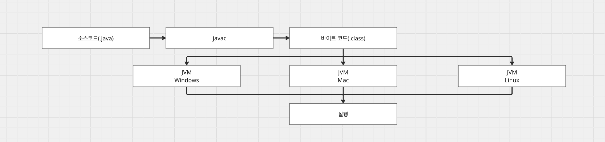
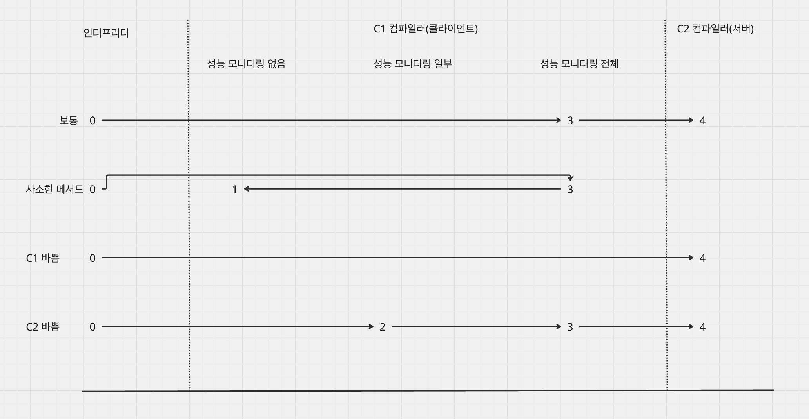

# [Java] Java 컴파일러

- **tags:** #Java #Compiler #JIT #AOT #JVM #Bytecode

---
### 무엇을 배웠는가?
* Java의 컴파일 과정(프론트엔드 및 백엔드 컴파일)에 대해 배웁니다.
* javac가 생성하는 바이트코드의 역할과 JVM 내부에서 어떻게 실행되는지 학습합니다.
* JIT 컴파일러(C1, C2)와 계층형 컴파일(Tiered Compilation)을 통한 성능 최적화 방식을 배웁니다.
* JIT와 AOT 컴파일러의 차이점과 각각의 장단점을 이해합니다.

---
### 왜 중요하고, 어떤 맥락인가?
Java는 "Write Once, Run Anywhere"라는 철학을 실현하기 위해 중간 언어인 바이트코드를 사용합니다.
단순히 소스 코드를 기계어로 바꾸는 것을 넘어, 실행 시점(Runtime)에 코드를 분석하고 최적화하는 JIT 컴파일 메커니즘을 이해하는 것은 고성능 Java 애플리케이션을 설계하고 튜닝하는 데 필수적입니다.

---
### 상세 내용

#### 1. Java 탄생 배경
C/C++ 계열의 언어로 작성된 소프트웨어는 OS에 종속적이며, OS마다 별도의 컴파일 과정이 필요했습니다. Java는 이러한 종속성 문제를 해결하기 위해 JVM(Java Virtual Machine)이라는 가상 머신 위에서 동작하며, 어떤 환경에서도 동일하게 실행될 수 있는 구조를 택했습니다.


#### 2. Java 컴파일러 구조
Java 컴파일러는 크게 프론트엔드 컴파일과 백엔드 컴파일로 나뉩니다.



* **프론트엔드 컴파일**: 소스 코드(.java)를 바이트코드(.class)로 변환 (javac)
* **백엔드 컴파일**: 바이트코드를 실제 기계어(Native Code)로 변환하여 실행 (JIT/AOT)


#### 3. 프론트엔드 컴파일 (javac)
`javac`는 소스 코드를 JVM이 이해할 수 있는 중간 언어인 **바이트코드**로 변환합니다. 이 과정에서 코드 최적화보다는 문법 검사와 논리적 오류 체크에 집중합니다.

* **주요 단계**
  1. **구문 분석과 심벌 테이블 채우기**: 어휘 분석을 통해 토큰을 생성하고, 추상 구문 트리(AST)를 구성합니다.
  2. **애너테이션 처리**: 컴파일 과정에서 AST를 변경할 수 있는 애너테이션을 처리합니다.
  3. **의미 분석과 바이트코드 생성**: 변수 선언 여부, 타입 일치 등을 확인하고 최종적으로 바이트코드를 생성합니다.

* **바이트코드 예시**
```kotlin
// Java 소스
public int add(int a, int b) {
    return a + b;
}

// 바이트코드 (javap -c MyClass.class)
public int add(int, int);
  Code:
     0: iload_1   // 로컬 변수 a를 피연산자 스택에 push
     1: iload_2   // 로컬 변수 b를 피연산자 스택에 push
     2: iadd      // 스택 상위 2개를 꺼내 더하고 결과를 push
     3: ireturn   // 스택 상위 값을 반환
```

#### 4. 백엔드 컴파일
인터프리터 방식으로 바이트코드를 한 줄씩 읽어 실행하면 성능이 느려질 수 있습니다. 이를 보완하기 위해 자주 실행되는 코드(핫코드)를 기계어로 미리 컴파일해두는 방식이 사용됩니다.


* **C1 컴파일러**: 빠른 컴파일 속도에 최적화 (빠른 응답성)
* **C2 컴파일러**: 높은 수준의 코드 최적화 (높은 처리량)
* **계층형 컴파일 (Tiered Compilation)**: 인터프리터, C1, C2를 조합하여 상황에 맞게 최적의 컴파일러를 선택합니다.



#### 5. JIT(Just-In-Time) 컴파일러
런타임에 바이트코드를 기계어로 변환하는 전략입니다.

* **최적화 기법**
  * **메서드 인라이닝**: 메서드 호출 오버헤드를 줄이기 위해 본문을 직접 삽입합니다.
  * **탈출 분석**: 객체가 메서드 밖으로 나가지 않으면 힙 대신 스택에 할당하여 GC 부담을 줄입니다.
  * **추측적 최적화**: 통계를 기반으로 최적의 경로를 가정하여 컴파일합니다.

* **컴파일 대상(Hot Code)**: 많이 호출되는 메서드나 반복문이 많은 코드를 대상으로 카운터를 통해 선정합니다.

#### 6. AOT(Ahead-Of-Time) 컴파일러
프로그램 실행 전(빌드 시점)에 미리 기계어로 컴파일하는 방식입니다.


* **장점**: 실행 즉시 최상의 성능(Warm-up 없음), 컴퓨팅 자원 절약
* **단점**: 빌드 시간 증가, 런타임 프로파일링 정보를 활용한 동적 최적화 불가

---
### 요약
- **javac**는 소스 코드를 플랫폼 독립적인 **바이트코드**로 변환합니다.
- **JIT 컴파일러**는 런타임에 자주 쓰이는 코드를 기계어로 변환하여 실행 성능을 극대화합니다.
- **C1, C2 컴파일러**와 **계층형 컴파일**을 통해 응답성과 처리량 사이의 균형을 맞춥니다.
- **AOT**는 빌드 시점에 기계어를 생성하여 빠른 초기 구동 성능을 제공하지만, 동적 최적화에는 한계가 있습니다.

---
### 참조
- [JVM] JIT 컴파일러의 다양한 최적화 기술들: [https://mangkyu.tistory.com/343](https://mangkyu.tistory.com/343)
- JVM 밑바닥까지 파헤치기 (도서)
