# [JVM] 가비지 컬렉터

## JVM 메모리

JVM은 스레드별 독립적 공간과 런타임 공유 공간으로 나뉜다. "메모리는 한정적인 공간이기 때문에 사용하지 않는 것들은 소멸시킬 필요가 있다."

스레드 독립 공간(프로그램 카운터, 가상 머신 스택, 네이티브 메서드 스택)은 스레드 생명주기와 함께 자연 회수되며, 메서드 영역은 고정 비용으로 계산 가능하다. 반면 힙 영역은 동적으로 객체 생성/소멸이 발생한다.

### 어떻게 회수할 것인가

객체 참조 여부를 판단하여 회수한다. 참조되지 않는 객체는 회수 대상이며, 이는 도달 가능성 분석 알고리즘으로 판단한다.

### 도달 가능성 분석 알고리즘

GC 루트와 참조 체인으로 도달 불가능한 객체를 판단한다.

**GC 루트 정의:**
- 가상 머신 스택: 현재 수행 메서드의 지역/매개변수/임시 변수
- 메서드 영역: 정적 필드 참조, 상수 참조 객체
- 네이티브 메서드 스택: JNI 참조 객체
- Primitive 타입, 동기화 락 객체

### 루트 노드와 안전 지점

"루트 집합은 스냅샷 같은 일관된 형상이 필요하기 때문에 사용자 스레드를 정지"시킨다. OopMap은 JIT 컴파일 시 스택/레지스터 참조를 기록하여 스캔을 최소화한다.

### 동시 접근 가능성

GC 수행 중 객체 참조 변경 방지를 위해 애플리케이션 스레드를 정지(Stop The World)시킨다. 동시성 지원 해결책들이 등장했다.

#### 1. 삼색 마킹 알고리즘

- 흰색: 미방문 객체
- 회색: 방문했으나 참조 미검사
- 검은색: 검사 완료

#### 2. 메모리 배리어

- 쓰기 배리어: 참조 변경 시 GC에 기록
- 읽기 배리어: Compact 시 최신 위치 정보 제공

### 메서드 영역 GC

메서드 영역도 메타스페이스 임계값 도달 또는 클래스 언로딩 필요 시 GC가 발생한다.

---

## 세대 단위 컬렉션

"대다수의 객체는 일찍 죽고, 살아남은 객체는 오래 살 가능성이 높다"는 경험에 기반한다.

### Young/Minor

신세대로 Eden, Survivor0/1로 세분화된다. Minor GC 후 살아남은 객체는 Survivor로 이동하며, age값이 증가한다. 임계치 초과 시 Old 영역으로 승격(promotion)된다.

### Old/Major

오래 살아남은 객체 영역이다. Minor GC에서 승격된 객체들이 쌓이고, Major GC로 청소된다.

### 세대 간 참조

Young↔Old 참조는 발생 가능하므로 기억 집합을 통해 추적한다. 카드 테이블은 512바이트 단위 카드로 힙을 분할하고 1바이트 플래그로 표현한다.

---

## 가비지 컬렉션 알고리즘

### 마크-스윕 알고리즘

회수 대상을 표시 후 일괄 청소한다. "가장 간단하나" 메모리 파편화가 발생한다.

### 마크-카피 알고리즘

메모리를 절반으로 나누어 한쪽은 할당, 다른 한쪽은 공백으로 유지한다. Young의 Survivor 영역이 사용한다. 파편화는 해결하나 가용 메모리가 절반이다.

### 마크-컴팩트 알고리즘

표시 후 회수 대상을 제거하고 객체를 메모리 앞부분부터 재배치한다. 파편화는 해결하나 Old 영역의 긴 정지 시간 초래한다.

---

## 가비지 컬렉터

### Serial GC

단일 스레드로 GC를 수행한다.

### Parallel GC

Serial GC를 멀티 스레드로 수행한다.

### CMS GC

애플리케이션 스레드와 GC 스레드를 동시 수행하여 정지 시간을 단축한다.

1. 최초 표시: "GC 루트 노드들을 열거하고, 객체들을 마킹한다"

2. 동시 표시: 사용자 스레드와 동시 작동

3. 재표시: 사용자 스레드 일시 정지 후 업데이트

4. 스윕: 객체 회수

CMS는 정지 시간이 짧으나 컴팩트가 없어 메모리 단편화 발생하며, 프로세서 자원을 많이 소비한다.

### Garbage First GC

"힙을 리전으로 나누어 빠르게 회수 가능한 부분부터 회수"한다.

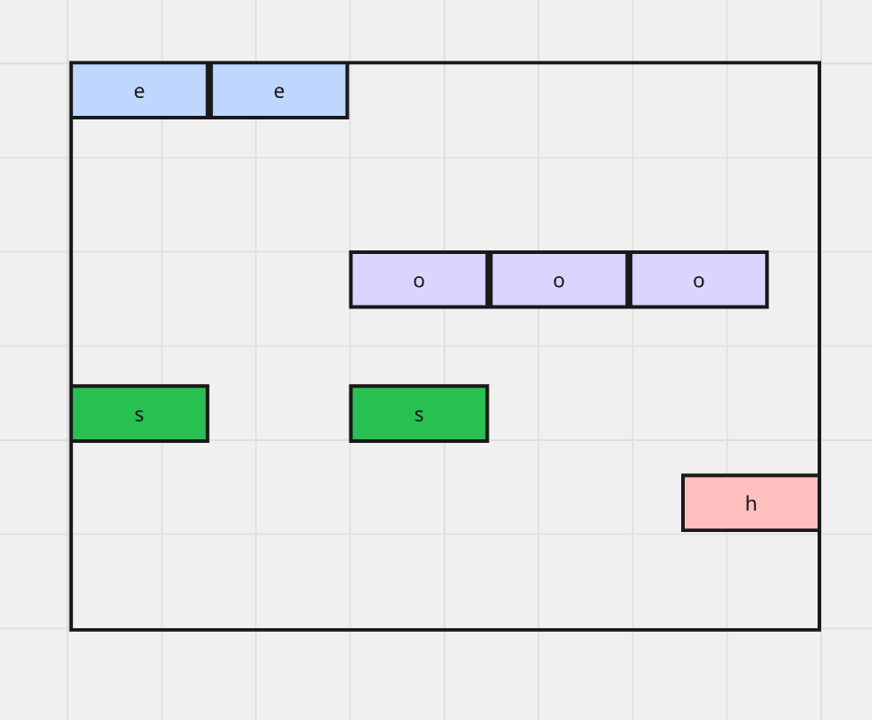

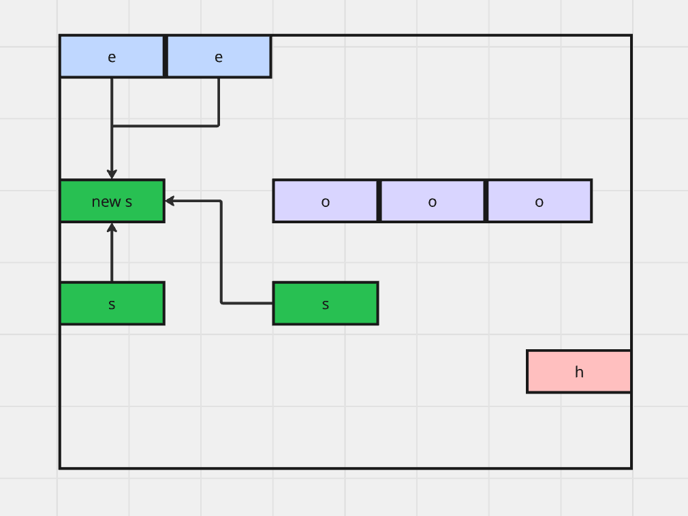

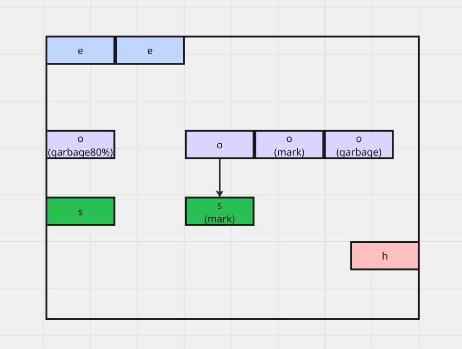

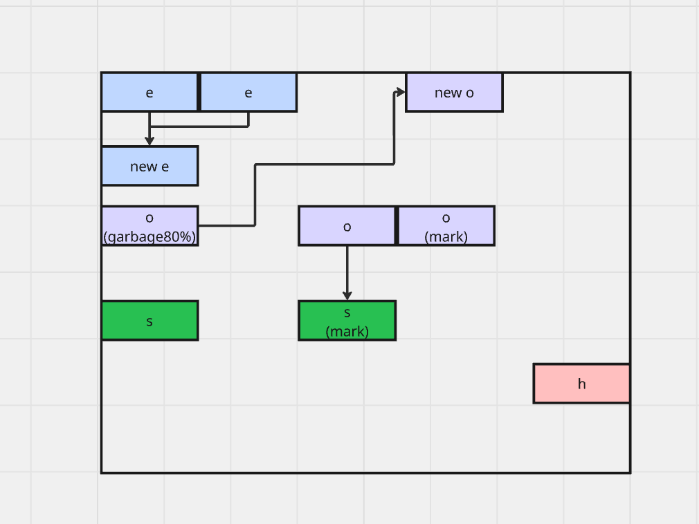

### ZGC

세대 구분 없는 리전 기반 ZPage를 사용한다.

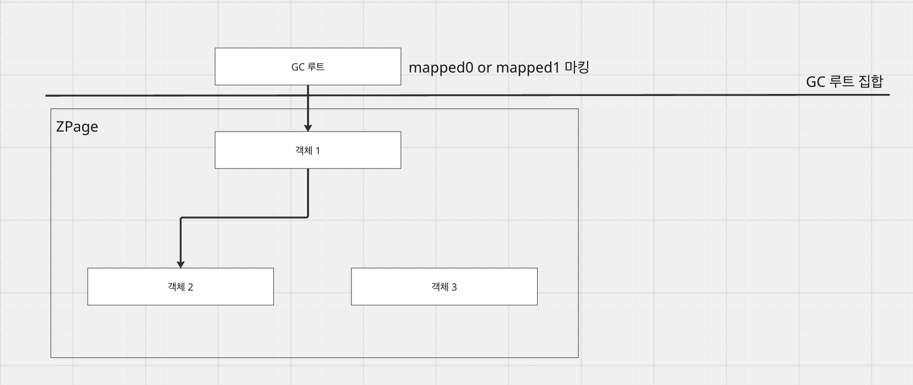

소리전(2MB), 중리전(32MB), 대리전(4MB 이상)으로 구분된다.

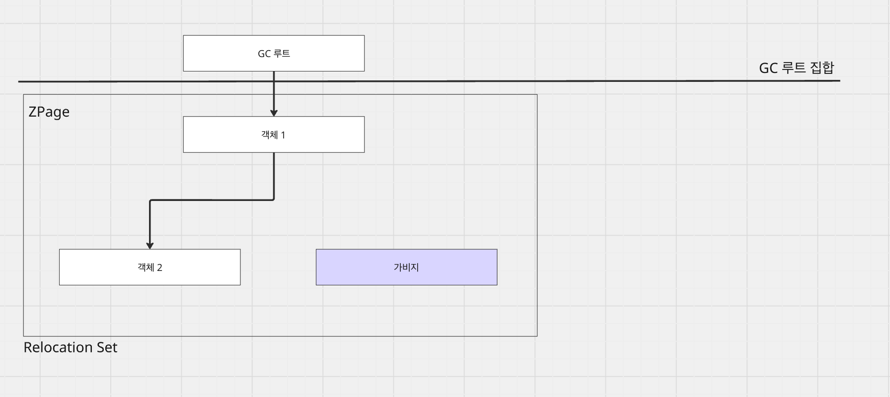

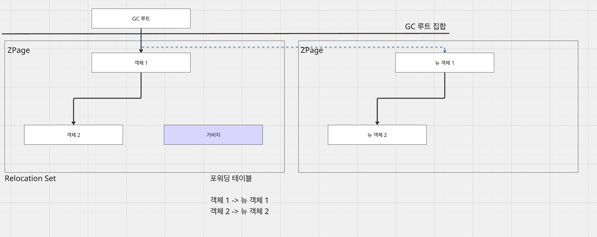

최근 세대 구분 ZGC가 추가되어 Young/Old 구분으로 빠른 GC가 가능해졌다.

### Shenandoah GC

G1GC 개선형으로 세대별 리전을 따로 구분하지 않는다.

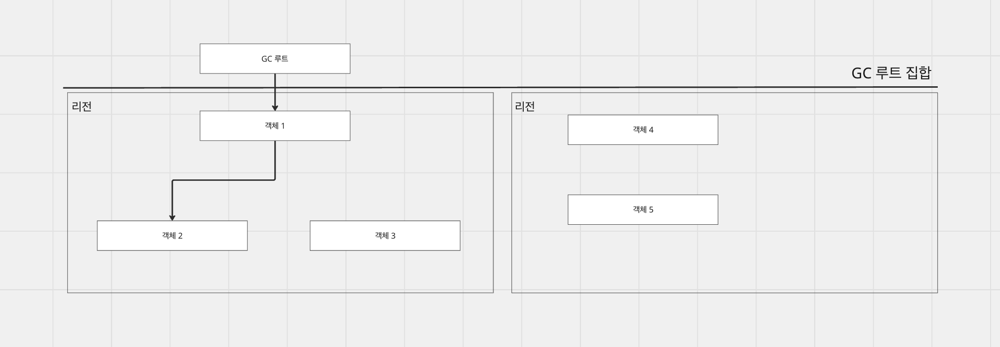

1. 최초 표시: 직접 참조 객체 표시 (정지 있음)
2. 동시 표시: 도달 가능 객체 표시 (정지 없음)
3. 최종 표시: 회수 집합 선정 (정지 있음)

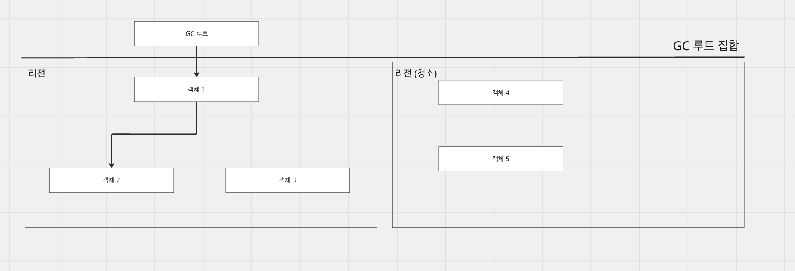

4. 동시 청소: 미사용 리전 청소

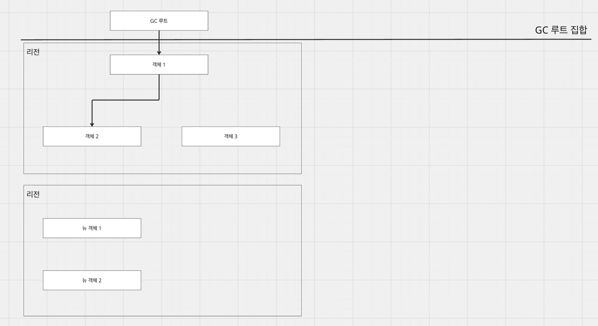

5. 동시 이주: 참조 객체 복사, 브룩스 포인터로 자가 치유

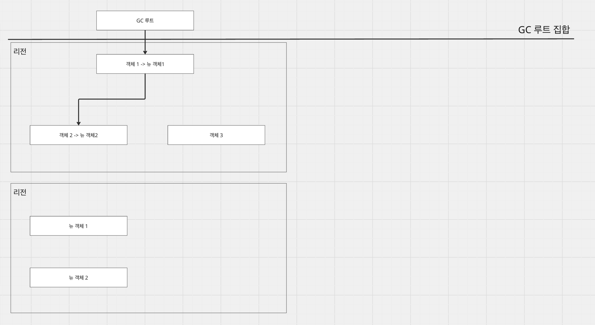

6. 최초 참조 갱신: 참조 업데이트 (정지 있음)
7. 동시 참조 갱신: 순차 참조 업데이트
8. 최종 참조 갱신: GC 루트 참조 업데이트 (정지 있음)
9. 동시 청소: 최종 정리

---

## 참조

- G1GC: https://junhoahn.kr/noriwiki/index.php/G1GC
- JVM 밑바닥까지 파헤치기
