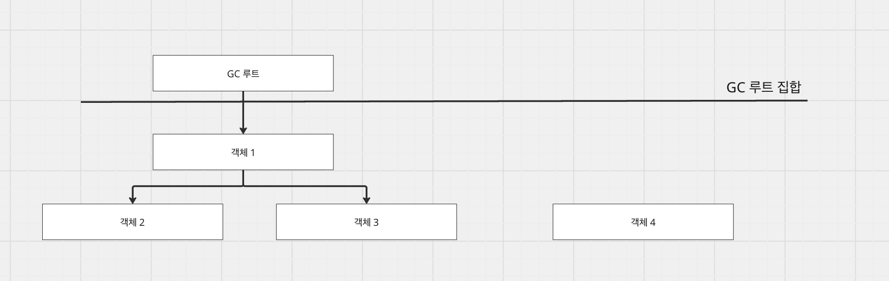
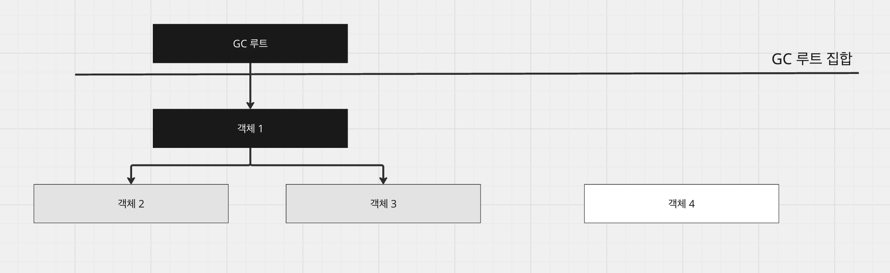
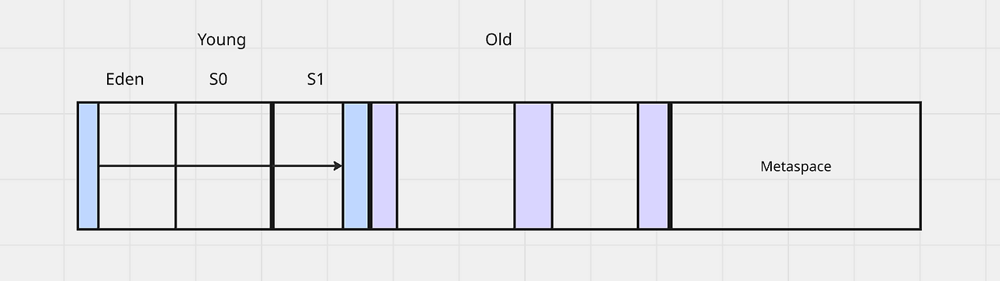
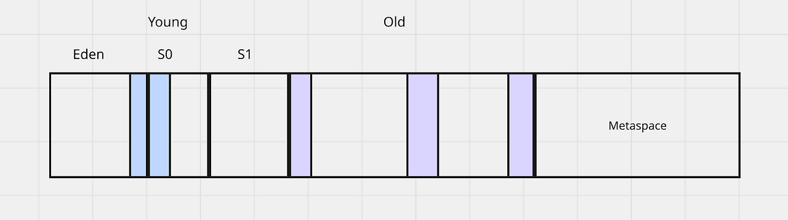
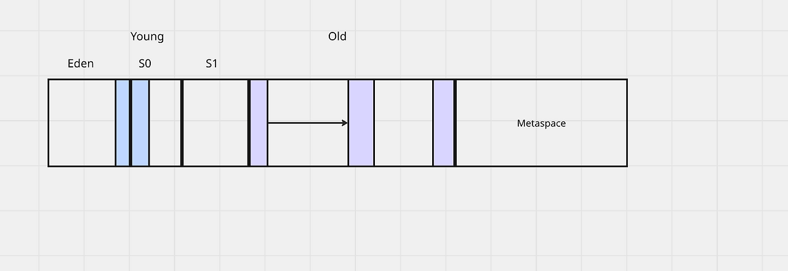
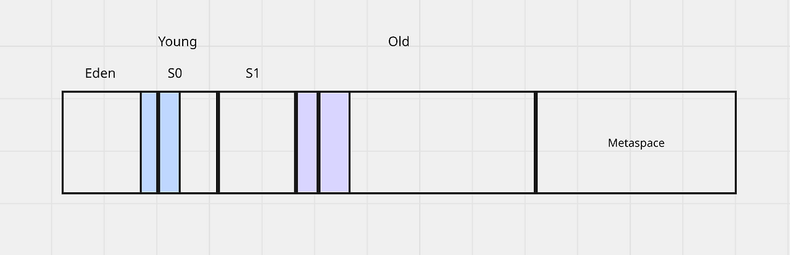
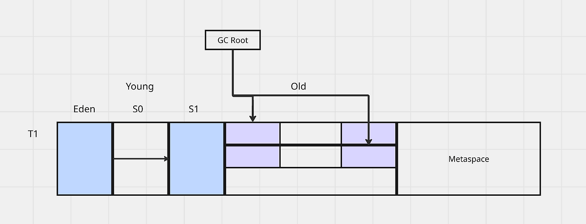
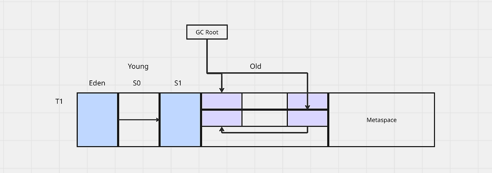
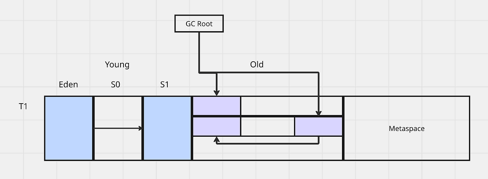

# [JVM] 가비지 컬렉터

## JVM 메모리

---

JVM에서는 스레드별로 독립적으로 사용하는 공간, 스레드들이 런타임에 동적으로 공유하는 공간이 존재한다. 2개의 공간 모두 JVM의 메모리를 차지하고 사용하게 되고, 애플리케이션을 구동시키기 위해선 당연한 일이다. 하지만 메모리는 한정적인 공간이기 때문에 사용하지 않는 것들은 소멸시킴으로써 스레드를 동작시키고, 새로운 객체들을 생성시킬 필요가 있다.

스레드 독립적인 공간(프로그램 카운터, 가상 머신 스택, 네이티브 메서드 스택)은 스레드의 생명주기와 함께 하기 때문에 자연히 메모리에서 회수될 수 있다. 그리고 메서드 영역도 그나마 클래스, 함수, 변수 정보와 같은 것들이 존재하는 영역이기 때문에 고정 비용으로 계산할 수 있다. 하지만 런타임에 공유되는 힙 영역은 객체들이 동적으로 생성되고, 소멸되며 상당한 메모리를 차지할 수도, 적은 메모리를 차지할 수도 있다. 그러므로 이 힙 영역을 어떻게 관리할 것인지는 제한된 메모리를 어떻게 안정적으로 관리할 수 있을 것인지에 직결된다.

**어떻게 회수할 것인가**

무작정 객체를 회수할 수 없으니 어떻게, 어떤 판단으로 회수할지 정해야 한다. 가장 간단하게는 객체가 참조되었느냐를 판단하는 것이다. 객체가 참조되고 있는 상황이라는 것은 어디선가 현재 사용중이라는 의미이므로 회수 대상이 아니고, 참조되지 않는다면 회수 대상으로 판단할 수 있다. 그리고 이 판단에 대한 여부를 도달 가능성 분석 알고리즘을 통해 판단한다.

**도달 가능성 분석 알고리즘**

도달 가능성 분석 알고리즘은 GC 루트와 이 루트가 참조중인 객체들을 체인으로 이어나가 도달이 불가능한 객체가 있는지를 판단하는 알고리즘이다. 체인으로 연결되지 않았다는 것은 미사용 객체이므로 회수 대상이 된다.

그렇다면 무엇을 GC 루트라 부르는가?

- 가상 머신 스택에서 스레드가 **현재 수행중인 메서드**의 지역 변수, 매개 변수, 임시 변수

- 메서드 영역에서 클래스가 정적 필드로 참조하는 객체 (static, object로 만들어진)

- 메서드 영역에서 상수로 참조되는 객체 (static, object로 만들어진)

- 네이티브 메서드 스택에서 JNI가 참조하는 객체

- primitive 타입

- 락(synchronized)으로 잠겨 있는 객체

이렇게 GC 루트들을 정하고, 체인으로 객체들을 참조할 수 있느냐의 여부로 회수 대상을 결정할 수 있다.

**루트 노드와 안전 지점**

루트 집합은 최초의 체인 지점을 찾는 것이기 때문에 스냅샷과 같이 일관된 형상기억이 필요하다. 그렇기 때문에 루트 집합을 찾을 때는 사용자 스레드가 침범하지 않게 애플리케이션을 잠시 정지시킨다. 그리고 열거하고, 참조 체인들을 찾기 시작한다. 이 참조 체인을 찾기 위해선 객체 참조가 저장된 위치를 알아야 하는데 OopMap을 통해 이 문제를 해결한다.

OopMap은 JIT 컴파일 시 스택 위치, 레지스터 데이터 참조를 기록하여, GC 루트 -> 객체를 참조 스캔을 없애는데 도움을 준다. 하지만 결국 데이터를 메모리에 저장하는 행위이기 때문에 전체에 OopMap을 생성하지 않는다. 대신 GC 시 안전 지점을 지정하고 사용자 스레드가 계속해서 polling을 수행 후 안전 지점을 만나면 멈추고, 루트 노드 열거든 재마킹이든 등의 작업을 수행한다.

**동시 접근 가능성**

GC를 수행하기 위해선 더 이상의 간섭이 없는 멈춤 상황이 필요하다. GC를 수행하는 도중 객체의 새로운 참조가 생기거나 참조되었던 객체가 더 이상 참조되지 않는 경우가 생길 수 있기 때문이다. 이 때문에 애플리케이션 스레드를 정지(Stop The World)시키고, 참조체인을 검색하는 방식을 선택했다. 하지만 이 애플리케이션 지연은 사용자 경험을 헤치기에 좋은 선택지는 아니기 때문에 동시성을 지원하는 해결책들이 나타났다.

**1. 삼색 마킹 알고리즘**

- 흰색: 아직 방문하지 않은 객체 (GC 후보)

- 회색: 방문했지만 참조 객체들은 아직 검사하지 않은 객체

- 검은색: 방문했고 참조 객체들을 모두 검사 완료한 객체

1. 루트 객체들은 회색, 나머지는 흰색으로 시작 (이미지는 검사가 완료된 루트 객체로 설정)

2. 회색 객체가 참조하는 객체들을 검사하며, 참조하는 객체들을 방문하기 전까지 객체들을 회색으로 마킹

3. 검사가 완료되었다면, 검은색으로 변경

4. 회색 객체들이 없다면 흰색 객체들을 수거

**2. 메모리 배리어**

- 쓰기 배리어: 객체 참조 변경 시 GC가 알 수 있도록 변경 사실을 기록한다.

- 읽기 배리어: Compact 시 객체가 새로운 장소로 이동할 때 최신의 장소를 알려주도록 한다.

힙에서 객체들을 어떻게 회수할 것인지, 회수하는 상황에서 참조가 변경되었을 때 어떻게 처리할 것인지에 대해 살펴 보았다.

**그러면 메서드 영역(메타스페이스)은 아예 대상이 아닌 것인가?**

메서드 영역은 클래스 정보, 상수, 메서드 데이터 등 여러 정보들을 관리하는 공간이고, 대체로 참조되거나 쓰이는 정보들이다. 하지만 그렇다고 대상이 절대 아닌 건 아니고, 해당 영역도 메모리가 부족하면 OOM이 발생하므로 필요에 따라 GC가 필요하다.

메서드 영역에서의 대상은 참조되지 않는 상수, 클래스 로더 회수 시의 클래스 정보 등이 있다. 이 상황에서는 메서드 영역에서 GC가 발생할 수 있는데 조건은 다음과 같다.

* 메타스페이스 임계값에 도달했을 때

* 클래스 언로딩이 필요할 때: 클래스의 모든 인스턴스들이 GC되어 클래스로더가 더 이상 참조되지 않을 때

와 같은 상황에서 GC를 수행하여 메서드 영역에서의 메모리 여유를 확보할 수 있다.

## 세대 단위 컬렉션

---

가비지 컬렉션은 세대 단위로 나누어 구성된다. 이렇게 된 이유는 대다수의 객체는 일찍 죽고(Young), 살아남은 객체는 횟수가 늘수록 오래 살 가능성이 높아진다. 라는 경험에서 비롯되었다. 때문에 일찍 죽을 객체라면 특정 영역에만 할당시켜놓고, 한번에 청소를 해버리는 것이 적은 비용으로 큰 메모리를 확보할 수 있다.

**Young, Minor**

신세대라 불리우며, 대다수의 객체가 이 곳에 할당되며 시작된다. 조금 더 세부적으로 가면 eden, Survivor0, 1로 세분화되는데 eden에는 새로 생성된 객체가 자리하는 공간이다. 보통 여기서 GC(Minor)가 발생하면 참조되지 않는 객체로 분류되어 제거가 되는데 만약에 살아남는다면 survivor 영역으로 빠지게 된다. survivor 영역으로 빠지게 되면 객체 헤더의 age 값이 증가하고, 이 age값이 임계치를 넘어가게 되면 promotion되어 old 영역으로 승격된다.

**Old, Major**

오래 살아남은 객체들이 위치하는 공간이다. Minor GC에서 살아남게 되면 계속해서 객체들이 promotion되어 old 영역에 쌓이게 되는데, 이를 청소해주기 위해 Major GC가 동작하게 된다. Old 영역은 Young 영역(Young이 크다면, 빠르게 청소가 불가)보다 크기 때문에 GC 수행 시간이 상대적으로 더 길다. 다만, 대다수의 객체는 일찍 죽기 때문에 Major GC의 빈도는 잦지 않다.

**세대 간 참조**

Young, Old로 영역을 구분하는 것은 목적과 효율성 측면에서 나눈 것이라 볼 수 있다. 모든 객체의 참조 대상들이 같은 영역에만 위치하면 더욱 효율적인 영역 탐색을 발생시키고, 처리를 진행할 수 있을 것이다. 하지만 그렇지 않고, Young -> Old, Old -> Young의 참조는 분명 발생 가능성이 존재한다. 때문에 매번 도달 가능성 분석을 진행해야하는데, 적은 수의 세대 참조를 위해서 매번 old같은 큰 영역에 대한 도달 가능성 분석을 진행하기엔 비효율적이다. 이를 위해 기억 집합이라는 자료구조를 두게 되었다. 가령 old -> young 참조를 기록(쓰기 배리어)해놓고 GC시 이를 참조하여 전체 스캔을 할 필요가 없게 한다.

**기억 집합과 카드 테이블**

기억 집합은 세대 간 혹은 리전 (G1GC)에서의 참조를 추적하기 위한 자료구조이다. 이를 이용하여 세대 별로 GC시 전체 스캔을 하지 않고도, 다른 세대에 어떤 객체를 참조하고 있는지 바로 알 수 있다. 카드 테이블은 기억 집합을 구현한 방법으로 힙을 512 바이트 단위의 card로 분할하고 각 카드는 1 바이트 플래그로 표현한다. 만약 세대 참조가 있다하면 true로 표기하고, 메모리 주소를 참조한다.

## 가비지 컬렉션 알고리즘

---

앞서 세대별로 영역을 나누어 객체를 수거하는 과정을 살펴보았다. 가비지 컬렉터는 구현체 별로 다양한 알고리즘을 가지고 있는데, 이 알고리즘을 이용하여 더욱 효율적으로 객체를 수거할 수 있다.

**마크-스윕 알고리즘**

회수 혹은 회수하지 않을 객체를 표시하고, 한번에 청소하는 방식이다. 가장 간단하고, 컬렉션 알고리즘들이 대개 이를 기반으로 만든 후에 단점을 보완하며 발전하였다. 단점은 힙에 처리 대상이 많아질수록 청소의 대상이 많아지는 구조이고, 압축 과정이 없기 때문에 메모리 파편화가 발생한다는 단점이 존재한다.

**마크-카피 알고리즘**

메모리를 절반으로 나누어 한쪽은 객체들에게 할당하고, 다른 한쪽은 비워두는 방식이다. young의 survivor 영역이 이 방식을 사용하고 있으며, 한쪽 영역이 가득차면 회수할 건 회수하고, 다른 한쪽으로 살아남은 객체들을 옮기고 압축하는 방식이다. 매모리 파편화도 해결하고, 실행 효율은 좋으나 가용할 수 있는 메모리를 절반밖에 사용하지 못한다는 단점이 존재한다.

**마크-컴팩트 알고리즘**

마크 스윕과 동일하게 객체를 표시한다. 다만 스윕에서는 객체들을 회수하고 끝이었지만, 컴팩트는 회수하고 객체들을 메모리 앞부분부터 다시 재배치하는 과정을 진행한다. 이로 인해 스윕에서 문제되었던 메모리 파편화 문제를 해결할 수 있게 되었다. 다만, 구세대 객체들은 꽤나 오래 살아남기 때문에 메모리를 이동시키고, 이를 참조하고있는 객체들 또한 갱신해야하며 이는 애플리케이션 정지 시간을 늘리는 결과를 발생시킨다.

## 가비지 컬렉터

---

**Serial GC**

단일 스레드를 돌려서 가비지 컬렉션을 수행하는 방식이다. 과정은 다음과 같다.

1. Young 영역이 임계점에 도달하여 가비지 컬렉션을 수행한다. 애플리케이션이 잠시 멈추고, 루트 노드들을 열거하여 참조 객체들을 조사한다.

2. 미회수 객체들은 survivor 영역으로 보내지며, 회수 대상들은 메모리를 해제한다. survivor로 보내지면서, 객체의 age count가 증가한다.

3. 컴팩트와 카피가 발생하기 때문에 객체들의 주소 참조를 업데이트한 후 애플리케이션을 재개한다.

4. old 영역도 마찬가지로 promotion된 객체들이 증가하여 임계치에 도달하게 된다.

5. young 영역의 GC와 마찬가지로 회수 대상은 메모리에서 제거하고, compact를 수행한다.

**Parallel GC**

Serial GC를 멀티 스레드로 수행하는 버전이다. Minor GC만 멀티 스레드로 수행할 때는 파뉴 컬렉터라 불리고, Major GC를 전담할 때는 패러럴 올드 컬렉터라한다.

**CMS GC**

앞서 설명한 Serial, Parallel과는 다른 방식으로 가비지 컬렉션을 수행한다. Serial, Parallel은 가비지 컬렉션을 수행하기 위해서 사용자 스레드를 무조건 멈추고 수행해야했다면, CMS 컬렉터는 애플리케이션 스레드와 가비지 컬렉션 스레드를 동시에 수행하여 애플리케이션 정지 시간을 줄이는 것을 목표로 한다.

다만, Young과 Old에 전부 수행되는 것이 아니라 Young은 시리얼 컬렉터 or 파뉴 컬렉터가 수행하고, Old에서 CMS 컬렉터를 수행하도록 하였다. 그 이유는 이미 시리얼, 파뉴 컬렉터만으로 충분한 성능을 보일뿐더러 CMS 컬렉터는 프로세서 자원을 많이 쓰기 때문에 Old에서만 사용하는 것이 효율적이기 때문이다.

1. 최초 표시 단계이다. GC 루트 노드들을 열거하고, 객체들을 마킹한다.

2. 동시 표시 단계이다. 참조 체인들을 계속해서 찾아나가며, 마킹을 수행하지만 사용자 스레드는 멈추지 않고, GC 스레드가 동시에 동작한다.

3. 재표시 단계이다. 병행하며 실행되는 동안 새로 참조하거나 참조가 끊긴 객체들이 존재할 수 있으므로 잠시 사용자 스레드를 멈춰놓고 표시를 업데이트한다.

4. 스윕 단계이다. 최종적으로 마킹이 전부 끝난 상황이기 때문에 사용자 스레드를 멈출 필요 없이 객체들을 회수한다.

CMS 컬렉터는 사용자 스레드를 멈추지않고, 객체들을 회수할 수 있다는 면에서 좋은 가비지 컬렉터라고 볼 수 있다. 하지만 스윕까지 수행하고, 컴팩트 단계가 없어 메모리 단편화가 존재한다. 그리고 가비지 컬렉션에 프로세서 자원이 많이 사용되어 사용자 스레드에 쓰일 자원을 뺏긴 점도 단점으로 꼽을 수 있다.

**Garbage First GC**

G1GC는 힙을 리전으로 나누어 빠르게 회수 가능한 부분부터 회수하자는 컨셉이다. 기존과 동일하게 Eden, Survivor, Old 등의 세대는 유지되나 각 세대들은 리전별로 나뉘어 독립적인 공간으로 유지된다. 그리고 각 리전에서는 기억 집합(카드 테이블)이 존재하여 리전 별 참조 문제를 해결할 수 있다. 또한 TAMS 포인터를 두어 리전 공간의 일부(객체)가 회수되는 동안 새로운 객체는 TAMS 포인터보다 위에 위치시켜 새로운 객체는 회수 대상에서 제외시킨다.

1. 최초 표시: GC 루트 노드들을 열거하여 직접 참조하는 객체들을 표시한다. 그리고 TAMS 포인터의 값을 수정하여 리전에서 현재 메모리가 회수되는 곳이 어디인지 지정한다.

2. 동시 표시: GC 루트부터 시작하여 도달 가능성을 분석하고, 객체 참조를 찾아나간다. CMS 알고리즘과 동일하며, GC 스레드와 사용자 스레드가 동시에 수행된다.

3. 재표시: CMS 컬렉터와 동일하게 새롭게 참조되거나 참조가 끊긴 객체들이 존재할 수 있다. 이 때문에 사용자 스레드를 잠시 멈추고, 회수 대상을 업데이트한다. 그리고 이 과정에서 리전의 모든 객체가 가비지라고 판단되면, 리전의 객체들을 전부 회수한다.

4. 복사 및 청소: 통계 데이터(이전 리전별 회수 시간은 어땠는지, 카드 테이블에서 더렵혀진 카드 갯수 등)를 기반으로 회수할 리전들을 선별(쓰레기 비율 계산)하고 청소 후에 살아남은 객체들은 빈 리전으로 복사하는 과정을 거친다.

**ZGC**

세대구분 없는 리전 기반 메모리 레이아웃을 사용하고, 이 리전을 ZPage라고 한다. 그리고 이 리전은 소리전(2MB이며, 256KB미만 객체를 담음), 중리전(32MB, 256KB이상 4MB미만 객체를 담음), 대리전(최소 4MB이상이며, 동적으로 2MB배수의 공간을 가짐)으로 나뉜다.

1. 동시표시: 도달 가능성을 분석하는 단계이다. 이번 사이클의 순서에 따라 mapped0, mapped1이 번갈아 가면서 마킹이 된다. 매 사이클마다 마킹을 다르게 하는 이유는 전 사이클에 어떤 객체가 사이클에서 살아남았는지 표기하기 위함이다. 그리고 이 과정에서 로드 배리어(읽기 장벽)가 동작하여 어떤 객체가 어떤 객체를 참조하는지 표시한다.

2. 동시 재배치 준비: 청소해야할 리전들을 선정하여 재배치 집합을 구성한다. ZPage에 하나라도 가비지가 포함되어있으면 재배치 대상이고, 모든 리전을 스캔한다.

3. 동시 재배치: 새로운 ZPage에 새로운 객체들을 복사한다. 그리고 이 때 미리 만들어둔 로드 배리어를 이용하여 포워딩 테이블을 구성하고, 새로운 객체로 포워딩시킨다. 만약 이 순간에 객체1이 조회되어 포워딩이 동작했다면, GC루트의 참조를 뉴 객체1로 갱신시킨다. 이렇게 되면 조회하는 것만으로 자연스럽게 참조를 갱신할 수 있으며 이를 자가 치유라고 한다. 그리고 가비지만 남게 된 리전은 자연스레 가비지 컬렉션의 대상이 된다.

4. 동시 재매핑: 재배치 대상을 청소하는 과정이다. 이미 앞서 자가 치유를 통해 옛 참조들은 가비지 컬렉션 대상이 되었기 때문에 동시 재매핑을 서둘러 수행할 필요가 없다. 따라서 동시 재매핑은 동시 표시 단계와 맞물려 수행해도 되므로 고비용의 청소 작업을 후로 미룰 수 있게 되었다.

최근에는 세대구분 ZGC가 추가(young, old)되어 젊은 객체들을 대상으로 빠르게 GC를 수행할 수 있게 되었다고 한다.

**Shanandoah GC**

셰넌도어 가비지 컬렉션은 G1GC를 개선하기 위해 등장했다. G1GC와 마찬가지로 리전을 사용하지만 따로 세대별 리전을 구분하지 않는다.

1. 최초 표시: GC 루트 집합에서 싲가하여 직접 참조하는 객체들을 표시한다. 이 과정에선 애플리케이션이 잠깐 정지된다.

2. 동시 표시: 도달 가능한 객체들을 표시하고, 사용자 스레드와 동시에 동작하기 때문에 애플리케이션이 정지되지 않는다.

3. 최종 표시: 모든 표시가 완료 되었다면 GC 루트 집합을 다시 스캔하여 변경사항이 없는지 체크한다. 그리고 리전 내에 미 참조 객체들이 존재하는데 이들을 회수 대상이라 부르고, 회수 대상들이 있는 리전들 중 회수 가치가 높은(가비지가 많은) 리전을 선별한다. 이 과정에서도 애플리케이션이 잠깐 정지된다.

4. 동시 청소: 1 ~ 3까지의 과정을 통해서 더 이상 참조되지 않는(미사용되는) 리전이 발견되었을 것이다. 이 리전을 청소한다.

5. 동시 이주: 앞서 선정된 회수 집합들에서 아직 참조중인 객체들을 다른 리전으로 복사한다. 객체들이 다른 리전으로 복사되면, 이 객체들을 참조하는 곳도 업데이트를 해주어야 하는데 읽기 장벽과 포워딩 포인터(브룩스 포인터)를 이용한다. 브룩스 포인터는 객체 메모리에서 자기 자신 헤더(객체 헤더)를 가리키고 있다가 객체가 복사되면 복사된 객체의 헤더를 가리키는 방식이다. 이를 이용하여 이전 객체를 참조하더라도 브룩스 포인터를 이용해 복사된 리전의 객체를 참조할 수 있다.

6. 최초 참조 갱신: 객체가 복사되었으니, 언제까지고 브룩스 포인터를 이용할 순 없다. 따라서 사용자 스레드를 잠시 정지시키고 옛 객체를 가리키는 참조를 전부 새로운 객체로 업데이트 시키게 된다.

7. 동시 참조 갱신: 참조 갱신을 시작하면서, 물리 메모리 주소 순서대로 참초를 업데이트한다.

8. 최종 참조 갱신: 갱신이 전부 완료되었다면, GC 루트 집합도 참조를 갱신해야 하므로 잠시 애플리케이션을 정지시키고 업데이트한다.

9. 동시 청소: 이제 더 이상 사용되지 않는 리전들이 있으므로 이 리전들을 청소한다.

## 참조

---

* g1gc: [https://junhoahn.kr/noriwiki/index.php/G1GC](https://junhoahn.kr/noriwiki/index.php/G1GC)

* [JVM 밑바닥까지 파헤치기](https://product.kyobobook.co.kr/detail/S000213057051?utm_source=google&utm_medium=cpc&utm_campaign=googleSearch&gt_network=g&gt_keyword=&gt_target_id=dsa-435935280379&gt_campaign_id=9979905549&gt_adgroup_id=132556570510&gad_source=1)
