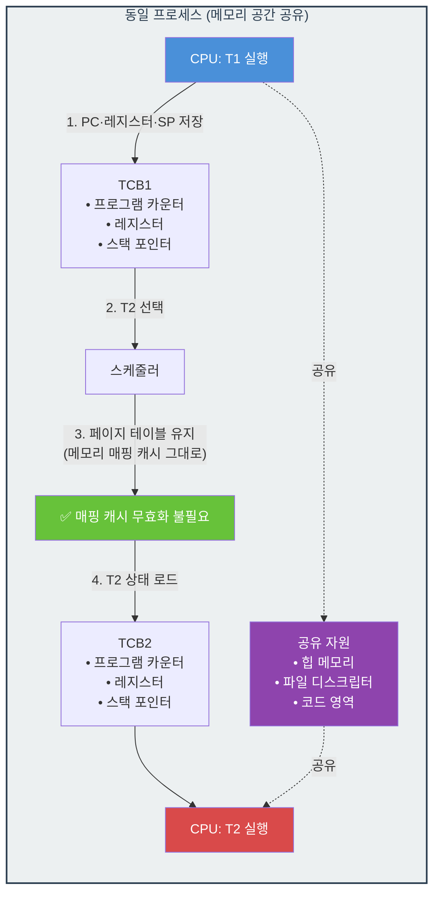

# 자바 스레드

> 통합 원본:
> - [_archive/jvm/process_thread_cost.md](../_archive/jvm/process_thread_cost.md)
> - [_archive/jvm/자바스레드.md](../_archive/jvm/자바스레드.md)

## 스레드란 무엇인가
---

스레드는 프로세스보다 가벼운 스케줄링 단위다. 같은 프로세스에 속한 스레드들은 메모리(힙·코드 영역·파일 디스크립터 등)를 공유하며, CPU 자원을 할당받아 작업을 수행한다.

스레드는 여러 계층에 걸쳐 존재한다.

- 커널 스레드: OS 커널이 직접 관리하는 스레드. 실제 CPU에 매핑되는 단위.
- 플랫폼 스레드 (자바 스레드): JVM 위의 스레드. 커널 스레드와 1:1로 매핑.
- 가상 스레드 (Java 21+): JVM 레벨에서 다중화되는 경량 스레드. 플랫폼 스레드 위에 마운트되어 동작.

어느 계층에 있든 결국 작업이 실행되려면 커널 스레드와 매핑되어야 한다.

## 커널 스레드와 자바 스레드
---

### 커널 스레드

커널 스레드는 OS 커널이 지원하는 스레드로, 프로세서와 작업을 매핑시켜주는 역할을 한다. 작업의 단위가 스레드이기 때문에 스레드 하나가 블로킹되더라도 프로세스 전체에는 영향을 주지 않는다.

커널 스레드의 한계는 두 가지다.

1. 시스템 콜 비용: 스레드의 생성·종료·전환이 모두 시스템 콜을 거친다. 컨텍스트 스위칭 시 레지스터·스택 등의 상태 저장과 복원이 커널 모드에서 일어나므로 오버헤드가 크다.
2. 메모리 비용: 커널 스택과 TCB(Thread Control Block) 같은 OS 자원을 할당받는다. JVM은 플랫폼 스레드 하나당 기본 1MB의 스택을 잡으므로(`-Xss` 옵션으로 조정), 수만 개 이상의 스레드를 동시에 유지하기 어렵다.

### 자바 스레드 (플랫폼 스레드)

자바 스레드는 `java.lang.Thread`로 생성되는 플랫폼 스레드다. JVM 내부에서 만들어지지만 OS의 커널 스레드와 1:1로 매핑된다. 즉, 자바 스레드를 하나 만들면 커널 스레드도 하나 생성되어 실제 작업을 수행한다.

따라서 자바 스레드는 커널 스레드의 한계를 그대로 물려받는다. 생성·소멸 비용이 크기 때문에 일반적으로 스레드 풀(ThreadPool)로 재사용한다. `ExecutorService`로 풀을 관리하면 생성 비용을 줄이고 동시 작업 수를 제한할 수 있다.

## 컨텍스트 스위칭 비용
---
CPU가 실행 중인 작업을 다른 작업으로 바꾸는 것을 컨텍스트 스위칭이라고 한다. 같은 프로세스 안의 스레드끼리의 스위칭은 프로세스 단위 스위칭에 비해 훨씬 가볍다.

### 스레드 컨텍스트 스위칭

같은 프로세스 내 T1 → T2로 스위칭되는 경우:



1. T1의 PC·레지스터·스택 포인터를 TCB(Thread Control Block) 에 저장
2. CPU가 T2 선택
3. 같은 프로세스이므로 페이지 테이블이 그대로 두고 가상→물리 주소 매핑 캐시를 무효화할 필요 없음
4. TCB2의 정보를 로드하여 T2 실행


- 저장·복원할 상태가 적다: 같은 프로세스의 모든 스레드는 코드·힙·파일 디스크립터 같은 자원을 공유하므로, 스위칭 시에는 스레드 고유의 상태(레지스터, 스택 포인터, PC)만 교체하면 된다.
- 메모리 매핑이 그대로 유지된다: 페이지 테이블이 동일하므로 CPU의 주소 변환 캐시(TLB)가 무효화되지 않아 캐시 히트가 유지된다.

## 자바 스레드 생명주기
---
자바 스레드는 다음 6개 상태를 가진다.

- NEW: `Thread` 객체가 생성되었지만 `start()`가 호출되지 않은 상태
- RUNNABLE: `start()`가 호출되어 실행 가능한 상태. OS 스케줄러에 의해 CPU를 할당받으면 실행된다.
- BLOCKED: 모니터 락(`synchronized`)을 획득하기 위해 대기 중인 상태
- WAITING: `Object.wait()`, `Thread.join()`, `LockSupport.park()` 등에 의해 무기한 대기하는 상태
- TIMED_WAITING: `Thread.sleep(ms)`, `Object.wait(ms)`, `Thread.join(ms)` 등으로 일정 시간 대기하는 상태
- TERMINATED: `run()`이 종료되어 실행이 완료된 상태

## 스레드 스케줄링
---

### 선점형 스케줄링

선점형 스케줄링은 OS가 각 스레드에 일정 시간(타임 슬라이스)을 할당하고, 시간이 지나면 강제로 CPU를 회수하여 다른 스레드에 할당하는 방식이다. JVM이 직접 스케줄링하지 않고 OS 스케줄러에 위임하므로, OS가 선점형이면 자바 스레드도 선점형으로 동작한다.

`Thread.setPriority()`로 우선순위를 1(`MIN_PRIORITY`)~10(`MAX_PRIORITY`)으로 설정할 수 있지만, OS 스케줄러에 대한 힌트일 뿐 보장되지 않는다. OS마다 우선순위 매핑이 다르고, 스케줄링 정책에 따라 무시되기도 한다.

장점은 특정 스레드의 CPU 독점을 방지해 응답성을 보장한다는 점이고, 단점은 컨텍스트 스위칭이 빈번해 오버헤드가 있다는 점이다.

### 비선점형(협력형) 스케줄링

실행 중인 스레드가 자발적으로 CPU를 양보하기 전까지는 다른 스레드가 실행되지 않는 방식이다. `Thread.yield()`, `Thread.sleep()`, I/O 대기 등을 통해서만 실행 흐름이 넘어간다.

자바는 기본적으로 선점형이지만 `Thread.yield()`로 협력적 양보를 시도할 수 있다. 이 역시 OS 스케줄러에 대한 힌트이므로 반드시 다른 스레드가 실행된다는 보장은 없다.

장점은 컨텍스트 스위칭이 적어 오버헤드가 낮다는 것이고, 단점은 하나의 스레드가 CPU를 오래 점유하면 다른 스레드가 기아(starvation) 상태에 빠질 수 있다는 것이다.

## 가상 스레드와 코루틴
---
### 가상 스레드 (Java 21+)

가상 스레드는 JVM 수준에서 관리되는 경량 스레드다. 커널 스레드와 직접 매핑되지 않고, 캐리어 스레드(자바 플랫폼 스레드) 위에 마운트되어 실행된다. 캐리어 스레드는 기존 자바 스레드와 동일하게 커널 스레드와 1:1 매핑되므로, 구조는 다음과 같다.

```
가상 스레드 (수백만 개)
   ↓ 마운트/언마운트
캐리어 스레드 = 플랫폼 스레드 (수십~수백 개)
   ↓ 1:1
커널 스레드
```

수백만 개의 가상 스레드가 소수의 캐리어 스레드 위에서 M:N으로 스케줄링된다.

- 경량성: 가상 스레드는 수 KB 수준의 스택 메모리만 쓰며, 힙에 저장된다. 수백만 개를 동시에 만들 수 있다.
- 블로킹 I/O 최적화: 가상 스레드가 블로킹 I/O를 만나면 캐리어 스레드에서 언마운트되고, 다른 가상 스레드가 그 캐리어에 마운트되어 실행된다. 블로킹 I/O가 실제로는 논블로킹처럼 동작한다.
- 기존 코드 호환성: `Thread` API와 호환되므로 기존 동기 코드를 거의 수정 없이 쓸 수 있다. `Thread.ofVirtual().start(runnable)` 또는 `Executors.newVirtualThreadPerTaskExecutor()`로 생성한다.

### 주의점

- CPU 바운드 작업에서는 이점이 크지 않다: 결국 CPU 연산은 캐리어 스레드 위에서 실행되기 때문.
- Pinning 이슈: Java 21에서는 `synchronized` 블록 내에서 블로킹 I/O가 발생하면 캐리어 스레드가 고정(pinning)되어 다른 가상 스레드가 그 캐리어를 못 쓰게 된다. 이를 피하려면 `ReentrantLock`을 사용한다. (Java 24의 [JEP 491](https://openjdk.org/jeps/491)에서 `synchronized` pinning이 제거되어, 향후에는 이 제약이 사라진다.)
    > **왜 `ReentrantLock`은 pinning이 없는가?** `synchronized`는 **JVM 수준의 락**이라 캐리어 스레드(OS 스레드) 단위로 락이 걸린다. 반면 `ReentrantLock`은 **고수준의 자바 레벨 락**이라 가상 스레드 단위로 락을 걸 수 있다. 그래서 가상 스레드가 락을 기다리는 동안 캐리어 스레드는 다른 가상 스레드가 자유롭게 쓸 수 있다.

### 코루틴

코루틴은 실행을 일시 중단(`suspend`)하고 재개(`resume`)할 수 있는 경량 동시성 구조다. JVM 생태계에서는 Kotlin 코루틴이 대표적이며, 자바의 가상 스레드와 목적은 유사하지만 접근 방식이 다르다.

- 비선점형 협력적 스케줄링: `suspend` 지점에서 자발적으로 실행을 양보한다. OS가 아닌 코루틴 디스패처가 실행을 관리한다.
- 컴파일러 기반 변환: Kotlin 컴파일러가 `suspend` 함수를 상태 머신(State Machine)으로 변환한다. 스레드를 블로킹하지 않고도 비동기 코드를 동기 코드처럼 쓸 수 있다.
- 구조적 동시성: `CoroutineScope`로 코루틴의 생명주기를 체계적으로 관리한다. 부모가 취소되면 자식도 함께 취소되어 리소스 누수를 막는다.

### 비교

| 구분 | 가상 스레드 | 코루틴 |
|------|------------|--------|
| 런타임 | JVM 수준에서 관리 | 라이브러리 수준에서 관리 |
| 스케줄링 | 선점형 (OS 스케줄러 위임) | 비선점형 (협력적, `suspend` 지점에서 양보) |
| 중단 지점 | 블로킹 I/O 호출 시 자동 언마운트 | `suspend` 키워드로 명시적 선언 |
| 코드 스타일 | 기존 동기 코드 그대로 사용 | `suspend`, `async/await` 등 전용 문법 필요 |
