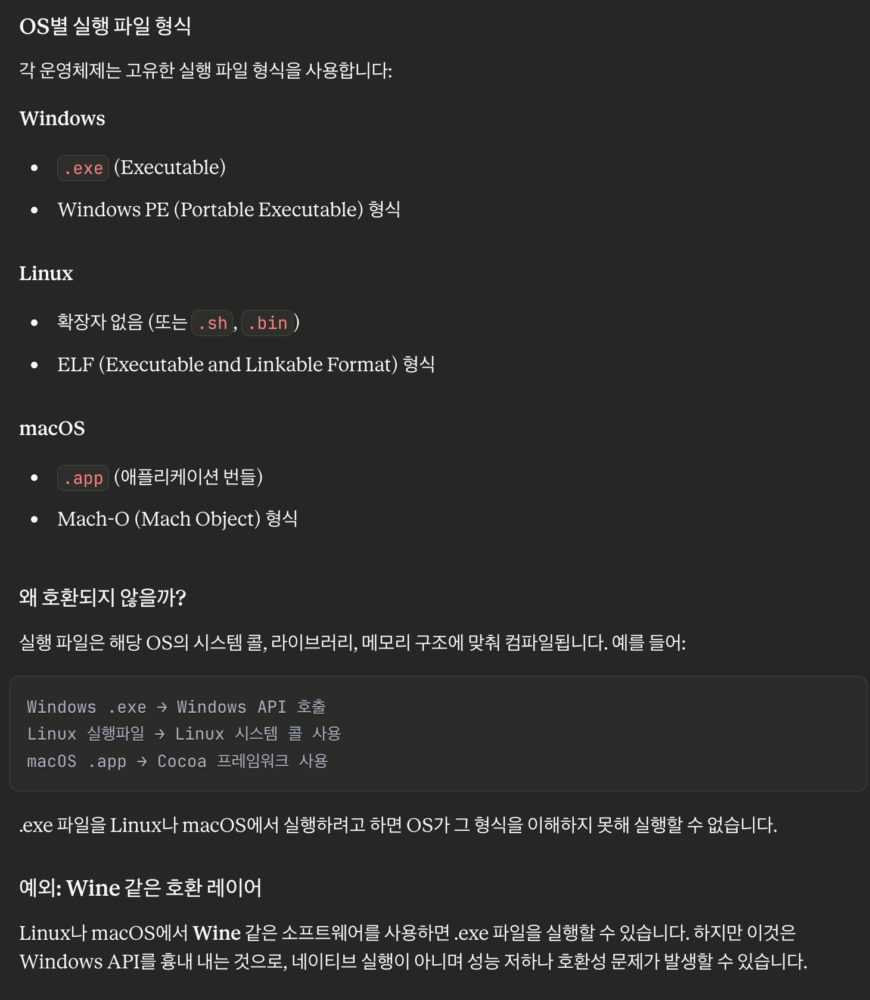
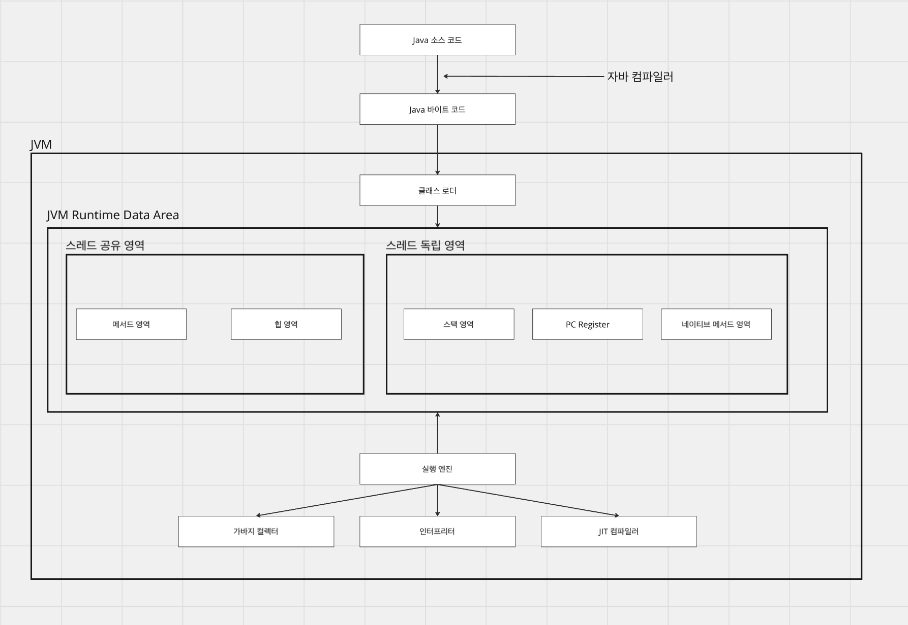

# [JVM] JVM과 코드 실행

## 1. JVM?

### Java Virtual Machine

JVM은 Java Virtual Machine의 줄임말로 자바 코드를 동작시키기 위한 가상 머신이다.

가상 머신은 물리 컴퓨터에 소프트웨어로 만든 독립적인 가상의 컴퓨터 환경이며, 특히 JVM같은 경우 Java 소스 코드를 컴파일하여 만든 바이트 코드를 실행시키기 위한 가상 머신이다.

JVM은 가상 머신이기 때문에 OS위에서 독립적으로 실행되는 특징을 가진다.

이 말은 JVM이 동작할 수 있는 OS라면, OS에 구애받지않고 JVM 계열 프로그램을 동작시킬 수 있음을 의미한다.

### OS에 구애받는다?

C/C++의 경우 개발자는 .cpp 파일로 프로그래밍을 하고, 코드를 컴파일하여 .exe라는 실행파일을 생성하고, 이 파일을 실행시켜 프로그램을 동작시킨다.

특정 언어들의 컴파일된 결과물은 OS에 종속적이고, 그 위에서만 실행이 가능하다.

즉, JVM의 경우 OS위에 래핑된 형태로 동작하는 가상머신이기 때문에 동작 가능한 OS라면 어디서든 실행이 가능함을 의미한다.

---

## 2. JVM 메모리 구조

### JVM 메모리 구조



**런타임 데이터 영역**

JVM 메모리가 구성되는 공간이고, 자바 애플리케이션이 실행되는 동안 클래스 정보, 변수, 객체등을 저장하고, 사용하는 메모리 공간이다.

런타임 데이터 영역은 메서드 영역, 힙, PC 레지스터, 스택, 네이티브 메서드 영역으로 구성된다.

### 스레드가 공유하는 영역

이 영역은 프로세스 내의 모든 스레드가 접근할 수 있다. 모든 스레드가 접근할 수 있다는 것은 공유 영역임을 의미하고, 동기화 문제를 신경써야하는 지점이기도 하다.

**1. 메서드 영역**

클래스 정보, 상수, 바이트 코드, JIT 컴파일러가 컴파일한 코드 캐시 등이 저장된다. 클래스로더가 변환된 바이트 코드를 JVM으로 로드하게 되는데, 이 바이트 코드를 메서드 영역에 저장하게 된다.

이 영역의 일부로 런타임 상수 풀이 존재하는데, 이 곳엔 클래스의 메타정보와 심벌 참조(e.g java.lang => 런타임에 주소 반환) 등을 저장하는 공간이다.

**2. 힙 영역**

객체들을 저장하는 공간이다. 이 힙 영역에는 객체들의 생애주기가 다뤄지는 공간이고, 런타임에 객체가 힙 영역의 메모리를 할당받고, 더 이상의 참조가 끊기면 GC의 대상이 되어 객체가 소멸된다.

### 스레드 독립적으로 생성되는 영역

**3. 가상머신 스택**

스레드는 메서드를 호출하여 명령을 수행한다. 이 때 메서드는 스택 프레임을 만들고, 지역 변수 테이블, 피연산자 스택, 동적 링크, 리턴 값을 쌓는다.

그리고 이 스택 프레임을 가상 머신 스택에 쌓고, 끝나면 꺼내는 과정을 반복하고, 메서드 실행이 종료되면 스택 프레임은 제거된다.

스레드가 독립적으로 명령을 수행하며, 메서드를 호출하는 것이기 때문에 다른 스레드가 접근해선 안되므로 스레드 내에서 관리된다.

**4. PC 레지스터**

멀티스레딩 환경에서 여러 스레드는 스케줄링에 의해 cpu 코어가 돌아가며, 명령을 수행한다. 스레드는 미쳐 작업을 끝내지 못했더라도 스케줄링에 따라 잠시 작업을 멈추는 상황이 발생하고, 다음 스케줄링 때 cpu 코어에 의해 작업이 진행된다.

이 상황에서 멈춘 지점이 어디엔가 관리가 되어야 다음 스케줄링 때 작업을 이어서 진행할 수 있다. 이 어디엔가 관리되는 곳이 PC 레지스터이다.

각 스레드의 고유한 작업에 대한 일이기 때문에 PC 레지스터는 스레드의 독립적인 공간에서 관리된다.

**5. 네이티브 메서드 스택**

Java이외의 언어로 작성된 네이티브 코드를 호출할 때 사용되는 영역이다. 네이티브 메서드 호출 시 생성되며, 가상머신 스택과 독립적으로 구현된 가상 머신도 존재하고, 합친 형태로 구현된 가상 머신도 존재한다.

---

## 3. JVM 로딩 전 단계

### 소스 코드

소스 코드는 개발자가 작성한 인간이 이해할 수 있는 고레벨 언어이다. Java, Kotlin, C, C++ 등 다양한 언어가 존재하고 개발자는 이 언어로 코드를 작성하고, 컴퓨터가 읽을 수 있는 기계어로 번역시키는 과정을 진행하여 자신이 개발한 프로그램을 동작시킨다.

```kotlin
class Jvm (
	private var methodArea: MethodArea,
    private var heap: Heap,
    private val threads: MutableList<Thread>
) {
	fun loadByteCodes(byteCodes: ByteCode) {
    	this.methodArea.byteCodes = byteCodes
    }
}

class Thread (
	private val methodStack: MethodStack,
    private val pcRegister: PcRegister,
    private val nativeMethodStack: NativeMethodStack
)

class ClassLoader(private val byteCodes: ByteCode) {
	fun loadTo(jvm: Jvm) { ... }
    fun link() { ... }
    fun initialize() { ... }
}

fun main() {
	val jvm = Jvm()
	val classLoader = ClassLoader()

    classLoader.loadTo(jvm)
    classLoader.link()
    classLoader.initialize()

    ...
}
```

### 자바 컴파일러와 바이트 코드

자바 컴파일러는 개발자가 작성한 소스 코드(.java)를 바이트 코드 (.class)로 변환하는 역할을 한다. 일반적인 컴파일 언어는 소스 코드를 직접 특정 OS와 CPU에 맞는 기계어로 변환한다.

하지만 JVM 실행 엔진은 로드된 바이트 코드를 인터프리터가 한 줄씩 읽어 각 OS에 맞는 기계어로 번역하고 실행한다. 바이트 코드는 JVM이 이해할 수 있는 명령어 집합으로 특정 OS나 CPU에 종속되지 않는다.

때문에 어느 OS던 바이트 코드는 동일하며, JVM만 설치 가능하다면 자바 애플리케이션을 실행할 수 있다.

---

## 4. 로드 후 JVM에서의 실행

### 클래스 로더

클래스 로더는 Java 바이트 코드(.class 파일)를 JVM에 로드하여 Runtime Data Area에 배치하는 역할을 한다.

클래스 로더는 동적으로 로드를 하는데, 그 이유는 프로그램 시작 시 모든 클래스를 한 번에 로드하는 것이 아닌 필요한 시점에 클래스를 로드하기 때문이다.

자바에서는 인터페이스를 제공하고, 다형성이 존재하는 언어이다. 그리고 리플렉션 API를 제공하기 때문에 컴파일 시점에 구체 타입, 동적 클래스 등을 알 수 없다.

이로 인해 클래스 로더는 동적으로 필요한 시점에 클래스 정보를 로드한다.

클래스 로더는 다음의 단계를 거쳐 클래스를 로드한다.

**1. 로딩**

바이트 코드를 메소드 영역에 저장하는데 저장하는 정보는 다음과 같다.

- 로드된 클래스와 부모 클래스의 정보
- 클래스, 인터페이스, Enum 클래스 정보
- 변수, 메소드 정보

**2. 링크**

링크는 로딩된 정보가 JVM 명세에 명시된 채로 구성되었는지 검사한다.

**3. 초기화**

클래스의 변수들을 초기화한다.

### 실행 엔진



**1. 인터프리터**

자바 컴파일러는 .java 파일을 바이트 코드 (.class)로 변환한다. 그리고 클래스 로더는 이 바이트 코드를 메서드 영역에 올리고, 바이트 코드를 이용하여 명령을 수행한다.

컴파일된 바이트 코드는 JVM에 올릴 수 있는 중간 단계일 뿐, 아직까지 실행된 것이 아니다. 실행을 위해 JVM은 이 바이트 코드를 한줄씩 읽어 기계어로 번역하고 명령을 수행하게 되는데 이 역할을 인터프리터가 한다.

**2. JIT 컴파일러**

인터프리터는 실제 동작을 수행하는 역할을 하지만, 한 줄 씩 읽기 때문에 다른 컴파일러 언어 (소스 코드 전체를 기계어로 컴파일하여 째로 수행)에 비하면 속도가 현저히 느릴 수 밖에 없다.

이 단점을 해소하기 위한 것이 JIT 컴파일러이다. JIT 컴파일러는 자주 수행되는 코드(핫 코드)를 감지하여(임계치 도달) 컴파일하고, 캐싱하여 메서드 영역에 저장한다.

그리고 후에 인터프리터가 이 코드를 다시 해석할 때 미리 캐싱해둔 기계어를 읽어 성능을 향싱시킨다.

**3. 가비지 컬렉터**

더 이상 참조되지 않는 객체를 메모리에서 해제하여 JVM의 힙 공간을 관리한다. Young, Survivor 0 1, Old 등의 공간이 나누어진 JVM의 힙에 대해서 가비지 컬렉팅을 수행한다. (JDK8부터는 클래스 메타데이터 정보를 관리하던 heap의 Perm을 제거하고, Native Memory의 Metaspace로 대체)

Young 영역에선 Minor GC가 발생하고, 보통 대다수의 객체가 이 곳에서 해제된다. 전체 힙을 기준으로 Young 영역은 작기 때문에 Minor GC가 처리할 공간이 작아 다른 GC보다 빠르게 수행된다.

Survivor는 Minor GC에서 살아남은 (아직 참조중인) 객체들이 이동하는 공간이고, Mark And Copy를 통해 살아남을 때마다 객체 헤더의 age값이 증가하고, Survivor 0, 1을 왔다갔다한다. 그리고 age가 임계치에 도달하면 Old 영역으로 객체를 promotion한다.

Old 영역에선 오래 살아남고, 메모리 공간을 많이 차지하는 객체들이 존재한다. 그렇기 때문에 Old 영역은 힙에서 큰 공간을 차지하고 있고, Major GC가 발생하는데 Minor GC보다 시간이 오래 걸린다.

---

## 5. 런타임 동작

### 객체 생성

애플리케이션이 동작하면서, 외부로부터 요청이 들어온다.

이 요청은 런타임에서 동적으로 수행되고, 가상머신은 객체를 생성하라는 바이트코드를 만나 객체를 생성하게 된다.

1. java.lang.String과 같은 클래스 이름(심벌 참조)인지 확인한다.

2. 이 심벌 참조가 클래스 로더에 의해 로딩, 링크, 초기화 과정을 거쳐 JVM에 로드되었는지 확인한다. (로드되지 않았다면, 클래스 로딩이 필요하다.)

3. 객체에 필요한 메모리 크기를 계산하여 자바 힙의 메모리 블록을 할당한다.

이 과정을 거쳐 객체가 할당되나 자바 힙은 공유 공간이기 때문에 동시성 문제가 발생할 수 있다.

이를 해결하기 위해 CAS같은 Atomic 연산, 스레드별 메모리 할당(TLAB)의 방식을 통해서 동시성 문제를 제어할 수 있다.

그리고 메모리가 할당된 객체는 생성자를 통해 필드의 값을 초기화가 된 후 객체가 완성된다.

### 객체의 메모리 레이아웃

객체는 자바 힙의 메모리를 할당받는데, 이 때 객체는 헤더, 인스턴스 데이터, 정렬 패딩으로 구성된 메모리 레이아웃 형태로 메모리에 저장된다.

객체 헤더는 해시 코드, GC age 정보, 락 플래그 정보를 저장하고, 이를 마크 워드라고 한다. 이를 이용해서 객체의 메모리 주소를 찾을 수 있고, 가비지 컬렉터에서 프로모션 대상인지, 동시성 제어에서 객체가 어떤 상황인지 판단할 수 있다.

그리고 클래스 워드는 메타스페이스에 저장된 클래스 정보를 가리키는 클래스 포인터로 런타임에 어느 클래스의 인스턴스인지 알 수 있다.

인스턴스 데이터는 객체의 실제 정보이다.

가령 Class Apple(val color: String) 이라는 클래스가 존재했을 때 color의 실제 값이 저장되고, 상속받은 부모 클래스의 필드들도 저장된다.

정렬 패딩은 모든 객체가 8바이트 배수여야 하는데, 인스턴스 데이터가 8배수가 되지 않을 때 사용되는 패딩 영역이다. (헤더는 32 or 64 비트 고정)

---

## 참고

* JVM 밑바닥까지 파헤치기
