# 목표
Jvm의 구성 요소인 heap과 gc 알고리즘을 공부합니다.
# 내용
## JVM Heap
### Heap?
Heap 메모리는 동적으로 생성된 객체가 저장되는 공간
이고, 5가지의 Runtime Data Area의 한 영역이다.  
힙 영역은 객체가 처음 생성된 후 저장되는 공간 (young), 생성된 후 오래 살아있거나 메모리가 큰 객체가 할당되는 공간 (old)로 구성된다.

### Heap 영역
`Eden - S0 - S1(Young Generation)` - `Tenured(Old Generation)` - `Permanent(Permanent Generation)`

Young: 생성된지 얼마 안된 객체들이 저장되는 장소이고 처음엔 Eden에 저장, MinorGC로 Young 영역을 청소한다.

Survivor0, 1: Minor GC에서 살아남은 객체들이 이동하는 공간

Old: 생성된지 오래된 객체들이 저장되는 장소, Young 영역에서 살아남은 객체가 이곳으로 옮겨지고 Full GC를 통해 사용되지 않는 객체가 제거

Perm → Metaspace: 프로그램 코드가 올라가는 부분 (클래스에 대한 정보를 저장하는 공간)

### Young과 Old과 나뉜 이유?
객체의 생존 기간에 따라 효율적으로 메모리를 관리하기 위함이다.  
일반적으로 객체가 생성되고, 몇 초 내에 소멸되는 사이클을 반복(약 98%)하고, 1~2%의 객체는 오래 살아남게 된다.

만약 young, old를 나누지 않고, 하나의 메모리 영역에서 관리한다면 메모리 해제를 위해서 짧으면 몇 초마다 전체를 스캔하여 GC를 발생시켜야 한다.  
전체 영역에 대한 GC이므로 시간이 길어지고, 애플리케이션 정지 시간이 길어지게 되는 치명적인 문제가 발생한다.

따라서 Young, Old를 나누어 빠르게 생성되고, 소멸되는 객체들을 Young에서 관리하여 효율적으로 메모리를 관리할 수 있다.

---

## GC 알고리즘
### Serial GC
> 목표
* young, old 영역을 나누어 효율적으로 메모리를 확보
* mark-sweep-compact를 사용하여 메모리 단편화까지 해결을 목표

> 과정   

#### Minor GC

1. young 영역이 임계점에 도달하여 GC 발생 (Stop-The-World)  

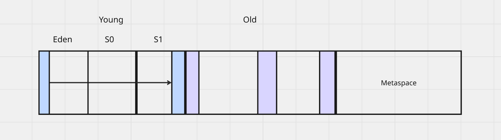
2. 살아있는 객체를 마킹 후 Survivor로 복사   
    a. 더이상 참조되지 않는 객체(가비지)가 존재한다면 메모리 해제   
    b. 다음 Minor GC에서는 Eden + S1에서 살아있는 객체를 S0로 이동하게 되고, age count가 증가    
    c. 객체의 age count가 임계점을 넘어선다면 old 영역으로 보내짐 (promotion)

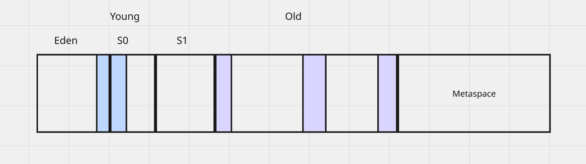
3. 애플리케이션을 재개하기 전에 GC Root의 객체 참조 주소를 업데이트   
a. GC Root?     
    i. 가비지 컬렉션 대상의 시작점이고, Thread Stack에 존재하는 로컬 변수, Method Area의 static 변수가 이에 해당한다.

#### Major GC
1. old 영역이 임계점에 도달하여 GC 발생 (Stop-The-World)

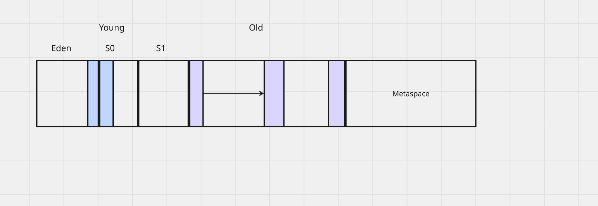
2. 살아있는 객체를 병렬 마킹, 참조되지 않는 객체 제거 (Mark, Sweep)
3. 단편화된 메모리를 압축 (Compact)

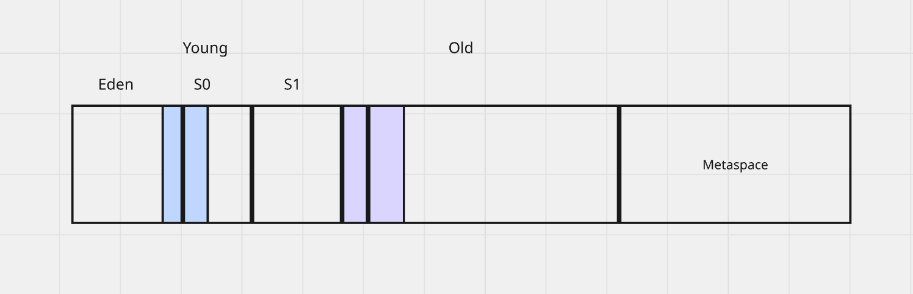
4. 애플리케이션을 재개하기 전에 GC Root의 객체 참조 주소를 업데이트   
   a. Compact되면서 실제 메모리 주소가 옮겨졌기 때문

### Parallel GC
> 목표
* 멀티 스레드 병렬 처리를 통한 높은 처리량
* Serial GC에서는 싱글 스레드로 처리하기 때문에 처리량이 낮고, 낮은 만큼 Stop-The-World가 긴 시간이 발생하여 이를 보완
> 과정

#### Minor GC
1. young 영역이 임계점에 도달하여 GC 발생 (Stop-The-World)
2. 살아있는 객체를 병렬 마킹, Survivor로 복사   
   a. 더이상 참조되지 않는 객체(가비지)가 존재한다면 메모리 해제   
   b. 다음 Minor GC에서는 Eden + S1에서 살아있는 객체를 S0로 이동하게 되고, age count가 증가    
   c. 객체의 age count가 임계점을 넘어선다면 old 영역으로 보내짐 (promotion)
3. 애플리케이션을 재개하기전에 GC Root의 객체 참조 주소를 업데이트

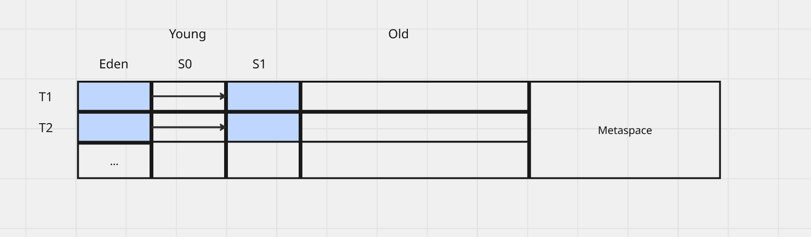
#### Major GC
1. old 영역이 임계점에 도달하여 GC 발생 (Stop-The-World)
2. 살아있는 객체를 병렬 마킹, 참조되지 않는 객체 제거 (Mark, Sweep)

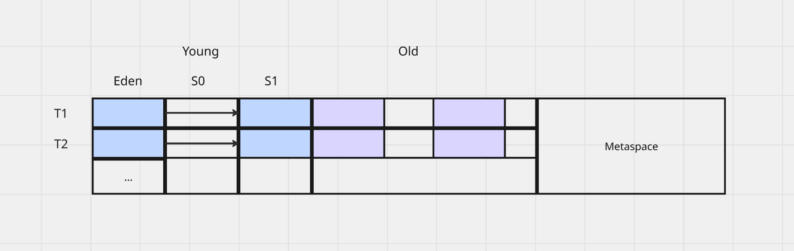
3. 단편화된 메모리를 압축 (Compact)

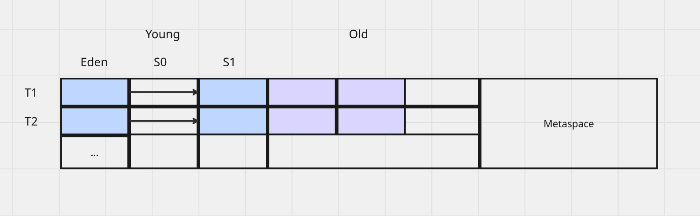
4. Compact가 되면서 실제 메모리 주소가 옮겨 졌기에 애플리케이션 재개 전에 GC Root의 객체 참조 주소를 업데이트

### CMS GC (Concurrent Mark Sweep)
> 목표
* GC 작업과 애플리케이션을 병렬적으로 실행하여 Stop-The-World를 최소화 함
  * 다만, 병렬 처리 과정에서 리소스(메모리, cpu) 사용률이 커지고 Compact 과정이 없어 메모리 단편화 문제가 존재

> 과정
#### Minor GC
Minor GC에서는 Serial GC, parallel GC와 동일하다.
* 큰 개선 사항이 없는 이유?
  * CMS GC는 old 영역 개선을 목표로 설계되었다. 그 이유는 경험적 측면에서 young 영역의 객체들은 대부분 빨리 죽고, 생성되기 때문에 gc 속도 자체가 빠르기 때문이다.

#### Major GC
1. Init Mark (Stop-The-World)   
   a. GC Root가 참조하고 있는 객체들을 마킹

2. Concurrent Mark   
   a. Init Mark에서 마킹된 객체들이 참조하는 모든 객체들을 마킹   
   b. 이 과정에서 Stop-The-World가 없으며 애플리케이션과 병렬로 수행

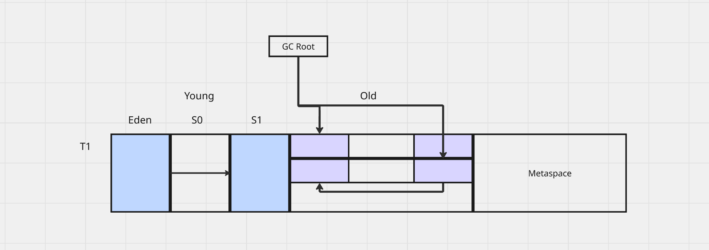
3. Remark (Stop-The-World)    
   a. 병행하며 실행되는 동안 애플리케이션이 새로 참조하거나 참조를 끊은 객체들이 발생   
   b. 마지막 마무리 작업으로 Remark 수행
4. Concurrent Sweep    
   a. 더 이상 참조되지 않는 객체들을 메모리에서 해제시킴   
   b. 메모리에서 해제되나 Compaction 과정이 없어 단편화 문제가 발생

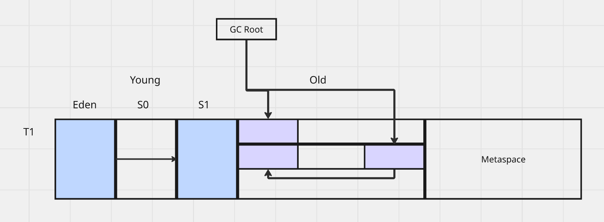

### G1 GC (Garbage First)
> 목표
* 처리량, 짧은 지연 시간 사이의 균형을 목표로 함
* 예측 가능한 멈춤 시간 (MaxGCPauseMills)를 이용하여 균형을 이룸

> 과정
#### Minor GC
1. young 영역이 임계에 달하여 GC 발생 (Stop-The-World)

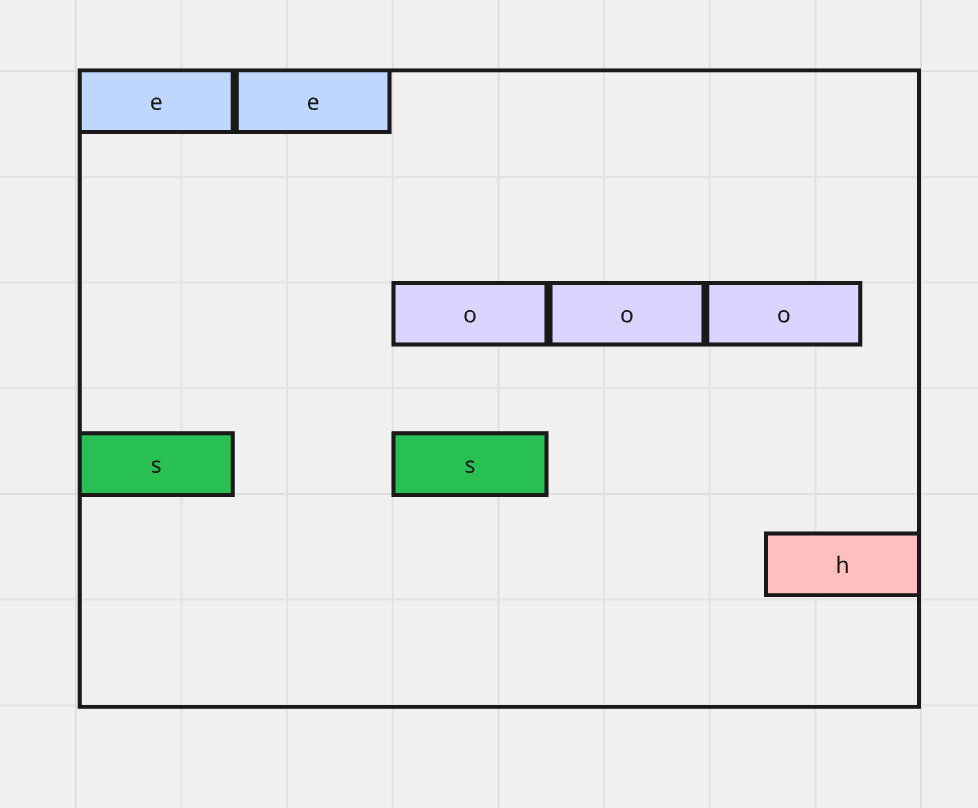
2. 일련의 목표(MaxGCPauseMills)를 가지고 Region(가비지 비율이 높은)들을 추리고, 그 외 살아있는 객체는 병렬로 Survivor, Old로 이동  
* Old로 이동?
  * eden + survivor의 양이 다음 이동될 survivor(s0 or s1)보다 크다면 일부 객체들을 old로 이동시킨다.
  * survivor에서 계속 살아남은, age count가 임계점에 다다른 객체를 이동시킨다.

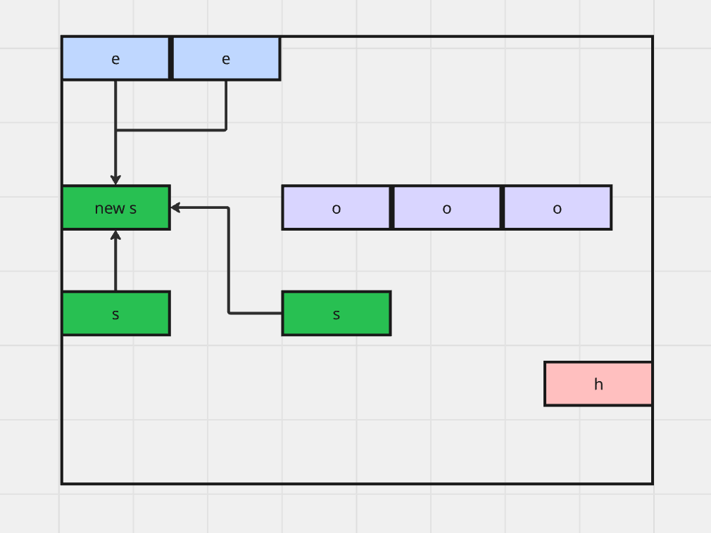
3. 애플리케이션 재개 전에 GC Root의 참조 주소를 업데이트

#### Major GC
1. Minor GC 수행 시 GC Root를 마킹 (Stop-The-World)
* old의 객체들이 survivor의 객체들을 참조할 수 있으므로 임계점 도달 후 최초 Minor GC 때 수행
  * 왜 survivor 객체들을 탐색?
    * 예를 들어 old -> survivor가 참조를 하나 탐색 하지 않는다면
    * minor gc가 발생하고, survivor의 객체를 삭제하게 된다. (survivor는 old를 모름)
    * old가 참조하는 survivor가 사라졌으므로 old.survivor를 호출할 경우 npe가 발생한다.

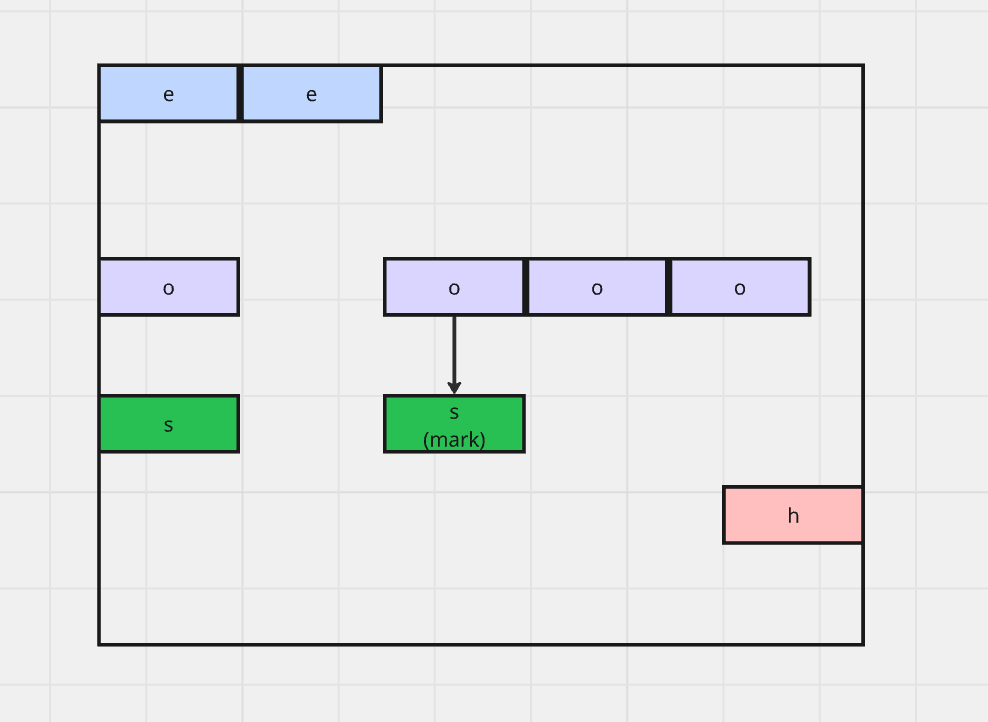
2. 마킹된 survivor 객체, GC Root들로부터 참조된 모든 객체들을 애플리케이션 수행과 함께 동시 마킹

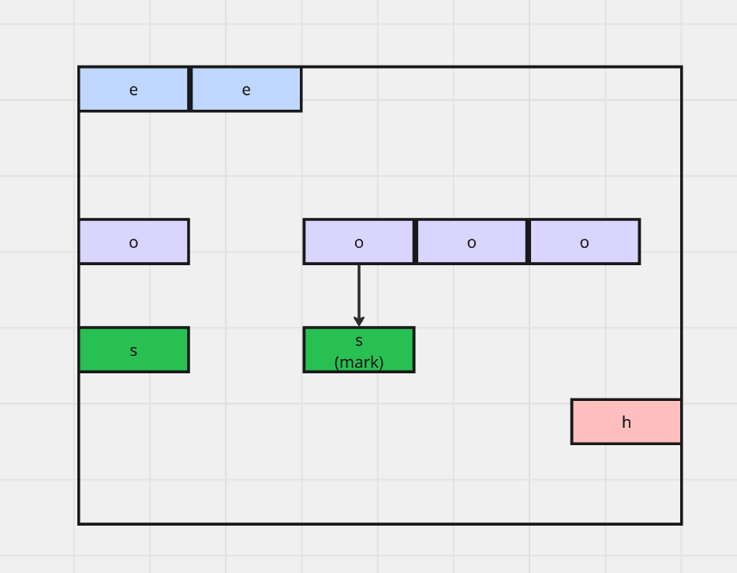
3. 동시 마킹 중 새로 참조된 객체들이 있을 수 있으므로 리마크 진행 (Stop-The-World)
* 리전의 모든 객체가 가비지라고 판단되면 회수

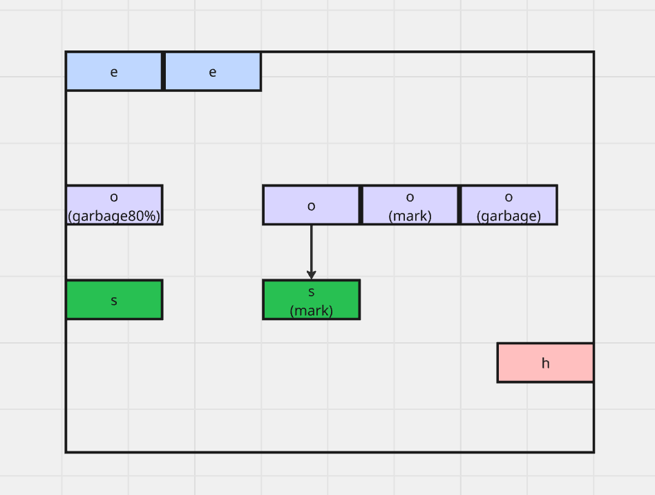
4. 리마크 후 비어있는 리전은 회수하고, 가바지 비유이 높은 리전들을 선정 (Collection Set)

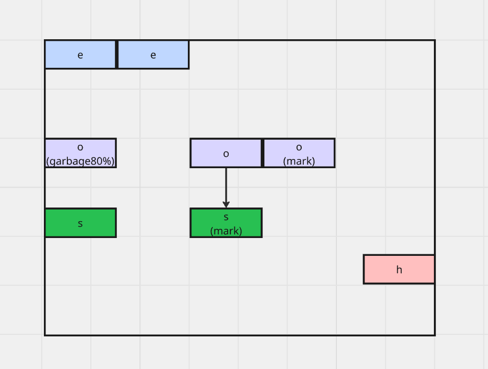
5. young 이전 + collection set을 청소하며, 살아있는 객체들은 새로운 리전으로 복사 (Stop-The-World)

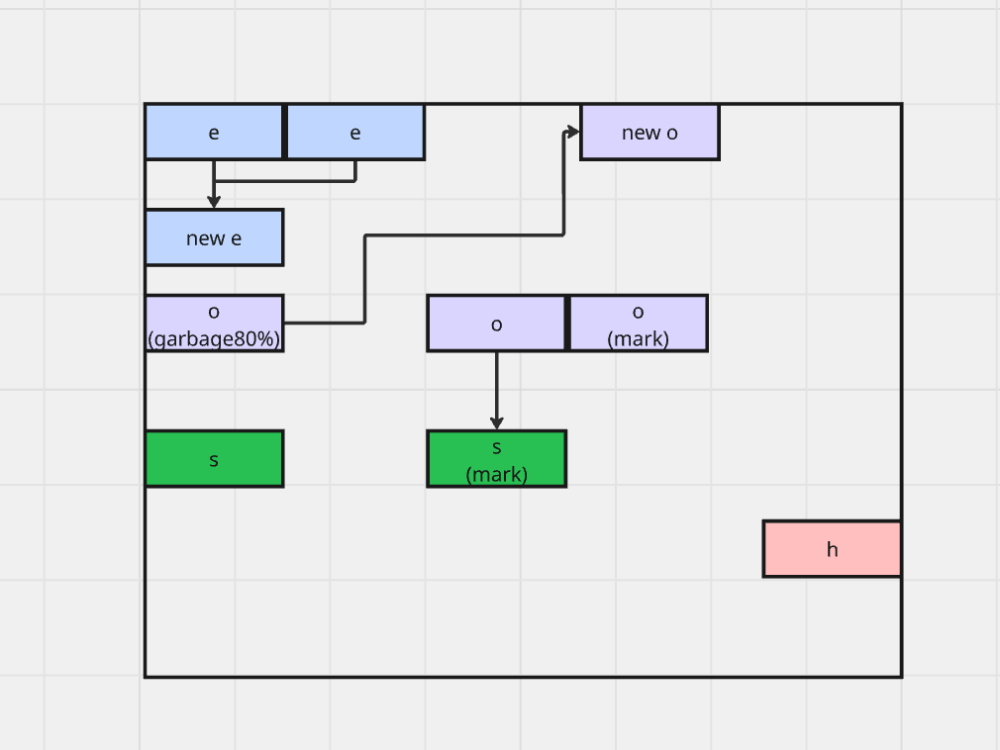

### ZGC
> 목표
* 힙 메모리가 수백 기가 ~ 테라바이트에 이르더라도 매우 짧은 STW (10ms 이내)를 보장
* 이전 gc에서의 멈춤 시간을 보완하기 위해 등장
  * G1GC는 힙이 커질수록 리전, Root GC 스캔 시간, 객체 복사 시간이 증가
  * STW를 매우 짧게 가져가면서 (GC Root만 탐색) 애플리케이션 스레드와 병렬로 GC를 수행

> 과정
1. 힙 메모리가 임계점에 도달하여 GC 수행
* 새로 생성된 객체들이므로 remapping bit만 활성화

| 객체 | Coloring pointer | 현재 상태 |
|---|---|---|
| B | 0100 | good | 
| D | 0100 | good |
| E | 0100 | good |

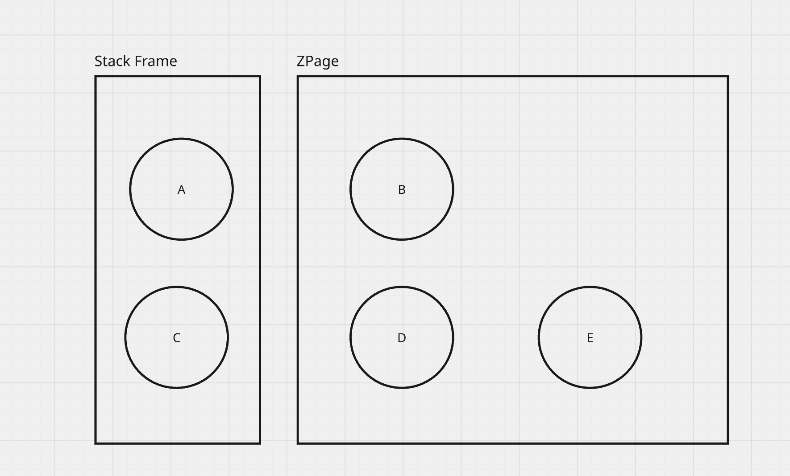
2. 스레드마다 자신의 로컬 변수 스캔 (GC Root)을 수행 (STW)

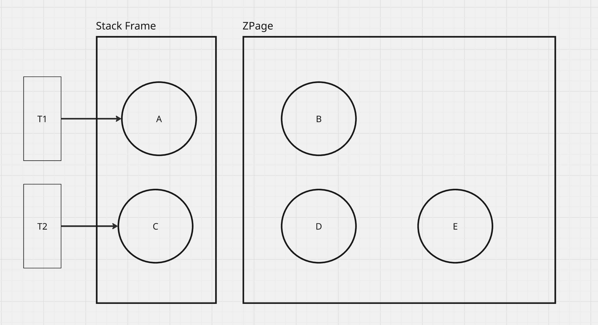
3. GC Root가 참조하는 객체를 탐색하며 마킹 진행

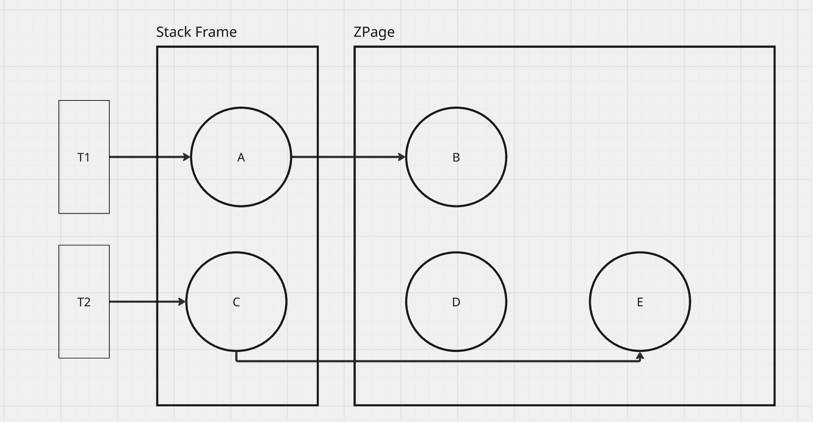
* A → B, C → E를 참조하고 있으므로 marked 0 bit 활성화되어야 함
  * mark 0 cycle이므로 0001이 good 상태 
  * load barrier가 동작하여 bad 상태의 객체들을 good으로 변경

| 객체 | Coloring pointer | 현재 상태 |
|---|---|---|
| B | 0100 | bad | 
| D | 0100 | bad |
| E | 0100 | bad |

load barrier를 수행하여 B, E 객체에 접근하고 D는 참조 대상이 아니므로 접근하지 않음(garbage)

| 객체 | Coloring pointer | 현재 상태 |
|---|------------------|------|
| B | 0001             | good |
| D | 0100             | bad  |
| E | 0001             | good |

이 과정을 거지고 나면 marked가 활성화된 객체 (good), 그렇지 않은 객체들(garbage)이 존재하고, 살아있는 객체들은 mark_stack으로 이동한다.  
하나라도 가비지인 객체가 존재하는 ZPage는 relocation set이라하며, GC의 대상이 된다.

4. 마킹이 끝난 후 애플리케이션에서 변화된 객체들을 찾아 리마킹 수행 (STW)
5. 참조가 살아있는 객체들(mark_stack)은 새로운 ZPage로 이동(relocation)시키고, 포워딩 테이블을 참고하여 GC Root가 새로운 참조를 이어가게 만들고 (remapping) 이전에 사용되었던 relocation set을 초기화한다.
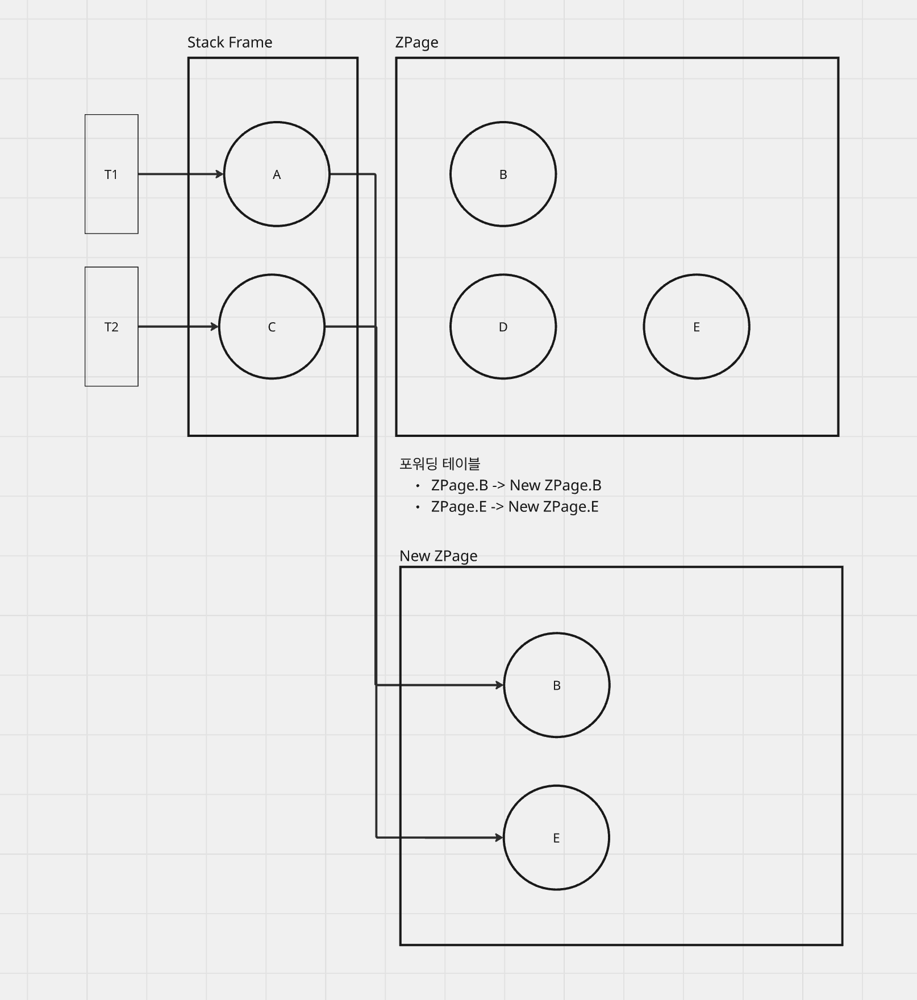

### Shenandoah GC
> 목표
* zgc와 마찬가지로 힙 메모리가 수백 기가 ~ 테라바이트에 이르더라도 매우 짧은 STW(10ms 이내)를 보장

> 과정
1. 힙 메모리가 임계점에 도달하여 GC를 수행

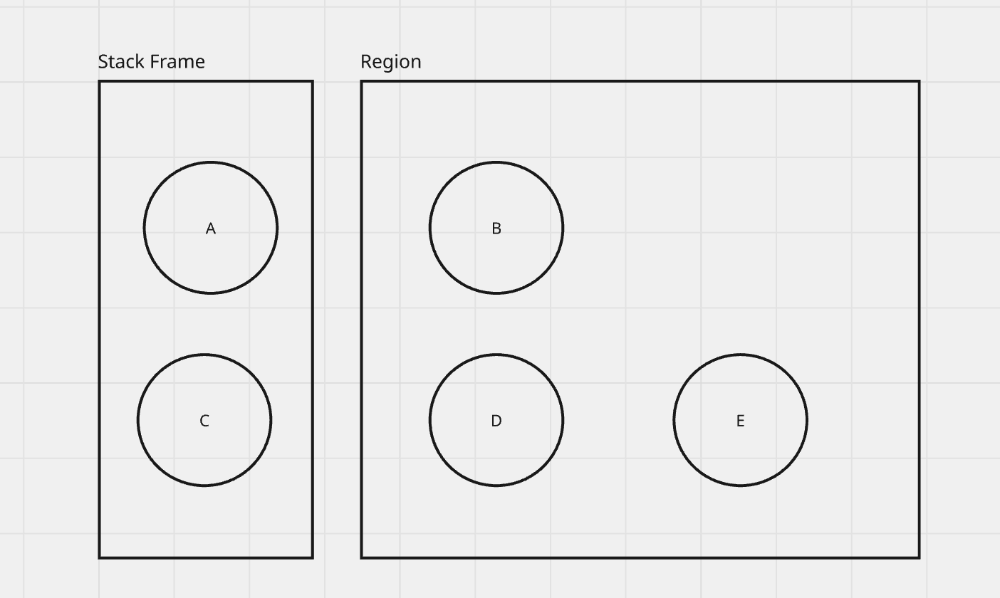
2. GC Root에서 참조하고 있는 객체들을 탐색하고, 마킹 수행 (극히 짧은 STW 발생)
3. 동시 마킹 중 새로 참조된 객체가 생길 수 있으므로 최종 마킹 수행 (극히 짧은 STW 발생)
* 최종 마킹 수행 후 참조되지 않은 객체들을 회수

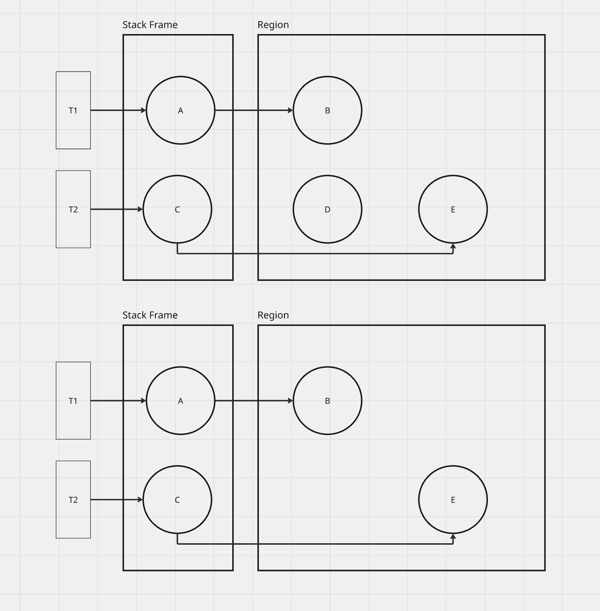
4. 살아있는 객체들을 새로운 리전으로 복사 후 원래 위치에는 포워딩 포인터를 두어 GC Root 참조 시 문제가 발생하지 않도록 처리
5. 힙 전체를 돌면서 간접 참조(포워딩 포인터)가 아닌 직접 참조하도록 업데이트를 수행하고, 사용하지 않는 옛 리전을 회수 (극히 짧은 STW 발생)

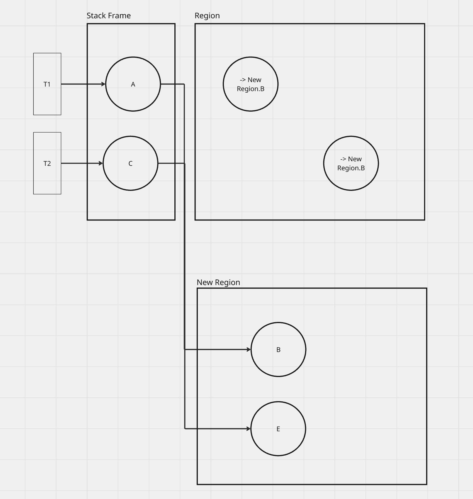