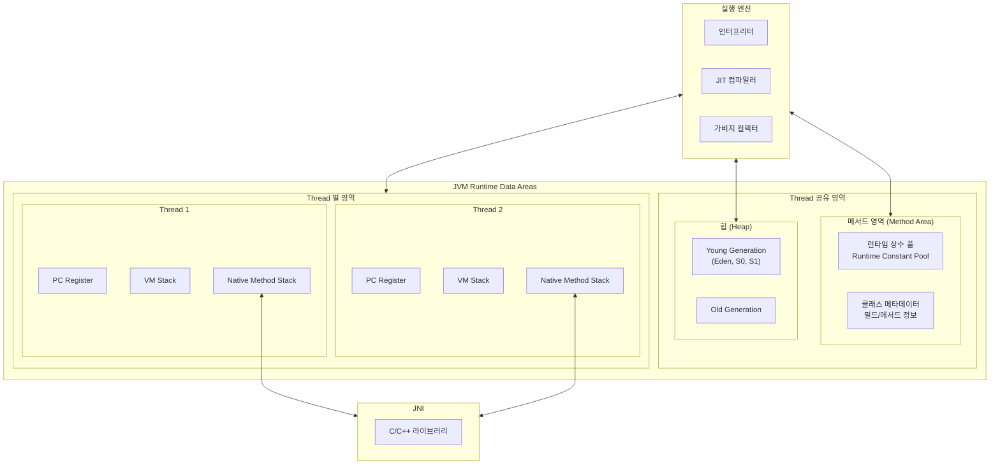
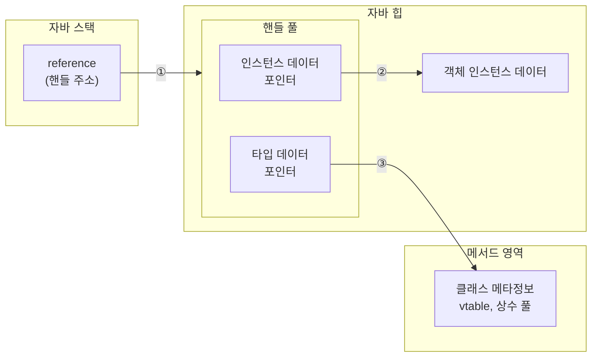
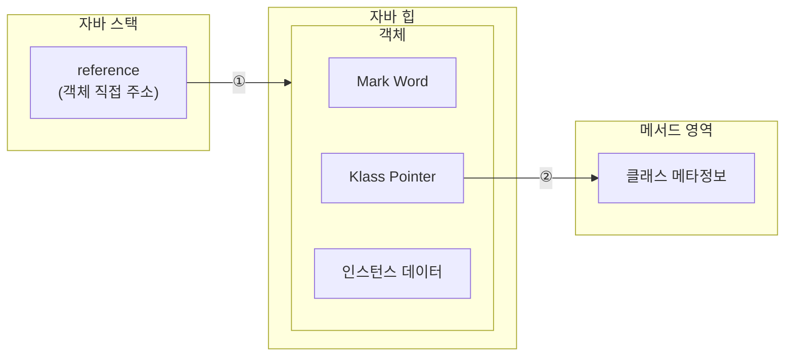

# [JVM] 자바 메모리

JVM 메모리 영역의 세부 구조, 객체 접근 방식, OOME 종류와 진단, 메모리 옵션, 그리고 운영 환경에서의 사이징을 정리한다.

> 메모리 영역의 큰 그림과 객체 생성 흐름은 [jvm_execution.md](./jvm_execution.md) 참조.

## 1. 메모리 영역 다시 보기

---

### 1.1 런타임 데이터 영역



| 영역 | 공유 여부 | 저장 내용 |
|---|---|---|
| 메서드 영역 (Metaspace) | 공유 | 클래스 메타데이터, 런타임 상수 풀, JIT 코드 캐시 일부 |
| 힙 | 공유 | 객체 인스턴스, 배열 |
| VM Stack | 스레드별 | 스택 프레임 (지역 변수, 피연산자 스택, 리턴 주소) |
| PC Register | 스레드별 | 다음 실행할 바이트 코드 주소 |
| Native Method Stack | 스레드별 | 네이티브 메서드 호출 정보 |

### 1.2 다이렉트 메모리 (Off-Heap)

자바 힙과는 별개로 **JVM 프로세스가 직접 OS의 네이티브 메모리를 할당받아 쓰는 영역**이다. 런타임 데이터 영역에 속하지 않는다.

NIO의 `DirectByteBuffer`가 이 영역을 사용한다. 자바 힙 ↔ 커널 버퍼 간 데이터 복사가 사라져 **Zero Copy**가 가능해지지만, JVM의 `-Xmx`로 제한되지 않으므로 **운영 시 다이렉트 메모리 사용량까지 합산**해서 컨테이너 메모리 limit을 잡아야 한다.

```
프로세스 메모리 = 자바 힙(-Xmx) + Metaspace + Code Cache + Stack × 스레드 수 + Direct Memory + JVM 자체 오버헤드
```

## 2. 힙 영역 세부

---

### 2.1 세대 구조

```
[Eden] [S0] [S1]   →   [Old]            (Native Memory: [Metaspace])
└─── Young ────┘        └─Old─┘
```

- **Young**: 갓 생성된 객체. Eden + Survivor 0/1로 구성. Minor GC로 청소.
- **Old**: 오래 살아남거나 큰 객체. Major GC(또는 Full GC)로 청소.
- **Metaspace** (Java 8+): 클래스 메타데이터. 힙이 아닌 네이티브 메모리에 위치.

> Java 7까지의 **PermGen**은 Java 8에서 제거되고 Metaspace로 대체됐다. Metaspace는 기본적으로 한도 없이 OS 메모리만큼 늘어날 수 있으므로, `-XX:MaxMetaspaceSize`로 상한을 지정해 무한 누수를 방지한다.

### 2.2 Young과 Old를 나눈 이유

객체의 생존 기간 분포는 **약 98%가 짧게 살고 2%가 오래 산다**(약한 세대 가설, Weak Generational Hypothesis). 한 영역에서 통째로 관리하면 GC 때마다 전체를 스캔해야 하므로 Stop-The-World가 길어진다.

세대를 나누면 다음 효과가 있다.

- 짧게 사는 객체는 작은 Young 영역에서 빠르게 회수
- 오래 사는 객체는 Old 영역에 모아 가끔만 GC
- 결과적으로 평균 STW 시간 ↓, 처리량 ↑

### 2.3 객체 흐름

```
new Object()
   │
   ▼
[Eden]
   │  Minor GC: 살아있는 객체 → Survivor로 복사
   ▼
[S0 / S1]  ←─ Minor GC마다 S0 ↔ S1 왕복, age 증가
   │
   │  age ≥ MaxTenuringThreshold (기본 15)
   ▼
[Old]
   │  Major GC
   ▼
회수
```

다음 Minor GC에서는 (Eden + 사용 중이던 Survivor)에서 살아있는 객체를 비어있던 Survivor로 이동시키며 age를 증가시킨다. age 임계치를 넘으면 Old로 promotion 된다.

### 2.4 Metaspace

| 항목 | PermGen (~Java 7) | Metaspace (Java 8+) |
|---|---|---|
| 위치 | 힙 내부 | 네이티브 메모리 |
| 기본 상한 | `-XX:MaxPermSize`로 수동 설정 | 무제한 (OS 메모리까지) |
| GC | 힙 GC와 함께 | 클래스 언로드 시 |
| OOM 메시지 | `OutOfMemoryError: PermGen space` | `OutOfMemoryError: Metaspace` |

> 운영 주의: Spring/Hibernate/CGLib 등 동적 클래스 생성 프레임워크가 많은 환경에서는 Metaspace 누수가 발생할 수 있다. `-XX:MaxMetaspaceSize`를 명시하지 않으면 무한정 늘어나 컨테이너가 OOMKilled 될 수 있다.

## 3. 객체 접근 방식

---

자바의 대다수 객체는 다른 객체를 조합하여 만들어진다. 따라서 객체나 객체 내부의 다른 객체에 접근할 때는 스택의 참조(reference)를 통해 힙의 객체에 접근한다. 이 참조가 어떻게 구현되는지에 따라 두 방식이 있다.

### 3.1 핸들 방식



힙에 핸들 풀을 두고, 핸들이 인스턴스 데이터 포인터와 타입 데이터 포인터를 갖는 방식. **GC로 객체가 이동해도 핸들의 인스턴스 포인터만 갱신**하면 되므로 안정적이다. 단, 한 번 더 거치는 만큼 접근 속도가 느리다.

### 3.2 다이렉트 포인터 방식 (HotSpot 채택)



스택의 reference가 **객체 주소를 직접 가리키고**, 객체 헤더의 Klass Pointer가 메서드 영역의 클래스 메타정보를 가리킨다. 핸들 풀을 거치지 않으므로 한 번의 포인터 추적이 줄어들어 빠르다. **HotSpot JVM이 채택한 방식**이다.

GC로 객체가 이동하면 모든 reference를 갱신해야 하므로 핸들 방식보다 GC가 복잡해지지만, 평소 접근 비용이 더 중요하다고 판단한 절충이다.

## 4. 메모리 오버플로 (OOME)

---

JVM의 여러 런타임 영역에서 OOME가 발생할 수 있다. 어디서 어떤 메시지로 터지는지를 알아야 진단할 수 있다.

### 4.1 자바 힙 오버플로

객체를 계속 생성하여 힙 공간을 넘어서면 발생한다.

```
Exception in thread "main" java.lang.OutOfMemoryError: Java heap space
```

힙 덤프를 분석하여 어떤 객체가 점유하고 있는지 파악한다. **불필요한 객체가 점유하고 있다면 메모리 누수**가 원인이다.

### 4.2 가상 머신 스택 / 네이티브 메서드 스택 오버플로

HotSpot은 두 영역을 구분하지 않고 다음 두 경우에 예외를 던진다.

#### 1) 스택 깊이 초과

스레드의 스택 깊이가 가상 머신이 허용하는 최대 깊이보다 클 경우. 무한 재귀가 대표 사례.

```
Exception in thread "main" java.lang.StackOverflowError
```

#### 2) 스레드 생성 실패

새 스레드의 스택을 위한 네이티브 메모리를 더 할당받지 못할 때.

```
Exception in thread "main" java.lang.OutOfMemoryError: unable to create native thread
```

> HotSpot은 스택 메모리를 동적으로 확장하는 기능을 제공하지 않는다. 동적으로 확장하면 한 스레드가 스택을 키우는 동안 다른 스레드 생성 가능 수가 줄어들어, 멀티스레딩 환경에서 처리량이 떨어지기 때문이다.

### 4.3 메서드 영역 / 런타임 상수 풀 오버플로

Java 8부터 런타임 상수 풀은 메서드 영역(Metaspace)에 속한다. 클래스가 너무 많이 로드되면 발생한다.

```
Exception in thread "main" java.lang.OutOfMemoryError: Metaspace
```

Spring·Hibernate 같은 프레임워크와 CGLib 같은 바이트 코드 조작 기술은 리플렉션으로 동적 클래스를 생성하고, 이 클래스들이 Metaspace에 로드되므로 누수 패턴을 주의해야 한다.

### 4.4 다이렉트 메모리 오버플로

NIO의 `DirectByteBuffer`나 `Unsafe` 인스턴스를 통해 직접 할당한 네이티브 메모리에서 발생한다.

```
Exception in thread "main" java.lang.OutOfMemoryError: Unable to allocate n bytes
```

다른 OOME와 차별점은 **힙 덤프에 별다른 이상이 없다**는 점이다. 힙은 멀쩡한데 OOM이 발생한다면 NIO·Zero Copy 등 물리 메모리에 직접 접근하는 코드를 의심해야 한다.

### 4.5 진단 도구

| 도구 | 용도 |
|---|---|
| `jmap -dump:live,format=b,file=heap.hprof <pid>` | 힙 덤프 추출 |
| `jcmd <pid> GC.heap_dump heap.hprof` | 힙 덤프 (jmap 대안) |
| `jcmd <pid> VM.native_memory detail` | NMT(Native Memory Tracking) 상세 보기 |
| `jstat -gc <pid> 1s` | GC 통계 1초 주기 |
| **MAT (Eclipse Memory Analyzer)** | 힙 덤프 분석 GUI |
| **VisualVM / JFR** | 종합 모니터링 |

> 운영 환경에서는 `-XX:+HeapDumpOnOutOfMemoryError -XX:HeapDumpPath=/var/dump`를 켜두어 OOM 발생 시 자동으로 힙 덤프가 남도록 한다.

## 5. JVM 메모리 옵션

---

### 5.1 힙 사이징

| 옵션 | 의미 |
|---|---|
| `-Xms<size>` | 최소 힙 크기 (초기 할당) |
| `-Xmx<size>` | 최대 힙 크기 |
| `-XX:InitialRAMPercentage=50.0` | 컨테이너 메모리의 % 단위 초기 힙 |
| `-XX:MaxRAMPercentage=80.0` | 컨테이너 메모리의 % 단위 최대 힙 |

> `-Xms`와 `-Xmx`를 같은 값으로 잡으면 힙이 동적으로 늘어났다 줄어드는 비용이 사라져 GC 동작이 안정적이다.

### 5.2 메타스페이스

| 옵션 | 의미 |
|---|---|
| `-XX:MaxMetaspaceSize=<size>` | Metaspace 상한 |
| `-XX:MetaspaceSize=<size>` | Metaspace 초기 크기 |
| `-XX:MaxMetaspaceFreeRatio=60` | Metaspace 비율 제한 (사용 후 free 비율이 60% 넘으면 축소) |

### 5.3 GC 선택

| 옵션 | 의미 |
|---|---|
| `-XX:+UseSerialGC` | Serial GC |
| `-XX:+UseParallelGC` | Parallel GC |
| `-XX:+UseG1GC` | G1 GC (Java 9+ 기본값) |
| `-XX:+UseZGC` | ZGC (Java 11+, 안정화는 Java 15+) |
| `-XX:+UseShenandoahGC` | Shenandoah GC |
| `-XX:MaxGCPauseMillis=200` | G1/ZGC 목표 정지 시간 (ms) |
| `-XX:G1HeapRegionSize=8m` | G1 리전 크기 명시 (1MB~32MB, 2의 거듭제곱). 기본은 2048개 리전을 목표로 자동 선택 |
| `-XX:+ParallelRefProcEnabled` | 참조 객체 처리를 병렬로 |
| `-XX:-ResizePLAB` | PLAB(Promotion Local Allocation Buffer) 동적 리사이즈 끔. 멀티스레드 promotion 시 동기화 비용 줄임 |

### 5.4 진단/모니터링

| 옵션 | 의미 |
|---|---|
| `-XX:+HeapDumpOnOutOfMemoryError` | OOM 발생 시 힙 덤프 자동 생성 |
| `-XX:HeapDumpPath=/var/dump` | 힙 덤프 저장 경로 |
| `-XX:+UnlockDiagnosticVMOptions` | 진단용 숨겨진 옵션 활성화 |
| `-XX:NativeMemoryTracking=detail` | NMT 활성화 (jcmd로 조회) |
| `-XX:+UnlockExperimentalVMOptions` | ZGC, Shenandoah 등 실험적 옵션 활성화 |
| `-XshowSettings:all` | 시작 시 JVM 설정 모두 출력 |

### 5.5 컨테이너 환경

| 옵션 | 의미 |
|---|---|
| `-XX:+UseContainerSupport` | 컨테이너의 메모리·CPU 제한 인식 (Java 10+ 기본값) |
| `-XX:ActiveProcessorCount=2` | JVM이 인식할 CPU 코어 수 강제 |

> K8s 환경에서 `-XX:MaxRAMPercentage`로 힙을 잡을 때, **pod limit = 자바 힙 + Metaspace + Code Cache + Stack × 스레드 수 + Direct Memory + JVM 오버헤드**를 고려해야 한다. 보통 힙은 pod limit의 50~70% 범위로 잡고 나머지를 Off-Heap에 양보한다.

## 6. GC 알고리즘 비교

---

| 알고리즘 | 도입 | 폐기 | 특징 | 적합 환경 |
|---|---|---|---|---|
| **Serial** | 초기 | - | 싱글 스레드, STW 김 | 작은 힙, 단일 코어 |
| **Parallel** | 초기 | - | 멀티 스레드, 처리량 ↑, STW 여전히 김 | 처리량 우선, 배치 |
| **CMS** | Java 5 | Java 14에서 제거 (Deprecated since 9) | 동시 마킹·동시 청소, STW 짧음, Compact 없어 단편화 | (사용 비권장) |
| **G1** | Java 7u4 | - (Java 9+ 기본값) | 리전 기반, 예측 가능한 STW(`MaxGCPauseMillis`), 처리량과 지연의 균형 | 일반 서버 (수 GB 힙) |
| **ZGC** | Java 11 | - | Colored Pointer, 힙이 수백 GB~TB여도 STW 10ms 이내 | 대형 힙, 저지연 |
| **Shenandoah** | Java 12 | - | ZGC와 유사, 동시 압축으로 짧은 STW | 대형 힙, 저지연 (RedHat 주도) |

> 알고리즘별 동작 원리(Mark-Sweep-Compact, Mark-Copy, Init Mark/Concurrent Mark/Remark, Coloring Pointer 등)는 [garbage_collector.md](./garbage_collector.md) 참조.

## 7. 운영 사례: 회사 서비스 JVM 옵션 분석

---

### 7.1 GC 비교 (실무 적용 기준)

| GC | 장점 | 단점 |
|---|---|---|
| **Parallel GC** | 처리량 좋음, CPU 사용률 적음(애플리케이션 스레드 멈춰놓고 수행), GC 횟수가 G1·ZGC보다 적음 | STW 시간이 김 |
| **G1GC** | 리전 단위 수집, 목표 STW 시간을 맞추려 함, 처리량과 지연 예측 가능 | 동시 마킹으로 CPU 사용률 ↑, 힙이 커질수록 STW 증가 (스캔·복사 시간 증가) |
| **ZGC** | 힙이 아무리 커져도 10ms 이내 GC | colored pointers, load barrier, relocate 등 부가 연산이 많아 동일 힙 기준 비효율적 |

### 7.2 API 서버 비교

요청 응답 지연이 잦은 서비스 4종을 비교한다.

|  | **opening** | **offercent-bff** | **greeting-aggregator** | **greeting-ats-server** |
| --- | --- | --- | --- | --- |
| GC | G1GC | 모름 (G1 추정, CPU 1코어 미만이라 Serial일 수도) | G1GC | G1GC |
| 요청 memory | 1GB | 1GB | 2GB | 2GB |
| 요청 CPU | 0.25 코어 | 0.25 코어 | 1코어 | 1코어 |
| 제한 memory | 2GB | 1GB | 2GB | 4GB |
| 제한 CPU | 없음 | 없음 | 없음 | 없음 |
| max heap | 512MB | 256MB | 512MB | 1GB |
| JVM 옵션 | `UseContainerSupport` | 없음 | `InitialMetaspaceSize=128m`, `MaxMetaspaceSize=256m`, `MaxMetaspaceFreeRatio=60`, `ActiveProcessorCount=2` | `XshowSettings:all`, `MaxMetaspaceFreeRatio=60`, `MaxMetaspaceSize=512m`, `+HeapDumpOnOutOfMemoryError`, `HeapDumpPath=/var/dump`, `+UnlockDiagnosticVMOptions`, `NativeMemoryTracking=detail` |
| 개선 안 | 힙 사이즈 ↑ (임계치 왔다갔다), G1 리전 사이즈 ↓ (잦지만 빠른 GC), 문제 API 코드 수정 | - | 힙 사용량 여유 O | 힙 사용량 여유 O |

> **응답 지연 진단**: GC로 인한 지연인지 확인 필요. `jvm.gc.pause` 메트릭과 force GC 발생 여부, 힙 임계치 초과 로그를 확인.

### 7.3 백엔드 서비스 전체 옵션 표

| 배포명(서비스명) | JVM metric (avg, max, max heap) | 사용 중인 JVM Option | Pod 메모리 (avg, max) | Pod 메모리 설정 | 비고 |
| --- | --- | --- | --- | --- | --- |
| greeting-ats-server | avg: 795MiB / max: 906MiB / max_heap: 1000MiB | `-XshowSettings:all -XX:MaxMetaspaceFreeRatio=60 -XX:MaxMetaspaceSize=512m -XX:+HeapDumpOnOutOfMemoryError -XX:HeapDumpPath=/var/dump -XX:+UnlockDiagnosticVMOptions -XX:NativeMemoryTracking=detail` (힙 크기 조절 옵션 없음) | avg: 1.9GiB / max: 3.84GiB / cpu max: 6.72 | limits: 4000Mi / requests: cpu 1, memory 2000Mi | 배포일자에 메모리가 4GiB 가까이 튐. 배포 시 cpu 최대 6.72 코어 사용. jib 빌드 |
| greeting-recruitment-api-server | nestjs | nestjs | avg: 200MiB / max: 520MiB | limits: 500Mi / requests: cpu 250m, memory 500Mi | |
| doodlin-communication | jvm metric 수집 X | `-XshowSettings:all -XX:MaxMetaspaceFreeRatio=60 -XX:MaxMetaspaceSize=512m -XX:+HeapDumpOnOutOfMemoryError -XX:HeapDumpPath=/var/dump -XX:+UnlockDiagnosticVMOptions -XX:NativeMemoryTracking=detail` (힙 크기 조절 옵션 없음) | avg: 1.4GiB / max: 2.77GiB | limits: 3000Mi / requests: cpu 250m, memory 2000Mi | jib 빌드 |
| doodlin-communication-batch (evaluationRemindJob) | 수집 X | (위와 유사 + JMX 옵션 추가, 힙 크기 옵션 없음) | avg: 560MiB | limits: 2500Mi / requests: cpu 250m, memory 2500Mi | |
| doodlin-communication-batch (sendReservedMailJob) | 수집 X | (evaluationRemindJob과 동일) | avg: 688MiB | limits: 2500Mi / requests: cpu 250m, memory 2500Mi | |
| greeting-analytics-server | 수집 X | `-XX:InitialRAMPercentage=50.0 -XX:MaxRAMPercentage=80.0 -XX:+UseContainerSupport` | avg: 1.2GiB / max: 2GiB | limits: 1500Mi / requests: cpu 250m, memory 1500Mi | 6/9 2GiB 사용. limits 수정 필요 |
| greeting-ats2-recruit-applicant-api | avg: 370MiB / max: 390MiB / max_heap: 500MiB | 관련 설정 없음 | avg: 1.1GiB / max: 2GiB | limits: 2000Mi / requests: cpu 250m, memory 2000Mi | |
| greeting-ats2-wno | avg: 730MiB / max: 730MiB / max_heap: 2GiB | `-Xms$memory -Xmx$memory -XX:MaxMetaspaceSize=512m -XX:+UseContainerSupport -XX:MaxGCPauseMillis=200 -XX:+ParallelRefProcEnabled -XX:-ResizePLAB` | avg: 1.8GiB / max: 3.8GiB | limits: 2000Mi / requests: cpu 250m, memory 2000Mi | 힙 최소·최대 2g, 조정 필요 |
| greeting-authn-server | avg: 350MiB / max: 400MiB / max_heap: 1GiB | `-Xms512m -Xmx1024m -XX:MaxMetaspaceSize=512m -XX:+UseG1GC -XX:MaxGCPauseMillis=200 -XX:+UnlockExperimentalVMOptions -XX:+UnlockDiagnosticVMOptions -XX:NativeMemoryTracking=detail -XX:+UseContainerSupport` | avg: 1GiB / max: 2GiB | limits: 3000Mi / requests: cpu 250m, memory 3000Mi | |
| greeting-integration-worker | 수집 X | `-XX:InitialRAMPercentage=50.0 -XX:MaxRAMPercentage=80.0 -XX:+UseContainerSupport -XX:+HeapDumpOnOutOfMemoryError -XX:HeapDumpPath=/var/dump -XX:+UnlockDiagnosticVMOptions -XX:NativeMemoryTracking=detail` | avg: 600MiB / max: 1.14GiB | limits: 750Mi / requests: cpu 250m, memory 750Mi | |
| greeting-kotlin-mail-worker | 수집 X | `-XX:InitialRAMPercentage=50.0 -XX:MaxRAMPercentage=80.0 -XX:+UseContainerSupport` | | limits: 750Mi / requests: cpu 250m, memory 500Mi | 사용 안 하는 것으로 알고있는데, 6/29부터 메모리 증가 추세 |
| greeting-payment-server | avg: 194MiB / max: 208MiB / max_heap: 580MiB | `-XX:InitialRAMPercentage=50.0 -XX:MaxRAMPercentage=60.0 -XX:+UseContainerSupport -XX:MetaspaceSize=512m -XX:MaxMetaspaceSize=512m` | avg: 700MiB / max: 1.35GiB | limits: 1000Mi / requests: cpu 10m, memory 1000Mi | |
| greeting-trm-server | avg: 667MiB / max: 736MiB / max_heap: 1.17GiB | `-server -XX:InitialRAMPercentage=50.0 -XX:MaxRAMPercentage=60.0 -XX:MaxMetaspaceSize=512m -XX:+UseContainerSupport -XX:+UseG1GC -XX:MaxGCPauseMillis=200 -XX:G1HeapRegionSize=8m -XX:+HeapDumpOnOutOfMemoryError -XX:HeapDumpPath=/var/dump -Xshare:off` | avg: 1.8GiB / max: 3.57GiB | limits: 2000Mi / requests: cpu 400m, memory 2000Mi | jib 빌드 |
| greeting-aggregator | 수집 X | `-XX:InitialMetaspaceSize=128m -XX:MaxMetaspaceSize=256m -XX:MaxMetaspaceFreeRatio=60 -XX:ActiveProcessorCount=2` (힙 옵션 없음, ~500MiB 추정) | avg: 830MiB / max: 3.93GiB | limits: 2000Mi / requests: cpu 1000m, memory 2000Mi | 힙 메모리 설정 필요 |
| greeting-api-gateway | avg: 295MiB / max: 394MiB / max_heap: 500MiB → 1GiB(7/2 이후) | `-XX:MaxMetaspaceSize=512m -XX:+UseContainerSupport -XX:+UseG1GC -XX:MaxGCPauseMillis=200 -XX:NativeMemoryTracking=detail -XX:+ParallelRefProcEnabled -XX:-ResizePLAB -XX:+HeapDumpOnOutOfMemoryError -XX:HeapDumpPath=/var/dump -XshowSettings:all` | avg: 1000MiB / max: 4.12GiB | limits: 2000Mi / requests: cpu 250m, memory 2000Mi | 7/2 heap 1GiB로 증가 |
| greeting-ats2-api | avg: 759MiB / max: 879MiB / max_heap: 2GiB | `-server -Xms2g -Xmx2g -XX:MaxMetaspaceSize=512m -XX:+UseContainerSupport -XX:MaxGCPauseMillis=200 -XX:+ParallelRefProcEnabled -XX:-ResizePLAB -XX:NativeMemoryTracking=detail` | avg: 1.92GiB / max: 3.79GiB | limits: 2000Mi / requests: cpu 250m, memory 2000Mi | 최소·최대치 조정 필요 |
| greeting-authz-server | avg: 244MiB / max: 297MiB / max_heap: 365MiB → 750MiB(7/2 이후) | (api-gateway와 유사) | avg: 950MiB / max: 2.65GiB | limits: 1500Mi / requests: cpu 250m, memory 1500Mi | 힙 메모리 설정 필요 |
| greeting-communication-api | avg: 266MiB / max: 345MiB / max_heap: 500MiB | `-XX:InitialMetaspaceSize=128m -XX:MaxMetaspaceSize=256m -XX:MaxMetaspaceFreeRatio=60 -XX:ActiveProcessorCount=2` (힙 옵션 없음) | avg: 885MiB / max: 1.94GiB | limits: 2000Mi / requests: cpu 300m, memory 2000Mi | 힙 메모리 설정 필요 |
| greeting-communication-offer | | (위와 동일) | avg: 498MiB / max: 983MiB | limits: 2000Mi / requests: cpu 300m, memory 2000Mi | 임시 서버, 통합 예정 |
| greeting-trm-authz-server | 수집 X | `-XX:InitialRAMPercentage=50.0 -XX:MaxRAMPercentage=80.0 -XX:+UseContainerSupport` | avg: 1.2GiB / max: 2.4GiB | limits: 2000Mi / requests: cpu 250m, memory 1000Mi | |
| greeting-workspace-server | avg: 250MiB / max: 250MiB / max_heap: 1GiB | `-Xms512m -Xmx1024m -XX:MaxMetaspaceSize=512m -XX:+UseContainerSupport -XX:+UseG1GC -XX:MaxGCPauseMillis=200 -XX:+HeapDumpOnOutOfMemoryError -XX:HeapDumpPath=/var/dump -XX:NativeMemoryTracking=detail` | avg: 800MiB / max: 1.6GiB | limits: 3000Mi / requests: cpu 250m, memory 3000Mi | 메모리 과도 설정 |
| greeting-expired-applicant-processor | 수집 X | `-XX:InitialRAMPercentage=50.0 -XX:MaxRAMPercentage=80.0 -XX:+UseContainerSupport` | | limits: 1000Mi / requests: cpu 250m, memory 1000Mi | |
| doodlin-internal-notification-consumer | - | `-Xmx2g -XX:MaxMetaspaceSize=512m` | - | limits: 2000Mi / requests: cpu 250m, memory 2000Mi | |
| offercent-bff | avg: 196MiB / max: 239MiB / max_heap: 242MiB | 관련 설정 없음 | avg: 698MiB / max: 2.19GiB | limits: 1000Mi / requests: cpu 250m, memory 1000Mi | JVM 설정 추가 필요 |
| offercent-user-api | avg: 164MiB / max: 197MiB / max_heap: 242MiB | 관련 설정 없음 | avg: 748MiB / max: 1.43GiB | limits: 1000Mi / requests: cpu 250m, memory 1000Mi | JVM 설정 추가 필요 |
| offercent-auth-api | avg: 169MiB / max: 239MiB / max_heap: 242MiB | 관련 설정 없음 | avg: 656MiB / max: 1.17GiB | limits: 1000Mi / requests: cpu 250m, memory 1000Mi | JVM 설정 추가 필요 |

## 참조

- [JVM 밑바닥까지 파헤치기](https://product.kyobobook.co.kr/detail/S000213057051)
- [jvm_execution.md](./jvm_execution.md) — 실행 흐름과 객체 생성
- [garbage_collector.md](./garbage_collector.md) — GC 알고리즘 상세
