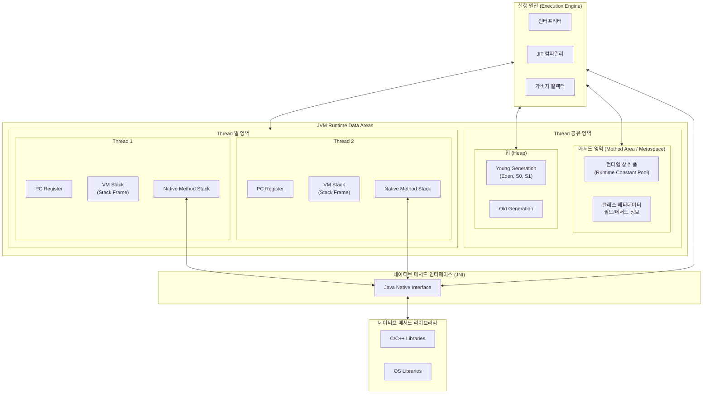
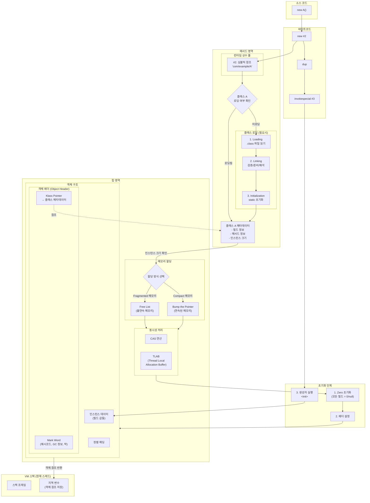
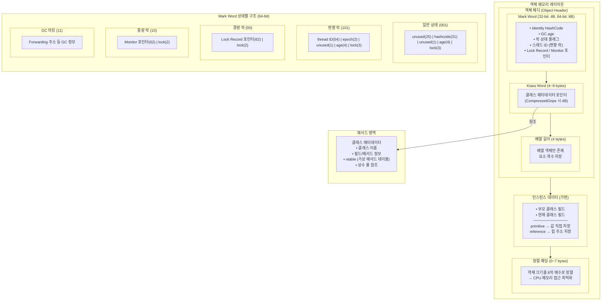
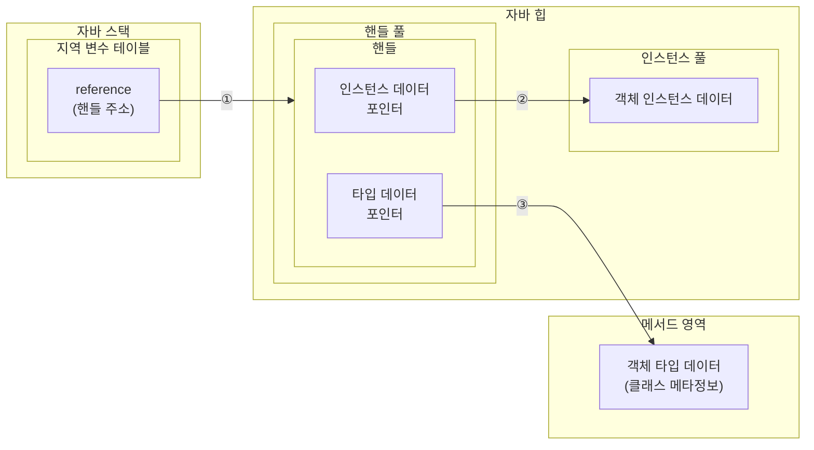
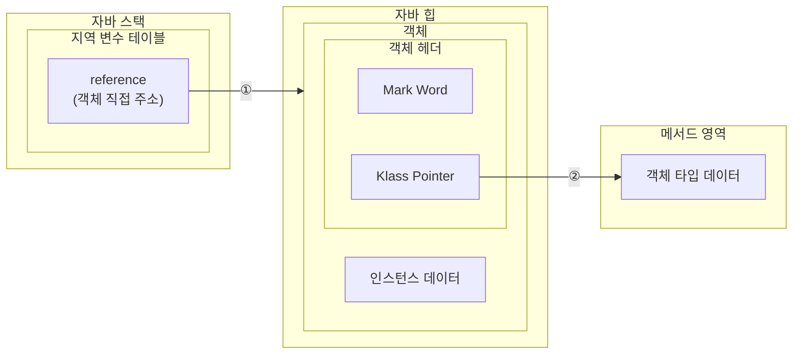

# 자바 메모리 — 런타임 데이터 영역과 객체, 그리고 OOME

> 통합 원본:
> - [_archive/jvm/memory_and_memory_overflow.md](../_archive/jvm/memory_and_memory_overflow.md)
> - [_archive/jvm/jvm_heap.md](../_archive/jvm/jvm_heap.md) (GC 알고리즘 상세는 [`garbage_collector.md`](garbage_collector.md)로 분리)
> - [_archive/jvm/jvm_options.md](../_archive/jvm/jvm_options.md) (메모리 관련 옵션만 발췌)

JVM은 자바 프로그램을 실행하기 위해 메모리를 여러 영역으로 분할해 관리한다.   
이 글은 **메모리 구조**, **객체가 메모리에 놓이는 방법**, **메모리가 넘쳤을 때 발생하는 OOME**, **메모리 관련 JVM 옵션**까지 다룬다.

GC 알고리즘(Serial/Parallel/CMS/G1/ZGC/Shenandoah) 동작 방식은 [`garbage_collector.md`](garbage_collector.md)로 분리했다.

---

## 1. 런타임 데이터 영역



크게 **모든 스레드가 공유하는 영역**(메서드 영역, 힙)과 **스레드마다 별도로 가지는 영역**(PC Register, VM Stack, Native Method Stack)으로 나뉜다.   
공유 영역은 객체·클래스 정보처럼 여러 스레드가 함께 보는 데이터를 담고, 스레드별 영역은 각 스레드가 어디까지 실행했는지·어떤 지역 변수를 가지고 있는지를 담는다.

### 1.1 프로그램 카운터 레지스터 (PC Register)
스레드별로 **현재 실행 중인 바이트코드 명령의 주소**를 기록하는 작은 영역이다.   
멀티스레드 환경에서는 컨텍스트 스위칭이 끊임없이 일어나는데, 다시 차례가 돌아왔을 때 "어디서부터 다시 실행해야 하는지"를 알아야 한다.   
이 위치 정보를 스레드끼리 섞이지 않도록 각 스레드마다 독립적으로 가지고 있는 곳이 PC Register다.

### 1.2 자바 가상 머신 스택 (VM Stack)
스레드 프라이빗 영역으로, **메서드가 호출될 때마다 스택 프레임을 하나씩 쌓는다**.   
스택 프레임에는 지역 변수 테이블, 피연산자 스택, 동적 링크, 메서드 반환값이 들어간다.

#### 지역 변수 테이블
컴파일 타임에 알 수 있는 기본 데이터 타입, 객체 참조, 반환 주소 타입을 저장한다.   
저장 단위를 **지역 변수 슬롯**이라 부르고, 슬롯 하나는 32비트다. `double`·`long` 같은 64비트 타입은 슬롯 2개를 차지한다.   
이 영역은 컴파일 시점에 크기가 모두 결정되어 런타임에 동적으로 늘어나지 않는다.

### 1.3 네이티브 메서드 스택
VM Stack이 자바 코드로 정의된 메서드를 위한 스택이라면, 네이티브 메서드 스택은 **JNI로 호출되는 네이티브(C/C++) 메서드 실행을 위한 스택**이다.   
핫스팟 JVM은 VM Stack과 네이티브 메서드 스택을 구분하지 않고 하나로 합쳐 관리한다.

### 1.4 자바 힙 (Heap)
**모든 스레드가 공유하며, 동적으로 생성된 객체 인스턴스가 저장되는 공간**이다.   
효율적인 메모리 회수를 위해 Young Generation(Eden, S0, S1) / Old Generation으로 나눠 관리하며, 자세한 구조는 §2에서 다룬다.

### 1.5 메서드 영역 (Metaspace)
**클래스 메타데이터, 상수, 정적 변수, JIT가 컴파일한 코드 캐시 등을 저장**한다. "논힙(Non-Heap)"으로 분류된다.   
JDK 7까지는 이 정보를 힙 안의 **Permanent Generation**에 두었으나, **JDK 8부터는 네이티브 메모리에 별도로 할당되는 Metaspace로 대체**됐다.   
영구 세대 시절에는 힙 일부였기에 `-XX:PermSize`로 크기 제한을 받았지만, Metaspace는 기본적으로 OS 메모리 한계까지 늘어날 수 있어 `-XX:MaxMetaspaceSize`로 명시하지 않으면 누수 시 호스트 메모리를 잠식할 수 있다.

### 1.6 런타임 상수 풀
**클래스 로딩 시 클래스 버전, 필드, 메서드, 인터페이스 등의 정보가 들어가는 영역**이다.   
메서드 영역(Metaspace)에 속하며, 동적으로 상수가 추가될 수 있어 공간이 부족해지면 OOME를 발생시킨다.

### 1.7 다이렉트 메모리 (Direct Memory)
**런타임 데이터 영역이 아닌, 네이티브 함수 라이브러리(`Unsafe`, NIO)를 통해 직접 할당받는 OS 메모리**다.   
NIO의 `DirectByteBuffer`가 대표적이며, 자바 힙과 네이티브 힙 사이에 데이터를 복사하는 비용 없이 입출력을 수행할 수 있어 Zero Copy 구현에 사용된다.   
다만 실제 사용 메모리는 **자바 힙 + 다이렉트 메모리**이므로 합산해서 관리해야 한다.

---

## 2. 자바 힙 구조

### 2.1 영역 구성

```
Young Generation        Old Generation     Metaspace (JDK8+)
┌──────┬─────┬─────┐    ┌──────────────┐   ┌────────────────┐
│ Eden │ S0  │ S1  │ -> │   Tenured    │   │ 클래스 메타데이터  │
└──────┴─────┴─────┘    └──────────────┘   └────────────────┘
  Minor GC (잦고 빠름)     Full GC (드물고 느림)   (논힙, OS 메모리)
```

- **Eden**: 새로 생성된 객체가 처음 자리잡는 곳. Minor GC가 자주 발생.
- **Survivor (S0, S1)**: Minor GC에서 살아남은 객체가 잠시 머무는 곳. age count가 누적되며 둘 사이를 왕복.
- **Old (Tenured)**: age가 임계점을 넘은 객체가 승격(promotion)되어 옮겨지는 곳.
- **Metaspace**: 객체가 아닌 **클래스 정보** 보관소. 힙에 속하지 않고 네이티브 메모리에 존재.

### 2.2 Young과 Old를 나눈 이유

**대부분의 객체는 잠깐 살다 죽는다(약 98%)**. 일부 객체(1~2%)만이 오래 살아남는다.

만약 힙을 단일 영역으로 두면 메모리 해제를 위해 GC 발생 시마다 힙 전체를 스캔해야 한다. 그러면 한 번의 GC가 길어지고 **Stop-The-World(STW)** 시간이 늘어 애플리케이션 정지 시간이 치명적으로 늘어난다.

Young/Old로 나누면 **빠르게 죽을 객체는 작은 Young 영역에서만 검사**하면 되기에 짧고 잦은 Minor GC로 처리하고, 진짜 오래 사는 객체만 Old로 보내서 드물게 큰 GC(Full GC, Mixed GC 등)를 돌릴 수 있다. 결과적으로 STW 누적 시간이 줄어든다.

---

## 3. 핫스팟 가상 머신에서의 객체

핫스팟 가상 머신은 **핫 코드(자주 실행되는 코드)를 감지하여 JIT 컴파일러로 네이티브 코드로 바꿔두는** 기술을 가진 JVM 구현체이다.   
핫 코드는 자주 호출되는 메서드, 시간 소모가 큰 순환문이 포함된 메서드 등이며, 이를 감지해 JIT가 백그라운드에서 컴파일한 뒤 런타임에 스택 프레임을 네이티브 코드로 교체한다. 이를 통해 응답 속도·실행 성능·최적화 효과를 얻는다.

이 절에서는 핫스팟이 관리하는 자바 힙에서의 **객체 생성, 메모리 레이아웃, 접근 방법**을 살펴본다.

### 3.1 객체 생성 과정



객체 생성을 간단히 정리하면 다음과 같다.

1. `new A()`가 바이트코드 `new` / `dup` / `invokespecial` 로 변환된다.
2. 메서드 영역의 런타임 상수 풀에서 심벌릭 참조로 클래스 A를 찾고, 클래스 로딩 여부를 확인한다(미로딩이면 Loading → Linking → Initialization 수행).
3. 클래스 메타데이터에서 인스턴스 크기를 얻어 힙에 메모리를 할당한다. 이때 할당 방식은 두 가지다.
    - **Bump the Pointer**: 힙이 연속된 메모리(컴팩션이 일어나는 GC)일 때 포인터를 그냥 옮겨 할당.
    - **Free List**: 단편화된 메모리(컴팩션이 없는 GC)일 때 비어 있는 자리 목록에서 적당한 블록을 찾아 할당.
4. 동시성 문제를 막기 위해 **CAS 연산** 또는 **TLAB(Thread Local Allocation Buffer, 스레드별 전용 작은 영역)** 으로 할당 충돌을 회피한다.
5. 메모리 영역을 0/null로 초기화한 뒤 객체 헤더(해시코드, GC age, 락 정보, Klass Pointer)를 설정하고, 마지막으로 생성자 `<init>`이 실행되면 객체 생성이 완료된다.

### 3.2 객체의 메모리 레이아웃



> **Mark Word 크기**: 32-bit JVM에서는 4바이트, 64-bit JVM에서는 8바이트다. 위 비트 레이아웃은 64-bit 기준이다.
> **편향 락(Biased Locking)**: JDK 15에서 deprecated, JDK 18부터 기본 비활성화. 최신 JDK에서는 거의 사용되지 않는다.

#### 객체 헤더
객체 헤더는 두 가지 정보를 담는다.
- **Mark Word**: 객체 자체의 런타임 데이터(해시코드, GC age, 락 상태, 락 점유 스레드 등). 좁은 공간에 많은 정보를 욱여넣어야 해서 락 상태별로 비트 레이아웃이 달라진다.
- **Klass Word**: Metaspace의 클래스 메타데이터를 가리키는 포인터. 이 객체가 어느 클래스의 인스턴스인지 런타임에 알아내기 위한 정보다.

#### 인스턴스 데이터
객체가 실제로 담고 있는 필드 값이다. 부모 클래스의 필드가 먼저 오고, 그 다음 현재 클래스의 필드가 온다. primitive는 값을 직접, reference는 힙 주소를 저장한다.

#### 정렬 패딩
핫스팟 JVM에서 객체 크기는 **반드시 8바이트의 배수**여야 한다(CPU 메모리 접근 최적화). 헤더는 이미 8바이트 배수이지만 인스턴스 데이터는 그렇지 않을 수 있어, 남는 0~7바이트를 패딩으로 채워 정렬한다.

### 3.3 객체 접근 방식

자바의 객체는 다른 객체들을 멤버로 가지는 합성 구조가 흔하다. 스택의 참조 변수에서 힙의 객체에, 그리고 그 객체의 멤버 객체에 접근하는 경로를 구현하는 방식은 두 가지다.

#### 핸들 방식



힙에 **핸들 풀**을 따로 두고, reference는 핸들을 가리킨다. 핸들은 두 개의 포인터(인스턴스 데이터, 타입 데이터)를 들고 있다.   
GC로 객체가 이동해도 reference 자체는 그대로이고 핸들 안의 포인터만 갱신하면 되므로 **안정적**이다.

#### 다이렉트 포인터 방식



reference가 객체를 **직접** 가리킨다. 핸들 풀이라는 한 단계가 사라지므로 접근 속도가 빠르다.   
**핫스팟 JVM은 다이렉트 포인터 방식**을 사용한다. 대신 GC가 객체를 이동시킬 때는 reference 자체를 모두 갱신해야 하는데, 이를 지원하기 위해 JVM은 안전 지점(safepoint)과 OopMap 같은 메커니즘으로 모든 reference 위치를 추적한다.

---

## 4. OOME (OutOfMemoryError)

JVM 메모리는 영역별로 OOME가 발생할 수 있다. 영역에 따라 에러 메시지와 원인이 달라서, 메시지로 어느 영역이 문제인지 식별할 수 있어야 한다.

### 4.1 자바 힙 오버플로
**원인**: 객체가 계속 생성되며 힙 한계를 넘어섬. 대부분 **메모리 누수**가 원인.   
**에러**: `java.lang.OutOfMemoryError: Java heap space`   
**조사**: 힙 덤프(`-XX:+HeapDumpOnOutOfMemoryError`)를 받아 어떤 객체가 비정상적으로 많이 살아 있는지, 어느 GC Root에서 참조 사슬이 끊어지지 않는지 확인.

### 4.2 가상 머신 스택과 네이티브 메서드 스택 오버플로
핫스팟은 두 스택을 구분하지 않고 두 가지 케이스에서 예외를 던진다.

1. **스레드 스택 깊이가 허용 최대치를 초과** → `java.lang.StackOverflowError`   
   주로 재귀 호출이 종료 조건 없이 반복될 때.
2. **스택 메모리를 동적으로 확장할 수 있다고 가정했을 때, 가용 메모리 부족** → `java.lang.OutOfMemoryError: unable to create native thread`

> 단, 핫스팟 JVM은 2번의 동적 확장 기능을 **제공하지 않는다**. 이유는 스택을 동적으로 늘리면 한 스레드가 차지하는 메모리가 커져 생성 가능한 스레드 수가 줄어들고, 멀티스레드 처리량이 떨어지기 때문이다. 그래서 핫스팟에서는 1번이 거의 모든 케이스다.

### 4.3 메서드 영역과 런타임 상수 풀 오버플로
**원인**: 동적으로 로드되는 클래스가 너무 많을 때 발생. **Spring, Hibernate, CGLib** 같은 라이브러리가 리플렉션·바이트코드 조작으로 런타임에 클래스를 생성하면 Metaspace를 갉아먹는다.   
**에러**: `java.lang.OutOfMemoryError: Metaspace`   
**대응**: `-XX:MaxMetaspaceSize`로 상한을 설정하고, 클래스로더가 누수되지 않는지 확인. 특히 핫 리로드를 자주 하는 개발 환경에서 잘 발생한다.

### 4.4 네이티브 다이렉트 메모리 오버플로
**원인**: NIO `DirectByteBuffer`, `Unsafe.allocateMemory` 등을 통해 **자바 힙이 아닌 OS 메모리**를 할당하는 코드에서 발생. **힙 덤프에는 흔적이 잘 남지 않는다**.   
**에러**: `java.lang.OutOfMemoryError: Unable to allocate n bytes` (Direct buffer memory 등)   
**조사 포인트**: 힙 덤프가 깨끗한데 OOME가 나면 다이렉트 메모리·Zero Copy 코드 라인을 의심한다. `-XX:NativeMemoryTracking=detail`과 `jcmd <pid> VM.native_memory` 명령으로 추적 가능.

---

## 5. 메모리 관련 JVM 옵션

운영 관점에서 자주 만지는 메모리 옵션을 카탈로그로 정리한다. (GC 알고리즘 선택 관련 옵션은 [`garbage_collector.md`](garbage_collector.md) 참조)

### 5.1 힙 크기
| 옵션 | 설명 |
|---|---|
| `-Xms` | 최소(초기) 힙 크기 |
| `-Xmx` | 최대 힙 크기 |
| `-XX:InitialRAMPercentage` | 컨테이너 메모리 대비 초기 힙 비율 (컨테이너 환경에서 `-Xms` 대신 사용) |
| `-XX:MaxRAMPercentage` | 컨테이너 메모리 대비 최대 힙 비율 (컨테이너 환경에서 `-Xmx` 대신 사용) |
| `-XX:+UseContainerSupport` | 컨테이너 환경에서 cgroup의 메모리·CPU 제한을 인식 (JDK 8u191+, JDK 10+ 기본 활성화) |

### 5.2 Metaspace
| 옵션 | 설명 |
|---|---|
| `-XX:MetaspaceSize` | 초기 Metaspace 크기 (이 값을 넘으면 첫 Full GC 트리거) |
| `-XX:MaxMetaspaceSize` | Metaspace 최대 크기 — **꼭 설정해야 OS 메모리 잠식 방지** |
| `-XX:MaxMetaspaceFreeRatio` | Metaspace 점유율이 이 비율을 넘지 않도록 GC 시 크기 조정 |

### 5.3 디버깅·진단
| 옵션 | 설명 |
|---|---|
| `-XX:+HeapDumpOnOutOfMemoryError` | OOME 발생 시 힙 덤프 자동 생성 |
| `-XX:HeapDumpPath` | 힙 덤프 저장 경로 |
| `-XX:+UnlockDiagnosticVMOptions` | 진단용 숨겨진 옵션들을 열어줌 |
| `-XX:NativeMemoryTracking=detail` | 네이티브 메모리 사용 상세 추적 (`jcmd VM.native_memory`로 조회) |
| `-XshowSettings:all` | 시작 시 JVM 설정 전체 출력 |

### 5.4 운영 팁
- **컨테이너 환경에서 `-Xms`/`-Xmx`를 절대값으로 박는 것보다, `-XX:MaxRAMPercentage`로 비율 지정이 안전**하다. 파드 리소스 limit이 바뀌어도 자동으로 따라간다.
- `-Xms`와 `-Xmx`를 **같은 값으로 설정**하면 GC 도중에 힙 크기를 재조정하는 오버헤드가 사라진다. 일반적으로 운영 환경에서 권장.
- Metaspace는 `-XX:MaxMetaspaceSize`를 **반드시** 명시한다. 미명시 시 OS 메모리 한계까지 늘어나 호스트가 OOM-Killer 대상이 될 수 있다.
- `-XX:+HeapDumpOnOutOfMemoryError`는 **운영에 항상 켜둔다**. 사후 분석 비용 대비 디스크 비용은 무시할 수 있다.

---

## 참고
- [_archive/jvm/memory_and_memory_overflow.md](../_archive/jvm/memory_and_memory_overflow.md) — 통합 전 원본 (정석 톤)
- [_archive/jvm/jvm_heap.md](../_archive/jvm/jvm_heap.md) — 통합 전 원본 (힙 구조 + GC 알고리즘)
- [_archive/jvm/jvm_options.md](../_archive/jvm/jvm_options.md) — 통합 전 원본 (옵션 사전 + 사내 서비스 표)
- [`garbage_collector.md`](garbage_collector.md) — GC 알고리즘 6종 상세 (Serial/Parallel/CMS/G1/ZGC/Shenandoah)
- [`jvm_execution.md`](jvm_execution.md) — JVM 실행 흐름과 JIT
