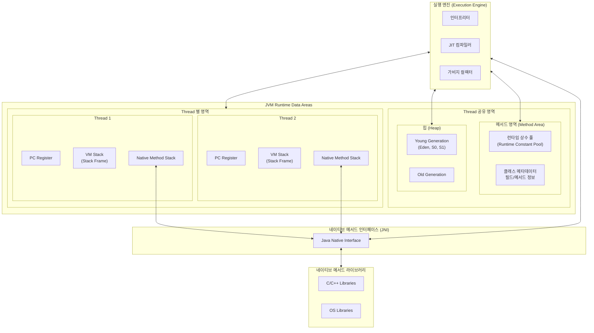
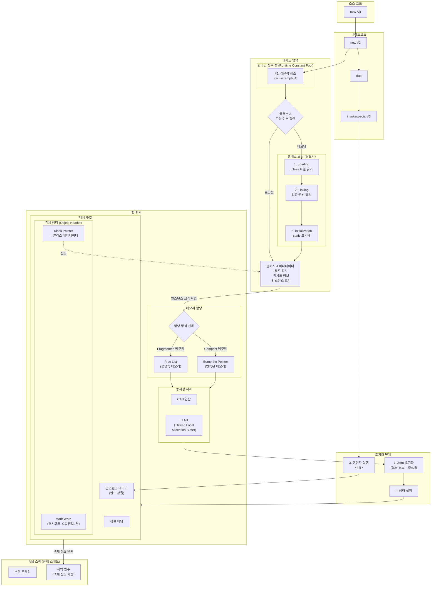
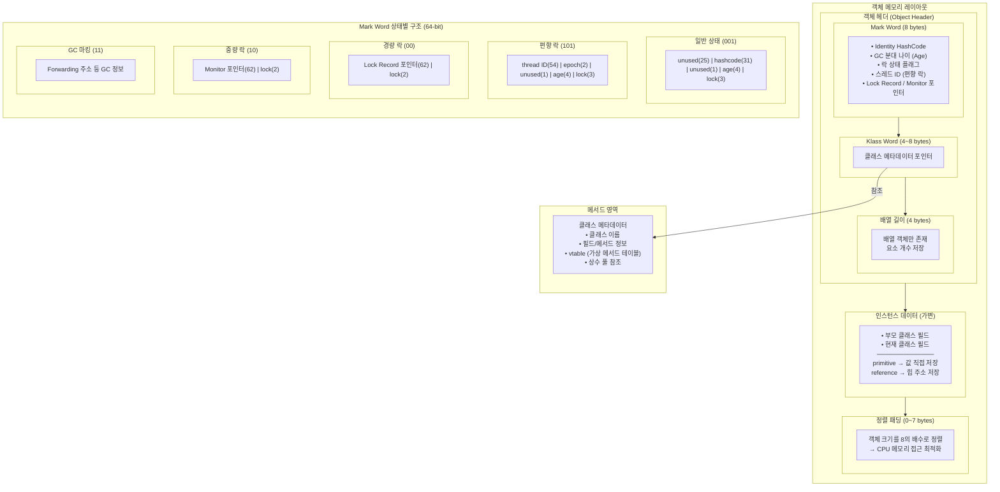
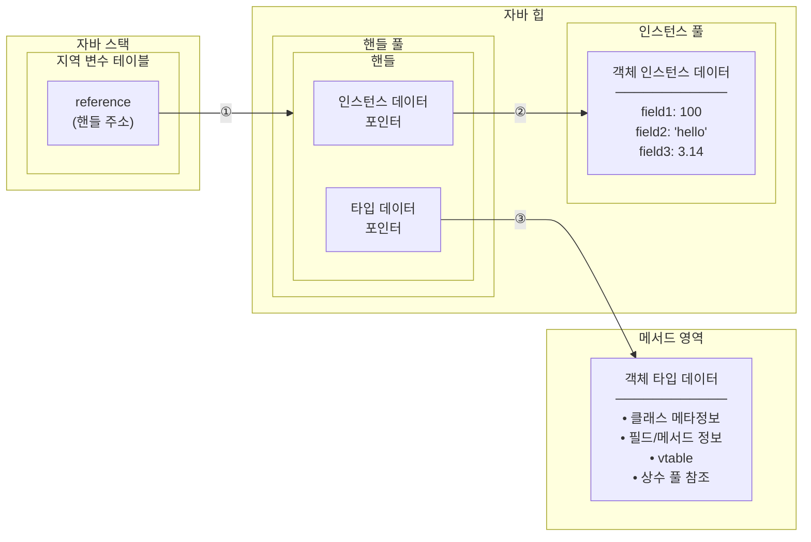
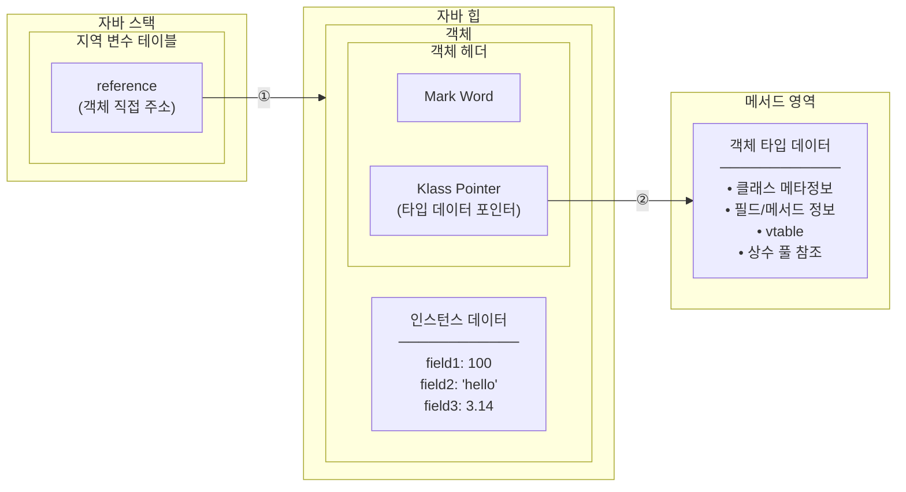

# 자바 메모리 영역과 메모리 오버플로
## 런타임 데이터 영역

### 1. 프로그램 카운터 레지스터 (PC Register)
멀티스레드가 컨텍스트 스위칭 시 멈추게 되는 지점들이 존재한다.    
이 멈춘 지점을 복원하고 다음 차례에 재실행 하기 위해 고유 카운터 등을 스레드 카운터에 저장하게 된다.   
이 스레드 카운터는 각 스레드 간에 영향을 주지 않는 독립된 영역에 저장하게 되고 이 영역을 스레드 프라이빗 메모리라고 한다.

### 2. 자바 가상 머신 스택 (VM Stack)
스레드 프라이빗하고, 메서드가 호출될 때마다 스택 프레임을 만들어 지역 변수 테이블, 피연산자 스택, 동적 링크, 메서드 반환값들을 저장한다.  

#### 2.1 지역 변수 테이블 
자바 가상 머신이 컴파일 타임에 알 수 있는 기본 데이터 타입, 객체 참조, 반환 주소 타입등을 저장하고 이 데이터 타입들을 저장하는 공간을 지역 변수 슬록이라 한다.    
이 슬롯은 32비트이며, double 타입과 같은 64비트는 2개의 슬롯을 차지하게 된다.    
이 지역 변수들은 코드로 이미 정의가 되었기 때문에 컴파일 과정에서 할당되어 크기가 완벽하게 정의된 상태이다.       

### 3. 네이티브 메서드 스택
가상 머신 스택은 자바코드로 정의된 메서드를 위한 스택이고, 네이티브 메서드 스택은 네이티브 메서드 (C, C++)를 실행할 때 사용된다.

### 4. 자바 힙
힙은 객체를 관리하기 위한 목적이고, 모든 스레드가 힙을 공유한다.   
객체 인스턴스 관리를 위해 메모리 회수 관점에서 신세대, 구세대, 영구 세대, 에덴, 서바이버 등을 나누어 메모리를 효율적으로 회수하고 할당한다.

### 5. 메서드 영역 (메타스페이스)
가상머신이 읽은 타입 정보, 상수, 정적 변수, JIT 컴파일러가 컴파일한 코드 캐시등을 저장한다.   
논힙이라 불리며, 힙의 영구 세대와는 다른 개념이다. (JDK 7까지는 영구 세대에서 관리되었으나 JDK8부터는 네이티브 메모리에 메타스페이스로 구현되었다.)

### 6. 런타임 상수 풀
가상 머신이 클래스를 로드할 때 클래스 버전, 필드, 메서드, 인터페이스 등 클래스 정보를 런타임 상수 풀에 저장한다.   
런타임 상수 풀은 메서드 영역에 속하며, 상수 풀의 공간이 부족하면 OOME를 발생시킨다.

### 7. 다이렉트 메모리
런타임에 속하지 않기에 힙이 아닌 물리 메모리를 직접 할당할 수 있는 네이티브 함수 라이브러리를 이용한다.    
NIO는 이 객체로 자바 힙, 네이티브 힙 간 데이터를 복사해 주고받는 데이터 통신이 필요없어지게 되었다. (Zero Copy)
다만, 실제 메모리는 자바 힙 + 다이렉트 메모리이므로 이를 간과하면 안된다.

## 핫스팟 가상 머신에서의 객체
핫스판 가상 머신은 핫 코드(자주 실행되는 코드)를 감지하여 컴파일 없이 즉시 실행을 하여 효율성을 확보하는 기술이다.   
핫 코드는 자주 호출되는 메서드, 시간 소모가 큰 순환문이 포함된 메서드 등이며, 이 코드들을 감지하여 JIT 컴파일러가 백그라운드에서 컴파일 후 런타임에 메서드의 스택 프레임을 컴파일한 네이티브 코드로 교체한다.   
이를 통해 응답 속도, 실행 성능, 최적화에서 효과를 볼 수 있다.

핫스팟이 관리하는 자바 힙에서의 객체 생성, 레이아웃, 접근 방법등을 살펴본다.

### 1. 객체 생성

간단하게 객체가 생성되는 과정은 다음과 같다.
1. new A()로 객체 생성 코드를 작성한다.
2. 이 코드는 byte code로 변환된다.
3. 메서드 영역 (런타임 상수 풀)에 클래스 정보들이 로드되어있고, 심벌 참조 후 클래스 로딩 여부를 확인한다.
4. 클래스 로딩이 확인되었으면, 메모리에 객체를 할당한다.

할당할 메모리는 로딩 후에 알 수 있고, 가비지 컬렉터가 compact를 할 수 있냐 없냐(가비지 컬렉터에 따라 compact 기능이 없을 수 있음)에 따라 인스턴스 할당 방식을 선택한다.
그리고 메모리 할당 과정에서 동시성 문제가 발생할 수 있는데, 이를 방지하기 위해 CAS 원자 연산, 스레드별 전용 메모리 할당 (TLAB)를 통해서 이를 해결할 수 있다.   
그 후 객체 헤더에 해시코드, 클래스 메타정보, GC age 정보 등을 설정하고, init 메서드가 실행되고 나서 비로소 객체가 완성된다.

### 2. 객체의 메모리 레이아웃

#### 2.1. 객체 헤더
객체 헤더는 2가지 유형의 정보를 가지고 있는다.
첫 번째 유형은 객체 자체의 런타임 데이터로 해시 코드(25비트), GC age(4비트), 락 상태 플래그(2비트), 스레드가 점유하는 락이고, 이 부분은 마크 워드에서 관리된다.
이 마크 워드는 작은 공간에 많은 정보를 담아야하기 때문에 최대한 효율적으로 써야하고, 그래서 위와 같은 형태가 나오게 되었다.
두 번째 유형은 클래스 워드이다.
클래스 워드는 메타스페이스의 클래스 메타데이터를 가리키는 포인터를 관리하여 어느 클래스의 인스턴스인지, 런타임에 알 수 있다.

#### 2.2 인스턴스 데이터
인스턴스 데이터는 객체가 실제로 담고 있는 정보이다.   
코드에서 정의된 다양한 타입의 필드, 부모 클래스 유무, 부모 클래스의 필드들 등이 이 부분에 기록이 된다. 

#### 2.3 정렬 패딩
핫스팟 가상 머신에서 객체의 크기는 무조건 8바이트 정수배여야 한다.    
객체의 헤더는 8바이트 배이나, 인스턴스 데이터는 그러지 못할 수도 있기 때문에 이 경우에 정렬 패딩을 이용하여 8바이트 정수배로 맞춘다.

### 3. 객체 접근
자바의 대다수 객체들은 여러 개의 객체를 조합하여 만들어진다.   
따라서 객체, 객체 내의 다른 객체들에 접근할 때는 스택에 있는 참조 데이터를 통해 힙에 들어있는 객체에 접근한다.   
이를 구현하기 위한 방식은 2가지가 존재한다.

#### 3.1 핸들 방식

자바 힙에 핸들 풀을 두어, 인스턴스 데이터 포인터는 객체 인스턴스 데이터를 가리키고, 타입 데이터 포인터(내부 멤버 변수 객체 타입)은 메서드 영역을 가리켜 어떤 클래스 정보인지를 참조한다.   
이를 통해 GC 시 객체가 이동하게 되는데 포인터만 변경하면 되므로 안정적이다.

#### 3.2 다이렉트 포인터 방식

별도 핸들 풀도 없고 이를 경유하지 않기 때문에 오버헤드 비용이 없기 때문에 핸들 방식보다 속도에서 큰 장점을 보인다.    
핫스팟 가상머신에선 다이렉트 포인터 방식을 사용한다.

## 4. OOME
가상 머신 메모리의 여러 런타임 영역에서는 OOME가 발생할 수 있다.   
실제 발생할 수 있는 경우를 찾아보고, 런타임 영역에 저장되는 내용을 검증하고, 메모리 오버플로가 발생하는 과정을 찾는다.

### 1. 자바힙 오버플로
자바 힙은 객체를 저장하는 공간으로, 계속해서 객체를 생성하고 힙의 공간을 넘어서는 경우 OOME가 발생하게 된다.   
힙 덤프를 통해 조사 후 필요 없는 객체로 인해 OOME(java.lang.OutOfMemoryError: Java heap space)가 발생했다면, 메모리 누수가 원인이다.

### 2. 가상 머신 스택과 네이티브 메서드 스택 오버 플로
핫스팟 가상 머신은 이 2개를 구분하지 않고 2가지의 경우에서 예외가 발생한다.
1. 스레드의 스택 깊이가 가상 머신이 허용하는 최대 깊이보다 클 경우 
2. 가상 머신이 스택 메모리를 동적으로 확장시킬 수 있는 기능을 제공하나 가용 메모리가 부족한 경우

단, 핫스팟 가상 머신은 2번의 동적으로 확장시킬 수 있는 기능을 제공하지 않는다.   
그 이유는 동적으로 스택 메모리를 할당받게 되면, 생성할 수 있는 스레드 수가 적어지며 멀티 스레딩 환경에서 스레드가 적다는 것은 처리량이 줄어듦을 의미한다.    

때문에 1번으로 인해 에러가 발생할 경우 Exception in thread "main" java.lang.StackOverflowError 에러가 발생한다.
그리고 2번으로 인해 에러가 발생하면 스레드를 더 이상 생성할 수 없으므로 Exception in thread "main" java.lang.OutOfMemoryError: unable to create native method 에러가 발생한다. 

### 3. 메서드 영역과 런타임 상수 풀 오버플로
JDK8로 넘어오면서 런타임 상수 풀은 메서드 영역에 속하게 되었고, 이를 메타스페이스라 부르게 되었다.   
이 또한 메모리의 일부 영역을 차지하고, OOME를 발생시킬 수 있는 영역에 속한다.    
간과하지 말아야 할 것은 현재 쓰고 있는 Spring, Hibernate 등과 같은 여러 프레임워크, CGLib같은 바이트 코드 조작 기술등은 리플렉션 기능을 통해 동적으로 클래스를 생성하고, 이 클래스들은 메타스페이스에 로드되기 때문에 주의 깊게 봐야 한다.   
이로 인해 에러가 발생하면 Exception in thread "main" java.lang.OutOfMemoryError: Metaspace 에러가 발생한다.

### 4. 네이티브 다이렉트 메모리 오버 플로
NIO와 같은 기술은 DirectByteBuffer로 네이티브 메모리를 할당하지 않고, 직접 Unsafe 인스턴스를 통해 메모리를 할당한다.   
즉, 힙에서 overflow가 발생하지 않고, 실제 물리 메모리에서 overflow가 발생하는 케이스이다. 
이로 인해 에러가 발생하면 Exception in thread "main" java.lang.OutOfMemoryError: Unable to allocate n bytes가 발생하고 다른 오버 플로와의 차이점은 힙 덤프 파일을 조사해도 크게 이상이 없다는 것이다.   
만약 overflow 에러가 발생하고, 힙 덤프 파일에 문제가 크게 없다면 NIO, Zero Copy 등 물리 메모리에 직접 접근하는 코드들로 인해 에러가 발생한 것인지 조사할 필요가 있다. 