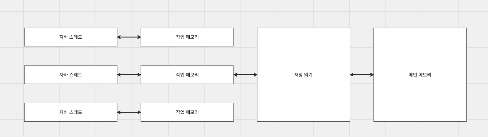

# [JVM] Volatile, Synchronize

## 자바 메모리 모델

---

하드웨어 수준에서 CPU는 RAM에서 데이터를 읽고, 쓰기 작업을 수행해야 하지만 이 둘 간의 속도 차이는 매우 크다. 이를 위해 CPU는 프로세서별로 캐시 레이어를 두고, 속도 문제를 해결하고 공유 변수를 관리하는 메모리와의 동기화 문제를 해결하기 위해 일련의 프로토콜을 사용한다.

### 메인 메모리와 작업 메모리

자바에서의 작업 메모리는 하드웨어의 캐시, 자바 스레드는 프로세서, RAM은 메인 메모리로 생각할 수 있다. 자바 메모리 모델은 멀티 스레드 환경에서 공유 변수에 접근하는 규칙을 정하는 것이 목적이다.

- 자바 스레드: 작업의 주체

- 메인 메모리: 모든 스레드가 접근 가능한 공간

- 메인 메모리 변수: 모든 변수는 메인 메모리에서 관리

- 작업 메모리: 스레드가 사용하는 독립적인 작업 공간

- 작업 메모리 변수: 작업 메모리에서 사용하는 변수는 메인 메모리에서의 변수의 복사본

- 저장 읽기: 스레드는 메인 메모리에 직접 접근이 불가하고, 각 작업 메모리에 스레드가 상호 접근 불가하며 저장 읽기를 통해 메인 메모리에 동기화

각 요소별 특징을 요약하면, 자바 스레드는 메인 메모리에서 변수를 복사하고 개인 작업 메모리에서 쓰기 작업을 수행한다. 단, 복사본에 대한 변경일 뿐이지 모든 스레드가 공유하는 메모리의 변수가 업데이트된 것이 아니다. 따라서 저장 읽기 작업을 통해 복사본을 메인 메모리에 동기화시켜주어야 다른 스레드가 동일한 값을 가진 변수를 참조할 수 있다.

### 메모리 간 상호작용

- 잠금: 메인 메모리에 존재하는 변수를 특정 스레드만 사용할 수 있도록 잠근다.

- 잠금 해제: 잠긴 변수를 해제하여 다른 스레드가 접근할 수 있도록 한다.

**- 읽기: 메인 메모리의 변수값을 특정 스레드의 작업 메모리로 전송한다.**

**- 적재: 작업 메모리의 변수에 읽기한 값을 복사한다.**

- 사용: 변수값을 실행 엔진으로 전달하여 바이트코드 명령어를 만날 때마다 실행한다.

**- 저장: 작업 메모리의 변수값을 메인 메모리로 전송한다.**

**- 쓰기: 작업 메모리에서 얻어온 값을 메인 메모리의 변수에 업데이트한다.**

이 상호작용 과정을 통해서 작업 메모리에서의 변수값을 동기화할 수 있다. 하지만 매번 작업 메모리의 변수가 업데이트 된다고 매번 동기화를 진행하면 성능적으로 떨어질 수 밖에 없다. 따라서 필요한 순간에만 동기화가 진행되는데, 이 순간은 변수를 사용할 때이다. 즉, 실시간으로 매번 쫓아다닐 필욘 없고 실제 사용되는 순간에 동기화(Lazy Evaluation)를 진행한다.

## Volatile

---

앞서 자바 스레드는 자신의 작업 메모리에서 변수를 업데이트하고, 메인 메모리에 동기화하는 과정을 가져갔다. 이 과정이 있어야 다른 스레드에서 동일 변수에 대해 같은 값을 보장받을 수 있기 때문이다.

volatile은 작업 메모리에서의 과정을 건너뛰고, 바로 메인 메모리에 값을 업데이트하는 키워드이다. 메인 메모리에 즉시 업데이트가 됨에 따라 다른 스레드는 변수를 가시성있게 사용할 수 있다.

### 캐시 무효화

캐시 무효화는 작업 메모리를 건너뛰고, 메인 메모리에 변수를 저장하고 읽는 것을 의미한다. 모든 스레드가 변수를 투명하게 볼 수 있는데 이를 가시성을 보장한다고한다. 쓰기 시 즉시 메인 메모리에 기록하고, 읽기 시 작업 메모리를 참조하지 않고 메인 메모리에서 최신의 값을 가져오게 한다. 즉, 캐시를 사용하지 않음을 의미하며 공유 자원만 참조하게 된다.

공유 자원을 참조한다고 해서 원자성이 보장되지는 않는다. 자바의 산술 연산자(바이트 코드 명령어)는 원자성을 보장해주지 않기 때문이다. 그래서 실제 Counter 예제를 만들고 여러 스레드로 동시 접근하여 카운트를 올리면 최종 값은 원자적이지 않음을 볼 수 있다. 값을 읽고, 쓰는 건 공유 자원에 대한 접근이지만 중간 연산은 원자성을 보장해주지 않는다.

### 메모리 장벽

명령어 재정렬은 성능을 위해 아래 라인에 존재하는 명령어를 위로 옮겨서 실행하게 한다. 하지만 이 재정렬은 복수의 스레드가 동시 접근 시 특정 스레드가 변경한 값으로 다른 스레드에선 조기 실행하여 의도치 않은 문제를 발생시킬 수 있다.

이를 막기 위해 volatile은 해당 명령어가 앞 라인으로 가지 못하게 메모리 장벽의 기능을 한다. 이로 인해서 모든 스레드는 정해진 순서에 따라 코드를 똑같이 수행하여 동등한 결과를 얻을 수 있다.

## Synchronized

---

앞서 Volatile은 메인 메모리에서 변수를 관리함에 따라 가시성이 보장된 변수를 사용할 수 있었다. 이로 인해 어느 정도의 원자성은 보장되었지만, 바이트 코드 명령어가 원자성을 보장해주지 않는 경우에 대해선 사용하기가 어려웠다.

### 잠금과 잠금 해제

자바 메모리 모델에선 Volatile 경우와 같이 더 넓은 범위로 원자성을 보장해야 하는 경우를 위해 잠금과 잠금 해제 연산을 제공한다. 이 연산을 사용하기 위해선 synchronized 키워드를 사용할 수 있다. synchronized 키워드는 바이트 코드 명령어로 변환 시 monitorenter, monitorexit로 변환되며 이를 이용하여 동기화 블록을 구성한다.

synchronized 블록은 다른 스레드로의 접근을 차단하게 된다. 즉, 하나의 스레드만 블록에 접근하여 작업을 수행하게 되며, 이 블록이 해제되기 전 작업 메모리에서의 변수는 메인 메모리로 동기화된다. 그리고 그 다음 스레드는 메인 메모리로부터 값을 읽어와 작업을 수행하게 된다.

이로 인해 알 수 있는 건 synchronized는 원자성과 가시성을 보장해준다.

### 성능과 데드락

synchronized는 원자성과 가시성을 보장해주기에 동시성 문제를 해결해주는 좋은 해결책이라 생각할 수 있다. 하지만 한편으로는 한번에 하나의 스레드만 접근하고, 나머지 스레드는 대기 상태에 빠트리기 때문에 성능 면에서 현저히 떨어질 수 있다. 그리고 서로 다른 스레드가 서로의 monitorenter를 획득하려 하지만, monitorexit가 안되는 상황이라면 데드락에 빠질 수 있다.
