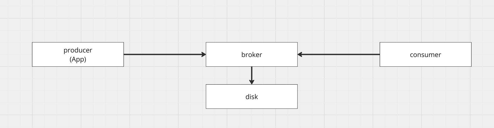
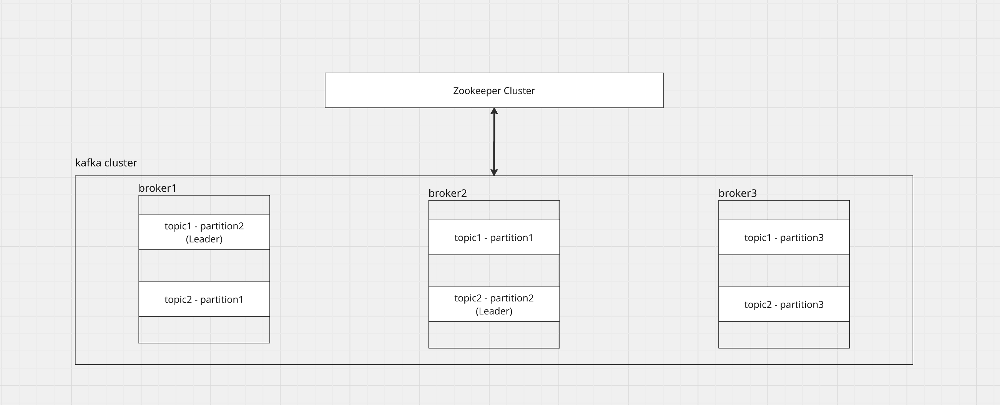

# [Kafka] 카프카 브로커의 역할, 동작 방식

---
### 무엇을 배웠는가?
* 카프카 브로커 구성에 대해서 배웁니다.
* 카프카 브로커와 클러스터 간의 관계, 주키퍼에 대해서 배웁니다. 

---
### 왜 중요하고, 어떤 맥락인가?
카프카의 브로커는 단순 메시지 중개를 넘어, 데이터의 저장, 분산, 복제 그리고 고성능 전송을 책임지는 핵심 요소입니다.   
특히 제로 카피같은 내부 최적화를 이용하여 어떻게 애용량 데이터를 빠르고 안정적으로 처리할 수 있는지 파악할 수 있습니다.

---
### 상세 내용
#### 1. 카프카 브로커란?

프로듀서와 컨슈마 사이에서 메시지를 안정적으로 저장하고, 전달하는 역할을 하는 서버(컴포넌트)입니다.


#### 2. ooo

1. **ㅁㅁㅁ**:
2. **ㅇㅇㅇ**:

#### 3. ooo
* **ㅁㅁㅁ**
    * **ㅇㅇㅇ**

#### 4. ooo

> ㅁㅁㅁ

#### 예시
```sql

```

```mermaid

```

### 요약