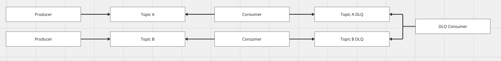

# [카프카] 컨슈머 재시도

## 컨슈머 재시도

컨슈머 재시도는 메시지 소비 후 오류 발생 시 회복하는 방법입니다. "메시지를 소비하면, 어떤 경우엔 offset에 커밋을 하여 실패 메시지를 건너뛸수도, 소비 자체를 못하고 일정 시간 후 다시 메시지를 소비할 수도 있다"는 특징이 있습니다.

메시지 유실을 방지하고 실패한 메시지를 재처리하기 위해 자동 또는 수동 재시도를 활용합니다.

## 재처리 가능성

### 외부 시스템 문제
외부 API 통신 실패 시 외부 시스템 복구 후 재처리 가능합니다.

### 처리불가한 데이터
유효성 검증 실패 또는 DB 저장 실패 데이터로, 데이터 가공 후 재처리가 필요합니다.

### 스키마 불일치
"컨슈머가 메시지를 역직렬화하면서 실패하는 문제"로, 스키마 버전 맞춤 시 자동 회복됩니다.

### 순서 위반
이전 상태값과 현재 상태값이 논리적으로 불일치하는 경우입니다.

### 리밸런싱
파티션 재할당 시 메시지 중복 또는 유실이 발생할 수 있습니다.

## 재시도 전략


### 재시도
지정된 횟수만큼 비즈니스 로직을 재시도하는 방식입니다.

### 알림
메일, 카톡 등 알림을 동기/비동기로 발송합니다.

### DLQ/DLT 격리
공통 DLQ 또는 토픽별 DLQ 중 선택하여 실패 메시지를 격리합니다.

### Outbox 패턴
별도 테이블에 실패 메시지를 저장하고, 스케줄러 또는 API로 재처리합니다.

## Spring Kafka 재처리 컴포넌트

### ErrorHandler (동기 재시도)


```kotlin
@Configuration
class KafkaErrorHandlerConfig {
    @Bean
    fun errorHandler(kafkaTemplate: KafkaTemplate<String, String>): DefaultErrorHandler {
        val recoverer = DeadLetterPublishingRecoverer(kafkaTemplate) { record, _ ->
            TopicPartition("${record.topic()}.DLT", record.partition())
        }
        val backOff = FixedBackOff(1000L, 3L)
        return DefaultErrorHandler(recoverer, backOff).apply {
            addNotRetryableExceptions(
                DeserializationException::class.java,
                IllegalArgumentException::class.java
            )
        }
    }
}

@Component
class OrderConsumer(private val externalApi: ExternalApi) {
    @KafkaListener(topics = ["order-topic"], groupId = "order-group")
    fun consume(record: ConsumerRecord<String, String>) {
        val order = parseOrder(record.value())
        externalApi.process(order)
    }
}
```

### RetryableTopic (비동기 재시도)


```kotlin
@Component
class PaymentConsumer(
    private val paymentGateway: PaymentGateway,
    private val alertService: AlertService
) {
    @RetryableTopic(
        attempts = "4",
        backoff = Backoff(delay = 1000, multiplier = 2.0, maxDelay = 10000),
        topicSuffixingStrategy = TopicSuffixingStrategy.SUFFIX_WITH_INDEX_VALUE,
        dltStrategy = DltStrategy.FAIL_ON_ERROR,
        exclude = [DeserializationException::class, IllegalArgumentException::class]
    )
    @KafkaListener(topics = ["payment-topic"], groupId = "payment-group")
    fun consume(record: ConsumerRecord<String, String>) {
        val payment = parsePayment(record.value())
        paymentGateway.process(payment)
    }

    @DltHandler
    fun handleDlt(record: ConsumerRecord<String, String>) {
        log.error("DLT 도착: topic=${record.topic()}, key=${record.key()}")
        alertService.notify("payment 처리 최종 실패: ${record.key()}")
    }
}
```

## 재시도 전략 예제

### 1. ErrorHandler - 동기 재시도

```kotlin
@Configuration
class PaymentConsumerConfig(
    private val objectMapper: ObjectMapper,
    private val paymentRetryListener: PaymentRetryListener
) {
    @Bean
    fun paymentKafkaListenerContainerFactory(
        kafkaTemplate: KafkaTemplate<String, Any>
    ): ConcurrentKafkaListenerContainerFactory<String, String> {
        val recoverer = DeadLetterPublishingRecoverer(kafkaTemplate)
        val backOff = ExponentialBackOff().apply {
            initialInterval = 1000L
            multiplier = 2.0
            maxInterval = 10000L
            maxElapsedTime = 30000L
        }
        val errorHandler = DefaultErrorHandler(recoverer, backOff).apply {
            addNotRetryableExceptions(IllegalArgumentException::class.java)
        }
        return ConcurrentKafkaListenerContainerFactory<String, String>().apply {
            setConsumerFactory(paymentConsumerFactory())
            setCommonErrorHandler(errorHandler)
        }
    }
}

@Component
class PaymentEventListener(
    private val paymentProcessingService: PaymentProcessingService,
    private val objectMapper: ObjectMapper
) {
    @KafkaListener(
        topics = ["payment-topic"],
        groupId = "payment-consumer-group",
        containerFactory = "paymentKafkaListenerContainerFactory"
    )
    fun listen(record: ConsumerRecord<String, String>) {
        val payment = objectMapper.readValue(record.value(), PaymentEvent::class.java)
        paymentProcessingService.processPayment(payment)
    }
}
```

### 2. RetryableTopic - 비동기 재시도

```kotlin
@Component
class OrderEventListener(
    private val orderProcessingService: OrderProcessingService,
    private val outboxService: OutboxService,
    private val notificationService: NotificationService,
    private val objectMapper: ObjectMapper
) {
    @RetryableTopic(
        attempts = "4",
        backoff = Backoff(delay = 1000, multiplier = 2.0, maxDelay = 10000),
        topicSuffixingStrategy = TopicSuffixingStrategy.SUFFIX_WITH_INDEX_VALUE,
        dltTopicSuffix = "-dlt",
        include = [RuntimeException::class],
        exclude = [IllegalArgumentException::class]
    )
    @KafkaListener(
        topics = ["order-topic"],
        groupId = "order-consumer-group",
        containerFactory = "orderKafkaListenerContainerFactory"
    )
    fun listen(record: ConsumerRecord<String, String>) {
        val order = objectMapper.readValue(record.value(), OrderEvent::class.java)
        orderProcessingService.processOrder(order)
    }

    @DltHandler
    fun handleDlt(record: ConsumerRecord<String, String>) {
        val order = objectMapper.readValue(record.value(), OrderEvent::class.java)
        log.error("Order {} sent to DLT after all retries exhausted", order.id)
        outboxService.saveFailedMessage(record, RuntimeException("All retries exhausted"))
        notificationService.notifyFailure(record, RuntimeException("Order processing failed permanently"))
    }
}
```

### 3. Notification (알림)


```kotlin
@Service
class NotificationService(
    private val notificationRepository: NotificationRepository,
    private val webClient: WebClient,
    @Value("\${slack.host}")
    val slackHost: String,
) {
    @Transactional
    fun notifyFailure(record: ConsumerRecord<*, *>, ex: Exception) {
        val notification = Notification(
            topic = record.topic(),
            eventId = record.key()?.toString() ?: "unknown",
            level = NotificationLevel.ERROR,
            message = "Message processing failed after all retries: ${ex.message}",
            detail = "Topic: ${record.topic()}, Partition: ${record.partition()}, Offset: ${record.offset()}"
        )
        webClient.post()
            .uri(slackHost + "/send")
            .bodyToMono()
            .block()
    }
}

@RestController
@RequestMapping("/api/notifications")
class NotificationController(private val notificationQueryService: NotificationQueryService) {
    @GetMapping
    fun listUnacknowledged() = ResponseEntity.ok(notificationQueryService.getUnacknowledged())

    @GetMapping("/topic/{topic}")
    fun listByTopic(@PathVariable topic: String) = ResponseEntity.ok(notificationQueryService.getByTopic(topic))

    @PostMapping("/{id}/acknowledge")
    fun acknowledge(@PathVariable id: Long): ResponseEntity<Map<String, Any>> {
        notificationQueryService.acknowledge(id)
        return ResponseEntity.ok(mapOf("acknowledged" to true))
    }
}
```

### 4. Outbox 패턴




```kotlin
@Service
class OutboxService(private val failedMessageRepository: FailedMessageRepository) {
    @Transactional
    fun saveFailedMessage(record: ConsumerRecord<*, *>, ex: Exception) {
        val failedMessage = FailedMessage(
            topic = record.topic(),
            messageKey = record.key()?.toString(),
            payload = record.value()?.toString() ?: "",
            errorMessage = (ex.message ?: "Unknown error").take(1000),
            stackTrace = StringWriter().also { ex.printStackTrace(PrintWriter(it)) }.toString().take(4000),
            status = OutboxStatus.PENDING
        )
        failedMessageRepository.save(failedMessage)
    }
}

@Component
class OutboxRetryScheduler(
    private val failedMessageRepository: FailedMessageRepository,
    private val kafkaTemplate: KafkaTemplate<String, Any>
) {
    @Scheduled(fixedDelayString = "\${retry.scheduler.interval-ms:30000}")
    @Transactional
    fun retryFailedMessages() {
        val pending = failedMessageRepository.findByStatusAndRetryCountLessThan(
            OutboxStatus.PENDING, 5
        )
        if (pending.isEmpty()) return
        log.info("Found {} failed messages to retry", pending.size)

        pending.forEach { msg ->
            try {
                msg.status = OutboxStatus.RETRYING
                msg.retryCount++
                msg.lastRetriedAt = Instant.now()
                kafkaTemplate.send(msg.topic, msg.messageKey, msg.payload).get()
                msg.status = OutboxStatus.SUCCESS
                msg.resolvedAt = Instant.now()
            } catch (ex: Exception) {
                if (msg.retryCount >= msg.maxRetries) {
                    msg.status = OutboxStatus.EXHAUSTED
                } else {
                    msg.status = OutboxStatus.PENDING
                }
            }
            failedMessageRepository.save(msg)
        }
    }
}

@RestController
@RequestMapping("/api/retry")
class RetryController(private val manualRetryService: ManualRetryService) {
    @PostMapping("/{id}")
    fun retryMessage(@PathVariable id: Long): ResponseEntity<Map<String, Any>> {
        val result = manualRetryService.retryById(id)
        return ResponseEntity.ok(mapOf("id" to id, "status" to result))
    }

    @GetMapping("/failed")
    fun listFailed(@RequestParam(required = false) status: OutboxStatus?): ResponseEntity<Any> {
        return ResponseEntity.ok(manualRetryService.listFailed(status))
    }

    @PostMapping("/retry-all")
    fun retryAll(): ResponseEntity<Map<String, Any>> {
        val count = manualRetryService.retryAllPending()
        return ResponseEntity.ok(mapOf("retriedCount" to count))
    }
}
```

## 전략 비교표

| 전략 | 방식 | 복잡도 | 적합 케이스 |
|------|------|--------|-----------|
| ErrorHandler | 동기 재시도 | 낮음 | 순서 중요 |
| @RetryableTopic | 비동기 재시도 토픽 | 중간 | 처리량 중요 |
| Notification | 메일, 메신저 전송 | 낮음 | 실패 모니터링 |
| Outbox | DB 저장 + 스케줄러 + API | 높음 | 외부 시스템 장애 회복 |
