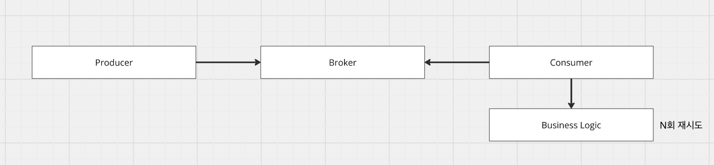
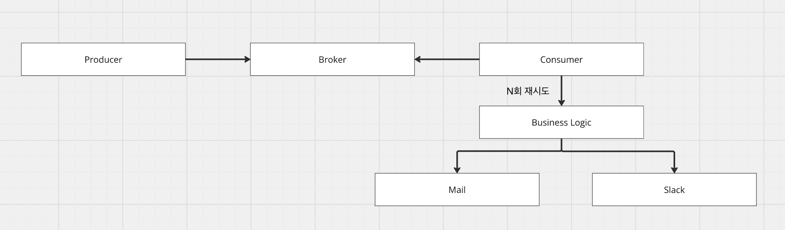
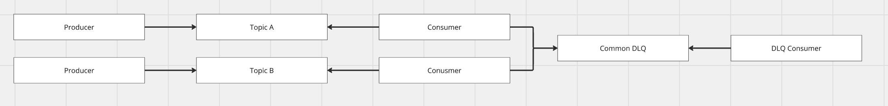
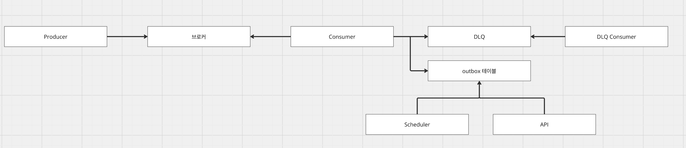

# [카프카] 컨슈머 재시도

## 컨슈머 재시도

---

컨슈머 재시도는 메시지를 소비 후 오류가 발생했을 때 어떻게 재시도를 하여 회복을 할 것 인지에 대한 방법이다. 컨슈머가 메시지를 소비하면, 어떤 경우엔 offset에 커밋을 하여 실패 메시지를 건너뛸수도, 소비 자체를 못하고 일정 시간 후 다시 메시지를 소비할 수도 있다. 즉, 경우에 따라 자동으로 회복 탄력성을 가질 수 있겠으나 회복 탄력성을 가지지 못하는 경우 수동으로 재시도를 해주어 메시지를 재처리해줄 수 있다.

이런 방법들을 통해 메시지 유실을 막고, 실패한 메시지들을 재처리하게 된다.

## 재처리 가능성

---

그렇다면 메시지를 컨슘하면서 문제가 생기는 경우가 어떤 경우에 생기는지, 그리고 어떤 사례들이 빠르게 재처리가 가능할지 혹은 메시지를 분석해서 가공 후 재처리가 필요할지 등도 알아볼 필요가 있다.

메시지를 컨슘하면서 생기는 문제는 바로 재처리가 가능한지, 메시지를 분석 후 별도 처리를 해야하는지, 시스템 복구 후 자동 처리되는지 등 회복 탄력성의 정도에 따라 나눌 수 있다.

바로 재처리가 가능한 케이스는 외부 시스템 문제 혹은 네트워크 순단 등으로 인해 생기는 문제이다. 때문에 일정 시간 혹은 일정 횟수를 두고, 재처리를 하면 대부분 회복이 된다. 그리고 시스템 복구 후 자동 처리는 애플리케이션에 문제가 생겨 재구동되더라도 최신 offset부터 다시 읽어 자동 처리하는 방법이다. 마지막으로 메시지 분석 후 별도 처리는 관리자가 수동으로 데이터를 가공하던지, 시스템을 변경해야하는 작업이 수반되므로 회복 탄력성이 상대적으로 떨어진다.

#### 외부 시스템 문제

컨슈머 애플리케이션에서 메시지를 컨슘 후 외부 시스템과의 통신 과정에서 오류가 발생하는 문제이다. 대표적으로 외부 시스템에 문제가 생겨서 요청을 받아들일 수 없는 상황이 있고, 외부 시스템에서 처리가 불가한 데이터일 경우이다. 전자의 경우 외부 시스템이 복구되면, 메시지 재처리가 가능하지만 후자의 경우 메시지를 분석 후 가공하거나 외부 시스템에서 데이터를 허용 가능하게 바꾸어야 한다.

#### 처리불가한 데이터

내부 시스템에서 처리 불가한 데이터이다. 주로 유효성 검증에 실패하거나 DB와 애플리케이션의 검증 수준이 달라 DB에 저장이 실패하는 문제이다. 처리가 불가한 데이터이기 때문에 메시지를 분석 후 가공하거나 시스템에서 데이터를 허용 가능하게 바꾸어야 한다.

#### 스키마 불일치

프로듀서와 컨슈머 간의 스키마가 불일치하며 발생하는 문제이다. 컨슈머가 메시지를 역직렬화하면서 실패하는 문제이기 때문에 수동 커밋이든, 자동 커밋이든 관계없이 현재 읽은 메시지에 대한 offset 커밋은 발생하지 않아 스키마 버전만 맞추어진다면 자동으로 회복할 수 있다.

#### 순서 위반

이전에 처리한 동일 데이터와 현재 처리한 동일 데이터 간의 상태값이 논리적으로 문제가 생길 때 발생한다. 가령 A 데이터의 이전 상태값이 삭제였는데, 현재 소비한 A가 생성 상태라던지 이런 논리적으로 상태값이 불일치할 때 생기는 문제이다. 순서가 바뀐 상태로 전달되었으므로 논리적인 최종 상태에 맞출 것인지 다시 리플레이를 할 것인지 등에 대한 판단이 필요하다.

#### 리밸런싱

컨슈머 그룹 내에서 파티션 재할당이 발생하면서 생기는 문제이다. 리밸런싱이 발생하면 기존 컨슈머가 처리 중이던 메시지의 offset이 아직 커밋되지 않은 상태에서 해당 파티션이 다른 컨슈머에게 할당될 수 있다. 이 경우 새로운 컨슈머가 마지막 커밋된 offset부터 다시 읽기 때문에 메시지 중복 처리가 발생할 수 있다. 반대로 자동 커밋 환경에서는 처리가 완료되지 않았음에도 offset이 이미 커밋되어 메시지 유실이 발생할 수도 있다. 리밸런싱 자체는 컨슈머 추가/제거, max.poll.interval.ms 초과, 세션 타임아웃 등으로 발생하며, 시스템이 안정화되면 자동으로 회복된다. 다만 리밸런싱 빈도가 높다면 max.poll.records나 처리 로직의 소요 시간을 조정하거나, Cooperative Sticky Assignor 등을 활용하여 리밸런싱 영향을 최소화할 필요가 있다.

## 재시도 전략

---

재시도에서 중요한 것은 순수하게 데이터의 유효성만을 검증하고 CUD를 진행하는 것인가이다. 가령 컨슈머 애플리케이션 로직에 메일, 카톡 알림 등에 대한 로직이 동기적으로 포함되어있고, 실패 지점이 이후라면 N회만큼 유저에게 알림을 발생하는 문제가 발생한다. 하여 컨슈머의 로직이 논리적으로 실패 후 재처리를 해도 되는 것인지 혹은 로직을 분리할 필요는 없는지 등을 따져보아야 한다.

#### 재시도



메시지를 소비 후 실패할 경우 지정해둔 횟수에 따라 비즈니스 로직을 재시도하는 케이스이다. 따로 DLQ / DLT를 두지않고, 애플리케이션 수준에서 재시도할 수 있는 방법이다.

#### 알림



메시지를 소비 후 알림을 발생시키는 전략이다. 재처리 로직을 후 알림을 동기적으로 실행하든, 비동기 스레드로 실행하든 별도 DLQ / DLT를 처리하는 방법이 있다. 그리고 별도 DLQ / DLT 를 두어 메시지를 발행하고, 컨슈머 그룹을 별도로 두어 관심사 별로 분리하는 방법도 존재한다. (알림 컨슈머 그룹, 재처리 컨슈머 그룹 등)

#### DLQ / DLT 격리 및 1 : 1 대응 vs 1 : N 대응



오류가 발생했을 때 토픽별로 DLQ를 둘 것인지, 공통의 DLQ를 둘 것인지에 대한 방법이다. 각각의 장단을 따져보면 다음과 같다.

- 공통 DLQ

각 토픽 별 네이밍, 페이로드, 헤더 등 천차만별이기 때문에 특정한 스키마를 두고 DLQ를 발행할 수 없다. 그에 따라 소비처에선 어떻게 스키마를 역직렬화할 것인지를 검토해야한다. 그리고 DLQ에 메시지가 많이 쌓이게 되면 메시지 Lag이 발생하므로 원하는 시점에 재처리, 알람 등 필요한 작업을 수행할 수 없다. 하지만 추상화가 잘 된다면 불필요하게 토픽 별 대응 큐를 만들 필요가 없고, 관리 포인트를 1개로 줄일 수 있다.

- 토픽 별 DLQ

토픽 별로 DLQ를 두기 때문에 스키마를 특정하여 애플리케이션에서 역직렬화할 수 있다. 그리고 메시지 Lag이 공통 DLQ보단 현저히 줄어들 것이기 때문에 원하는 시점에 자동으로 오류 대응이 가능하다. 하지만 관리 포인트가 늘어나고, 토픽을 신설한다면 그에 대한 쌍으로 토픽을 신설해야한다는 부담이 있다.

#### Outbox 패턴 + 스케줄러 or 재처리 API



별도의 outbox 테이블을 두고, 스케줄러와 수동 API를 활용하는 방법이다. 메시지를 소비 후 1. 실패 / 성공 여부 관계없이 outbox 테이블에 토픽, 페이로드, 헤더 등의 값을 저장하거나 2. 실패할 경우에만 outbox 테이블에 적재할 수 있다. 1번의 경우 메시지 히스토리, 리플레이 등에 활용할 수 있고, 2번의 경우 우리가 필요한 메시지만 확인하여 스케줄러든, API든 재처리를 할 수 있다는 장점이 있다.

## Spring Kafka에서 재처리 컴포넌트

---

주로 Spring Kafka를 사용하므로 라이브러리에서 제공하는 재처리 컴포넌트에 대해 알아보도록 한다.

#### ErrorHandler

```kotlin
@Configuration
class KafkaErrorHandlerConfig {

    @Bean
    fun errorHandler(kafkaTemplate: KafkaTemplate<String, String>): DefaultErrorHandler {
        val recoverer = DeadLetterPublishingRecoverer(kafkaTemplate) { record, _ ->
            TopicPartition("${record.topic()}.DLT", record.partition())
        }

        val backOff = FixedBackOff(1000L, 3L)

        return DefaultErrorHandler(recoverer, backOff).apply {
            addNotRetryableExceptions(
                DeserializationException::class.java,
                IllegalArgumentException::class.java
            )
        }
    }
}

@Component
class OrderConsumer(
    private val externalApi: ExternalApi
) {
    @KafkaListener(topics = ["order-topic"], groupId = "order-group")
    fun consume(record: ConsumerRecord<String, String>) {
        val order = parseOrder(record.value())
        externalApi.process(order)
    }
}
```

메시지 수신 -> 실패 -> 1초 후 재시도(3회)의 흐름을 가지는 코드이다. 애플리케이션 코드만으로 재처리를 할 수 있으며, FixedBackOff를 이용하여 어떤 주기로 재시도를 할 것인지 그리고 DeadLetter를 발행해야한다면, DeadLetterPublisingRecoverer를 이용하여 메시지를 재처리하고, DLQ에 격리할 수 있다.

#### RetryableTopic

```kotlin
@Component
class PaymentConsumer(
    private val paymentGateway: PaymentGateway,
    private val alertService: AlertService
) {
    @RetryableTopic(
        attempts = "4",
        backoff = Backoff(
            delay = 1000,
            multiplier = 2.0,
            maxDelay = 10000
        ),
        topicSuffixingStrategy = TopicSuffixingStrategy.SUFFIX_WITH_INDEX_VALUE,
        dltStrategy = DltStrategy.FAIL_ON_ERROR,
        exclude = [
            DeserializationException::class,
            IllegalArgumentException::class
        ]
    )
    @KafkaListener(topics = ["payment-topic"], groupId = "payment-group")
    fun consume(record: ConsumerRecord<String, String>) {
        val payment = parsePayment(record.value())
        paymentGateway.process(payment)
    }

    @DltHandler
    fun handleDlt(record: ConsumerRecord<String, String>) {
        log.error("DLT 도착: topic=${record.topic()}, key=${record.key()}, value=${record.value()}")
        alertService.notify("payment 처리 최종 실패: ${record.key()}")
    }
}
```

비동기로 재시도하는 방식이다. 메시지가 실패할 경우 topicSuffixingStrategy패턴에 지정된 재시도 토픽으로 메시지를 발행하여 재처리한다. 최종적으로 재시도에 실패한 메시지는 Dlt로 발행하며(재시도 토픽과 별도) 지정된 DltHandler가 최종 실패를 처리한다.

## 재시도 전략 예제

---

#### ErrorHandler - 동기 재시도 처리

1. Consumer 설정

```kotlin
@Configuration
class PaymentConsumerConfig(
    private val objectMapper: ObjectMapper,
    private val paymentRetryListener: PaymentRetryListener
) {
    @Bean
    fun paymentKafkaListenerContainerFactory(
        kafkaTemplate: KafkaTemplate<String, Any>
    ): ConcurrentKafkaListenerContainerFactory<String, String> {
        // DLT로 실패 메시지를 전송하는 Recoverer
        val recoverer = DeadLetterPublishingRecoverer(kafkaTemplate)

        // 1초 시작, 2배씩 증가, 최대 10초, 총 30초
        val backOff = ExponentialBackOff().apply {
            initialInterval = 1000L
            multiplier = 2.0
            maxInterval = 10000L
            maxElapsedTime = 30000L
        }

        val errorHandler = DefaultErrorHandler(recoverer, backOff).apply {
            addNotRetryableExceptions(IllegalArgumentException::class.java) // 재시도 불필요 예외
        }

        return ConcurrentKafkaListenerContainerFactory<String, String>().apply {
            setConsumerFactory(paymentConsumerFactory())
            setCommonErrorHandler(errorHandler)
        }
    }
}
```

2. Listener

```kotlin
@Component
class PaymentEventListener(
    private val paymentProcessingService: PaymentProcessingService,
    private val objectMapper: ObjectMapper
) {
    @KafkaListener(
        topics = ["payment-topic"],
        groupId = "payment-consumer-group",
        containerFactory = "paymentKafkaListenerContainerFactory"
    )
    fun listen(record: ConsumerRecord<String, String>) {
        val payment = objectMapper.readValue(record.value(), PaymentEvent::class.java)
        paymentProcessingService.processPayment(payment)
    }
}
```

- `DefaultErrorHandler`는 블로킹 방식이므로, 재시도 중 해당 파티션의 다른 메시지 처리가 지연된다.

- `addNotRetryableExceptions()`로 재시도가 무의미한 예외를 지정할 수 있다.

#### RetryableTopic - 비동기 재시도

```less
order-topic → OrderEventListener → 실패 발생
    → order-topic-retry-0 (1초 후 재시도)
    → order-topic-retry-1 (2초 후 재시도)
    → order-topic-retry-2 (4초 후 재시도)
    → 모든 재시도 실패 → order-topic-dlt (@DltHandler 처리)
    → Outbox 저장 + 알림 발송
```

1. Listener + @RetryableTopic

```kotlin
@Component
class OrderEventListener(
    private val orderProcessingService: OrderProcessingService,
    private val outboxService: OutboxService,
    private val notificationService: NotificationService,
    private val objectMapper: ObjectMapper
) {
    @RetryableTopic(
        attempts = "4",                       // 원본 1회 + 재시도 3회
        backoff = Backoff(
            delay = 1000,                     // 초기 지연 1초
            multiplier = 2.0,                 // 2배씩 증가
            maxDelay = 10000                  // 최대 10초
        ),
        topicSuffixingStrategy = TopicSuffixingStrategy.SUFFIX_WITH_INDEX_VALUE,
        dltTopicSuffix = "-dlt",
        include = [RuntimeException::class],
        exclude = [IllegalArgumentException::class]
    )
    @KafkaListener(
        topics = ["order-topic"],
        groupId = "order-consumer-group",
        containerFactory = "orderKafkaListenerContainerFactory"
    )
    fun listen(record: ConsumerRecord<String, String>) {
        val order = objectMapper.readValue(record.value(), OrderEvent::class.java)
        orderProcessingService.processOrder(order)
    }

    @DltHandler
    fun handleDlt(record: ConsumerRecord<String, String>) {
        val order = objectMapper.readValue(record.value(), OrderEvent::class.java)
        log.error("Order {} sent to DLT after all retries exhausted", order.id)

        // Outbox에 저장하여 스케줄러가 재처리할 수 있도록 함
        outboxService.saveFailedMessage(record, RuntimeException("All retries exhausted"))
        // 알림 발송
        notificationService.notifyFailure(record, RuntimeException("Order processing failed permanently"))
    }
}
```

- `@RetryableTopic`은 논블로킹이므로, 재시도 중에도 원본 토픽의 다른 메시지를 계속 처리한다.

- Spring Kafka가 자동으로 `order-topic-retry-0`, `order-topic-retry-1`, `order-topic-retry-2`, `order-topic-dlt` 토픽을 생성한다.

- `@DltHandler`에서 최종 실패 처리 로직을 구현한다.

- `include`/`exclude`로 재시도 대상 예외를 세밀하게 제어한다.

#### Notification (알림)

1. 알림 저장 (Consumer 내부)

```kotlin
@Service
class NotificationService(
    private val notificationRepository: NotificationRepository,
    private val webClient: WebClient,
    @Value("\${slack.host}")
    val slackHost: String,
) {
    @Transactional
    fun notifyFailure(record: ConsumerRecord<*, *>, ex: Exception) {
        val notification = Notification(
            topic = record.topic(),
            eventId = record.key()?.toString() ?: "unknown",
            level = NotificationLevel.ERROR,
            message = "Message processing failed after all retries: ${ex.message}",
            detail = "Topic: ${record.topic()}, Partition: ${record.partition()}, Offset: ${record.offset()}"
        )
		
		webClient.post()
            .uri(slackHost + "/send")
            .bodyToMono()
            .block()
    }
}
```

2. 알림 조회 API

```less
@RestController
@RequestMapping("/api/notifications")
class NotificationController(
    private val notificationQueryService: NotificationQueryService
) {
    @GetMapping
    fun listUnacknowledged() = ResponseEntity.ok(notificationQueryService.getUnacknowledged())

    @GetMapping("/topic/{topic}")
    fun listByTopic(@PathVariable topic: String) = ResponseEntity.ok(notificationQueryService.getByTopic(topic))

    @PostMapping("/{id}/acknowledge")
    fun acknowledge(@PathVariable id: Long): ResponseEntity<Map<String, Any>> {
        notificationQueryService.acknowledge(id)
        return ResponseEntity.ok(mapOf("acknowledged" to true))
    }
}
```

#### Outbox 패턴

1. Outbox 저장 (Consumer 내부)

```kotlin
@Service
class OutboxService(
    private val failedMessageRepository: FailedMessageRepository
) {
    @Transactional
    fun saveFailedMessage(record: ConsumerRecord<*, *>, ex: Exception) {
        val failedMessage = FailedMessage(
            topic = record.topic(),
            messageKey = record.key()?.toString(),
            payload = record.value()?.toString() ?: "",
            errorMessage = (ex.message ?: "Unknown error").take(1000),
            stackTrace = StringWriter().also { ex.printStackTrace(PrintWriter(it)) }.toString().take(4000),
            status = OutboxStatus.PENDING
        )
        failedMessageRepository.save(failedMessage)
    }
}
```

2. 스케줄러 - 주기적 재처리

```kotlin
@Component
class OutboxRetryScheduler(
    private val failedMessageRepository: FailedMessageRepository,
    private val kafkaTemplate: KafkaTemplate<String, Any>
) {
    @Scheduled(fixedDelayString = "\${retry.scheduler.interval-ms:30000}")
    @Transactional
    fun retryFailedMessages() {
        val pending = failedMessageRepository.findByStatusAndRetryCountLessThan(
            OutboxStatus.PENDING, 5
        )
        if (pending.isEmpty()) return

        log.info("Found {} failed messages to retry", pending.size)

        pending.forEach { msg ->
            try {
                msg.status = OutboxStatus.RETRYING
                msg.retryCount++
                msg.lastRetriedAt = Instant.now()

                kafkaTemplate.send(msg.topic, msg.messageKey, msg.payload).get()

                msg.status = OutboxStatus.SUCCESS
                msg.resolvedAt = Instant.now()
            } catch (ex: Exception) {
                if (msg.retryCount >= msg.maxRetries) {
                    msg.status = OutboxStatus.EXHAUSTED
                } else {
                    msg.status = OutboxStatus.PENDING
                }
            }
            failedMessageRepository.save(msg)
        }
    }
}
```

- `fixedDelay`를 사용하여 이전 실행이 끝난 후 30초 뒤에 다음 실행이 시작된다. (중복 실행 방지)

- `maxRetries` 초과 시 `EXHAUSTED` 상태로 변경하여 무한 재시도를 방지한다.

##### 3. 수동 재처리

```kotlin
@RestController
@RequestMapping("/api/retry")
class RetryController(
    private val manualRetryService: ManualRetryService
) {
    // 단건 재처리
    @PostMapping("/{id}")
    fun retryMessage(@PathVariable id: Long): ResponseEntity<Map<String, Any>> {
        val result = manualRetryService.retryById(id)
        return ResponseEntity.ok(mapOf("id" to id, "status" to result))
    }

    // 실패 메시지 목록 조회
    @GetMapping("/failed")
    fun listFailed(@RequestParam(required = false) status: OutboxStatus?): ResponseEntity<Any> {
        return ResponseEntity.ok(manualRetryService.listFailed(status))
    }

    // 전체 PENDING 메시지 일괄 재처리
    @PostMapping("/retry-all")
    fun retryAll(): ResponseEntity<Map<String, Any>> {
        val count = manualRetryService.retryAllPending()
        return ResponseEntity.ok(mapOf("retriedCount" to count))
    }
}
```

| 전략 | 방식 | 복잡도 | 적합 케이스 |
| --- | --- | --- | --- |
| ErrorHandler | 동기 재시도 | 낮음 | 순서 중요 |
| @RetryableTopic | 비동기 재시도 토픽 | 중간 | 처리량 중요 |
| Notifcation | 메일, 메신저 전송 | 낮음 | 실패 모니터링 |
| Outbox | DB 저장 + 스케줄러 + API | 높음 | 외부 시스템 장애 회복 |
