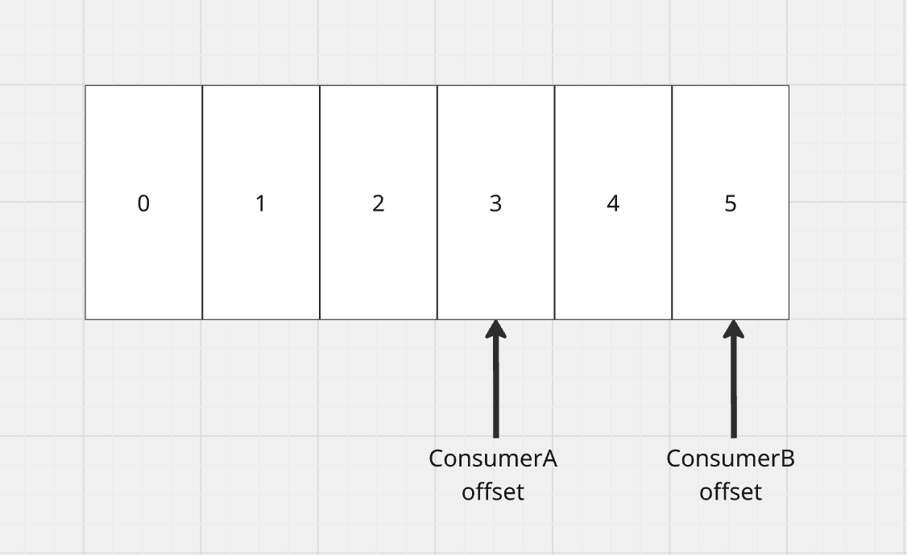
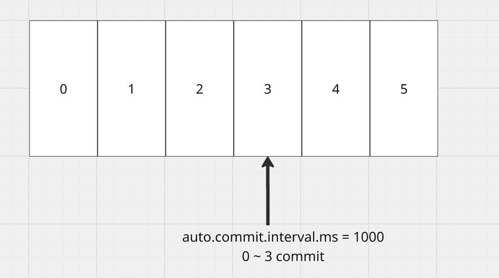
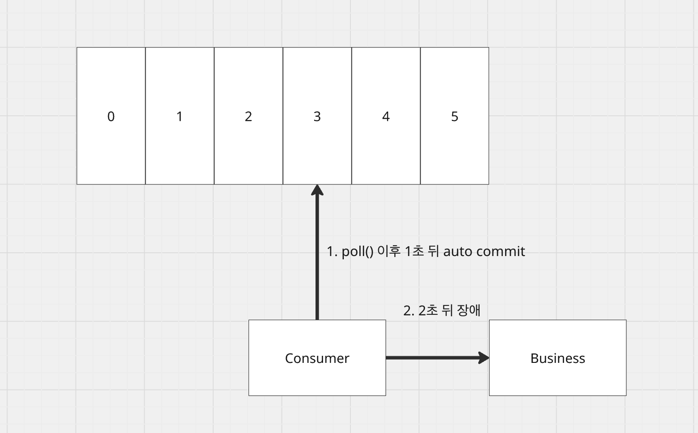
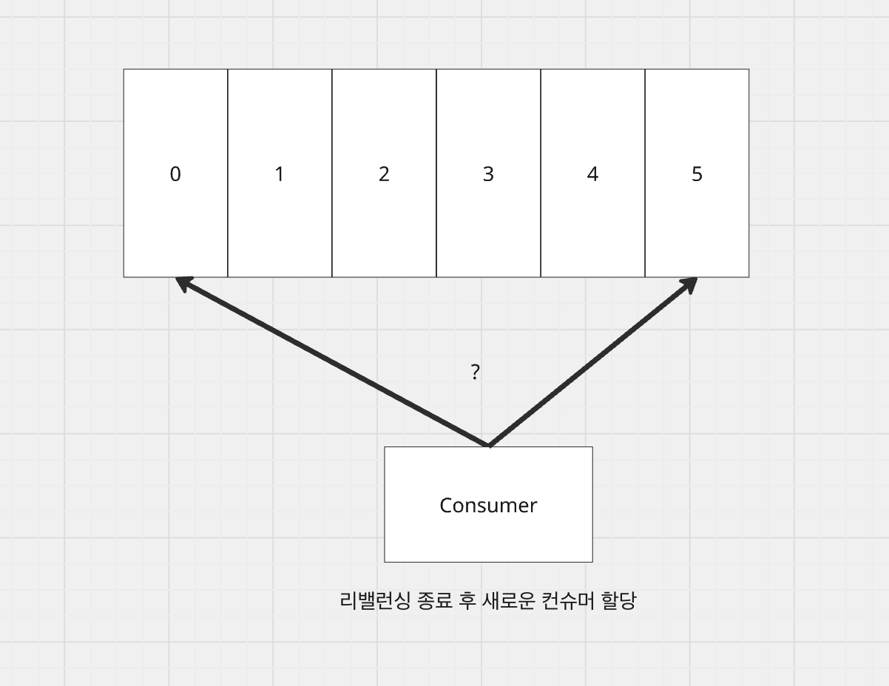
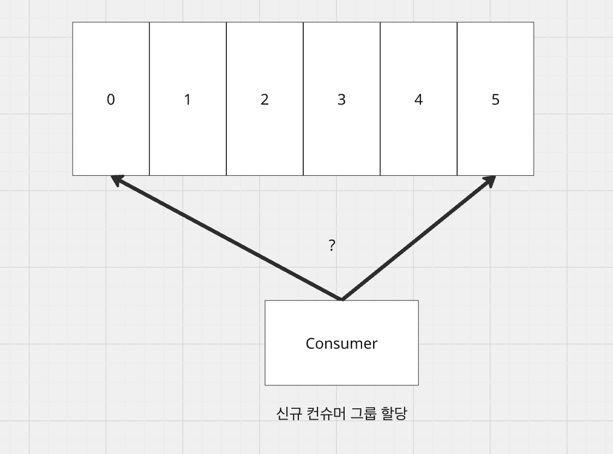
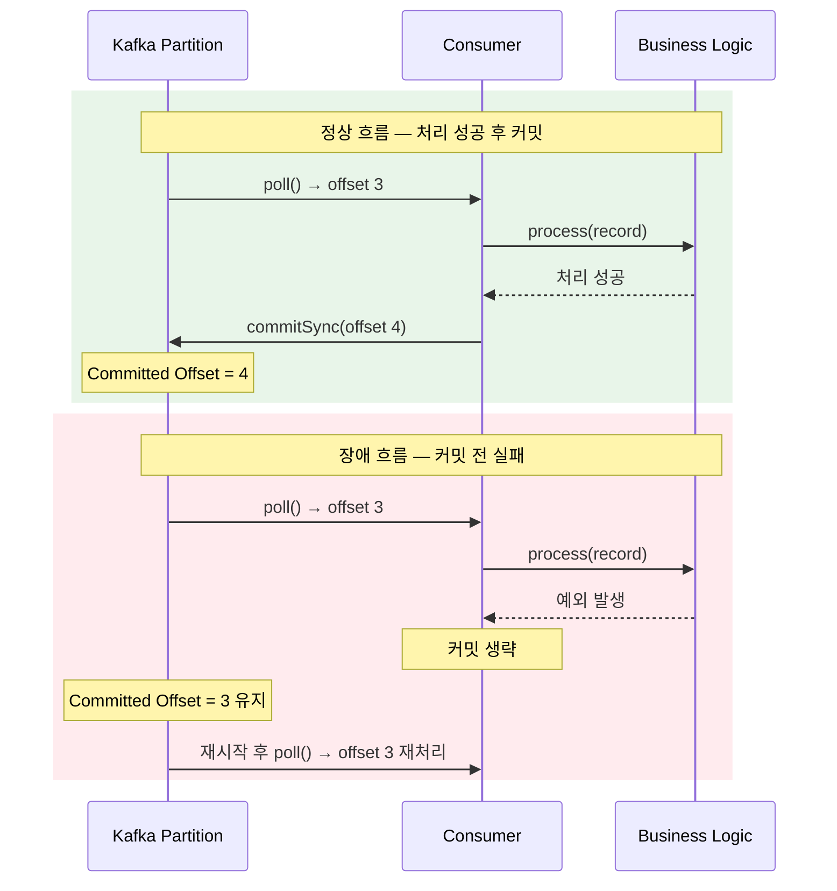
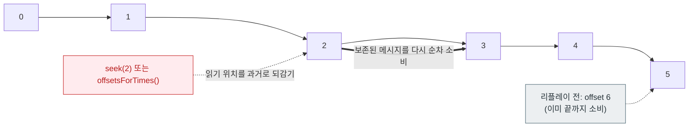

# 카프카 오프셋
## 카프카 오프셋이란?
카프카 메시지는 파티션에 저장되고, 번호가 붙는데 이를 오프셋이라 한다. 즉, 이 메시지가 어디에 위치해있는가를 기록하는 장치이다.

이를 통해 컨슈머가 메시지를 어디까지 읽었고, 다음엔 어디서부터 읽어야할지를 알 수 있다. 카프카의 메시지는 파티션 적재 시 끝에 append되는 방식이고, 컨슈머는 offset이 가리키는 곳부터 메시지를 순차적으로 읽어나간다.

오프셋을 이해할 때 자주 쓰이는 용어를 먼저 정리하면 다음과 같다.

* Current Offset: 컨슈머가 다음에 읽을(poll 할) 메시지의 위치
* Committed Offset: 컨슈머가 "여기까지 처리했다"고 브로커에 기록한 위치. 리밸런싱이나 재시작 후 이 지점부터 다시 읽는다.
* Log-End Offset: 파티션에 가장 마지막으로 적재된 메시지의 다음 위치. 즉, 프로듀서가 써넣은 가장 끝 지점이다.
* Consumer Lag: `Log-End Offset - Committed Offset`. 컨슈머가 프로듀서를 얼마나 따라잡지 못하고 있는지를 나타내는 지표로, 처리 지연을 판단하는 핵심 값이다.

## 파티션과 컨슈머
카프카의 파티션에는 여러 컨슈머 그룹이 붙어 메시지를 소비해나갈 수 있다. 그렇기 때문에 어떤 컨슈머가 어디까지 메시지를 읽었다 하더라도 이는 독립적으로 동작해야한다. 만약 오프셋이 글로벌하게 관리된다면, 여러 컨슈머 그룹이 이를 경쟁해서 읽음 표시를하고, 각 컨슈머들은 자신이 어느 메시지까지 읽었는지 알 수 없다.

그래서 파티션마다의 오프셋은 각 컨슈머 그룹 단위로 독립적으로 관리된다. 정확히는 `(group.id, topic, partition)` 조합을 키로 오프셋이 기록되며, 한 컨슈머 그룹 안에서는 하나의 파티션을 하나의 컨슈머만 소비하기 때문에 결과적으로 컨슈머 입장에서도 독립적으로 보인다. 이런 특징 때문에 컨슈머는 서로 간섭 없이 안정적으로 메시지를 읽어나갈 수 있다.

참고로 이 오프셋 기록은 과거에는 ZooKeeper에 저장됐지만, 현재는 `__consumer_offsets`라는 카프카 내부 토픽에 저장된다. 즉, 오프셋 커밋도 결국 하나의 메시지를 발행하는 것과 같다.



## commit, 오프셋 관리
그렇다면 컨슈머는 메시지를 어떻게 커밋을 하고, 오프셋을 어떻게 관리할까?
컨슈머는 커밋을 어떻게 하느냐로 오프셋을 관리할 수 있다. 자동 커밋, 수동 커밋 2가지 방식으로 나뉘며 상황에 따라 맞는 방식을 선택할 수 있다.

### 자동 커밋
컨슈머는 메시지를 자동으로 커밋할 수 있다. `enable.auto.commit` 옵션인데, 이를 true로 하면 `auto.commit.interval.ms`(기본값 5000ms) 주기로 메시지들을 커밋할 수 있다.

한 가지 주의할 점은, 자동 커밋이 별도의 백그라운드 타이머로 정확히 N초마다 도는 것이 아니라 `poll()`이 호출되는 시점에 "마지막 커밋 이후 interval이 지났는가"를 확인하고 커밋한다는 것이다. 그래서 poll 주기가 길면 커밋도 그만큼 늦어진다.



수동으로 커밋을 명시하지 않아도, 시스템이 알아서 관리해준다는 면에서 편하지만 다음과 같은 문제점이 존재한다.

**auto commit은 되었으나 애플리케이션 로직 장애 발생**



이 상황은 다음과 같다.
1. poll()로 offset 3의 메시지를 가져온다.
2. auto commit 옵션으로 인해 1초 뒤에 메시지가 커밋이 된다.
3. 비즈니스 로직이 수행되다가 2초 뒤에 장애가 발생한다.

이는 메시지를 읽었고, 처리했다고 마킹은 했지만 실제적으로 처리가 되지 않은 상황이다. 즉, 복구가 필요하며 메시지가 유실된 상황과 동일하다.

### 수동 커밋
수동 커밋은 메시지를 읽고, 비즈니스 로직이 완벽하게 수행된 지점에 직접 commit을 명시하는 방식이다. 옵션은 `enable.auto.commit = false`로 지정할 수 있다.

자동 커밋에 비해 어떤 상황에서 커밋을 할지 직접 지정해야 하므로 번거롭지만, 안전하게 메시지 읽었음을 마킹하는 방식이다.

즉, 비즈니스 로직에 대한 트랜잭션 관리만 잘 된다면 자동 커밋에 비해 안전하다.

수동 커밋은 다시 두 가지로 나뉜다.

* `commitSync()`: 브로커의 커밋 응답을 받을 때까지 블로킹한다. 실패 시 내부적으로 재시도하므로 안전하지만, 매 커밋마다 대기하므로 처리량이 떨어진다.
* `commitAsync()`: 응답을 기다리지 않고 다음 처리를 이어간다. 빠르지만 실패해도 재시도하지 않기 때문에(콜백으로 처리), 커밋 누락 가능성이 있다.

## 리밸런싱과 offset reset
### 리밸런싱
리밸런싱은 컨슈머들에게 새롭게 파티션을 할당하는 과정이다. 리밸런싱이 발생하는 이유는 다음과 같다.

* 새로운 컨슈머가 컨슈머 그룹에 추가
* 기존 컨슈머가 그룹에서 이탈
* 파티션 증설
* 컨슈머의 구독 토픽 변경
* 컨슈머의 하트비트를 일정 시간 내 못받을 경우 

컨슈머에 장애가 생겼거나 파티션과 컨슈머 간 관계를 조정할 필요가 있을 때 리밸런싱으로 이를 해결할 수 있다.

### auto.offset.reset
이 리밸런싱의 사유 중 특히 파티션이 증설이 되었을 떄, 새로운 컨슈머 그룹이 추가되었을 때를 주목할 필요가 있다.

#### 파티션 증설
파티션 증설의 경우 새로운 파티션이 생겼기 때문에 어떤 컨슈머들도 이 파티션에 대한 오프셋 커밋을 기록이 없다. 이 상황에서 리밸런싱이 발생하게 되고, 메시지가 계속해서 쌓일 경우 어떻게 될까?

리밸런싱이 완료가 된다면, 새로운 파티션에 컨슈머가 붙게 될 것이다. 하지만 이 컨슈머는 이 파티션에 대한 어떤 오프셋 기록도 없다.



#### 새로운 컨슈머 그룹 추가
그리고 새로운 컨슈머 그룹이 추가되어 파티션이 할당되었다고 가정하자. 이 경우에도 마찬가지로 컨슈머는 파티션에 대해 어떤 오프셋 기록도 없다.



#### auto.offset.reset 전략
`auto.offset.reset`은 위처럼 커밋된 오프셋이 없는 경우, 또는 커밋된 오프셋이 더 이상 유효하지 않은 경우(보관 기간이 지나 메시지가 삭제되어 커밋 위치가 파티션 범위를 벗어난 경우)에 적용된다. 반대로 유효한 커밋 오프셋이 이미 존재한다면 이 설정과 무관하게 커밋된 위치부터 읽는다.

이렇게 기준이 될 offset이 없는 케이스에서 컨슈머들은 어떻게 메시지를 읽어들여야할까? 3가지 전략이 존재한다.

* latest
* earliest
* none

latest는 가장 최신의 메시지부터 읽어들이는 방식이다. 정책을 어떻게 하느냐에 따라 달라지겠지만 새로운 컨슈머 그룹이 추가되었다는 것은 새로운 비즈니스를 할 것이기 떄문에 최신의 메시지를 처리하는 것은 괜찮아 보인다. 
다만, 파티션이 증설이 되는 경우라면 0 ~ 4까지의 메시지를 처리하지 못했다라는 의미이므로 메시지 유실과 동일하다.

이런 경우에는 earliest가 적절하다. earliest는 가장 예전의 메시지부터 읽어들이는 방식이다. 즉, 0 ~ 4까지의 메시지를 읽어들여 메시지를 처리할 수 있다. 다만 신규 컨슈머 그룹이 붙었을 때 가장 처음부터 메시지를 읽어들이므로 신규 비즈니스가 과거의 데이터를 처리해도 맞는 것인지를 검토해봐야 한다.

none은 offset 기록이 없을 경우 예외를 발생시킨다. 참고로 `auto.offset.reset`의 기본값은 `latest`이다.

종합적으로 보았을 때 가장 안정적인 방법은 earliest로 미처 처리하지 못한 메시지들을 처리한 후 offset 기록을 남긴 후 에 latest로 재배포하는 것이 가장 안정적인 처리방법으로 보인다.

## 오프셋을 활용한 예시
오프셋은 단순히 어디까지 읽었는가 뿐만 아니라 직접 조작하여 메시지 처리를 유연하게 제어하는 도구로 삼을 수 있다. 컨슈머는 `seek()` 계열 API로 읽기 시작 위치를 임의로 옮길 수 있는데, 이를 활용한 대표적인 예시들은 다음과 같다.

### 1. 장애 복구 — 처리하지 못한 지점부터 재처리
앞서 자동 커밋의 문제에서 보았듯, 커밋은 되었지만 비즈니스 로직이 실패한 상황에서는 메시지가 유실된 것과 같다. 수동 커밋을 쓰면 이런 상황에서 오프셋을 활용해 안전하게 복구할 수 있다.

핵심은 처리 성공 후 커밋 순서를 지키는 것이다. 만약 처리 도중 장애가 발생해 커밋을 하지 못했다면, 컨슈머는 재시작 시 마지막으로 커밋된 오프셋부터 다시 읽으므로 실패한 메시지를 자연스럽게 재처리하게 된다.



이처럼 오프셋과 커밋 시점을 직접 제어하면, 최소 한 번 처리(at-least-once)를 보장해 장애 상황에서도 메시지 유실을 막을 수 있다. (단, 재처리로 인한 중복이 발생할 수 있으므로 비즈니스 로직은 멱등하게 설계하는 것이 좋다.)

### 2. Consumer Lag 모니터링 — 처리 지연 감지와 스케일 아웃
오프셋은 운영 관점에서 컨슈머가 얼마나 밀려 있는지를 측정하는 데에도 쓰인다. 앞서 정의한 `Consumer Lag = LEO - Committed Offset`이 그 지표다.

예를 들어 프로듀서가 초당 1000건을 보내는데 컨슈머가 초당 500건밖에 처리하지 못한다면, Lag은 시간이 지날수록 계속 커진다. 이 Lag이 일정 임계치를 넘으면 알림을 보내거나 컨슈머 인스턴스를 추가(스케일 아웃)하는 식으로 대응할 수 있다.

### 3. 메시지 리플레이(Replay) — 특정 시점부터 다시 읽기
오프셋을 과거로 되돌리면 이미 처리한 메시지를 다시 읽을 수 있다. 이를 리플레이라 하며, 다음과 같은 상황에서 유용하다.

* 비즈니스 로직에 버그가 있어 잘못 처리된 데이터를 올바른 로직으로 재처리해야 할 때
* 새로운 집계/분석 파이프라인을 추가하고, 과거 데이터까지 채워 넣어야 할 때(백필, backfill)

처음부터 다시 읽으려면 `seekToBeginning()`을 쓰고, 특정 시각부터 읽으려면 `offsetsForTimes()`로 해당 시각 이후의 첫 오프셋을 찾아 `seek()` 하면 된다.



```java
// 예: "1시간 전" 시점 이후의 메시지부터 다시 처리
long oneHourAgo = System.currentTimeMillis() - Duration.ofHours(1).toMillis();
Map<TopicPartition, Long> query = new HashMap<>();
for (TopicPartition partition : consumer.assignment()) {
    query.put(partition, oneHourAgo);
}

Map<TopicPartition, OffsetAndTimestamp> found = consumer.offsetsForTimes(query);
found.forEach((partition, offsetAndTimestamp) -> {
    if (offsetAndTimestamp != null) {
        consumer.seek(partition, offsetAndTimestamp.offset()); // 해당 시점으로 되감기
    }
});
```

여기서 카프카의 중요한 특성이 드러난다. 컨슈머가 메시지를 읽어도 메시지는 삭제되지 않고 보관 기간(retention) 동안 파티션에 그대로 남아 있다. 로그 자체는 보존되므로 오프셋만 되돌리면 언제든 과거 메시지를 다시 소비할 수 있는 것이다. 이것이 메시지 큐(예: RabbitMQ)와 구분되는 카프카의 강력한 점 중 하나다.

> 단, 운영 중인 컨슈머 그룹의 오프셋을 직접 되감으면 정상 처리 흐름과 충돌할 수 있으므로, 리플레이는 보통 별도의 컨슈머 그룹을 새로 만들어 수행한다.