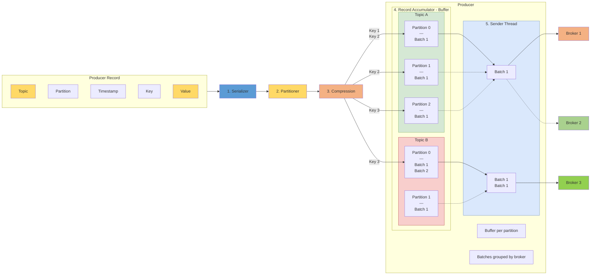

# [Kafka] 카프카 프로듀서의 메시지 전송 파이프라인과 주요 설정

- **Tags**: #Kafka #Producer #RecordAccumulator

---

### 무엇을 배웠는가?
카프카 프로듀서가 `send()`를 호출할 때, 메시지가 즉시 브로커로 전송되는 것이 아니라 **직렬화**, **파티셔닝**, **압축** 과정을 거칩니다.   
이후 **Record Accumulator**라는 내부 버퍼에 **배치**로 쌓이고, 별도의 **Sender 스레드**가 브로커로 비동기 전송하는 파이프라인 과정을 학습합니다.  

### 왜 중요하고, 어떤 맥락인가?
프로듀서의 성능을 높이기 위해서는 이 내부 동작을 이해하는 것이 중요합니다.   
만약 모든 메시지를 단건으로 전송한다면, 매번 TCP 3-way handshake와 같은 네트워크 연결 오버헤드가 발생하여 매우 비효율적입니다.   
카프카는 **메시지를 배치로 모아서 한 번에 전송**하는 방식을 통해 이 오버헤드를 극적으로 줄이고 높은 처리량(Throughput)을 달성합니다.    
`batch.size`나 `linger.ms` 같은 설정을 조절하여 이 동작을 애플리케이션의 요구사항(지연 시간 vs 처리량)에 맞게 튜닝할 수 있습니다.

### 상세 내용
#### 1. 프로듀서 메시지 전송 파이프라인
프로듀서가 보낸 `ProducerRecord`는 브로커에 도달하기까지 5단계를 거칩니다.  

1. **직렬화 (Serializer)** 

`ProducerRecord`의 **Key와 Value를 바이트 배열(byte array)로 직렬화**합니다.  
`key.serializer`와 `value.serializer` 설정을 통해 사용할 직렬화 클래스를 지정합니다. (e.g., `StringSerializer`, `ByteArraySerializer`).

2. **파티셔닝 (Partitioner)**

메시지가 토픽의 **어떤 파티션에 저장될지 결정**합니다.

* **Key가 있는 경우**: Key를 해시(기본: murmur2 알고리즘)하여 특정 파티션에 고정적으로 매핑합니다. (Key가 같으면 항상 같은 파티션으로 갑니다.)
* **Key가 없는 경우**: 라운드 로빈(Round-Robin) 방식으로 여러 파티션에 분배됩니다.
* `partitioner.class` 설정을 통해 커스텀 파티셔너를 지정할 수도 있습니다.

3. **압축 (Compression)**

네트워크 전송량을 줄이기 위해 `compression.type` 설정(gzip, snappy, lz4 등)에 따라 메시지를 압축합니다.

4. **레코드 어큐뮬레이터 (Record Accumulator)**

압축된 메시지는 즉시 전송되지 않고, **파티션별로 구분된 버퍼(배치)**에 쌓입니다.
* 이 버퍼의 총 크기는 `buffer.memory` 설정으로 제한됩니다.
* 배치가 `batch.size` 설정값에 도달하거나, `linger.ms`로 설정된 최대 대기 시간을 초과하면 전송 대상이 됩니다.

5. **센더 스레드 (Sender Thread)**

별도의 센더 스레드가 `Record Accumulator`에서 준비된 배치들을 가져와 브로커로 전송합니다.

* **피기배킹(Piggybacking)**: 전송 시, **동일한 브로커가 담당하는 파티션의 배치**들(서로 다른 토픽의 배치라도)을 모아서 **단일 요청으로 전송**하여 효율을 극대화합니다.
* `acks`: 전송 후 브로커로부터 응답을 기다리는 수준을 설정합니다('0'=응답 없음, '1'=리더만 응답, 'all'=복제본까지 응답).
* `retries`: 전송 실패 시 재시도 횟수를 설정합니다.
* `max.in.flight.requests.per.connection`: 응답을 받지 않고도 한 번에 보낼 수 있는 최대 요청 수입니다.

---

### 핵심
* 카프카 프로듀서는 효율성을 위해 메시지를 즉시 보내지 않고, **`Record Accumulator`에 배치(batch)로 모아** 보냅니다.
* 메시지 전송은 **별도의 `Sender` 스레드**가 비동기로 담당하며, 동일 브로커로 가는 배치들은 '피기배킹'으로 묶여 전송 효율을 높입니다.
* `batch.size`(배치 크기)와 `linger.ms`(최대 대기 시간) 설정은 처리량(Throughput)과 지연 시간(Latency)을 결정합니다.