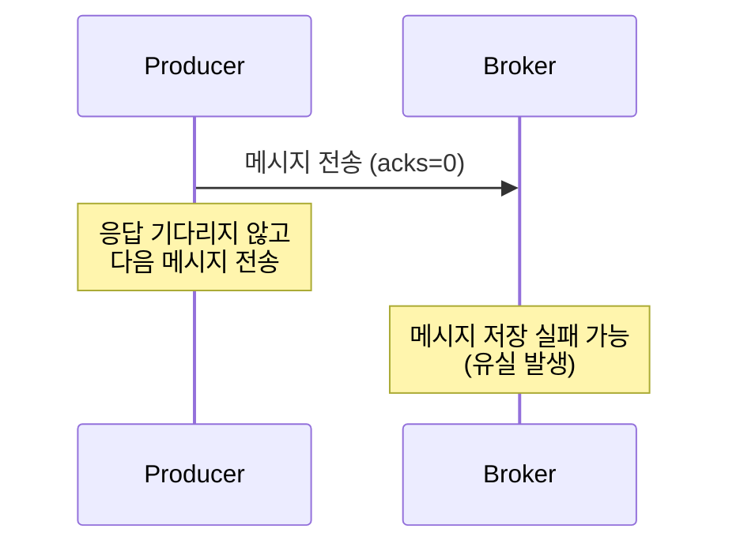
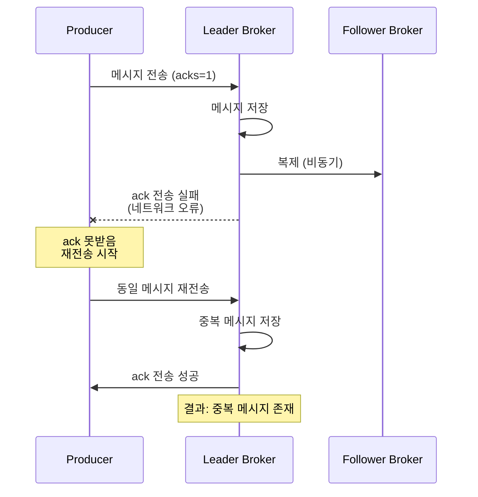
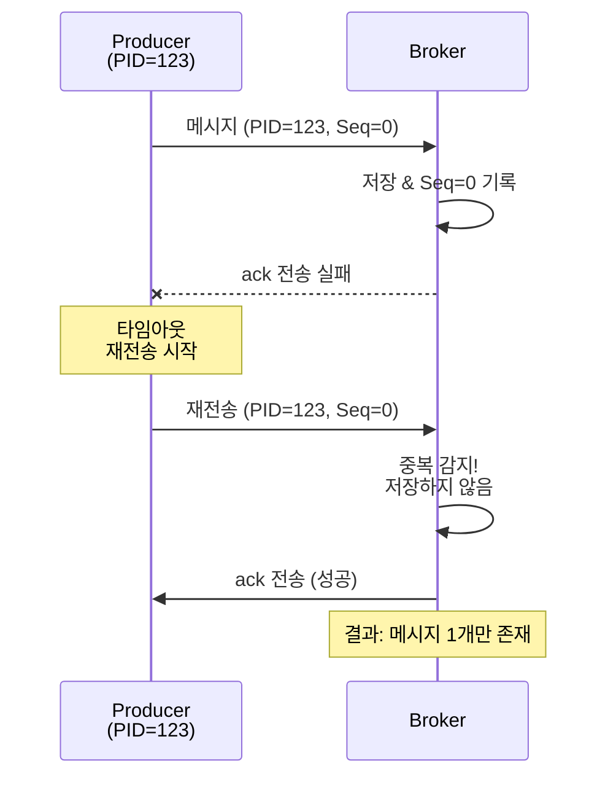
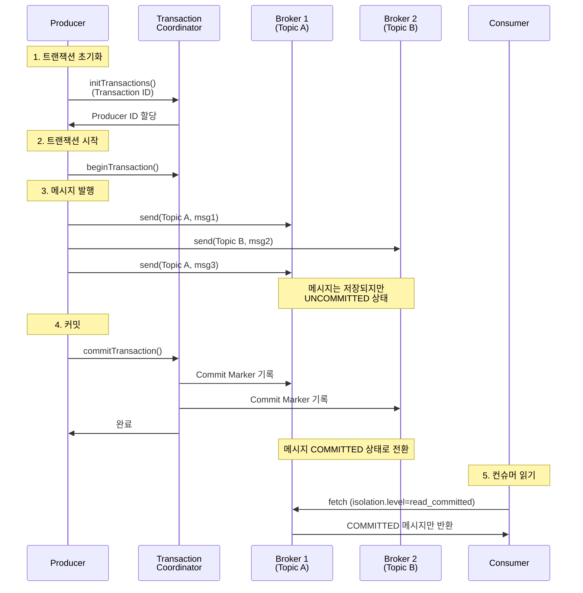
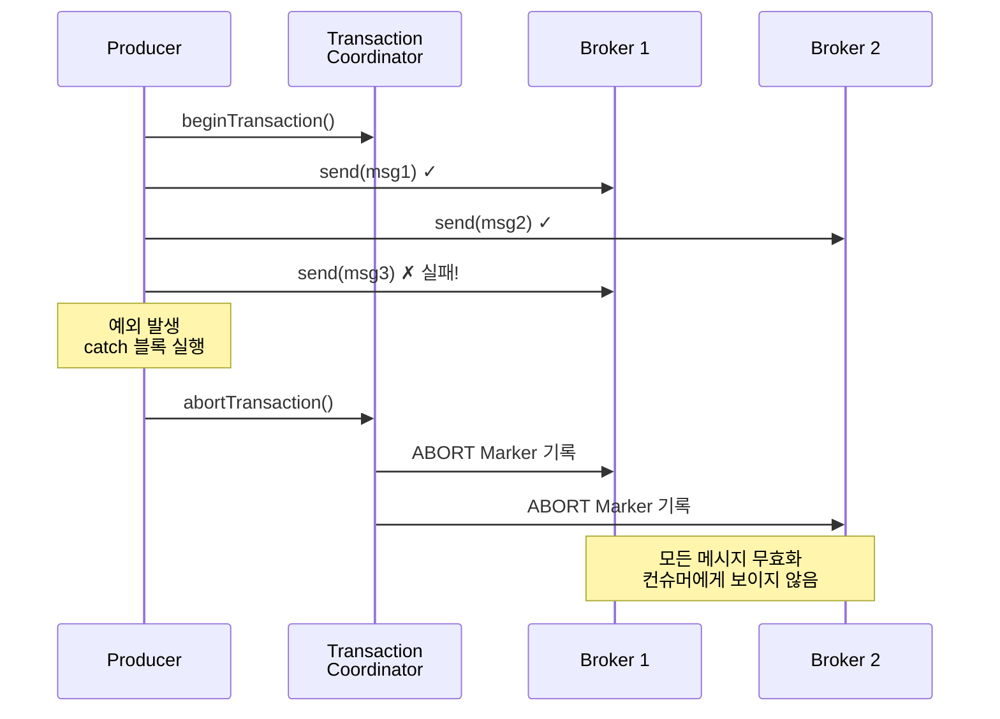

# [Kafka] 메시지 발행 보장 (Message Delivery Semantics)

---
### 무엇을 배웠는가?
Kafka에서 메시지 발행 시 보장 수준을 결정하는 세 가지 방식(At Most Once, At Least Once, Exactly Once)과 각각의 동작 원리, 설정 방법, 그리고 Exactly Once를 구현하기 위한 멱등성 프로듀서와 트랜잭션 메커니즘을 학습했습니다.

---
### 왜 중요하고, 어떤 맥락인가?
분산 시스템에서 메시지 전달 보장은 데이터 일관성과 시스템 안정성에 직결되는 핵심 요소입니다.    
실시간 로그 수집처럼 일부 손실이 허용되는 경우부터 금융 거래처럼 정확한 한 번의 처리가 필수인 경우까지, 비즈니스 요구사항에 맞는 적절한 보장 수준을 선택해야 합니다.    
특히 Kafka는 대용량 이벤트 스트리밍 플랫폼으로 널리 사용되므로, 각 보장 수준의 트레이드오프를 이해하고 올바르게 설정하는 것이 중요합니다.

---
### 상세 내용

#### 1. 메시지 발행 보장 수준 개요

Kafka는 세 가지 메시지 전달 보장 수준을 제공합니다:

| 보장 수준 | 메시지 손실 | 메시지 중복 | 성능 | 사용 사례 |
|----------|------------|------------|------|----------|
| **At Most Once** | 가능 | 없음 | 가장 빠름 | 실시간 로그, 메트릭 |
| **At Least Once** | 없음 | 가능 | 중간 | 일반적인 이벤트 처리 |
| **Exactly Once** | 없음 | 없음 | 가장 느림 | 금융 거래, 결제 |

#### 2. At Most Once (최대 한 번 전송)

* **동작 방식**
    * 프로듀서가 메시지를 전송하고 브로커의 응답(ack)을 **기다리지 않음**
    * Fire-and-Forget 방식
    * 네트워크 장애나 브로커 다운 시 메시지 유실 가능

* **프로듀서 설정**
```properties
  acks=0
```

* **특징**
    * **장점**: 가장 빠른 처리 속도, 낮은 지연시간
    * **단점**: 메시지 유실 가능성이 가장 높음
    * **적합한 사례**:
        - 실시간 로그 수집 (일부 유실 허용)
        - 메트릭 데이터 전송 (샘플링된 데이터)
        - IoT 센서 데이터 (주기적으로 전송되는 데이터)


#### 3. At Least Once (최소 한 번 전송)

* **동작 방식**
    * 프로듀서가 메시지를 전송하고 **리더 브로커의 ack을 대기**
    * ack을 받지 못하면 **자동으로 재전송** (retries 설정에 따라)
    * 메시지는 반드시 브로커에 저장되지만, 중복 가능성 존재

* **프로듀서 설정**
```properties
  acks=1
  retries=2147483647  # 최대 재시도 횟수
  max.in.flight.requests.per.connection=5
```

* **메시지 중복이 발생하는 시나리오**
    1. 프로듀서가 메시지를 브로커에 전송
    2. 브로커는 메시지를 정상적으로 저장
    3. **네트워크 오류로 ack이 프로듀서에 도달하지 못함**
    4. 프로듀서는 타임아웃으로 판단하고 재전송
    5. 결과: 동일한 메시지가 2번 저장됨

* **특징**
    * **장점**: 메시지 유실 없음, 중간 수준의 성능
    * **단점**: 중복 메시지 발생 가능 (컨슈머에서 멱등성 처리 필요)
    * **적합한 사례**:
        - 이벤트 소싱 (중복 제거 로직 필요)
        - 로그 집계 (중복 허용 가능)
        - 알림 시스템 (중복 발송 가능)


#### 4. Exactly Once (정확히 한 번 전송)

메시지가 **유실이나 중복 없이** 정확히 한 번만 처리되는 것을 보장합니다. 세 가지 메커니즘의 조합으로 구현됩니다.

##### 4-1. acks=all 설정

* **동작 방식**
    * 리더 브로커뿐만 아니라 **모든 ISR(In-Sync Replicas)에 복제 완료** 후 ack 반환
    * 데이터 내구성이 가장 높음

* **설정**
```properties
  acks=all  # 또는 acks=-1
  min.insync.replicas=2  # 최소 ISR 수 지정
```

* **min.insync.replicas의 역할**
    * ISR에 최소 몇 개의 브로커가 있어야 쓰기 작업을 허용할지 지정
    * 예: `min.insync.replicas=2`이면 리더 + 최소 1개의 팔로워가 동기화되어야 함
    * ISR이 부족하면 `NotEnoughReplicasException` 발생

* **여전히 중복 가능한 시나리오**
    * 모든 ISR에 복제 완료 후 ack을 보내는 도중 네트워크 장애 발생
    * 프로듀서는 재전송 → 중복 발생
    * **해결책**: 멱등성 프로듀서 사용

##### 4-2. 멱등성 프로듀서 (Idempotent Producer)

* **개념**
    * 동일한 메시지를 여러 번 전송해도 **브로커에는 한 번만 저장**되도록 보장
    * 프로듀서 재시도로 인한 중복을 자동으로 제거

* **동작 원리**
```
  각 메시지에 고유 식별자 부여:
  (Producer ID, Sequence Number)
  
  예시:
  - 첫 번째 메시지: (PID=123, Seq=0)
  - 두 번째 메시지: (PID=123, Seq=1)
  - 재전송된 첫 번째: (PID=123, Seq=0) ← 브로커가 중복 감지
```

* **설정**
```properties
  enable.idempotence=true
  
  # 멱등성 활성화 시 자동으로 설정되는 값들:
  acks=all
  retries=2147483647
  max.in.flight.requests.per.connection=5
```

* **중복 제거 과정**
    1. 프로듀서는 브로커로부터 **PID(Producer ID)** 할당받음
    2. 각 메시지에 **Sequence Number** 자동 부여 (파티션별로 0부터 증가)
    3. 브로커는 파티션마다 마지막 Sequence Number를 메모리에 보관
    4. 중복 메시지 도착 시:
        - 브로커는 메시지를 **저장하지 않음**
        - 프로듀서에게 **ack만 전송** (재전송 중단)


* **제약사항**
    * **단일 프로듀서 세션 내에서만 보장**
        - 프로듀서가 재시작되면 새로운 PID 할당
        - 이전 세션의 중복은 감지 불가
    * **단일 파티션 내에서만 순서 보장**
    * **트랜잭션과 함께 사용**하면 세션 간 보장 가능

##### 4-3. 트랜잭션 (Transaction)

* **개념**
    * 여러 토픽/파티션에 대한 메시지 발행을 **하나의 원자적(atomic) 단위**로 처리
    * All-or-Nothing: 모두 성공하거나 모두 실패
    * 프로듀서 재시작 후에도 **동일한 Transaction ID**로 멱등성 보장

* **동작 흐름**


* **주요 구성 요소**

    1. **Transaction ID**
        - 프로듀서를 고유하게 식별
        - 재시작 후에도 동일한 ID 사용 가능
        - 코디네이터는 이전 트랜잭션을 자동으로 정리

    2. **Transaction Coordinator**
        - 트랜잭션 상태를 관리하는 브로커
        - 내부 토픽 `__transaction_state`에 상태 저장
        - 각 Transaction ID마다 하나의 코디네이터 할당

    3. **Transaction Markers**
        - COMMIT 또는 ABORT 마커
        - 각 파티션의 로그에 기록됨
        - 컨슈머는 이 마커를 보고 메시지 처리 여부 결정

* **프로듀서 설정**
```properties
  # 트랜잭션 활성화
  transactional.id=my-transactional-id-001
  
  # 자동으로 설정되는 값들:
  enable.idempotence=true
  acks=all
  retries=2147483647
  max.in.flight.requests.per.connection=5
```

* **컨슈머 설정**
```properties
  # COMMITTED된 메시지만 읽기
  isolation.level=read_committed
  
  # 기본값은 read_uncommitted (트랜잭션 무시)
```

* **트랜잭션 롤백 시나리오**


* **특징**
    * **장점**:
        - 여러 파티션/토픽에 걸친 원자적 처리
        - 프로듀서 재시작 후에도 멱등성 보장 (Transaction ID 유지 시)
        - Exactly-Once Semantics 완벽 구현
    * **단점**:
        - 성능 오버헤드 (코디네이터와의 추가 통신)
        - 지연시간 증가
        - 컨슈머도 `read_committed` 설정 필요
    * **적합한 사례**:
        - 금융 거래 (이체, 결제)
        - 주문 처리 시스템
        - 재고 관리
        - 데이터베이스 변경 이벤트 발행

#### 5. 전체 비교표

| 설정 | At Most Once | At Least Once | Exactly Once |
|------|-------------|--------------|--------------|
| **acks** | 0 | 1 | all |
| **enable.idempotence** | false | false | true |
| **transactional.id** | - | - | 설정 필요 (선택) |
| **retries** | 0 | > 0 | Integer.MAX_VALUE |
| **메시지 손실** | 가능 | 없음 | 없음 |
| **메시지 중복** | 없음 | 가능 | 없음 |
| **지연시간** | 낮음 | 중간 | 높음 |
| **처리량** | 높음 | 중간 | 낮음 |

#### 6. 설정

**실시간 로그 수집 (손실 허용)**
```properties
acks=0
retries=0
compression.type=snappy
batch.size=100000
```

**일반 이벤트 처리 (중복 허용)**
```properties
acks=1
retries=3
max.in.flight.requests.per.connection=5
compression.type=lz4
```

**중요 비즈니스 이벤트 (중복 없음, 단일 파티션)**
```properties
enable.idempotence=true
# acks=all, retries=MAX_VALUE 자동 설정됨
max.in.flight.requests.per.connection=5
```

### 요약

1. **At Most Once (acks=0)**: 가장 빠르지만 메시지 손실 가능. 실시간 로그 수집에 적합.

2. **At Least Once (acks=1)**: 메시지 손실은 없지만 중복 가능. 리더 브로커만 확인. 일반적인 이벤트 처리에 사용.

3. **Exactly Once (acks=all + idempotence + transaction)**: 손실과 중복 모두 없음. 세 가지 메커니즘 조합:
    - **acks=all**: 모든 ISR 복제 완료 후 응답
    - **멱등성 프로듀서**: (PID, Sequence Number)로 중복 자동 제거
    - **트랜잭션**: 여러 파티션에 걸친 원자적 처리, 프로듀서 재시작 후에도 보장

4. **트레이드오프**: 보장 수준이 높을수록 지연시간과 오버헤드 증가. 비즈니스 요구사항에 맞게 선택.

5. **실무 적용**:
    - 로그/메트릭 → At Most Once
    - 일반 이벤트 → At Least Once + 컨슈머 멱등성
    - 금융/주문 → Exactly Once (트랜잭션)

6. **컨슈머 고려사항**: Exactly Once를 위해서는 컨슈머도 `isolation.level=read_committed` 설정과 멱등한 처리 로직 필요.