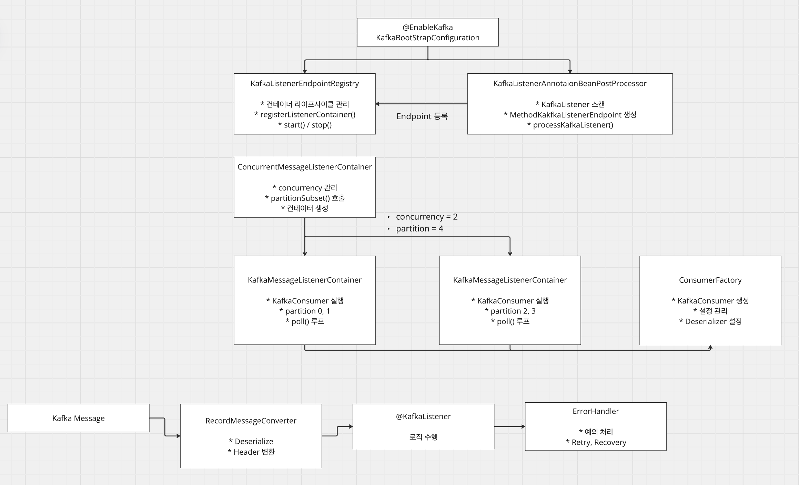

# [Kafka] Spring Kafka Consumer

## 개요

Spring Kafka Consumer는 Apache Kafka로부터 메시지를 수신하고 처리하기 위한 Spring 기반 라이브러리입니다.

**주요 기능:**
- `@KafkaListener`: 어노테이션으로 토픽, 그룹ID, 병렬 처리 등 설정
- Spring Transaction: `@Transactional`과 통합 사용 가능
- 에러 핸들링: `DefaultErrorHandler`를 이용한 재시도 로직

---

## Spring Kafka 기본 동작

### @EnableKafka

카프카 리스너를 활성화하는 어노테이션입니다.

```java
@Target(ElementType.TYPE)
@Retention(RetentionPolicy.RUNTIME)
@Documented
@Import(KafkaBootstrapConfiguration.class)
public @interface EnableKafka {
}
```

### KafkaBootstrapConfiguration

```java
@Configuration(proxyBeanMethods = false)
@Role(BeanDefinition.ROLE_INFRASTRUCTURE)
public class KafkaBootstrapConfiguration {

    @Bean(name = KafkaListenerConfigUtils.KAFKA_LISTENER_ANNOTATION_PROCESSOR_BEAN_NAME)
    @Role(BeanDefinition.ROLE_INFRASTRUCTURE)
    public KafkaListenerAnnotationBeanPostProcessor kafkaListenerAnnotationProcessor() {
        return new KafkaListenerAnnotationBeanPostProcessor();
    }

    @Bean(name = KafkaListenerConfigUtils.KAFKA_LISTENER_ENDPOINT_REGISTRY_BEAN_NAME)
    public KafkaListenerEndpointRegistry defaultKafkaListenerEndpointRegistry() {
        return new KafkaListenerEndpointRegistry();
    }
}
```

**역할:**
- `KafkaListenerAnnotationBeanPostProcessor`: `@KafkaListener` 메서드 스캔 및 엔드포인트 등록
- `KafkaListenerEndpointRegistry`: 모든 리스너 컨테이너 관리

### @KafkaListener

메시지 수신 메서드를 지정하는 어노테이션입니다.

```java
@Target({ElementType.METHOD, ElementType.ANNOTATION_TYPE})
@Retention(RetentionPolicy.RUNTIME)
@MessageMapping
@Documented
public @interface KafkaListener {
    String id() default "";
    String containerFactory() default "";
    String[] topics() default {};
    String topicPattern() default "";
    TopicPartition[] topicPartitions() default {};
    String containerGroup() default "";
    String errorHandler() default "";
    String groupId() default "";
    boolean idIsGroup() default true;
    String clientIdPrefix() default "";
    String beanRef() default "__listener";
    String concurrency() default "";
    String autoStartup() default "";
    String[] properties() default {};
}
```

### KafkaListenerAnnotationBeanPostProcessor

```java
public class KafkaListenerAnnotationBeanPostProcessor<K, V>
        implements BeanPostProcessor, Ordered, BeanFactoryAware {

    @Override
    public Object postProcessAfterInitialization(Object bean, String beanName) {
        Class<?> targetClass = AopUtils.getTargetClass(bean);

        Map<Method, Set<KafkaListener>> annotatedMethods =
            MethodIntrospector.selectMethods(targetClass,
                (MethodIntrospector.MetadataLookup<Set<KafkaListener>>) method -> {
                    Set<KafkaListener> listenerMethods =
                        findListenerAnnotations(method);
                    return (!listenerMethods.isEmpty() ? listenerMethods : null);
                });

        annotatedMethods.forEach((method, listeners) ->
            listeners.forEach(listener ->
                processKafkaListener(listener, method, bean, beanName)));

        return bean;
    }

    protected void processKafkaListener(KafkaListener kafkaListener,
                                       Method method, Object bean, String beanName) {
        MethodKafkaListenerEndpoint<K, V> endpoint =
            new MethodKafkaListenerEndpoint<>();
        endpoint.setMethod(method);
        endpoint.setBean(bean);
        endpoint.setTopics(resolveTopics(kafkaListener));
        endpoint.setGroupId(getEndpointGroupId(kafkaListener, beanName));

        this.registrar.registerEndpoint(endpoint, factory);
    }
}
```

### MessageListenerContainer

메시지 리스너의 생명주기를 관리합니다.

```java
public interface MessageListenerContainer extends SmartLifecycle {
    void setupMessageListener(Object messageListener);
    void start();
    void stop();
    boolean isRunning();
}
```

### ConcurrentMessageListenerContainer

```java
public class ConcurrentMessageListenerContainer<K, V> extends AbstractMessageListenerContainer<K, V> {

    private final List<KafkaMessageListenerContainer<K, V>> containers = new ArrayList<>();
    private int concurrency = 1;

    @Override
    protected void doStart() {
        if (!isRunning()) {
            ContainerProperties containerProperties = getContainerProperties();
            TopicPartitionOffset[] topicPartitions = containerProperties.getTopicPartitions();

            if (topicPartitions != null && this.concurrency > topicPartitions.length) {
                this.concurrency = topicPartitions.length;
            }

            for (int i = 0; i < this.concurrency; i++) {
                KafkaMessageListenerContainer<K, V> container =
                    constructContainer(containerProperties, topicPartitions, i);
                this.containers.add(container);
                container.start();
            }
        }
    }
}
```

**주의:** `concurrency` 옵션은 파티션 수를 초과할 수 없습니다.

### 파티션 할당 로직

```java
// 자동 할당 시 파티션 할당 전략
CONFIG = new ConfigDef().define(PARTITION_ASSIGNMENT_STRATEGY_CONFIG,
    Type.LIST,
    List.of(RangeAssignor.class, CooperativeStickyAssignor.class),
    new ConfigDef.NonNullValidator(),
    Importance.MEDIUM,
    PARTITION_ASSIGNMENT_STRATEGY_DOC
);

@Override
public Map<String, List<TopicPartition>> assignPartitions(
        Map<String, List<PartitionInfo>> partitionsPerTopic,
        Map<String, Subscription> subscriptions) {
    Map<String, List<MemberInfo>> consumersPerTopic = consumersPerTopic(subscriptions);
    Map<String, String> consumerRacks = consumerRacks(subscriptions);
    List<TopicAssignmentState> topicAssignmentStates = partitionsPerTopic.entrySet().stream()
            .filter(e -> !e.getValue().isEmpty())
            .map(e -> new TopicAssignmentState(e.getKey(), e.getValue(),
                consumersPerTopic.get(e.getKey()), consumerRacks))
            .collect(Collectors.toList());

    Map<String, List<TopicPartition>> assignment = new HashMap<>();
    subscriptions.keySet().forEach(memberId -> assignment.put(memberId, new ArrayList<>()));

    boolean useRackAware = topicAssignmentStates.stream()
        .anyMatch(t -> t.needsRackAwareAssignment);
    if (useRackAware)
        assignWithRackMatching(topicAssignmentStates, assignment);

    topicAssignmentStates.forEach(t -> assignRanges(t, (c, tp) -> true, assignment));

    if (useRackAware)
        assignment.values().forEach(list -> list.sort(PARTITION_COMPARATOR));
    return assignment;
}

private void assignRanges(TopicAssignmentState assignmentState,
                          BiFunction<String, TopicPartition, Boolean> mayAssign,
                          Map<String, List<TopicPartition>> assignment) {
    for (String consumer : assignmentState.consumers.keySet()) {
        if (assignmentState.unassignedPartitions.isEmpty())
            break;
        List<TopicPartition> assignablePartitions = assignmentState.unassignedPartitions.stream()
                .filter(tp -> mayAssign.apply(consumer, tp))
                .limit(assignmentState.maxAssignable(consumer))
                .collect(Collectors.toList());
        if (assignablePartitions.isEmpty())
            continue;

        assign(consumer, assignablePartitions, assignmentState, assignment);
    }
}

// 수동 파티션 지정 시
private TopicPartitionOffset[] partitionSubset(ContainerProperties containerProperties, int index) {
    TopicPartitionOffset[] topicPartitions = containerProperties.getTopicPartitions();

    if (topicPartitions == null) {
        return null;  // 자동 할당 모드
    } else if (this.concurrency == 1) {
        return topicPartitions;
    } else {
        int numPartitions = topicPartitions.length;
        if (numPartitions == this.concurrency) {
            return new TopicPartitionOffset[]{topicPartitions[index]};
        } else {
            int perContainer = numPartitions / this.concurrency;
            int start = index * perContainer;
            int end = index == this.concurrency - 1 ? numPartitions : start + perContainer;
            return Arrays.copyOfRange(topicPartitions, start, end);
        }
    }
}
```

### ConsumerFactory

```java
public class DefaultKafkaConsumerFactory<K, V> implements ConsumerFactory<K, V> {

    private final Map<String, Object> configs;
    private Supplier<Deserializer<K>> keyDeserializerSupplier;
    private Supplier<Deserializer<V>> valueDeserializerSupplier;

    public DefaultKafkaConsumerFactory(Map<String, Object> configs) {
        this.configs = new HashMap<>(configs);
    }

    @Override
    public Consumer<K, V> createConsumer(
            @Nullable String groupId,
            @Nullable String clientIdPrefix,
            @Nullable String clientIdSuffix,
            @Nullable Properties properties) {

        Map<String, Object> configProps = new HashMap<>(this.configs);

        if (groupId != null) {
            configProps.put(ConsumerConfig.GROUP_ID_CONFIG, groupId);
        }

        if (clientIdPrefix != null) {
            configProps.put(ConsumerConfig.CLIENT_ID_CONFIG,
                clientIdPrefix + (clientIdSuffix != null ? clientIdSuffix : ""));
        }

        Deserializer<K> keyDeserializer = this.keyDeserializerSupplier.get();
        Deserializer<V> valueDeserializer = this.valueDeserializerSupplier.get();

        return new org.apache.kafka.clients.consumer.KafkaConsumer<>(
            configProps,
            keyDeserializer,
            valueDeserializer
        );
    }
}
```

---

## Spring Kafka 처리량 증대

### 배치 컨슈머

메시지를 특정 byte 또는 레코드 개수만큼 한 번에 처리합니다.

```kotlin
@Configuration
class BatchConsumerConfig {

    private val log = LoggerFactory.getLogger(javaClass)

    @Value("\${spring.kafka.bootstrap-servers}")
    private lateinit var bootstrapServers: String

    @Bean
    fun batchKafkaListenerContainerFactory(): ConcurrentKafkaListenerContainerFactory<String, Any> {
        val configProps = mapOf(
            ConsumerConfig.BOOTSTRAP_SERVERS_CONFIG to bootstrapServers,
            ConsumerConfig.GROUP_ID_CONFIG to "batch-events-consumer",
            ConsumerConfig.KEY_DESERIALIZER_CLASS_CONFIG to StringDeserializer::class.qualifiedName,
            ConsumerConfig.VALUE_DESERIALIZER_CLASS_CONFIG to StringDeserializer::class.qualifiedName,
            ConsumerConfig.AUTO_OFFSET_RESET_CONFIG to "earliest",
            ConsumerConfig.ENABLE_AUTO_COMMIT_CONFIG to true,
            ConsumerConfig.MAX_POLL_RECORDS_CONFIG to 500,
            ConsumerConfig.FETCH_MIN_BYTES_CONFIG to 1048576,
            ConsumerConfig.FETCH_MAX_WAIT_MS_CONFIG to 500
        )

        val consumerFactory = DefaultKafkaConsumerFactory<String, Any>(configProps)

        return ConcurrentKafkaListenerContainerFactory<String, Any>().apply {
            setConsumerFactory(batchEventConsumerFactory())
            setConcurrency(1)
            setBatchListener(true)
            setCommonErrorHandler(
                DefaultErrorHandler(
                    { record, ex ->
                        log.error("Batch consumer error - topic: {}, value: {}",
                            record?.topic(), record?.value(), ex)
                    },
                    FixedBackOff(1000L, 3L)
                )
            )
        }
    }
}
```

### 병렬 컨슈머

#### 1. ThreadPoolExecutor 처리

```kotlin
@Bean
fun kafkaConsumerExecutor(): ThreadPoolTaskExecutor {
    return ThreadPoolTaskExecutor().apply {
        corePoolSize = 10
        maxPoolSize = 20
        queueCapacity = 1000
        setThreadNamePrefix("kafka-consumer-")
        initialize()
    }
}

@KafkaListener(
    topics = [KafkaTopics.OPTIMIZED_EVENTS],
    groupId = "async-events-consumer",
    containerFactory = "asyncKafkaListenerContainerFactory"
)
fun listen(records: List<ConsumerRecord<String, Event>>, acknowledgment: Acknowledgment) {
    val events = records.map { it.value() }

    val futures = events.chunked(50).map { chunk ->
        CompletableFuture.runAsync({
            eventProcessor.processBatch(chunk)
        }, kafkaConsumerExecutor)
    }

    CompletableFuture.allOf(*futures.toTypedArray()).join()

    acknowledgment.acknowledge()
}
```

#### 2. Confluent Parallel Consumer 처리

Parallel Consumer는 하나의 파티션을 구독하며 다중 메시지를 병렬 처리합니다.

**처리 순서 옵션:**
- **UNORDERED**: 최대 병렬성, 순서 보장 없음
- **KEY**: 동일 키 메시지는 순서 보장 (권장)
- **PARTITION**: 파티션 내 순서 보장

```kotlin
@Bean
fun parallelConsumerOptions(
    parallelConsumerKafkaConsumer: Consumer<String, String>
): ParallelConsumerOptions<String, String> {
    return ParallelConsumerOptions.builder<String, String>()
        .consumer(parallelConsumerKafkaConsumer)
        .ordering(ProcessingOrder.KEY)
        .maxConcurrency(100)
        .build()
}

@Bean(destroyMethod = "close")
fun parallelStreamProcessor(
    options: ParallelConsumerOptions<String, String>
): ParallelStreamProcessor<String, String> {
    return ParallelStreamProcessor.createEosStreamProcessor(options)
}

@Component
class ParallelEventListener(
    private val parallelStreamProcessor: ParallelStreamProcessor<String, String>
) {
    @PostConstruct
    fun start() {
        if (isRunning.compareAndSet(false, true)) {
            log.info("Starting Parallel Consumer for topic: {}", KafkaTopics.PARALLEL_EVENTS)

            parallelStreamProcessor.subscribe(listOf(KafkaTopics.PARALLEL_EVENTS))

            parallelStreamProcessor.poll { context: PollContext<String, String> ->
                processMessage(context)
            }
        }
    }
}
```

---

## 성능 비교



| 컨슈머 전략 | 처리 옵션 | 처리 방식 | TPS | 처리 시간 (100만건) | 순위 |
|-----------|--------|--------|-----|-----------------|------|
| 일반 컨슈머 | concurrency: 10, partition: 10 | 10개 파티션 병렬 | 18,867 | 53,000ms | 3 |
| 배치 컨슈머 | concurrency: 10, partition: 10, batch: 500 | 10개 파티션 병렬 + 배치 | 50,000 | 20,000ms | **1** |
| 비동기 컨슈머 | concurrency: 1, partition: 1, batch: 500, thread: 10 | 1개 파티션 + 10개 스레드 병렬 | 32,258 | 31,000ms | 2 |
| 병렬 컨슈머 | partition: 1, max concurrency: 10, key 기반 | 1개 파티션 + 10개 병렬 | 15,625 | 64,000ms | 4 |

**분석:**
- 배치 컨슈머가 최고 처리량 (10개 파티션 + 배치 처리)
- 비동기 컨슈머가 단일 파티션으로 우수한 처리량 달성
- 병렬 컨슈머는 1개 파티션만으로도 준수한 성능 제공

---

## 참고

- [Confluent Parallel Consumer 설명](https://d2.naver.com/helloworld/7181840)
