# [Concurrency] 코루틴(Coroutine)의 원리와 동작 방식

- **Tags:** #Coroutine #Concurrency #Asynchronous #Kotlin #CPS #VirtualThread #WebFlux

---

# 코루틴

## 코루틴이란

코루틴(Coroutine)은 **co(협력) + routine(루틴)**의 합성어로, 실행을 일시 중단(suspend)하고 나중에 재개(resume)할 수 있는 경량 실행 단위입니다. OS 스레드와 달리 커널이 아닌 유저 레벨에서 스케줄링되며, 하나의 스레드 위에서 수천~수만 개의 코루틴이 동시에 실행될 수 있습니다.

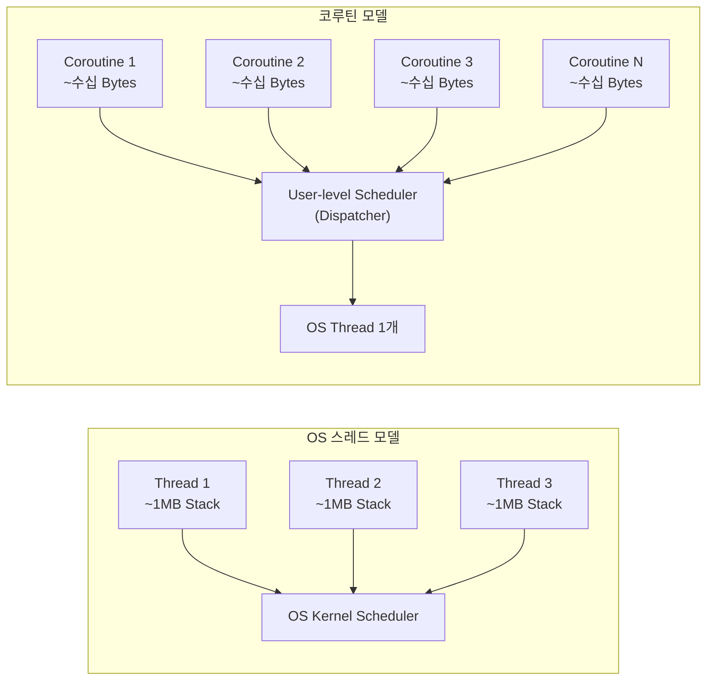
```mermaid
graph LR
    subgraph OS_Thread["OS 스레드 모델"]
        direction TB
        T1["Thread 1<br/>~1MB Stack"]
        T2["Thread 2<br/>~1MB Stack"]
        T3["Thread 3<br/>~1MB Stack"]
        K["OS Kernel Scheduler"]
        T1 --> K
        T2 --> K
        T3 --> K
    end

    subgraph Coroutine_Model["코루틴 모델"]
        direction TB
        C1["Coroutine 1<br/>~수십 Bytes"]
        C2["Coroutine 2<br/>~수십 Bytes"]
        C3["Coroutine 3<br/>~수십 Bytes"]
        C4["Coroutine N<br/>~수십 Bytes"]
        US["User-level Scheduler<br/>(Dispatcher)"]
        TH["OS Thread 1개"]
        C1 --> US
        C2 --> US
        C3 --> US
        C4 --> US
        US --> TH
    end
```

OS 스레드는 각각 약 1MB의 스택 메모리를 점유하고 OS 커널이 직접 스케줄링합니다. 반면 코루틴은 수십 바이트 수준의 메모리만 사용하며, 유저 레벨에서 자체적으로 스케줄링됩니다.

## 비선점형 멀티태스킹이란

멀티태스킹 방식은 크게 **선점형(Preemptive)**과 **비선점형(Non-preemptive, Cooperative)**으로 나뉩니다.

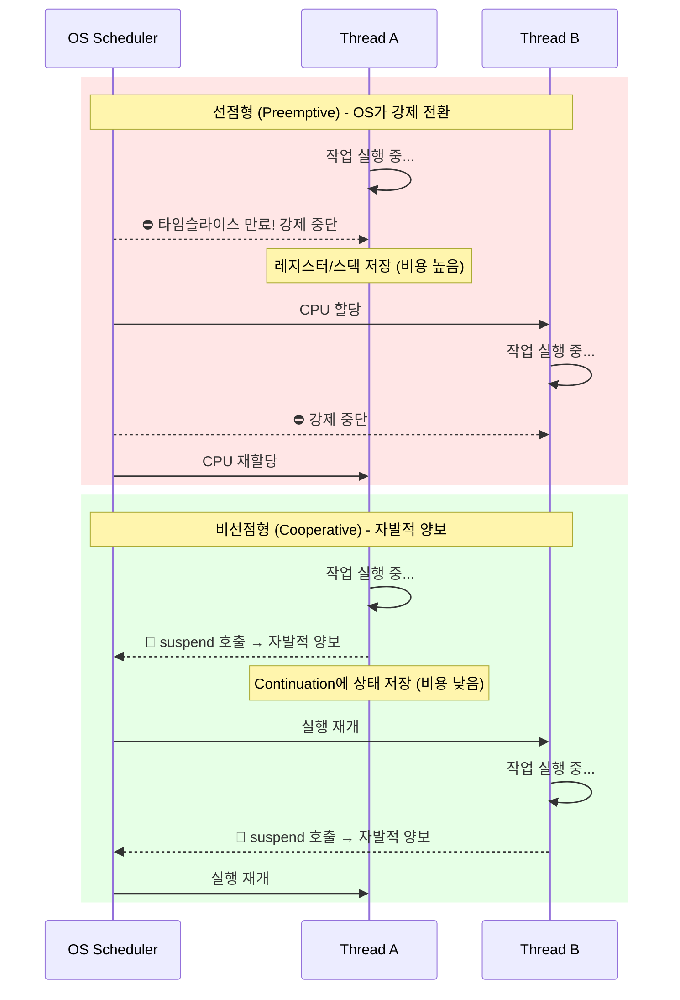
```mermaid
sequenceDiagram
    participant OS as OS Scheduler
    participant T1 as Thread A
    participant T2 as Thread B

    rect rgb(255, 230, 230)
        Note over OS,T2: 선점형 (Preemptive) - OS가 강제 전환
        T1->>T1: 작업 실행 중...
        OS-->>T1: ⛔ 타임슬라이스 만료! 강제 중단
        Note over T1: 레지스터/스택 저장 (비용 높음)
        OS->>T2: CPU 할당
        T2->>T2: 작업 실행 중...
        OS-->>T2: ⛔ 강제 중단
        OS->>T1: CPU 재할당
    end

    rect rgb(230, 255, 230)
        Note over OS,T2: 비선점형 (Cooperative) - 자발적 양보
        T1->>T1: 작업 실행 중...
        T1-->>OS: 🤝 suspend 호출 → 자발적 양보
        Note over T1: Continuation에 상태 저장 (비용 낮음)
        OS->>T2: 실행 재개
        T2->>T2: 작업 실행 중...
        T2-->>OS: 🤝 suspend 호출 → 자발적 양보
        OS->>T1: 실행 재개
    end
```

**선점형**에서는 OS가 타임 슬라이스마다 강제 전환하므로 공유 자원에 락이 필요하고, 컨텍스트 스위칭 비용(레지스터 저장/복원, 커널 모드 전환)이 큽니다.

**비선점형**에서는 `suspend` 함수 호출 지점에서만 자발적으로 양보하므로, 전환 비용이 거의 없고 동일 스레드 내에서는 동기화가 불필요합니다. 다만 하나의 코루틴이 양보 없이 오래 실행하면 같은 스레드의 다른 코루틴이 굶주립니다(starvation).

```kotlin
fun main() = runBlocking {
    val jobs = List(100_000) {
        launch {
            delay(1000L)  // ← 이 suspend 지점에서 양보
            print(".")
        }
    }
    jobs.forEach { it.join() }
}
```

## 코루틴, 버추얼 스레드, 스프링 웹플럭스의 비교

세 기술 모두 "적은 OS 스레드로 높은 동시성"이라는 같은 문제를 풀지만, 동작 메커니즘이 근본적으로 다릅니다.

### 코루틴의 동작 방식

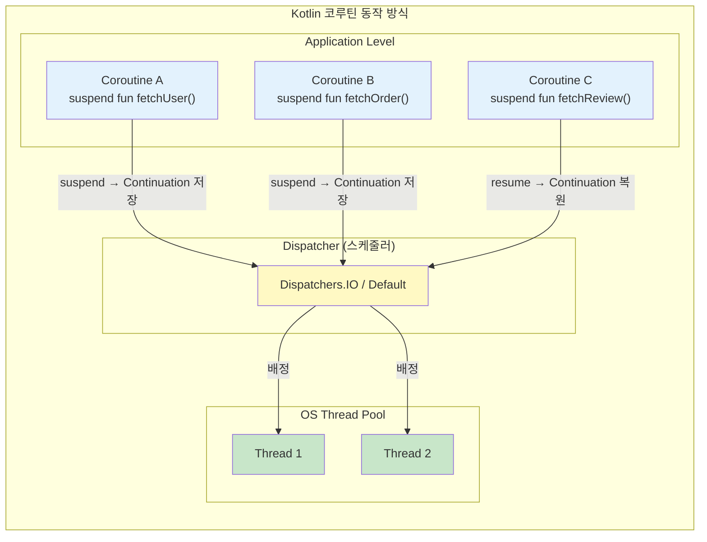
```mermaid
graph TB
    subgraph Coroutine["Kotlin 코루틴 동작 방식"]
        direction TB

        subgraph App["Application Level"]
            CO1["Coroutine A<br/>suspend fun fetchUser()"]
            CO2["Coroutine B<br/>suspend fun fetchOrder()"]
            CO3["Coroutine C<br/>suspend fun fetchReview()"]
        end

        subgraph Dispatcher["Dispatcher (스케줄러)"]
            D["Dispatchers.IO / Default"]
        end

        subgraph ThreadPool["OS Thread Pool"]
            TH1["Thread 1"]
            TH2["Thread 2"]
        end

        CO1 -->|"suspend → Continuation 저장"| D
        CO2 -->|"suspend → Continuation 저장"| D
        CO3 -->|"resume → Continuation 복원"| D
        D -->|"배정"| TH1
        D -->|"배정"| TH2
    end

    style CO1 fill:#E3F2FD
    style CO2 fill:#E3F2FD
    style CO3 fill:#E3F2FD
    style D fill:#FFF9C4
    style TH1 fill:#C8E6C9
    style TH2 fill:#C8E6C9
```

Kotlin 코루틴은 컴파일러가 `suspend` 함수를 CPS(Continuation Passing Style) 변환하여 상태 머신으로 만듭니다. 각 suspend 지점마다 현재 label과 지역변수를 Continuation 객체에 저장하고, 점유하던 스레드를 반환합니다. I/O가 완료되면 Dispatcher가 빈 스레드를 골라 코루틴을 재개하며, 이때 **재개되는 스레드가 원래 스레드와 다를 수 있습니다.** 컨텍스트 스위칭을 OS가 아닌 애플리케이션 레벨에서 수행하므로 비용이 극히 낮습니다.

### 버추얼 스레드의 동작 방식

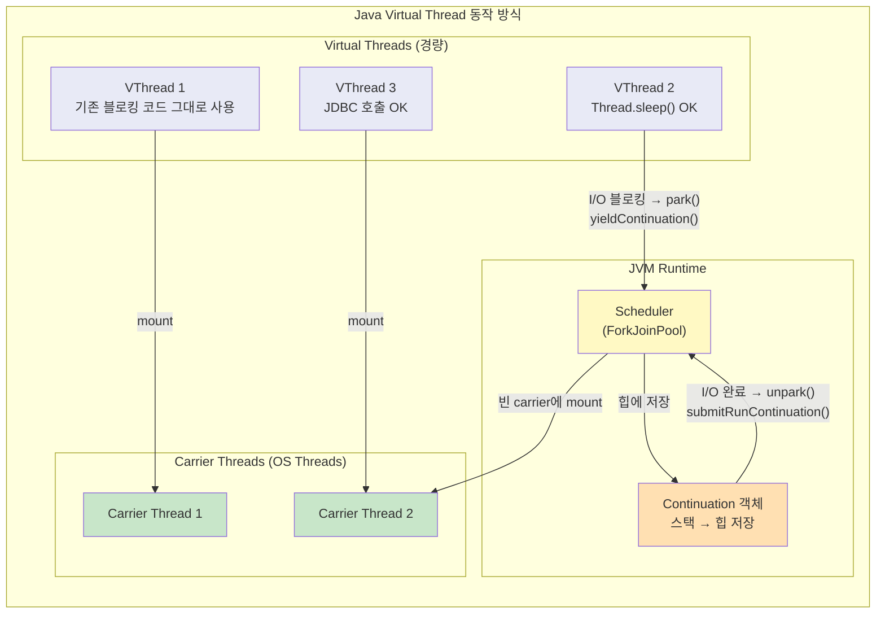
```mermaid
graph TB
    subgraph VT["Java Virtual Thread 동작 방식"]
        direction TB

        subgraph VThreads["Virtual Threads (경량)"]
            V1["VThread 1<br/>기존 블로킹 코드 그대로 사용"]
            V2["VThread 2<br/>Thread.sleep() OK"]
            V3["VThread 3<br/>JDBC 호출 OK"]
        end

        subgraph JVM["JVM Runtime"]
            SC["Scheduler<br/>(ForkJoinPool)"]
            CONT["Continuation 객체<br/>스택 → 힙 저장"]
        end

        subgraph Carrier["Carrier Threads (OS Threads)"]
            CT1["Carrier Thread 1"]
            CT2["Carrier Thread 2"]
        end

        V1 -->|"mount"| CT1
        V2 -->|"I/O 블로킹 → park()<br/>yieldContinuation()"| SC
        SC -->|"힙에 저장"| CONT
        CONT -->|"I/O 완료 → unpark()<br/>submitRunContinuation()"| SC
        SC -->|"빈 carrier에 mount"| CT2
        V3 -->|"mount"| CT2
    end

    style V1 fill:#E8EAF6
    style V2 fill:#E8EAF6
    style V3 fill:#E8EAF6
    style SC fill:#FFF9C4
    style CONT fill:#FFE0B2
    style CT1 fill:#C8E6C9
    style CT2 fill:#C8E6C9
```

Java Virtual Thread는 JVM 레벨에서 경량 스레드를 제공합니다. Virtual Thread는 실제 OS 스레드(Carrier Thread) 위에 mount되어 실행되다가, 블로킹 I/O를 만나면 `park()`가 호출됩니다. 이때 `yieldContinuation()`을 통해 현재 스택 정보를 힙에 저장하고, carrier thread를 해방합니다. I/O가 완료되면 `unpark()`가 호출되어 `submitRunContinuation()`으로 ForkJoinPool에 작업을 제출하고, 빈 carrier thread에서 재개됩니다.

코루틴과 같은 Continuation 개념을 사용하지만 결정적인 차이가 있습니다:
- **코루틴**: `suspend` 키워드로 개발자가 중단 지점을 명시
- **Virtual Thread**: JVM이 블로킹 호출을 **자동 감지**하여 unmount

기존의 `Thread.sleep()`이나 JDBC 호출을 그대로 쓸 수 있다는 것이 최대 장점입니다. 단, `synchronized` 블록 안에서 I/O가 발생하면 carrier thread가 **pin**되어 성능이 저하될 수 있으므로, `ReentrantLock`으로 대체하는 것이 권장됩니다.

### 웹플럭스의 동작 방식

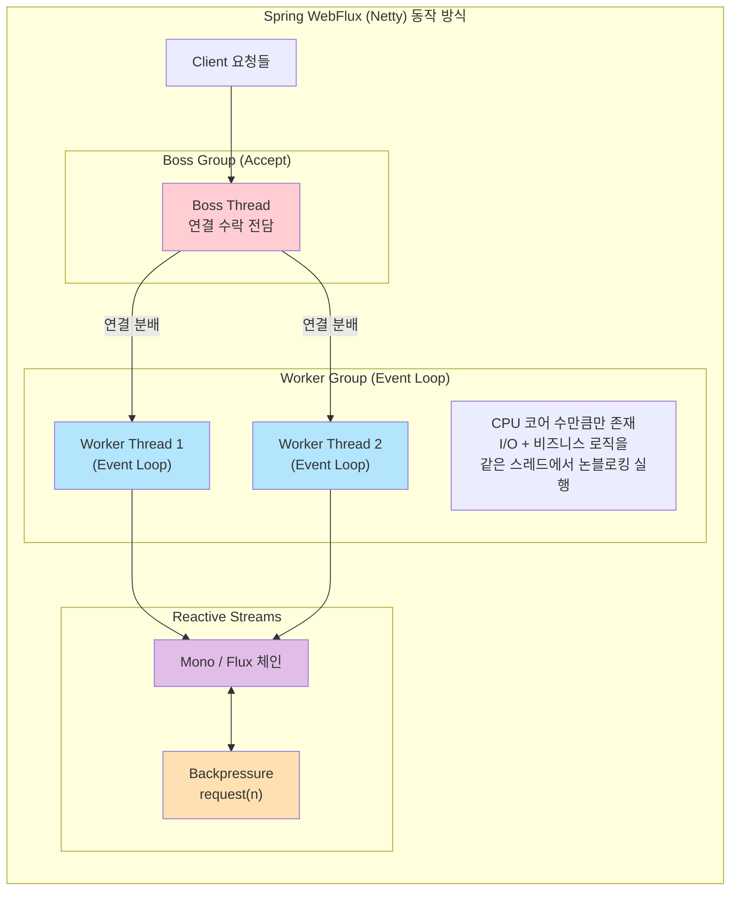
```mermaid
graph TB
    subgraph WF["Spring WebFlux (Netty) 동작 방식"]
        direction TB

        CLIENT["Client 요청들"]

        subgraph Boss["Boss Group (Accept)"]
            BT["Boss Thread<br/>연결 수락 전담"]
        end

        subgraph Worker["Worker Group (Event Loop)"]
            W1["Worker Thread 1<br/>(Event Loop)"]
            W2["Worker Thread 2<br/>(Event Loop)"]
            NOTE["CPU 코어 수만큼만 존재<br/>I/O + 비즈니스 로직을<br/>같은 스레드에서 논블로킹 실행"]
        end

        subgraph Reactive["Reactive Streams"]
            MONO["Mono / Flux 체인"]
            BP["Backpressure<br/>request(n)"]
        end

        CLIENT --> BT
        BT -->|"연결 분배"| W1
        BT -->|"연결 분배"| W2
        W1 --> MONO
        W2 --> MONO
        MONO <--> BP
    end

    style BT fill:#FFCDD2
    style W1 fill:#B3E5FC
    style W2 fill:#B3E5FC
    style MONO fill:#E1BEE7
    style BP fill:#FFE0B2
```

Spring WebFlux는 Netty 기반의 이벤트 루프 모델을 사용합니다. 연결 수락만 담당하는 Boss Group과 실제 I/O 읽기/쓰기 및 비즈니스 로직을 처리하는 Worker Group으로 나뉩니다.

**주의할 점:** Worker Group의 이벤트 루프 스레드가 I/O와 비즈니스 로직을 **모두 같은 스레드에서 논블로킹으로 실행**합니다. 별도의 "비동기 처리 전용 스레드"가 존재하는 것이 아닙니다.

모든 작업이 Reactive Streams 스펙의 Publisher-Subscriber 패턴으로 동작하며, 소비자가 `request(n)`으로 처리 속도를 제어하는 배압(backpressure)을 네이티브로 지원합니다. CPU 코어 수만큼의 극소수 스레드만으로 수만 개의 동시 연결을 처리할 수 있지만, 모든 코드가 Mono/Flux 체인으로 작성되어야 해서 가독성과 디버깅 난이도가 높습니다.

### 톰캣 vs 네티에서의 코루틴 — 흔한 오해 바로잡기

코루틴을 톰캣에서 쓸 때와 네티에서 쓸 때의 차이는 실무에서 매우 중요하지만, 자주 오해되는 부분입니다.

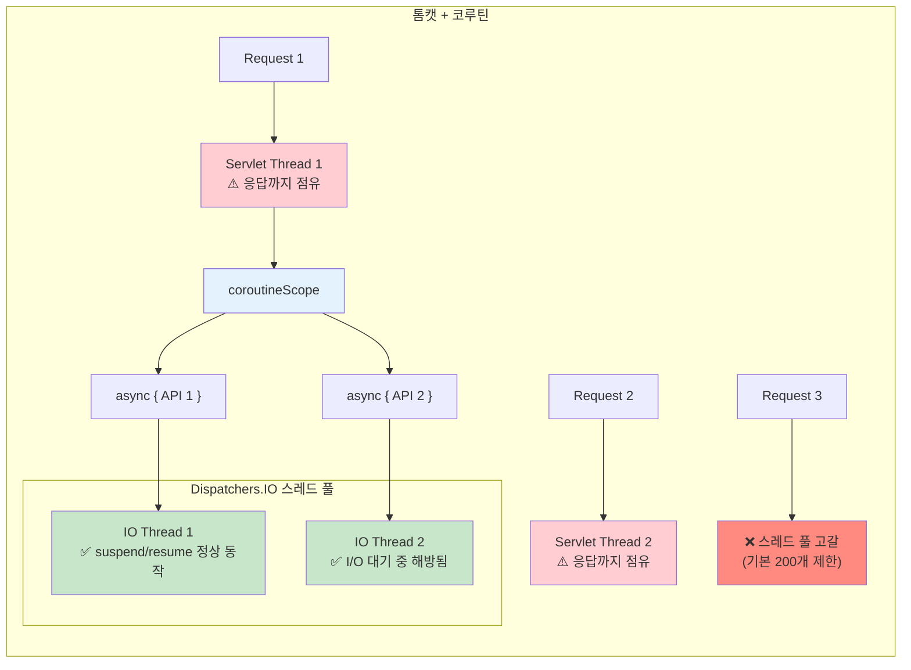
```mermaid
graph TB
    subgraph Tomcat["톰캣 + 코루틴"]
        direction TB

        REQ1["Request 1"] --> ST1["Servlet Thread 1<br/>⚠️ 응답까지 점유"]
        REQ2["Request 2"] --> ST2["Servlet Thread 2<br/>⚠️ 응답까지 점유"]
        REQ3["Request 3"] --> ST3["❌ 스레드 풀 고갈<br/>(기본 200개 제한)"]

        ST1 --> CS1["coroutineScope"]
        CS1 --> A1["async { API 1 }"]
        CS1 --> A2["async { API 2 }"]

        subgraph IO_Pool["Dispatchers.IO 스레드 풀"]
            IO1["IO Thread 1<br/>✅ suspend/resume 정상 동작"]
            IO2["IO Thread 2<br/>✅ I/O 대기 중 해방됨"]
        end

        A1 --> IO1
        A2 --> IO2
    end

    style ST1 fill:#FFCDD2
    style ST2 fill:#FFCDD2
    style ST3 fill:#FF8A80
    style IO1 fill:#C8E6C9
    style IO2 fill:#C8E6C9
    style CS1 fill:#E3F2FD
```

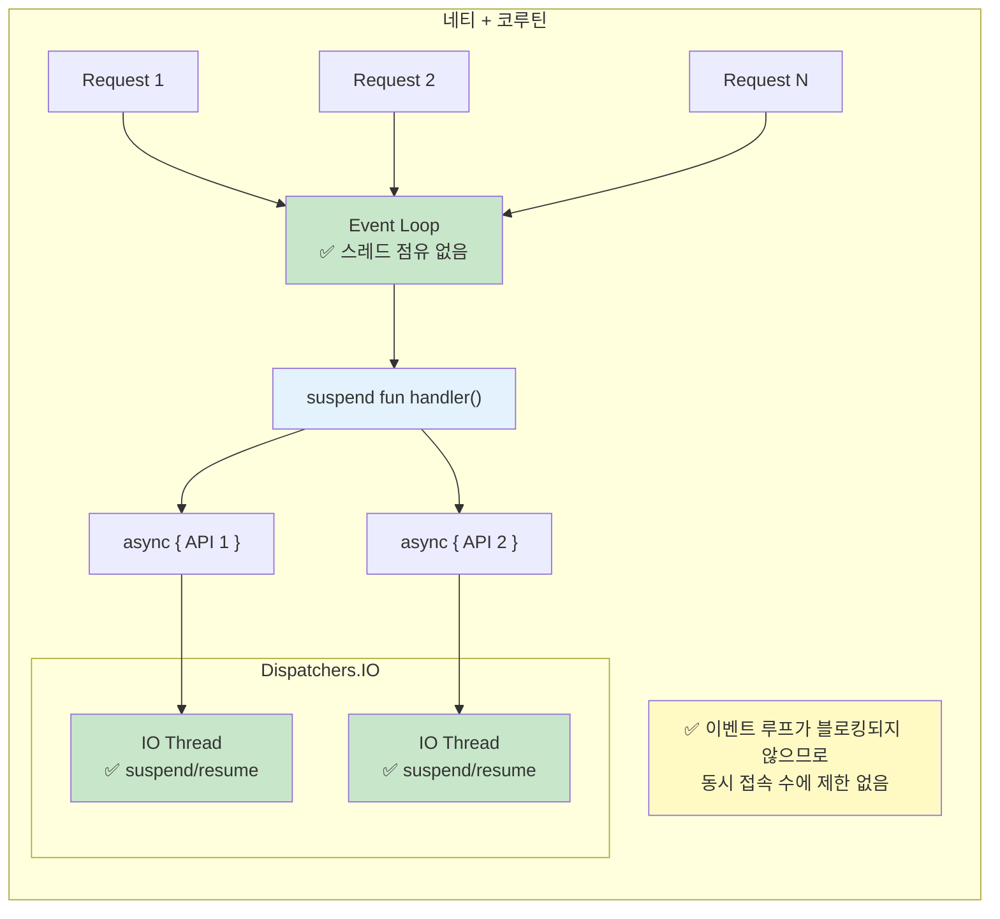
```mermaid
graph TB
    subgraph Netty_Coroutine["네티 + 코루틴"]
        direction TB

        RQ1["Request 1"] --> EL["Event Loop<br/>✅ 스레드 점유 없음"]
        RQ2["Request 2"] --> EL
        RQ3["Request N"] --> EL

        EL --> SC["suspend fun handler()"]
        SC --> AC1["async { API 1 }"]
        SC --> AC2["async { API 2 }"]

        subgraph IO["Dispatchers.IO"]
            I1["IO Thread<br/>✅ suspend/resume"]
            I2["IO Thread<br/>✅ suspend/resume"]
        end

        AC1 --> I1
        AC2 --> I2

        NOTE2["✅ 이벤트 루프가 블로킹되지 않으므로<br/>동시 접속 수에 제한 없음"]
    end

    style EL fill:#C8E6C9
    style SC fill:#E3F2FD
    style I1 fill:#C8E6C9
    style I2 fill:#C8E6C9
    style NOTE2 fill:#FFF9C4
```

**"톰캣에서 코루틴을 쓰면 JVM 스레드가 블로킹된다"**는 표현은 **절반만 맞습니다.**

- 코루틴의 `Dispatchers.IO` 스레드들 사이에서는 suspend/resume이 **정상적으로 동작**하며, I/O 대기 중 IO 스레드는 해방됩니다.
- **진짜 병목은 코루틴이 아니라 톰캣의 서블릿 스레드**입니다. 톰캣은 1 request per 1 servlet thread 모델이므로, 요청을 받은 서블릿 스레드는 내부에서 코루틴을 아무리 잘 써도 **응답을 보낼 때까지 점유 상태**를 유지합니다.

따라서 **"톰캣에서 코루틴이 아무 의미 없다"는 결론은 잘못**입니다:
- 하나의 서블릿 스레드 안에서 `async`로 여러 I/O를 병렬 호출하면 **총 응답 시간이 단축**되는 이점이 분명히 있습니다.
- 다만 **동시 접속 수를 스케일링**하는 데는 서블릿 스레드 풀(기본 200개)이 병목이 되어 한계가 있습니다.
- 네티 환경에서는 이벤트 루프가 스레드 점유 없이 요청을 처리하므로 이 병목이 사라집니다.

### 세 기술 비교 요약

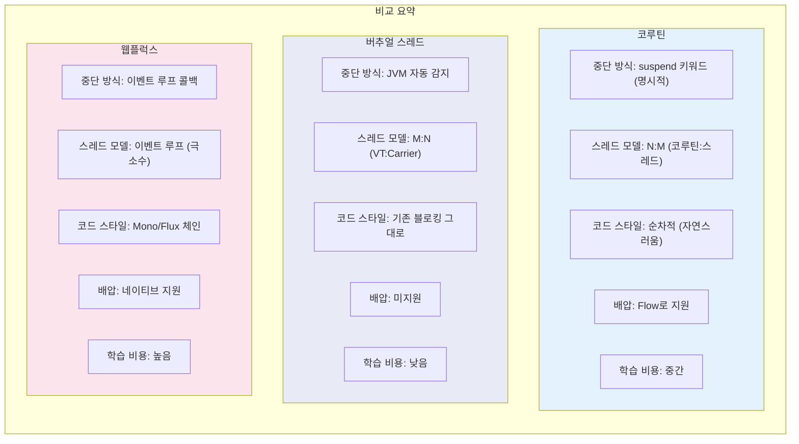
```mermaid
graph LR
    subgraph Compare["비교 요약"]
        direction TB

        subgraph CR["코루틴"]
            CR1["중단 방식: suspend 키워드 (명시적)"]
            CR2["스레드 모델: N:M (코루틴:스레드)"]
            CR3["코드 스타일: 순차적 (자연스러움)"]
            CR4["배압: Flow로 지원"]
            CR5["학습 비용: 중간"]
        end

        subgraph VTH["버추얼 스레드"]
            VT1["중단 방식: JVM 자동 감지"]
            VT2["스레드 모델: M:N (VT:Carrier)"]
            VT3["코드 스타일: 기존 블로킹 그대로"]
            VT4["배압: 미지원"]
            VT5["학습 비용: 낮음"]
        end

        subgraph WFX["웹플럭스"]
            WF1["중단 방식: 이벤트 루프 콜백"]
            WF2["스레드 모델: 이벤트 루프 (극소수)"]
            WF3["코드 스타일: Mono/Flux 체인"]
            WF4["배압: 네이티브 지원"]
            WF5["학습 비용: 높음"]
        end
    end

    style CR fill:#E3F2FD
    style VTH fill:#E8EAF6
    style WFX fill:#FCE4EC
```

---

# 코루틴의 동작

## 동작 원리 — CPS 변환과 상태 머신

Kotlin 컴파일러는 `suspend` 함수를 만나면 CPS(Continuation Passing Style) 변환을 수행합니다. 각 중단 지점을 기준으로 코드를 label로 분할하고, 함수 전체를 하나의 상태 머신으로 변환합니다.

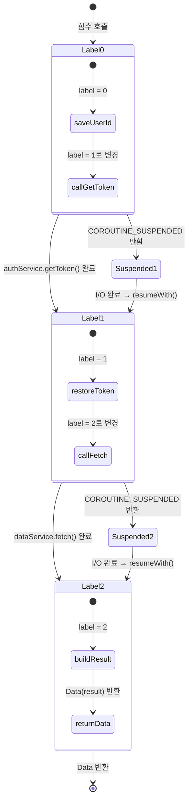
```mermaid
stateDiagram-v2
    [*] --> Label0: 함수 호출
    Label0 --> Label1: authService.getToken() 완료
    Label0 --> Suspended1: COROUTINE_SUSPENDED 반환
    Suspended1 --> Label1: I/O 완료 → resumeWith()
    Label1 --> Label2: dataService.fetch() 완료
    Label1 --> Suspended2: COROUTINE_SUSPENDED 반환
    Suspended2 --> Label2: I/O 완료 → resumeWith()
    Label2 --> [*]: Data 반환

    state Label0 {
        [*] --> saveUserId: label = 0
        saveUserId --> callGetToken: label = 1로 변경
    }

    state Label1 {
        [*] --> restoreToken: label = 1
        restoreToken --> callFetch: label = 2로 변경
    }

    state Label2 {
        [*] --> buildResult: label = 2
        buildResult --> returnData: Data(result) 반환
    }
```

```kotlin
// 원본 suspend 함수
suspend fun fetchData(userId: String): Data {
    val token = authService.getToken(userId)    // suspension point 1
    val data = dataService.fetch(token)          // suspension point 2
    return Data(data)
}

// 컴파일러 변환 후 (의사 코드)
fun fetchData(userId: String, cont: Continuation<Data>): Any? {
    val sm = cont as? FetchDataSM ?: FetchDataSM(cont)
    when (sm.label) {
        0 -> {
            sm.userId = userId
            sm.label = 1
            val result = authService.getToken(userId, sm)
            if (result == COROUTINE_SUSPENDED) return COROUTINE_SUSPENDED
            sm.result = result
        }
        1 -> {
            sm.token = sm.result as String
            sm.label = 2
            val result = dataService.fetch(sm.token, sm)
            if (result == COROUTINE_SUSPENDED) return COROUTINE_SUSPENDED
            sm.result = result
        }
        2 -> {
            val data = sm.result as RawData
            return Data(data)
        }
    }
}
```

각 suspend 호출이 `COROUTINE_SUSPENDED`를 반환하면, 함수는 즉시 리턴하고 스레드가 해방됩니다. I/O가 완료되면 Continuation의 `resumeWith()`가 호출되어 저장된 label 위치부터 실행을 이어갑니다. 버추얼 스레드도 Continuation 객체를 사용하지만, JVM이 블로킹 호출을 자동 감지하여 `yieldContinuation()`으로 힙에 스택을 저장한다는 점에서 메커니즘이 다릅니다.

## 코루틴 사용 방법

### 코루틴 빌더: runBlocking, launch, async

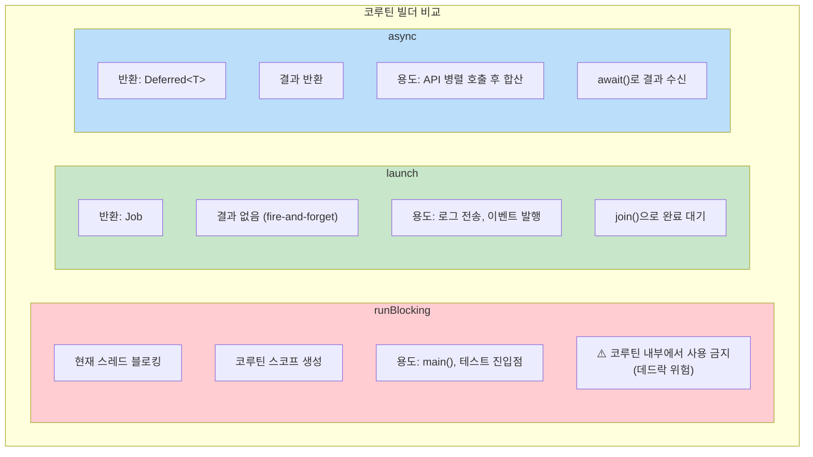
```mermaid
graph TB
    subgraph Builders["코루틴 빌더 비교"]
        direction LR

        subgraph RB["runBlocking"]
            RB1["현재 스레드 블로킹"]
            RB2["코루틴 스코프 생성"]
            RB3["용도: main(), 테스트 진입점"]
            RB4["⚠️ 코루틴 내부에서 사용 금지<br/>(데드락 위험)"]
        end

        subgraph LA["launch"]
            LA1["반환: Job"]
            LA2["결과 없음 (fire-and-forget)"]
            LA3["용도: 로그 전송, 이벤트 발행"]
            LA4["join()으로 완료 대기"]
        end

        subgraph AS["async"]
            AS1["반환: Deferred&lt;T&gt;"]
            AS2["결과 반환"]
            AS3["용도: API 병렬 호출 후 합산"]
            AS4["await()로 결과 수신"]
        end
    end

    style RB fill:#FFCDD2
    style LA fill:#C8E6C9
    style AS fill:#BBDEFB
```

```kotlin
import kotlinx.coroutines.*

// 1) runBlocking — 현재 스레드를 블로킹하며 코루틴 스코프 생성
//    main 함수나 테스트에서 진입점으로만 사용
fun main() = runBlocking {
    println("Start on ${Thread.currentThread().name}")

    // 2) launch — 결과 없는 "fire-and-forget" 코루틴 (반환: Job)
    val job = launch {
        delay(1000)
        println("launch 완료")
    }

    // 3) async — 결과를 반환하는 코루틴 (반환: Deferred<T>)
    val deferred = async {
        delay(500)
        42  // 결과 값
    }

    val result = deferred.await()  // suspend (블로킹 아님)
    println("async 결과: $result")
    job.join()
}
```

`launch`는 `Job`을 반환하여 생명주기(취소, 조인)만 제어하고, `async`는 `Deferred<T>`를 반환하여 `await()`로 결과를 받습니다. 여러 API 병렬 호출 후 결과 합산에는 `async`, 로그 전송이나 이벤트 발행 같은 부수 효과에는 `launch`를 씁니다.

### runBlocking — 현재 스레드를 막는 진입점

`runBlocking`은 새로운 코루틴을 시작하면서 **현재 스레드를 블로킹**하여 내부 코루틴이 전부 완료될 때까지 기다립니다. 코루틴 세계와 일반 blocking 세계의 **다리 역할**입니다.

```kotlin
// ✅ 사용해도 되는 경우
fun main() = runBlocking {          // 메인 함수 진입점
    launch { delay(1000); println("done") }
}

@Test
fun test() = runBlocking {          // 테스트 진입점
    val result = fetchData()
    assertEquals("expected", result)
}

// ❌ 절대 금지 — 코루틴 내부에서 runBlocking 호출 → 데드락
fun main() = runBlocking {
    launch {
        runBlocking {               // ← 이미 점유된 스레드를 다시 블로킹 → 데드락!
            delay(1000)
        }
    }
}
```

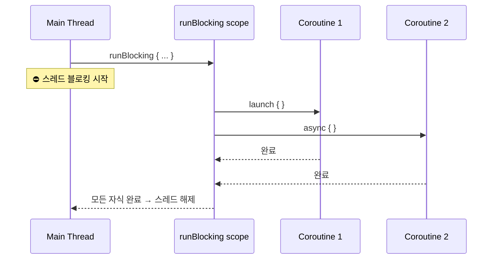
```mermaid
sequenceDiagram
    participant MT as Main Thread
    participant RB as runBlocking scope
    participant C1 as Coroutine 1
    participant C2 as Coroutine 2

    MT->>RB: runBlocking { ... }
    Note over MT: ⛔ 스레드 블로킹 시작
    RB->>C1: launch { }
    RB->>C2: async { }
    C1-->>RB: 완료
    C2-->>RB: 완료
    RB-->>MT: 모든 자식 완료 → 스레드 해제
```

`runBlocking`은 Dispatcher를 지정하지 않으면 호출한 스레드에서 직접 코루틴을 실행합니다. 프로덕션 서버 코드(Spring, Ktor 등)에서는 프레임워크가 이미 코루틴 스코프를 제공하므로 `runBlocking`을 직접 쓸 일이 거의 없습니다.

---

### Job — 코루틴의 생명주기 핸들

`launch`가 반환하는 `Job`은 코루틴의 **생명주기를 추적하고 제어**하는 핸들입니다. 코루틴의 상태를 조회하거나, 완료를 기다리거나, 취소할 수 있습니다.

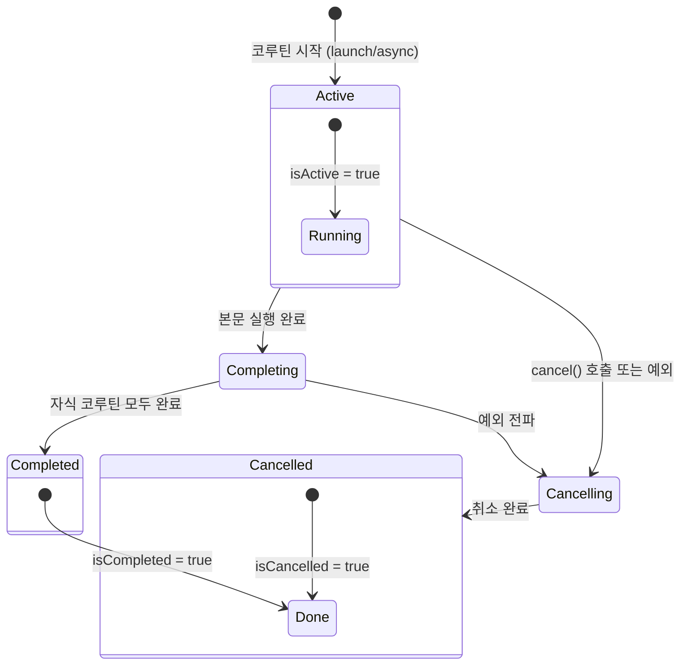
```mermaid
stateDiagram-v2
    [*] --> Active: 코루틴 시작 (launch/async)
    Active --> Completing: 본문 실행 완료
    Completing --> Completed: 자식 코루틴 모두 완료
    Active --> Cancelling: cancel() 호출 또는 예외
    Completing --> Cancelling: 예외 전파
    Cancelling --> Cancelled: 취소 완료

    state Active {
        [*] --> Running: isActive = true
    }
    state Completed {
        [*] --> Done: isCompleted = true
    }
    state Cancelled {
        [*] --> Done: isCancelled = true
    }
```

```kotlin
fun main() = runBlocking {
    val job = launch {
        repeat(5) { i ->
            println("작업 $i — isActive: ${coroutineContext[Job]?.isActive}")
            delay(500)
        }
    }

    println("isActive: ${job.isActive}")        // true
    println("isCompleted: ${job.isCompleted}")  // false
    println("isCancelled: ${job.isCancelled}")  // false

    delay(1200)
    job.cancel()                 // 취소 신호 전송 (즉시 종료 X, 다음 suspend 지점에서 취소)
    job.join()                   // 취소가 완전히 완료될 때까지 대기
    println("isCancelled: ${job.isCancelled}")  // true
}
```

#### 부모-자식 Job 계층

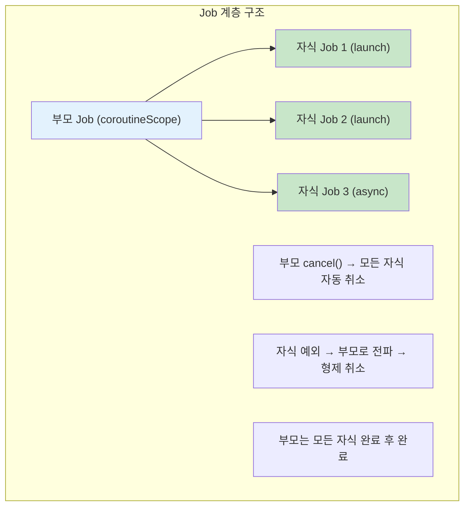
```mermaid
graph TB
    subgraph JobTree["Job 계층 구조"]
        PJ["부모 Job (coroutineScope)"]
        CJ1["자식 Job 1 (launch)"]
        CJ2["자식 Job 2 (launch)"]
        CJ3["자식 Job 3 (async)"]

        PJ --> CJ1
        PJ --> CJ2
        PJ --> CJ3

        NOTE1["부모 cancel() → 모든 자식 자동 취소"]
        NOTE2["자식 예외 → 부모로 전파 → 형제 취소"]
        NOTE3["부모는 모든 자식 완료 후 완료"]
    end

    style PJ fill:#E3F2FD
    style CJ1 fill:#C8E6C9
    style CJ2 fill:#C8E6C9
    style CJ3 fill:#C8E6C9
```

```kotlin
fun main() = runBlocking {
    val parentJob = launch {
        val child1 = launch {
            delay(1000)
            println("child1 완료")
        }
        val child2 = launch {
            delay(2000)
            println("child2 완료")
        }
        // 부모가 먼저 끝나더라도 자식이 끝날 때까지 Completing 상태로 대기
    }

    delay(500)
    parentJob.cancel()         // child1, child2도 자동 취소됨
    parentJob.join()
    println("모두 취소 완료")
}
```

#### SupervisorJob — 자식 간 예외 격리

일반 `Job`은 한 자식이 실패하면 나머지 자식도 취소됩니다. `SupervisorJob`을 사용하면 자식이 서로 독립적으로 동작합니다.

```kotlin
// 일반 Job — 하나 실패 → 형제도 취소
val scope1 = CoroutineScope(Job() + Dispatchers.Default)
scope1.launch { throw RuntimeException("실패") }  // 형제 코루틴도 함께 취소

// SupervisorJob — 하나 실패 → 나머지는 계속 실행
val scope2 = CoroutineScope(SupervisorJob() + Dispatchers.Default)
scope2.launch { throw RuntimeException("실패") }  // 이 코루틴만 취소됨
scope2.launch { delay(1000); println("나는 살아있음") }  // 정상 실행
```

| | `Job` | `SupervisorJob` |
|---|---|---|
| 자식 실패 시 | 모든 자식 취소 | 실패한 자식만 취소 |
| 적합한 사용 | 트랜잭션처럼 전부 성공해야 할 때 | 대시보드 위젯 등 독립 작업 |

---

### Deferred<T> — 결과를 반환하는 Job

`Deferred<T>`는 `Job`의 서브타입으로, `async` 빌더가 반환합니다. `Job`의 생명주기 기능을 모두 갖추면서 추가로 **결과 값**을 반환합니다.

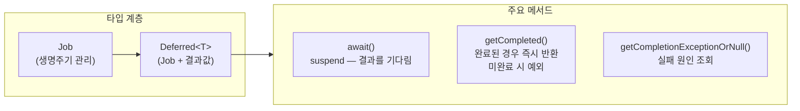
```mermaid
graph LR
    subgraph DeferredHierarchy["타입 계층"]
        JOB["Job\n(생명주기 관리)"]
        DEF["Deferred&lt;T&gt;\n(Job + 결과값)"]
        JOB --> DEF
    end

    subgraph Methods["주요 메서드"]
        direction TB
        AW["await()\nsuspend — 결과를 기다림"]
        GT["getCompleted()\n완료된 경우 즉시 반환\n미완료 시 예외"]
        CE["getCompletionExceptionOrNull()\n실패 원인 조회"]
    end

    DEF --> Methods
```

```kotlin
fun main() = runBlocking {
    // 1. 즉시 시작되는 async (기본 동작)
    val deferred: Deferred<Int> = async {
        delay(1000)
        42
    }

    println("계산 중...")
    val result = deferred.await()    // 완료될 때까지 suspend (스레드 블로킹 아님)
    println("결과: $result")        // 결과: 42

    // 2. 지연 시작 — start = CoroutineStart.LAZY
    val lazyDeferred = async(start = CoroutineStart.LAZY) {
        heavyComputation()
    }
    // 아직 실행 안 됨
    lazyDeferred.start()             // 명시적으로 시작하거나
    val value = lazyDeferred.await() // await() 호출 시 자동 시작

    // 3. 취소와 예외
    val failing = async { throw IOException("네트워크 오류") }
    try {
        failing.await()              // 예외가 여기서 던져짐
    } catch (e: IOException) {
        println("처리: ${e.message}")
    }
}
```

**`async`의 핵심 패턴 — 병렬 실행:**

```kotlin
suspend fun fetchAll(): Result = coroutineScope {
    // await() 전에 async를 먼저 다 띄워야 병렬 실행됨!
    val userDeferred = async { userService.getUser() }     // 즉시 시작
    val orderDeferred = async { orderService.getOrders() } // 즉시 시작
    val reviewDeferred = async { reviewService.getReviews() } // 즉시 시작

    // ❌ 잘못된 패턴 — 순차 실행이 되어버림
    // val user = async { userService.getUser() }.await()  // await가 바로 호출되면 순차!

    Result(
        user = userDeferred.await(),
        orders = orderDeferred.await(),
        reviews = reviewDeferred.await()
    )
}
```

---

### CoroutineContext와 CoroutineScope

#### CoroutineContext — 코루틴의 실행 환경

`CoroutineContext`는 코루틴 실행에 필요한 **설정 요소들의 집합**입니다. `+` 연산자로 여러 요소를 조합합니다.

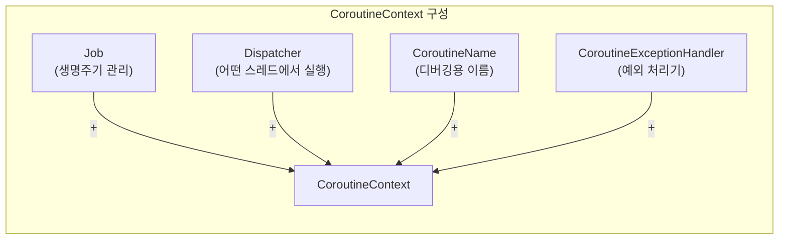
```mermaid
graph LR
    subgraph Context["CoroutineContext 구성"]
        direction TB
        JB["Job\n(생명주기 관리)"]
        DS["Dispatcher\n(어떤 스레드에서 실행)"]
        CN["CoroutineName\n(디버깅용 이름)"]
        EH["CoroutineExceptionHandler\n(예외 처리기)"]

        JB -->|"+"| COMBINE
        DS -->|"+"| COMBINE
        CN -->|"+"| COMBINE
        EH -->|"+"| COMBINE
        COMBINE["CoroutineContext"]
    end
```

```kotlin
val context = Job() +
    Dispatchers.IO +
    CoroutineName("MyCoroutine") +
    CoroutineExceptionHandler { _, e -> println("오류: $e") }

// 현재 코루틴의 컨텍스트 요소 접근
launch(context) {
    println(coroutineContext[Job])                    // 현재 Job
    println(coroutineContext[CoroutineDispatcher])    // 현재 Dispatcher
    println(coroutineContext[CoroutineName]?.name)    // "MyCoroutine"
}
```

#### CoroutineScope — 코루틴을 시작하는 범위

`CoroutineScope`는 `CoroutineContext`를 포함하며, 그 안에서 시작된 모든 코루틴의 **생명주기를 묶어서 관리**합니다.

```kotlin
// 커스텀 스코프 생성
class MyRepository {
    // 직접 스코프 생성 — 반드시 cancel()을 호출해야 누수 없음
    private val scope = CoroutineScope(SupervisorJob() + Dispatchers.IO)

    fun startWork() {
        scope.launch { heavyIoWork() }
    }

    fun cleanup() {
        scope.cancel()  // 이 스코프에서 실행 중인 모든 코루틴 취소
    }
}

// suspend 함수 내부 — coroutineScope { } 사용 권장
suspend fun doWork() = coroutineScope {
    // 이 블록 안에서 새 스코프 생성
    // 부모 코루틴의 컨텍스트를 상속받음
    launch { subtask1() }
    launch { subtask2() }
}  // 모든 자식이 완료될 때 반환
```

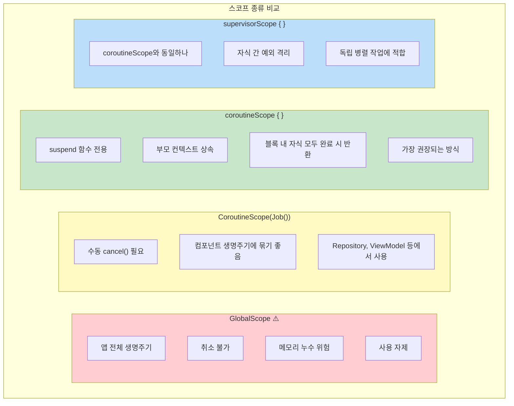
```mermaid
graph TB
    subgraph ScopeTypes["스코프 종류 비교"]
        direction LR

        subgraph GS["GlobalScope ⚠️"]
            GS1["앱 전체 생명주기"]
            GS2["취소 불가"]
            GS3["메모리 누수 위험"]
            GS4["사용 자제"]
        end

        subgraph CS["CoroutineScope(Job())"]
            CS1["수동 cancel() 필요"]
            CS2["컴포넌트 생명주기에 묶기 좋음"]
            CS3["Repository, ViewModel 등에서 사용"]
        end

        subgraph CSS["coroutineScope { }"]
            CSS1["suspend 함수 전용"]
            CSS2["부모 컨텍스트 상속"]
            CSS3["블록 내 자식 모두 완료 시 반환"]
            CSS4["가장 권장되는 방식"]
        end

        subgraph SS["supervisorScope { }"]
            SS1["coroutineScope와 동일하나"]
            SS2["자식 간 예외 격리"]
            SS3["독립 병렬 작업에 적합"]
        end
    end

    style GS fill:#FFCDD2
    style CS fill:#FFF9C4
    style CSS fill:#C8E6C9
    style SS fill:#BBDEFB
```

**컨텍스트 상속 규칙:**

```kotlin
fun main() = runBlocking(CoroutineName("Root")) {
    println(coroutineContext[CoroutineName]?.name)  // "Root"

    launch {
        // 부모 컨텍스트 상속 → CoroutineName = "Root"
        println(coroutineContext[CoroutineName]?.name)  // "Root"
    }

    launch(CoroutineName("Child")) {
        // 명시적 지정 → 덮어씀
        println(coroutineContext[CoroutineName]?.name)  // "Child"

        launch {
            // "Child" 상속
            println(coroutineContext[CoroutineName]?.name)  // "Child"
        }
    }
}
```

---

### Dispatcher — 코루틴이 어떤 스레드에서 실행될지 결정

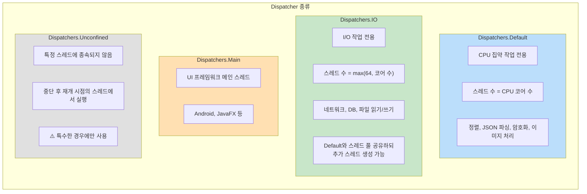
```mermaid
graph TB
    subgraph Dispatchers["Dispatcher 종류"]
        direction TB

        subgraph Default["Dispatchers.Default"]
            D_DESC["CPU 집약 작업 전용"]
            D_POOL["스레드 수 = CPU 코어 수"]
            D_USE["정렬, JSON 파싱, 암호화, 이미지 처리"]
        end

        subgraph IO["Dispatchers.IO"]
            IO_DESC["I/O 작업 전용"]
            IO_POOL["스레드 수 = max(64, 코어 수)"]
            IO_USE["네트워크, DB, 파일 읽기/쓰기"]
            IO_NOTE["Default와 스레드 풀 공유하되<br/>추가 스레드 생성 가능"]
        end

        subgraph Main["Dispatchers.Main"]
            M_DESC["UI 프레임워크 메인 스레드"]
            M_USE["Android, JavaFX 등"]
        end

        subgraph Unconfined["Dispatchers.Unconfined"]
            U_DESC["특정 스레드에 종속되지 않음"]
            U_USE["중단 후 재개 시점의 스레드에서 실행"]
            U_NOTE["⚠️ 특수한 경우에만 사용"]
        end
    end

    style Default fill:#BBDEFB
    style IO fill:#C8E6C9
    style Main fill:#FFE0B2
    style Unconfined fill:#E0E0E0
```

```kotlin
fun main() = runBlocking {
    // Default: CPU 집약 작업
    val sorted = withContext(Dispatchers.Default) {
        hugeList.sortedBy { it.score }
    }

    // IO: 네트워크/DB/파일 작업
    val users = withContext(Dispatchers.IO) {
        database.getAllUsers()
    }

    // Dispatcher 간 전환
    launch(Dispatchers.IO) {
        val rawData = api.fetchRawData()              // IO 스레드
        val parsed = withContext(Dispatchers.Default) {
            parseJson(rawData)                         // Default로 전환
        }
        withContext(Dispatchers.Main) {
            updateUI(parsed)                           // Main으로 전환 (Android)
        }
    }
}
```

### 구조화된 동시성 (Structured Concurrency)

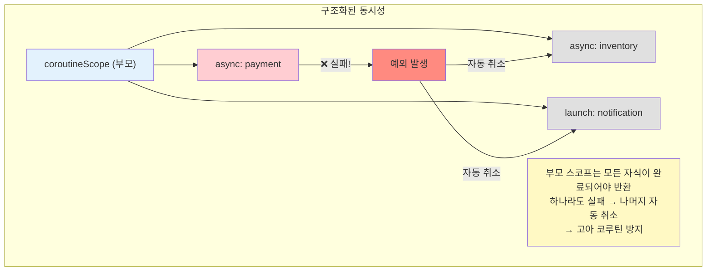
```mermaid
graph TB
    subgraph SC["구조화된 동시성"]
        PARENT["coroutineScope (부모)"]

        PARENT --> C1["async: payment"]
        PARENT --> C2["async: inventory"]
        PARENT --> C3["launch: notification"]

        C1 -->|"❌ 실패!"| CANCEL["예외 발생"]
        CANCEL -->|"자동 취소"| C2
        CANCEL -->|"자동 취소"| C3

        NOTE["부모 스코프는 모든 자식이 완료되어야 반환<br/>하나라도 실패 → 나머지 자동 취소<br/>→ 고아 코루틴 방지"]
    end

    style PARENT fill:#E3F2FD
    style C1 fill:#FFCDD2
    style C2 fill:#E0E0E0
    style C3 fill:#E0E0E0
    style CANCEL fill:#FF8A80
    style NOTE fill:#FFF9C4
```

```kotlin
suspend fun processOrder(orderId: String) = coroutineScope {
    val payment = async { paymentService.charge(orderId) }
    val inventory = async { inventoryService.reserve(orderId) }
    val notification = launch { notificationService.send(orderId) }

    // payment가 실패하면 → inventory, notification도 자동 취소됨
    val paymentResult = payment.await()
    val inventoryResult = inventory.await()

    OrderResult(paymentResult, inventoryResult)
}
```

## 코루틴의 예외 처리

코루틴의 예외 처리는 빌더 종류에 따라 다르게 동작하며, 이를 제대로 이해하지 않으면 예외가 삼켜지거나 예상치 못한 크래시가 발생합니다.

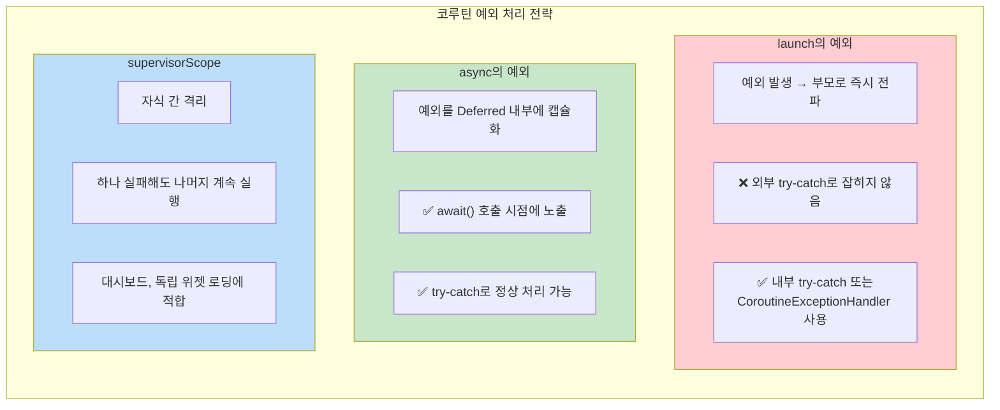
```mermaid
graph TB
    subgraph ExceptionHandling["코루틴 예외 처리 전략"]
        direction TB

        subgraph Launch["launch의 예외"]
            L1["예외 발생 → 부모로 즉시 전파"]
            L2["❌ 외부 try-catch로 잡히지 않음"]
            L3["✅ 내부 try-catch 또는<br/>CoroutineExceptionHandler 사용"]
        end

        subgraph Async["async의 예외"]
            A1["예외를 Deferred 내부에 캡슐화"]
            A2["✅ await() 호출 시점에 노출"]
            A3["✅ try-catch로 정상 처리 가능"]
        end

        subgraph Supervisor["supervisorScope"]
            S1["자식 간 격리"]
            S2["하나 실패해도 나머지 계속 실행"]
            S3["대시보드, 독립 위젯 로딩에 적합"]
        end
    end

    style Launch fill:#FFCDD2
    style Async fill:#C8E6C9
    style Supervisor fill:#BBDEFB
```

### launch — CoroutineExceptionHandler 사용

```kotlin
// ❌ 잘못된 방법 — launch의 예외는 try-catch로 잡히지 않음
fun main() = runBlocking {
    try {
        launch { throw RuntimeException("boom") }  // 부모로 전파 → 전체 취소
    } catch (e: Exception) {
        println("잡힘?")  // 여기 도달하지 않음!
    }
}

// ✅ 올바른 방법 1 — launch 내부에서 try-catch
launch {
    try { riskyOperation() }
    catch (e: Exception) { println("내부에서 처리: ${e.message}") }
}

// ✅ 올바른 방법 2 — CoroutineExceptionHandler
val handler = CoroutineExceptionHandler { _, ex ->
    println("Caught: ${ex.message}")
}
val scope = CoroutineScope(Dispatchers.Default + handler)
scope.launch { throw RuntimeException("boom") }  // handler에서 처리
```

### async — try-catch on await()

```kotlin
val deferred = async { throw RuntimeException("API 실패") }
try {
    deferred.await()  // 여기서 예외가 던져짐
} catch (e: Exception) {
    println("처리 완료: ${e.message}")  // 정상적으로 잡힘
}
```

### supervisorScope — 자식 간 격리

```kotlin
suspend fun loadDashboard() = supervisorScope {
    val weather = async {
        try { weatherApi.get() } catch (e: Exception) { WeatherWidget.Error(e) }
    }
    val news = async {
        try { newsApi.getHeadlines() } catch (e: Exception) { NewsWidget.Error(e) }
    }
    // 하나 실패해도 나머지 계속 실행
    Dashboard(weather = weather.await(), news = news.await())
}
```

### ⚠️ CancellationException은 절대 catch하지 마세요

코루틴의 취소 메커니즘이 `CancellationException`으로 동작합니다. 이를 잡으면 코루틴이 정상 취소되지 않아 **리소스 누수**가 발생합니다.

```kotlin
// ⚠️ Exception을 catch할 때는 반드시 CancellationException 재전파
try {
    suspendFunction()
} catch (e: Exception) {
    if (e is CancellationException) throw e  // 반드시 재전파!
    handleError(e)
}
```

## 코루틴 장점과 단점, 언제 써야 하는가

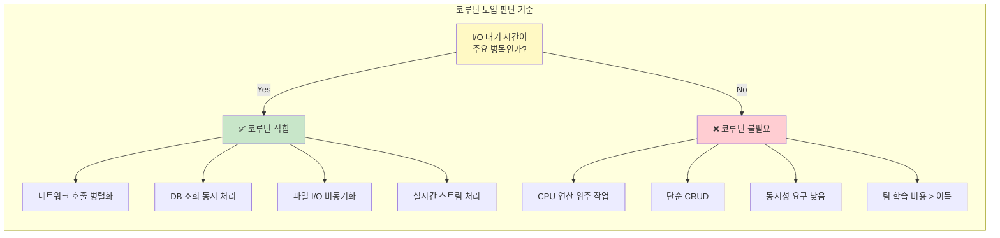
```mermaid
graph LR
    subgraph Decision["코루틴 도입 판단 기준"]
        direction TB

        Q["I/O 대기 시간이<br/>주요 병목인가?"]

        Q -->|"Yes"| USE["✅ 코루틴 적합"]
        Q -->|"No"| SKIP["❌ 코루틴 불필요"]

        USE --> U1["네트워크 호출 병렬화"]
        USE --> U2["DB 조회 동시 처리"]
        USE --> U3["파일 I/O 비동기화"]
        USE --> U4["실시간 스트림 처리"]

        SKIP --> S1["CPU 연산 위주 작업"]
        SKIP --> S2["단순 CRUD"]
        SKIP --> S3["동시성 요구 낮음"]
        SKIP --> S4["팀 학습 비용 > 이득"]
    end

    style Q fill:#FFF9C4
    style USE fill:#C8E6C9
    style SKIP fill:#FFCDD2
```

**장점:**
- 경량성 — 수십만 개 동시 생성 가능
- 순차적 코드 스타일로 비동기 로직 작성
- 구조화된 동시성으로 생명주기 자동 관리
- try-catch 기반 자연스러운 예외 처리
- Flow를 통한 리액티브 스트림 지원

**단점:**
- 코루틴 내부 블로킹 호출 시 스레드 전체가 멈춤
- 스택 트레이스가 실제 호출과 다름
- suspend 함수의 "색깔 문제" (suspend는 코루틴 안에서만 호출 가능)
- 팀 전체의 학습 비용

---

# 코루틴의 데이터 통신 방법

```mermaid
graph LR
    subgraph DataComm["데이터 통신 메커니즘 비교"]
        direction TB

        subgraph CH["Channel"]
            CH1["Hot Stream — 수집자 없어도 실행"]
            CH2["코루틴 간 단방향 파이프"]
            CH3["send() / receive()"]
            CH4["버퍼 초과 시 자동 배압"]
        end

        subgraph SE["Sequence"]
            SE1["동기적 지연 평가 (코루틴 무관)"]
            SE2["yield()로 값을 하나씩 생산"]
            SE3["비동기 호출 불가 ⚠️"]
            SE4["무한 컬렉션, 대용량 변환에 적합"]
        end

        subgraph FL["Flow"]
            FL1["Cold Stream — collect 시점에 실행 시작"]
            FL2["suspend 함수 호출 가능"]
            FL3["map/filter/flatMap 등 풍부한 연산자"]
            FL4["StateFlow / SharedFlow로 파생 가능"]
        end
    end

    style CH fill:#FFCDD2
    style SE fill:#FFF9C4
    style FL fill:#BBDEFB
```

## Channel

Channel은 코루틴 간 데이터를 주고받는 **Hot 스트림 파이프**입니다. Go의 채널에서 영감을 받았으며, 생산자와 소비자가 각자의 코루틴에서 독립적으로 `send`/`receive`를 호출합니다. 버퍼가 가득 차면 생산자가 자동으로 suspend되어 소비자가 따라올 때까지 기다립니다(배압).

```mermaid
sequenceDiagram
    participant P as 생산자 코루틴
    participant CH as Channel (capacity=3)
    participant C as 소비자 코루틴

    P->>CH: send(1)
    P->>CH: send(4)
    P->>CH: send(9)
    Note over CH: 버퍼 가득 (3/3)
    P-->>P: ⏸️ suspend — 소비자가 받을 때까지 대기
    C->>CH: receive() → 1
    Note over CH: 빈자리 생김 (2/3)
    P->>CH: send(16) — 재개
    C->>CH: receive() → 4
    C->>CH: receive() → 9
    P->>CH: close()
    C->>CH: for 루프 종료 (채널 닫힘)
```

### Channel 버퍼 전략

```kotlin
// RENDEZVOUS (기본, capacity=0) — send와 receive가 동시에 만나야 전달
val rendezvous = Channel<Int>()
// send()는 receive()가 준비될 때까지 suspend, 그 반대도 마찬가지

// BUFFERED — 고정 크기 버퍼
val buffered = Channel<Int>(capacity = 10)

// CONFLATED — 버퍼 크기 1, 새 값이 오면 이전 값을 덮어씀 (최신 값만 유지)
val conflated = Channel<Int>(Channel.CONFLATED)
// 소비자가 느려도 send()가 절대 suspend되지 않음 — 대신 중간 값은 유실

// UNLIMITED — 버퍼 무제한 (OOM 위험, 사용 자제)
val unlimited = Channel<Int>(Channel.UNLIMITED)
```

| 전략 | 버퍼 크기 | send() 동작 | 적합한 상황 |
|---|---|---|---|
| RENDEZVOUS | 0 | receive()까지 suspend | 생산-소비 동기화가 필요할 때 |
| BUFFERED | N | 버퍼 초과 시 suspend | 일반적인 파이프라인 |
| CONFLATED | 1 | 절대 suspend 안 됨 | 최신 상태만 중요할 때 (UI 업데이트 등) |
| UNLIMITED | ∞ | 절대 suspend 안 됨 | 사용 자제 (메모리 무제한 증가) |

```kotlin
fun main() = runBlocking {
    val channel = Channel<Int>(capacity = 3)

    // 생산자
    val producer = launch {
        for (x in 1..6) {
            println("send($x) 시작")
            channel.send(x)
            println("send($x) 완료")
        }
        channel.close()
    }

    // 소비자 — 생산자보다 느리게 처리
    val consumer = launch {
        for (value in channel) {
            println("receive: $value")
            delay(200)
        }
    }
}
// send(1)~send(3)은 즉시 완료 (버퍼에 들어감)
// send(4)는 소비자가 하나를 꺼낼 때까지 suspend
```

### 팬아웃 / 팬인 패턴

```kotlin
// 팬아웃 — 하나의 채널을 여러 소비자가 나눠서 처리
val channel = Channel<Task>(capacity = 10)

repeat(3) { workerId ->
    launch {
        for (task in channel) {
            process(task, workerId)  // 각 태스크는 하나의 워커만 처리
        }
    }
}

// 팬인 — 여러 생산자가 하나의 채널에 전송
suspend fun sendFrom(ch: SendChannel<String>, name: String) {
    repeat(3) { ch.send("$name: $it") }
}

val merged = Channel<String>()
launch { sendFrom(merged, "A") }
launch { sendFrom(merged, "B") }
```

---

## Sequence

Sequence는 **동기적 지연 평가(lazy evaluation)** 컬렉션으로, 코루틴과 무관하게 동작합니다. `sequence { }` 블록 안에서 `yield()`로 값을 하나씩 내보내고, 소비자가 다음 값을 요청할 때까지 실행이 멈춥니다.

Flow와 결정적으로 다른 점은 **`delay()`나 네트워크 호출 같은 비동기 작업을 내부에서 쓸 수 없다**는 것입니다. 순수하게 CPU 연산으로 값을 생산하는 무한 컬렉션이나 대용량 데이터 변환에 적합합니다.

```kotlin
// 무한 피보나치 수열 — 모든 값을 미리 계산하지 않음
val fibonacci: Sequence<Long> = sequence {
    var a = 0L
    var b = 1L
    while (true) {
        yield(a)                  // 값 하나를 내보내고 다음 요청까지 일시정지
        val next = a + b
        a = b
        b = next
    }
}

fibonacci.take(10).toList()  // [0, 1, 1, 2, 3, 5, 8, 13, 21, 34]
fibonacci.first { it > 1000 }  // 1597 — 필요한 만큼만 계산

// 대용량 파일을 한 줄씩 읽는 예 — 전체를 메모리에 올리지 않음
fun readLines(path: String): Sequence<String> = sequence {
    File(path).bufferedReader().use { reader ->
        var line = reader.readLine()
        while (line != null) {
            yield(line)
            line = reader.readLine()
        }
    }
}

readLines("huge.log")
    .filter { "ERROR" in it }
    .take(100)
    .forEach { println(it) }
```

```mermaid
sequenceDiagram
    participant C as 소비자 (forEach)
    participant S as sequence { }

    C->>S: 첫 번째 값 요청
    S->>S: yield(0) 실행
    S-->>C: 0 반환, 일시정지
    C->>S: 다음 값 요청
    S->>S: yield(1) 실행
    S-->>C: 1 반환, 일시정지
    Note over C,S: take(10) 만족 시 → 시퀀스 실행 중단
```

---

## Flow

Flow는 코루틴 기반의 **Cold 비동기 스트림**입니다. `collect()`를 호출하는 시점에 비로소 실행이 시작되며, 각 수집자마다 독립적인 실행 흐름을 가집니다. 내부에서 `suspend` 함수를 자유롭게 호출할 수 있어, 비동기 데이터 파이프라인을 선언적으로 구성할 수 있습니다.

```mermaid
graph LR
    subgraph FlowPipeline["Flow 파이프라인"]
        direction LR
        EMIT["flow { emit() }\n데이터 생산"] --> OPS["map / filter\nflatMapLatest\ndebounce / buffer..."]
        OPS --> CATCH["catch { }\n예외 처리"]
        CATCH --> COLLECT["collect { }\n소비 — 실행 시작"]
    end

    style EMIT fill:#E3F2FD
    style OPS fill:#FFF9C4
    style CATCH fill:#FFCDD2
    style COLLECT fill:#C8E6C9
```

```kotlin
fun tickerFlow(period: Long): Flow<Int> = flow {
    var i = 0
    while (true) {
        emit(i++)           // suspend emit — 소비자 속도에 맞춰 진행
        delay(period)
    }
}

// collect() 전까지는 아무것도 실행되지 않음
tickerFlow(100)
    .filter { it % 2 == 0 }
    .map { it * it }
    .take(5)
    .collect { println(it) }   // 0, 4, 16, 36, 64
```

### 주요 중간 연산자

```kotlin
// map — 각 값 변환
flow.map { it * 2 }

// filter — 조건에 맞는 값만 통과
flow.filter { it > 0 }

// flatMapLatest — 새 값이 오면 이전 변환 취소 후 새로 시작 (검색 자동완성 등)
queryFlow.flatMapLatest { query ->
    searchApi.search(query)   // 새 query 도착 시 이전 API 호출 자동 취소
}

// flatMapMerge — 모든 변환을 동시에 실행 (순서 보장 X)
urlFlow.flatMapMerge { url -> fetchFlow(url) }

// flatMapConcat — 순서를 보장하며 순차 실행
flow.flatMapConcat { fetchFlow(it) }

// debounce — 마지막 값 이후 일정 시간이 지나야 다음 단계로 전달 (입력 쓰로틀링)
inputFlow.debounce(300)

// distinctUntilChanged — 이전 값과 같으면 무시
stateFlow.distinctUntilChanged()

// buffer — 생산자와 소비자를 별도 코루틴에서 실행해 속도 차이 흡수
slowProducerFlow.buffer(capacity = 10)

// conflate — 소비자가 처리하는 동안 들어온 값은 마지막 것만 유지
sensorFlow.conflate()

// flowOn — 업스트림이 실행될 Dispatcher를 지정 (다운스트림에는 영향 없음)
flow { emit(readFile()) }.flowOn(Dispatchers.IO)
```

### 예외 처리

```kotlin
flow {
    emit(1)
    throw IOException("읽기 실패")
}
.catch { e ->
    // catch는 업스트림 예외만 잡음 — collect 내부 예외는 잡지 않음
    println("오류: ${e.message}")
    emit(-1)   // 폴백 값을 대신 방출할 수도 있음
}
.collect { println(it) }

// collect 내부 예외는 try-catch로 직접 처리
try {
    flow.collect { value ->
        if (value < 0) throw IllegalStateException("음수 불가")
    }
} catch (e: IllegalStateException) {
    println("처리: ${e.message}")
}
```

### StateFlow — 상태를 보관하는 Hot Flow

`StateFlow`는 항상 **현재 값을 하나 유지**하는 Hot 스트림입니다. 새 수집자가 구독을 시작하면 즉시 현재 값을 받으며, 같은 값이 연속으로 set되면 emit되지 않습니다(distinctUntilChanged 내장).

```kotlin
class CounterViewModel : ViewModel() {
    // MutableStateFlow — 값 변경 가능
    private val _count = MutableStateFlow(0)

    // 외부에는 읽기 전용으로 노출
    val count: StateFlow<Int> = _count.asStateFlow()

    fun increment() {
        _count.value++               // 동기적 업데이트
        // 또는 _count.update { it + 1 }  — 동시성 안전한 업데이트
    }
}

// 수집
viewModel.count
    .onEach { println("count: $it") }
    .launchIn(lifecycleScope)
```

```mermaid
sequenceDiagram
    participant VM as ViewModel
    participant SF as StateFlow (value=0)
    participant C1 as Collector 1 (기존)
    participant C2 as Collector 2 (나중에 구독)

    C1->>SF: collect 시작
    SF-->>C1: 즉시 0 전달 (현재 값)
    VM->>SF: value = 1
    SF-->>C1: 1 전달
    C2->>SF: collect 시작
    SF-->>C2: 즉시 1 전달 (현재 값)
    VM->>SF: value = 2
    SF-->>C1: 2 전달
    SF-->>C2: 2 전달
```

### SharedFlow — 여러 수집자에게 브로드캐스트하는 Hot Flow

`SharedFlow`는 **여러 수집자에게 동시에 값을 전달**하는 Hot 스트림입니다. StateFlow와 달리 초기값이 없고, 이벤트 버스나 일회성 이벤트 전달에 적합합니다.

```kotlin
class EventBus {
    // replay=0: 새 구독자에게 과거 값 재전달 없음 (일회성 이벤트)
    // replay=1: 새 구독자에게 최근 값 1개 재전달 (StateFlow와 유사해짐)
    private val _events = MutableSharedFlow<AppEvent>(
        replay = 0,
        extraBufferCapacity = 64,
        onBufferOverflow = BufferOverflow.DROP_OLDEST
    )
    val events: SharedFlow<AppEvent> = _events.asSharedFlow()

    suspend fun emit(event: AppEvent) = _events.emit(event)
    // 또는 비suspend: _events.tryEmit(event)
}

// 여러 수집자가 동시에 같은 이벤트를 받음
eventBus.events.collect { event -> handleEvent(event) }
```

| | StateFlow | SharedFlow |
|---|---|---|
| 초기값 | 필수 | 없음 |
| 현재 값 접근 | `.value`로 가능 | 없음 |
| 새 구독자 | 현재 값 즉시 전달 | replay 설정에 따름 |
| 같은 값 연속 emit | 무시 (중복 제거) | 항상 전달 |
| 주요 용도 | UI 상태 | 이벤트, 알림 브로드캐스트 |

### Cold vs Hot 스트림 정리

```mermaid
graph TB
    subgraph ColdHot["Cold vs Hot"]
        direction LR

        subgraph Cold["Cold Stream"]
            C1["Flow (일반)"]
            C2["Sequence"]
            C3["수집자마다 독립 실행"]
            C4["collect() 전까지 대기"]
        end

        subgraph Hot["Hot Stream"]
            H1["Channel"]
            H2["StateFlow"]
            H3["SharedFlow"]
            H4["수집자와 무관하게 실행"]
            H5["수집 시작 전 값은 유실 가능"]
        end
    end

    style Cold fill:#BBDEFB
    style Hot fill:#FFCDD2
```

```kotlin
// Cold — collect()마다 처음부터 새로 실행
val cold = flow { emit(Random.nextInt()) }
cold.collect { println(it) }  // 매번 다른 값
cold.collect { println(it) }  // 또 다른 값 (새 실행)

// Hot — 실행 중인 흐름에 탭(tap)하는 개념
val hot = MutableStateFlow(0)
hot.collect { println(it) }   // 현재 상태를 구독
hot.collect { println(it) }   // 같은 상태를 공유
```

---

# 예제

## 실제 예제 #1 — 여러 API 병렬 호출 후 합치기

```mermaid
sequenceDiagram
    participant Client
    participant Handler as coroutineScope
    participant User as userService
    participant Order as orderService
    participant Review as reviewService

    Client->>Handler: getUserDashboard()

    par 병렬 실행
        Handler->>User: async { getUser() }
        Note over User: 200ms
    and
        Handler->>Order: async { getOrders() }
        Note over Order: 500ms
    and
        Handler->>Review: async { getReviews() }
        Note over Review: 300ms
    end

    User-->>Handler: user 결과
    Review-->>Handler: reviews 결과
    Order-->>Handler: orders 결과

    Note over Handler: 총 ~500ms (가장 느린 호출 시간)
    Handler-->>Client: DashboardResponse
```

```kotlin
suspend fun getUserDashboard(userId: String): DashboardResponse = coroutineScope {
    val user = async { userService.getUser(userId) }
    val orders = async { orderService.getOrders(userId) }
    val reviews = async { reviewService.getReviews(userId) }

    // 세 결과가 모두 도착할 때까지 대기 (병렬 실행)
    DashboardResponse(
        user = user.await(),
        recentOrders = orders.await().take(5),
        averageRating = reviews.await().map { it.rating }.average()
    )
    // 하나라도 실패 → 나머지 자동 취소 (구조화된 동시성)
}
```

순차적으로 호출하면 200+500+300 = **1000ms**가 걸리지만, `async`로 병렬 실행하면 가장 느린 호출 시간인 약 **500ms**만에 완료됩니다.

## 실제 예제 #2 — Flow 기반 실시간 검색 + debounce

```mermaid
sequenceDiagram
    participant User as 사용자 입력
    participant SF as MutableStateFlow
    participant D as debounce(300ms)
    participant DU as distinctUntilChanged
    participant FM as flatMapLatest
    participant API as searchApi

    User->>SF: "k"
    SF->>D: "k"
    Note over D: 300ms 대기...
    User->>SF: "ko"
    SF->>D: "ko" (이전 타이머 리셋)
    Note over D: 300ms 대기...
    User->>SF: "kot"
    SF->>D: "kot" (이전 타이머 리셋)
    Note over D: 300ms 경과 ✅
    D->>DU: "kot"
    DU->>FM: "kot" (새 쿼리)
    FM->>API: search("kot")
    API-->>FM: 결과

    User->>SF: "kotlin"
    SF->>D: "kotlin"
    Note over D: 300ms 경과 ✅
    D->>DU: "kotlin"
    DU->>FM: "kotlin" (새 쿼리)
    Note over FM: ⛔ 이전 "kot" 검색 자동 취소
    FM->>API: search("kotlin")
    API-->>FM: 결과
```

```kotlin
class SearchViewModel : ViewModel() {
    private val _query = MutableStateFlow("")

    val searchResults: StateFlow<SearchState> = _query
        .debounce(300)                    // 300ms 입력 멈추면 실행
        .distinctUntilChanged()            // 같은 쿼리 중복 방지
        .filter { it.length >= 2 }         // 2글자 이상만
        .flatMapLatest { query ->          // 새 쿼리 → 이전 검색 자동 취소
            flow {
                emit(SearchState.Loading)
                try {
                    emit(SearchState.Success(searchApi.search(query)))
                } catch (e: Exception) {
                    emit(SearchState.Error(e.message))
                }
            }
        }
        .stateIn(viewModelScope, SharingStarted.WhileSubscribed(5000), SearchState.Idle)

    fun onQueryChanged(q: String) { _query.value = q }
}
```

`flatMapLatest`는 새로운 검색어가 입력되면 이전에 진행 중이던 API 호출을 **자동으로 취소**합니다. 이 패턴은 불필요한 네트워크 호출을 크게 줄여줍니다.

## 실제 예제 #3 — 재시도 + 타임아웃 + 예외 처리 조합

```mermaid
sequenceDiagram
    participant Caller
    participant Retry as retryWithBackoff
    participant API as externalApi

    Caller->>Retry: fetchData()

    rect rgb(255, 230, 230)
        Note over Retry: Attempt 1
        Retry->>API: withTimeout(5s) { getData() }
        API-->>Retry: ❌ Timeout
        Note over Retry: delay(1000ms) 대기
    end

    rect rgb(255, 240, 220)
        Note over Retry: Attempt 2
        Retry->>API: withTimeout(5s) { getData() }
        API-->>Retry: ❌ IOException
        Note over Retry: delay(2000ms) 대기 (x2.0)
    end

    rect rgb(230, 255, 230)
        Note over Retry: Attempt 3 (마지막)
        Retry->>API: withTimeout(5s) { getData() }
        API-->>Retry: ✅ 성공
    end

    Retry-->>Caller: Data 반환
```

```kotlin
suspend fun <T> retryWithBackoff(
    maxRetries: Int = 3,
    initialDelay: Long = 1000,
    maxDelay: Long = 10_000,
    factor: Double = 2.0,
    block: suspend () -> T
): T {
    var currentDelay = initialDelay
    repeat(maxRetries - 1) { attempt ->
        try {
            return withTimeout(5_000) { block() }
        } catch (e: TimeoutCancellationException) {
            println("Attempt ${attempt + 1}: timeout")
        } catch (e: IOException) {
            println("Attempt ${attempt + 1}: ${e.message}")
        }
        // CancellationException은 잡지 않음! (코루틴 취소는 존중해야 함)
        delay(currentDelay)
        currentDelay = (currentDelay * factor).toLong().coerceAtMost(maxDelay)
    }
    // 마지막 시도 — 실패하면 예외를 호출자에게 전파
    return withTimeout(5_000) { block() }
}

// 사용
suspend fun fetchData(): Data = supervisorScope {
    try {
        retryWithBackoff { externalApi.getData() }
    } catch (e: Exception) {
        Data.fallbackDefault()  // 3번 모두 실패 시 폴백
    }
}
```

`withTimeout`은 지정 시간 내에 응답이 오지 않으면 `TimeoutCancellationException`을 던지며, `delay()`를 사용한 백오프는 스레드를 블로킹하지 않으므로 대기 중에도 다른 코루틴이 같은 스레드에서 작업을 계속할 수 있습니다. 이 패턴은 결제 게이트웨이, 외부 API 연동, 분산 시스템 통신 등에서 매우 실용적으로 사용됩니다.

---

# 핵심 정리

코루틴은 스레드를 **블로킹(Blocking)**하는 대신 **중단(Suspending)**시킴으로써, 해당 스레드를 즉시 다른 작업에 사용할 수 있도록 해제합니다. `suspend` 함수는 컴파일러가 **상태 머신**과 **Continuation(CPS)**을 이용해 비동기 코드를 순차적인 코드로 변환해준 결과입니다.

**구조화된 동시성**(CoroutineScope + Job)을 통해 코루틴의 생명주기를 명확하게 관리하고, 예외 전파를 제어하여 메모리 누수나 좀비 프로세스를 방지할 수 있습니다.

핵심 판단 기준은 **"I/O 대기 시간이 전체 처리 시간의 주요 병목인가"**입니다. 네트워크 호출, DB 조회, 파일 읽기처럼 대기 시간이 긴 작업을 동시에 여러 개 처리해야 한다면 코루틴의 이점이 극대화됩니다.
