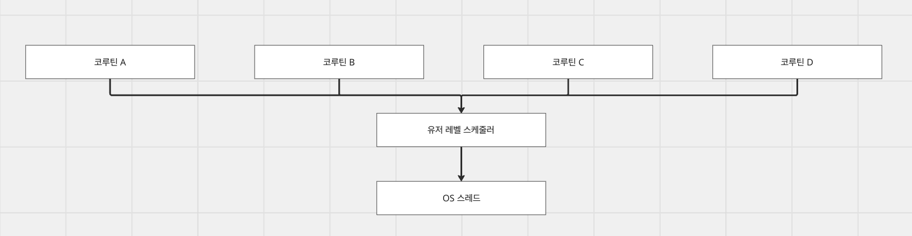
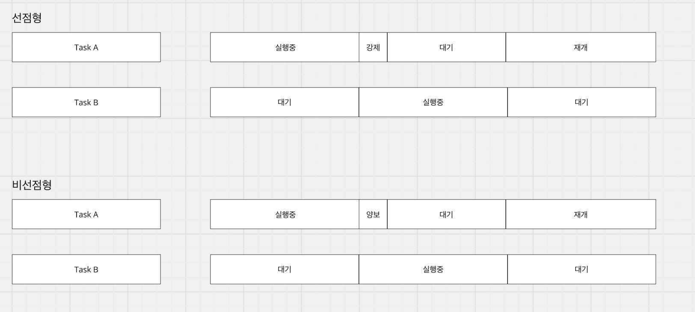
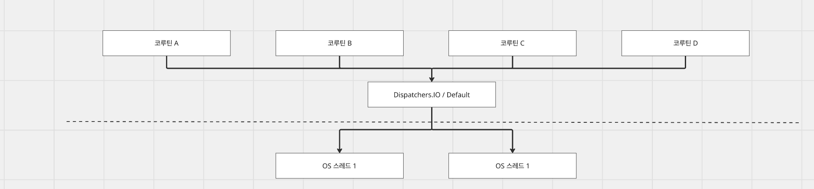
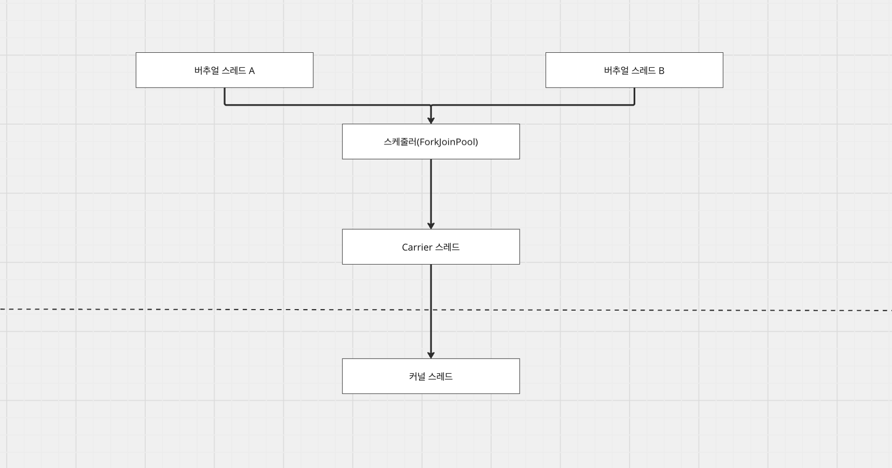
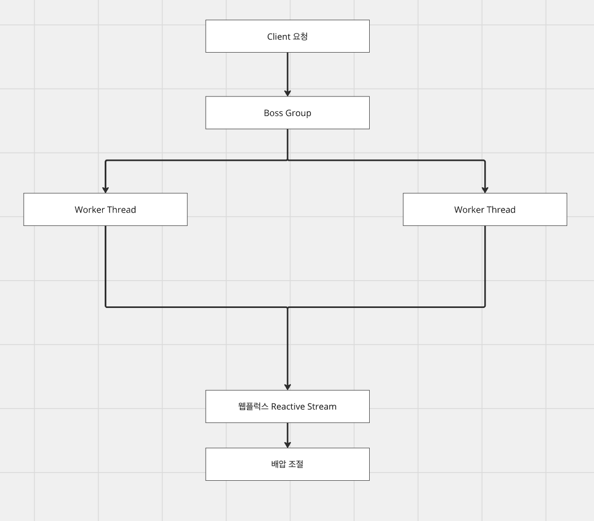
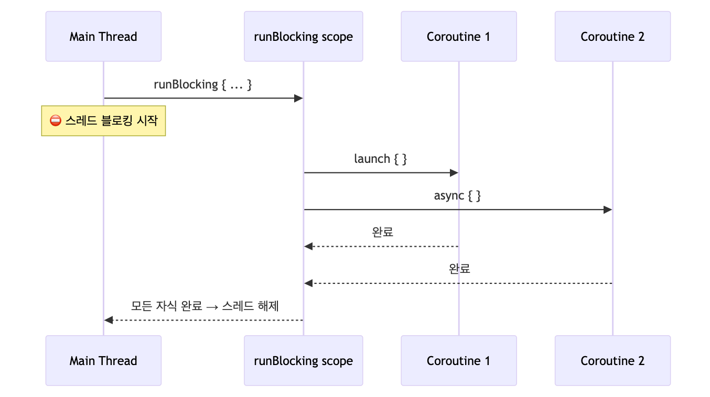
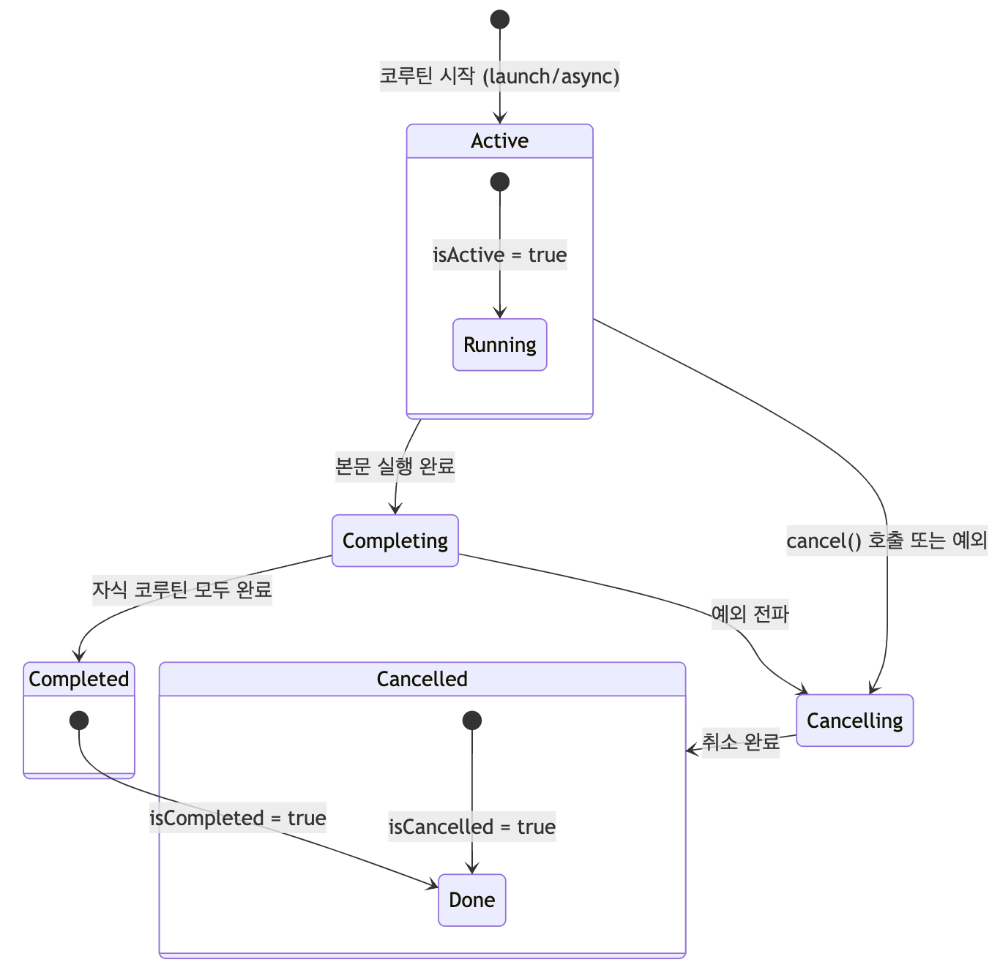
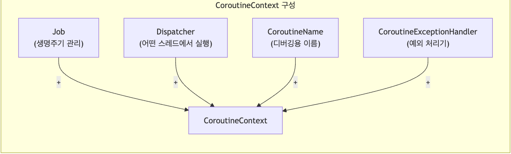
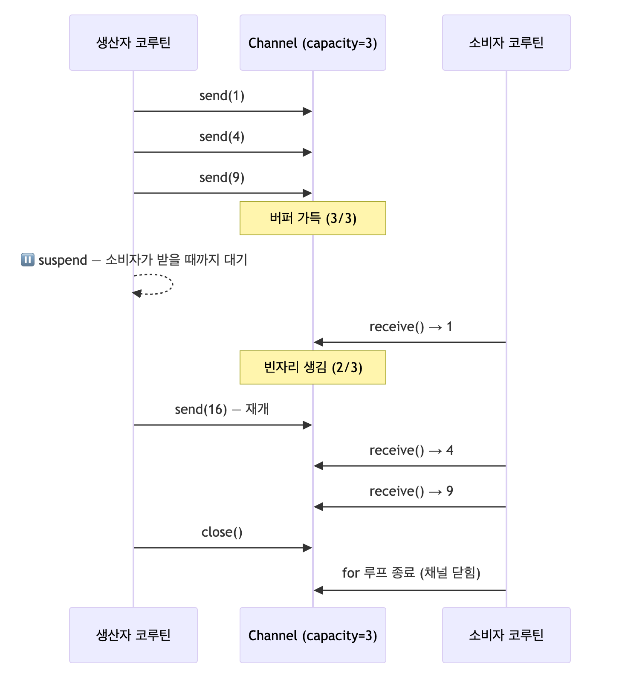

# [Java, Kotlin] 코루틴

## 코루틴

---

### 코루틴이란?



코루틴은 실행을 일시 중단(suspend)하고, 나중에 재개(resume)할 수 있는 경량 실행 단위이다. 커널 스레드 스케줄링에 의존하지 않고, 유저 레벨에서 스케줄링이 된다. 이로 인해서 하나의 JVM 스레드 위에서 여러 코루틴이 동시에 실행될 수 있다.

### 비선점형 멀티태스킹



선점형은 스케줄러가 각 스레드가 일할 수 있는 시간을 제약하고, 시간이 되면 강제로 작업을 중단시키고 다른 스레드로 전환시킨다. 스레드는 작업 중단 시 CPU 레지스터에서 현재 작업중인 값을 저장하고, 교체되는 작업으로 CPU 레지스터에 복원하는 등의 컨텍스트 스위칭이 발생한다.

비선점형은 스레드 스스로 양보 지점을 만날 경우 실행을 양보하고, 다른 작업이 수행할 수 있게 한다. 코루틴에서는 이 비선점형 방식을 택하며 양보(suspend)를 하고, 커널 레벨에서의 컨텍스트 스위칭이 아닌 Continuation 객체(유저 레벨)에 저장하고, 복원하여 전환 비용이 거의 없다.

### 코루틴, 버추얼 스레드, 웹플럭스 비교



코루틴은 코틀린 컴파일러가 suspend 키워드가 걸려있는 함수를 Continuation Passing Style로 변환하여 상태 머신으로 만든다. 중단 지점마다 현재 위치(label)는 어디인지, 실행중이던 값을 Continuation 객체에 저장하고 점유중인 스레드를 반환한다. 입출력이 완료되면 Dispatcher는 유휴 스레드를 골라 작업을 재개한다.



버추얼 스레드는 JVM 레벨에서의 경량 스레드이다. 일반적으로 캐리어 스레드(Java 스레드)는 커널 스레드와 1:1 매핑되어 작업을 수행하고 컨텍스트 스위칭이 발생하게 된다. 하지만 버추얼 스레드는 Carrier 스레드에 mount되어 실행하다, 블로킹 I/O를 만다면 park(작업 정지)된다. 작업을 정지시키고, 현재의 작업 정보(스레드 스택)를 힙에 저장하고 unmount된다. 스케줄러에 의해 버추얼 스레드B는 Carrier 스레드에 mount되고, I/O가 완료된 버추얼 스레드A는 unpark(작업 재개)되어 스케줄러에 의해 작업을 수행한다.



Webflux는 Netty 기반의 이벤트 루프를 이용한다. Boss Group으로 연결을 수락(accept)하고, Worker Thread(Event Loop)에게 작업을 던진다. 그리고 Reactive가 소비-구독 패턴으로 동작하여 비동기로 처리함과 동시에 배압 조절(pull)까지 수행한다.

## 코루틴의 동작

---

### CPS변환과 상태 머신

```kotlin
/ 원본 suspend 함수
suspend fun fetchData(userId: String): Data {
    val token = authService.getToken(userId)    // suspension point 1
    val data = dataService.fetch(token)          // suspension point 2
    return Data(data)
}

// 컴파일러 변환 후 (의사 코드)
fun fetchData(userId: String, cont: Continuation<Data>): Any? {
    val sm = cont as? FetchDataSM ?: FetchDataSM(cont)
    when (sm.label) {
        0 -> {
            sm.userId = userId
            sm.label = 1
            val result = authService.getToken(userId, sm)
            if (result == COROUTINE_SUSPENDED) return COROUTINE_SUSPENDED
            sm.result = result
        }
        1 -> {
            sm.token = sm.result as String
            sm.label = 2
            val result = dataService.fetch(sm.token, sm)
            if (result == COROUTINE_SUSPENDED) return COROUTINE_SUSPENDED
            sm.result = result
        }
        2 -> {
            val data = sm.result as RawData
            return Data(data)
        }
    }
}
```

코틀린 컴파일러는 suspend 함수를 만나면 label로 중단 지점을 나누고, 함수를 하나의 상태머신으로 만든다. 보통 함수는 호출되면, 끝까지 코드가 수행되지만 코루틴은 중단과 재개를 한다.

중단과 재개 시 이제까지 실행한 컨텍스트 정보를 어딘가에 저장해두어야 한다. 코루틴에서 Continuation은 중단 지점을 만났을 때 실행 정보들을 저장해두기 위한 객체이고, 복원을 통해서 OS까지 내려가지않고 유저 레벨에서 컨텍스트 스위칭이 가능하게 만든다. 그리고 label(상태)을 이용하여 재개할 지점이 어딘지를 알 수 있다.

## 코루틴 사용 방법

---

### runBlocking

```kotlin
// ✅ 사용해도 되는 경우
fun main() = runBlocking {          // 메인 함수 진입점
    launch { delay(1000); println("done") }
}

@Test
fun test() = runBlocking {          // 테스트 진입점
    val result = fetchData()
    assertEquals("expected", result)
}

// ❌ 절대 금지 — 코루틴 내부에서 runBlocking 호출 → 데드락
fun main() = runBlocking {
    launch {
        runBlocking {               // ← 이미 점유된 스레드를 다시 블로킹 → 데드락!
            delay(1000)
        }
    }
}
```



runBlocking은 현재 스레드를 블로킹하여 내부 코루틴이 완료될 때까지 기다리는 코루틴 스코프이다. 따로 Dispatcher(코루틴에서 제공하는 스레드풀)을 사용하지 않으면, 현재 스레드에서 코루틴을 실행시키고 코루틴이 전부 완료되면 스레드 블로킹을 해제한다.

### Job

```kotlin
fun main() = runBlocking {
    val job = launch {
        repeat(5) { i ->
            println("작업 $i — isActive: ${coroutineContext[Job]?.isActive}")
            delay(500)
        }
    }

    println("isActive: ${job.isActive}")        // true
    println("isCompleted: ${job.isCompleted}")  // false
    println("isCancelled: ${job.isCancelled}")  // false

    delay(1200)
    job.cancel()                 // 취소 신호 전송 (즉시 종료 X, 다음 suspend 지점에서 취소)
    job.join()                   // 취소가 완전히 완료될 때까지 대기
    println("isCancelled: ${job.isCancelled}")  // true
}
```



Job은 코루틴의 생명주기를 핸들링하는 객체이다. 이를 이용하여 코루틴의 상태를 조회하고, 완료를 기다리고, 취소할 수 있다. 또한 Job은 부모 - 자식 관계의 계층 관계로 관리될 수 있다. 이들은 상호 연결되어있어 부모가 먼저 끝나더라도 자식이 끝날 때까지 대기한다던지, 자식이 취소되면 부모도 취소된다던지 연쇄적으로 전파가 되는 특성(구조화된 동시성)이 있다. 이를 독립적으로 제어할 필요가 있다면 SupervisorJob을 통해서 예외를 격리하여 독립적으로 동작시킬 수도 있다.

### Deferred

```kotlin
fun main() = runBlocking {
    // 1. 즉시 시작되는 async (기본 동작)
    val deferred: Deferred<Int> = async {
        delay(1000)
        42
    }

    println("계산 중...")
    val result = deferred.await()    // 완료될 때까지 suspend (스레드 블로킹 아님)
    println("결과: $result")        // 결과: 42

    // 2. 지연 시작 — start = CoroutineStart.LAZY
    val lazyDeferred = async(start = CoroutineStart.LAZY) {
        heavyComputation()
    }
    // 아직 실행 안 됨
    lazyDeferred.start()             // 명시적으로 시작하거나
    val value = lazyDeferred.await() // await() 호출 시 자동 시작

    // 3. 취소와 예외
    val failing = async { throw IOException("네트워크 오류") }
    try {
        failing.await()              // 예외가 여기서 던져짐
    } catch (e: IOException) {
        println("처리: ${e.message}")
    }
}

---

suspend fun fetchAll(): Result = coroutineScope {
    // await() 전에 async를 먼저 다 띄워야 병렬 실행됨!
    val userDeferred = async { userService.getUser() }     // 즉시 시작
    val orderDeferred = async { orderService.getOrders() } // 즉시 시작
    val reviewDeferred = async { reviewService.getReviews() } // 즉시 시작

    // ❌ 잘못된 패턴 — 순차 실행이 되어버림
    // val user = async { userService.getUser() }.await()  // await가 바로 호출되면 순차!

    Result(
        user = userDeferred.await(),
        orders = orderDeferred.await(),
        reviews = reviewDeferred.await()
    )
}
```

Deferred는 async가 반환하는 타입이다. Job을 상속받기 때문에 Job의 기능들을 사용할 수 있고, 결과 값을 반환한다. async ~ await으로 결과값을 반환받을 수 있으며, await을 호출할 경우 블로킹을 걸고 결과를 기다리기 때문에 awaitAll과 같이 한번에 결과를 기다리는 방법을 사용할 수도 있다.

### CoroutineContext



```kotlin
val context = Job() +
    Dispatchers.IO +
    CoroutineName("MyCoroutine") +
    CoroutineExceptionHandler { _, e -> println("오류: $e") }

// 현재 코루틴의 컨텍스트 요소 접근
launch(context) {
    println(coroutineContext[Job])                    // 현재 Job
    println(coroutineContext[CoroutineDispatcher])    // 현재 Dispatcher
    println(coroutineContext[CoroutineName]?.name)    // "MyCoroutine"
}
```

CouroutineContext는 코루틴 실행에 필요한 요소들의 집합이다. + operator를 이용하여 Job, Dispatchers, CouroutinName, CouroutineExceptionHandler를 각각 커스텀하게 구성한 뒤 하나로 합칠 수 있다.

### CoroutineScope

```kotlin
// 커스텀 스코프 생성
class MyRepository {
    // 직접 스코프 생성 — 반드시 cancel()을 호출해야 누수 없음
    private val scope = CoroutineScope(SupervisorJob() + Dispatchers.IO)

    fun startWork() {
        scope.launch { heavyIoWork() }
    }

    fun cleanup() {
        scope.cancel()  // 이 스코프에서 실행 중인 모든 코루틴 취소
    }
}

// suspend 함수 내부 — coroutineScope { } 사용 권장
suspend fun doWork() = coroutineScope {
    // 이 블록 안에서 새 스코프 생성
    // 부모 코루틴의 컨텍스트를 상속받음
    launch { subtask1() }
    launch { subtask2() }
}  // 모든 자식이 완료될 때 반환
```

CouroutineScope는 CoroutineContext를 포함하며, 모든 코루틴의 생명주기를 관리한다.

### Dispatcher

|  | 스레드 풀 | 기본값 | 특징 | 용도 |
| --- | --- | --- | --- | --- |
| Unconfined | 특정 스레드에 종속되지 않음 | 제한 없음 | 중단 후 재개 시점의 스레드에서 실행 |  |
| Main | UI 프레임워크(Android) 메인 스레드 | 1개 |  |  |
| IO | Default 스레드 풀과 공유하되, 추가적으로 스레드 생성 가능 | max(64, 코어수) | I/O 작업 시 사용 | 네트워크, DB, 파일 읽기 / 쓰기 |
| Default |  | CPU 코어 수 | CPU 작업 시 사용 | 정렬, JSON 파싱, 암호화, 이미지 처리 |

```kotlin
fun main() = runBlocking {
    // Default: CPU 집약 작업
    val sorted = withContext(Dispatchers.Default) {
        hugeList.sortedBy { it.score }
    }

    // IO: 네트워크/DB/파일 작업
    val users = withContext(Dispatchers.IO) {
        database.getAllUsers()
    }

    // Dispatcher 간 전환
    launch(Dispatchers.IO) {
        val rawData = api.fetchRawData()              // IO 스레드
        val parsed = withContext(Dispatchers.Default) {
            parseJson(rawData)                         // Default로 전환
        }
        withContext(Dispatchers.Main) {
            updateUI(parsed)                           // Main으로 전환 (Android)
        }
    }
}
```

코루틴이 어떤 스레드에서 실행될지 결정한다.

## 코루틴의 데이터 통신 방법

---

### Channel



Channel은 코루틴 간 데이터를 주고받는 스트림 파이프이다. 생산자와 소비자 패턴을 이용하여 생산자 코루틴 -> 소비자 코루틴으로 데이터를 스트림 처리하여 버퍼가 가득찼을 경우 생산자는 중단되고, 소비자는 배압 처리를 할 수 있는 방식이다.

| 전략 | 버퍼 크기 | send 동작 | 필요 상황 |
| --- | --- | --- | --- |
| RENDEZVOUS | 0 | 수신될 때까지 suspend | 생산자와 소비자 간의 동기화가 필요할 때 |
| BUFFERED | N | 버퍼 초과 시 suspend | 일반적인 파이프라인 |
| CONFLATED | 1 | suspend x | 최신 상태만 소비자가 읽도록 내부에서 덮어쓰기 됨 |
| UNLIMITED | 무한 | suspend x |  |

```kotlin
// RENDEZVOUS (기본, capacity=0) — send와 receive가 동시에 만나야 전달
val rendezvous = Channel<Int>()
// send()는 receive()가 준비될 때까지 suspend, 그 반대도 마찬가지

// BUFFERED — 고정 크기 버퍼
val buffered = Channel<Int>(capacity = 10)

// CONFLATED — 버퍼 크기 1, 새 값이 오면 이전 값을 덮어씀 (최신 값만 유지)
val conflated = Channel<Int>(Channel.CONFLATED)
// 소비자가 느려도 send()가 절대 suspend되지 않음 — 대신 중간 값은 유실

// UNLIMITED — 버퍼 무제한 (OOM 위험, 사용 자제)
val unlimited = Channel<Int>(Channel.UNLIMITED)
```

Channel은 여러 버퍼 전략을 통해 데이터를 스트리밍할 수 있다. 그리고 이 버퍼를 몇 명의 소비자가 나눠서 처리할지(팬아웃), 몇 명의 생산자가 채널에 전송할지(팬인)도 가능하다.

```kotlin
// 팬아웃 — 하나의 채널을 여러 소비자가 나눠서 처리
val channel = Channel<Task>(capacity = 10)

repeat(3) { workerId ->
    launch {
        for (task in channel) {
            process(task, workerId)  // 각 태스크는 하나의 워커만 처리
        }
    }
}

// 팬인 — 여러 생산자가 하나의 채널에 전송
suspend fun sendFrom(ch: SendChannel<String>, name: String) {
    repeat(3) { ch.send("$name: $it") }
}

val merged = Channel<String>()
launch { sendFrom(merged, "A") }
launch { sendFrom(merged, "B") }
```

### Sequence

```kotlin
// 무한 피보나치 수열 — 모든 값을 미리 계산하지 않음
val fibonacci: Sequence<Long> = sequence {
    var a = 0L
    var b = 1L
    while (true) {
        yield(a)                  // 값 하나를 내보내고 다음 요청까지 일시정지
        val next = a + b
        a = b
        b = next
    }
}

fibonacci.take(10).toList()  // [0, 1, 1, 2, 3, 5, 8, 13, 21, 34]
fibonacci.first { it > 1000 }  // 1597 — 필요한 만큼만 계산

// 대용량 파일을 한 줄씩 읽는 예 — 전체를 메모리에 올리지 않음
fun readLines(path: String): Sequence<String> = sequence {
    File(path).bufferedReader().use { reader ->
        var line = reader.readLine()
        while (line != null) {
            yield(line)
            line = reader.readLine()
        }
    }
}

readLines("huge.log")
    .filter { "ERROR" in it }
    .take(100)
    .forEach { println(it) }
```

Sequence는 Lazy Evaluation 컬렉션이다. seqeunce 블록 안에서 yield로 값을 보내고, 다음 요청까지 실행을 중단한다. delay, 네트워크와 같은 비동기 작업을 내부에선 사용할 수 없고, cpu 연산 작업에 용이하다.

### Flow


```kotlin
fun tickerFlow(period: Long): Flow<Int> = flow {
    var i = 0
    while (true) {
        emit(i++)           // suspend emit — 소비자 속도에 맞춰 진행
        delay(period)
    }
}

// collect() 전까지는 아무것도 실행되지 않음
tickerFlow(100)
    .filter { it % 2 == 0 }
    .map { it * it }
    .take(5)
    .collect { println(it) }   // 0, 4, 16, 36, 64
```

flow는 sequence와 비슷하지만 delay, 네트워크 통신 등의 비동기 데이터 파이프라인을 구성할 수 있다.
