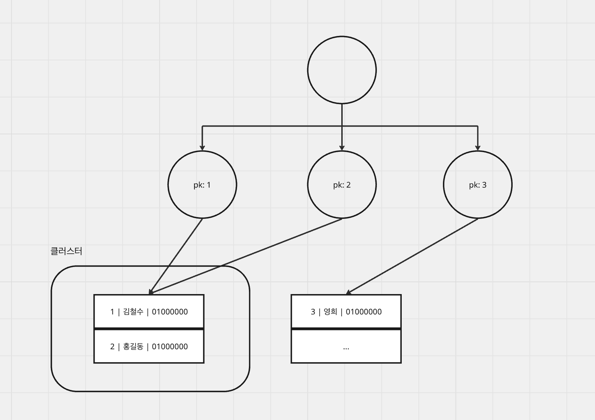
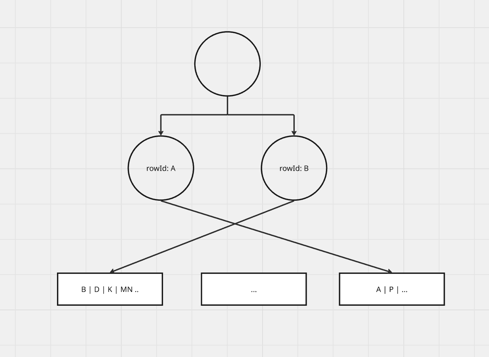

# [DB] 클러스터형 vs 비클러스터형 인덱스

- **Tags**: #Database #DB #ClusteredIndex #InnoDB
---

### 무엇을 배웠는가
* 데이터베이스의 인덱스의 주요 유형인 클러스터형 인덱스, 비클러스터형 인덱스 학습
* 클러스터형 인덱스: 데이터 자체를 정렬하여 저장하는 인덱스
* 비클러스터형 인덱스: 데이터의 위치를 가리키는 별도의 색인 파일을 생성하는 인덱스

---
### 왜 중요하고, 어떤 맥락인가
이 2개의 인덱스는 읽기 및 쓰기 시 성능에 직접적인 영향을 미치므로 주요한 개념입니다.
* **클러스터형 인덱스**
  * PK 순서로 데이터가 정렬되어있고, PK로 검색 시 바로 데이터를 검색할 수 있습니다.
* **비클러스텨형 인덱스**
  * 색인 데이터는 정렬되어있으나, 데이터는 무작위로 저장되어 있습니다.

---

### 상세 내용
#### 1. 클러스터형 인덱스
테이블의 **PK를 기반으로 생성**되며, 데이터의 **물리적 저장 순서** 자체를 PK 순서에 맞게 정렬합니다.

* **특징**
  * 테이블 당 **하나만** 존재할 수 있습니다. (n개의 물리적 기준으로 데이터를 저장할 수 없기 때문)
  * 인덱스의 리프 노드 곧 **실제 데이터**입니다.
  * **MySQL의 InnoDB 스토리지 엔진**에서는 **Primary Key가 자동으로 클러스터형 인덱스**가 됩니다.
    * PK가 없으면 UNIQUE NOT NULL 인덱스를, 이것마저 없으면 내부적으로 숨겨진 키를 클러스터형 인덱스로 사용합니다.
* **장점**
  * PK를 기반으로 한 범위 검색 시, 물리적으로 연속된 데이터를 읽어오므로 매우 빠릅니다.
* **단점**
  * 데이터 삽입/수정/삭제 시 **물리적인 데이터 재정렬**이 필요하므로 성능이 저하됩니다.
    * 중간에 데이터가 삽입되면 페이지 분할 및 데이터 이동이 발생할 수 있습니다.

    
#### 2. 비클러스터형 인덱스
PK가 아닌 다른 컬럼을 기반으로 생성되며, 실제 데이터와는 별개의 공간에 인덱스 페이지를 만듭니다.

* **특징**
  * 테이블 당 **여러 개**를 생성할 수 있습니다.
  * 인덱스의 리프 노드는 실제 데이터가 아닌 데이터의 물리적 위치를 가리키는 주소값(`RowId`)을 가집니다.
* **장점**
  * 데이터의 물리적 순서를 변경하지 않고 인덱스 페이지만 수정하므로 삽입/수정/삭제 작업이 클러스터 인덱스보다 빠릅니다.
* **단점**
  * 데이터를 조회할 때 인덱스에서 `RowId`를 찾고, 다시 디스크의 실제 데이터에 접근하는 **두 단계의 과정**이 필요하여 클러스터 형 인덱스보다 느릴 수 있습니다.

---

### 비교
| 구분 | 클러스터형 인덱스 | 비클러스터형 인덱스 |
| :--- | :--- | :--- |
| **개수** | 테이블 당 1개 | 테이블 당 여러 개 |
| **정렬 방식**| **물리적** 데이터 정렬 | **논리적** 인덱스 정렬 |
| **리프 노드**| 실제 데이터 | 데이터 주소값 (`RowId`) |
| **검색 속도**| 매우 빠름 (특히 범위 검색) | 상대적으로 느릴 수 있음 (Key Lookup 발생) |
| **CUD 속도**| 느림 (데이터 재정렬 필요) | 빠름 (인덱스 페이지만 수정) |

---

### 요약
* **PK 설계가 매우 중요합니다.** InnoDB에서는 PK가 곧 데이터의 물리적 정렬 기준인 클러스터형 인덱스입니다.
* **클러스터형 인덱스**는 범위 기반 검색이 잦고, 정적인 데이터에 적합합니다.
* **비클러스터형 인덱스**는 삽입/수정/삭제가 빈번하고, 특정 값에 대한 단일 조회가 잦은 컬럼에 적합합니다.