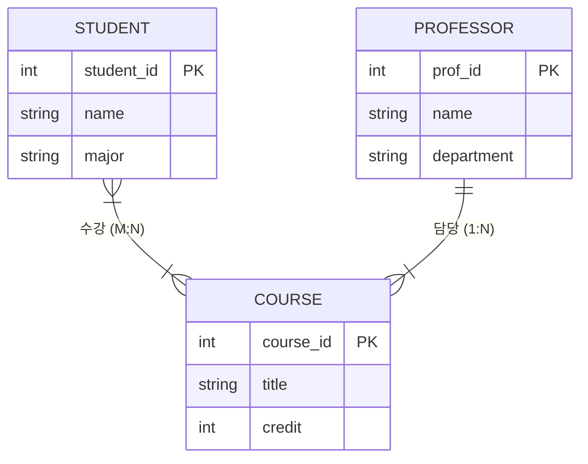
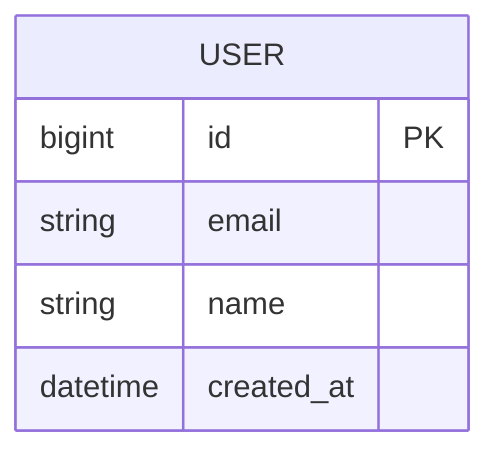
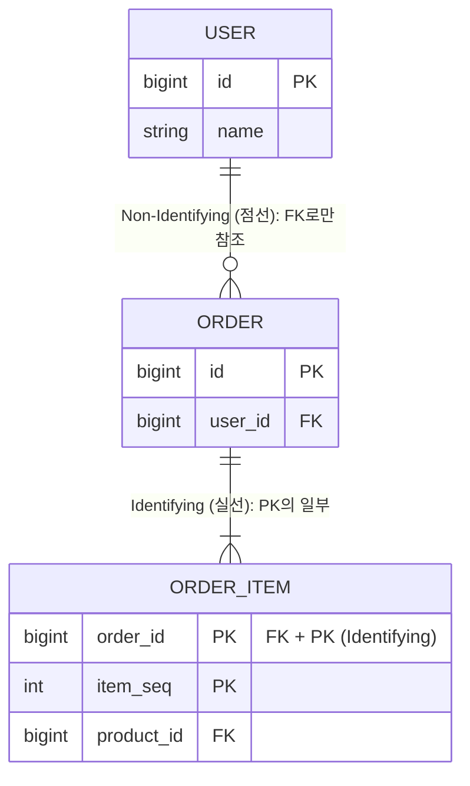
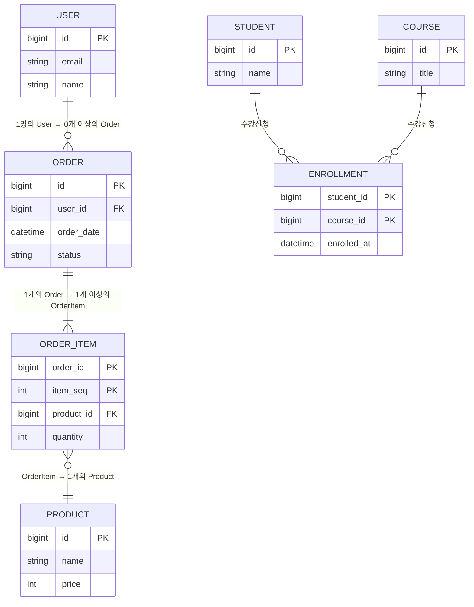

# ERD 표기법

ERD(Entity Relationship Diagram)는 데이터베이스의 엔티티 간 관계를 시각적으로 표현하는 다이어그램이다.

---

## Peter-Chen 표기법

개체는 각 특징을 나타내는 속성과 기본키를 가지고 있다. 또한 개체 간의 관계 타입을 나타낼 수 있다.

```
  [사각형]  → 엔티티 (Entity)
  (타원형)  → 속성 (Attribute)
  <마름모>  → 관계 (Relationship)
  (밑줄 타원) → 기본키 (Primary Key)
```



* 관계의 카디널리티를 마름모 양쪽에 1, N, M으로 표기
* 학술/교육 목적으로 주로 사용되며, 실무에서는 잘 사용하지 않음

---

## 정보 공학 표기법 (IE/Crow's Foot)

실무에서 가장 널리 사용되는 표기법이다. 엔티티의 이름을 최상단에, Attribute를 하단에 적는다.



### 관계선 유형

| 선 유형 | 의미 | 설명 |
|---------|------|------|
| 실선 (Identifying) | 강한 연관관계 | 부모 테이블의 PK를 자식 테이블에서 FK + PK로 사용 |
| 점선 (Non-Identifying) | 약한 연관관계 | 부모 테이블의 PK를 자식 테이블에서 FK로만 사용 (PK 아님) |



### 카디널리티 (Cardinality) 표기

```
  ──────  하나 (1)        : 정확히 1개
  ──────< 다수 (Many)     : 여러 개
  ──||──  하나 (필수)     : 반드시 1개
  ──O|──  하나 (선택)     : 0 또는 1개
  ──|<──  다수 (필수)     : 1개 이상
  ──O<──  다수 (선택)     : 0개 이상
```

* `||` (이중 세로선): 필수 (Mandatory) - 최소 1개
* `O` (원): 선택 (Optional) - 0개 가능
* `<` (까마귀 발): 다수 (Many)

### 관계 읽기 예시

```
  User ──||────O<── Order
  "한 명의 User는 0개 이상의 Order를 가진다"
  "하나의 Order는 반드시 1명의 User에 속한다"

  Order ──||────|<── OrderItem
  "하나의 Order는 1개 이상의 OrderItem을 가진다"
  "하나의 OrderItem은 반드시 1개의 Order에 속한다"

  Student ──O<────O<── Course  (M:N, 중간 테이블 필요)
  "한 명의 Student는 0개 이상의 Course를 수강한다"
  "하나의 Course는 0명 이상의 Student가 수강한다"
```



### Identifying vs Non-Identifying 실무 판단 기준

```sql
-- Identifying (실선): 자식이 부모 없이 존재할 수 없고, PK의 일부
CREATE TABLE order_item (
    order_id BIGINT NOT NULL,
    item_seq INT NOT NULL,
    product_id BIGINT NOT NULL,
    PRIMARY KEY (order_id, item_seq),  -- 부모 PK가 복합 PK의 일부
    FOREIGN KEY (order_id) REFERENCES orders(id)
);

-- Non-Identifying (점선): 자식이 자체 PK를 가지고, 부모 PK는 FK로만 참조
CREATE TABLE orders (
    id BIGINT AUTO_INCREMENT PRIMARY KEY,
    user_id BIGINT NOT NULL,           -- FK로만 사용
    FOREIGN KEY (user_id) REFERENCES users(id)
);
```

---

## Barker 표기법

Oracle에서 주로 사용하는 표기법이다.

* 엔티티를 모서리가 둥근 사각형으로 표현
* 필수 속성은 `*`, 선택 속성은 `o`로 표기
* 관계선에 역할명을 작성하여 관계의 의미를 명확히 함

---

## 표기법 비교

| 항목 | Peter-Chen | IE (Crow's Foot) | Barker |
|------|------------|-------------------|--------|
| 주 사용처 | 학술/교육 | 실무 (가장 보편적) | Oracle |
| 엔티티 표현 | 사각형 | 사각형 (속성 포함) | 둥근 사각형 |
| 관계 표현 | 마름모 | 선 + 까마귀 발 | 선 + 역할명 |
| 속성 표현 | 타원형 | 엔티티 내부 | 엔티티 내부 |
| ERD 도구 지원 | 낮음 | 높음 (대부분 지원) | 중간 |
