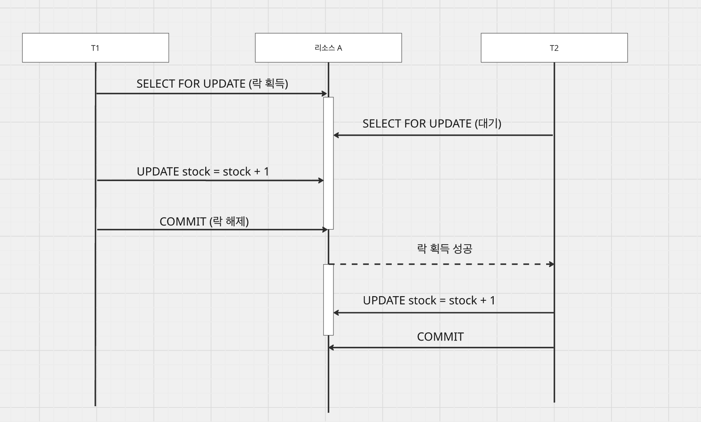
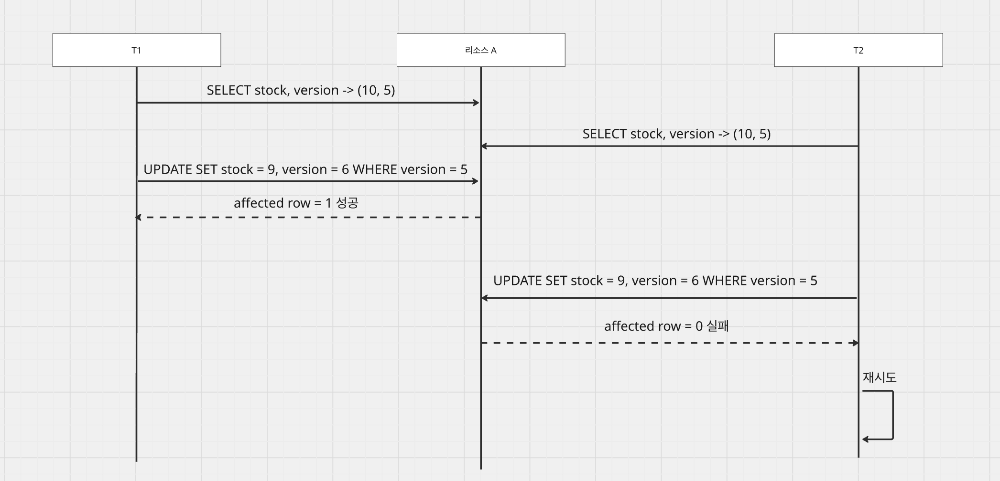
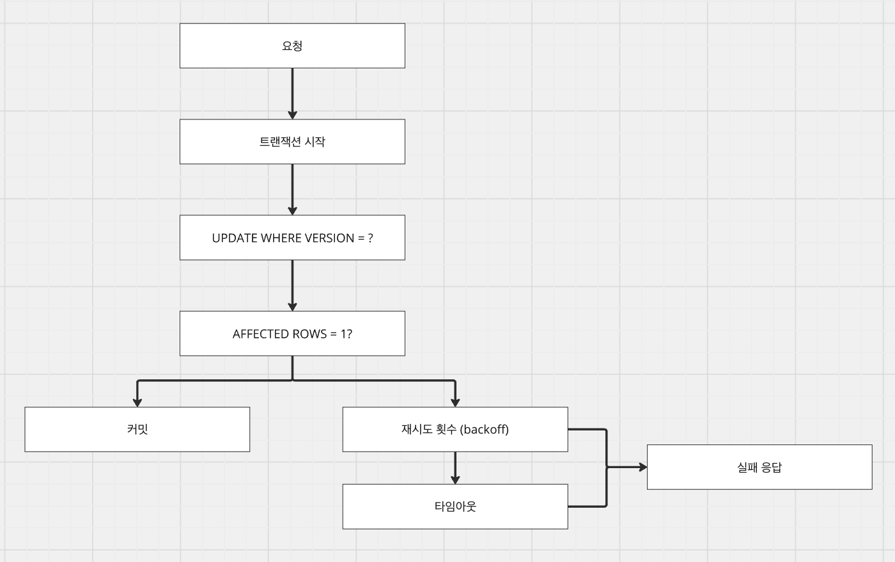

# [Database] 낙관적 락, 비관적 락

- **tags:** #MySQL #Lock #PessimisticLock #OptimisticLock #MVCC #Database

---
### 무엇을 배웠는가?
* 락(Lock)의 기본 개념과 다중 트랜잭션 환경에서의 데이터 정합성 유지 방식을 배웁니다.
* 비관적 락(Pessimistic Lock)과 낙관적 락(Optimistic Lock)의 차이점과 각각의 장단점을 학습합니다.
* 낙관적 락과 MVCC(Multi-Version Concurrency Control)의 유사점과 차이점을 이해합니다.
* 상황에 맞는 적절한 락 전략(재시도 로직, 타임아웃 등) 선택 기준을 배웁니다.

---
### 왜 중요하고, 어떤 맥락인가?
분산 환경이나 멀티 스레드 환경에서 여러 트랜잭션이 동시에 같은 데이터에 접근할 때, 데이터의 무결성을 보장하는 것은 시스템의 신뢰성에 직결됩니다. 락은 이러한 동시성 문제를 해결하기 위한 필수적인 메커니즘입니다. 무조건적인 락 사용은 성능 저하를 초래할 수 있으므로, 비관적 락과 낙관적 락의 트레이드오프를 이해하고 도메인의 특성에 맞게 적용하는 능력이 중요합니다.

---
### 상세 내용

#### 1. 락(Lock)이란?
락은 여러 수행 주체(스레드, 트랜잭션)가 하나의 자원에 접근할 때, 접근하는 동안 외부의 영향을 받지 않게 일관성 있는 상태를 유지하기 위한 장치입니다.

* **락의 단점**
  * **락 경합 및 성능 저하**: 특정 시점에 하나의 수행 주체만이 접근해야 하므로 대기 상태가 발생하고 처리량이 떨어질 수 있습니다.
  * **데드락(Deadlock)**: 서로 다른 수행 주체가 리소스를 점유한 채 상대방의 리소스를 대기하는 교착 상태가 발생할 수 있습니다.

#### 2. 비관적 락 (Pessimistic Lock)
비관적 락은 충돌이 무조건 발생할 것이라는 가정하에 진행됩니다. 데이터를 읽거나 쓰는 순간 락을 걸어 다른 주체의 접근을 차단합니다.

* **종류**
  1. **읽기 락 (Shared Lock)**: 읽기 락이 걸린 리소스는 다른 읽기 락 접근은 가능하지만 쓰기는 불가능합니다.
  2. **쓰기 락 (Exclusive Lock)**: 어떤 락이어도 대기시키며 무조건 다른 주체의 접근을 차단합니다.

* **사용 예시**

#### 3. 낙관적 락 (Optimistic Lock)
낙관적 락은 경합이 발생하지 않을 것이라고 가정합니다. `version` 컬럼 등을 이용하여 수정 시점에 데이터 변경 여부를 확인합니다. (Compare And Set)

* **장점**: 락 유지 시간이 없어 동시성이 높습니다.
* **단점**: 충돌 시 재시도 비용이 발생하며, 애플리케이션에서 재시도 로직을 구현해야 합니다.

#### 4. 낙관적 락과 MVCC
MVCC(Multi-Version Concurrency Control)는 DB 레벨에서 제공하는 읽기와 쓰기 간 리소스 점유를 대기시키지 않는 방법입니다.

* MySQL의 언두 로그(Undo Log)를 활용한 동시성 제어와 낙관적 락은 추상적인 면에서 닮아 있으나, 재시도 전략 등의 구현 위치에서 차이가 있습니다.

---
### 요약
- **비관적 락**은 데이터 정합성이 절대적으로 중요한 금융, 재고 차감 등에 적합합니다.
- **낙관적 락**은 읽기 처리가 많고 동시 접근이 적은 개인 프로필 편집 등에 적합합니다.
- **재시도 전략**: 낙관적 락 사용 시 기아 상태 방지를 위한 재시도 횟수와 타임아웃 설정이 필수적입니다.

---
### 참조
- [데이터베이스] 낙관적 락, 비관적 락: [https://biuea.tistory.com/21](https://biuea.tistory.com/21)
