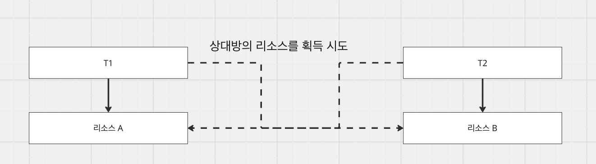
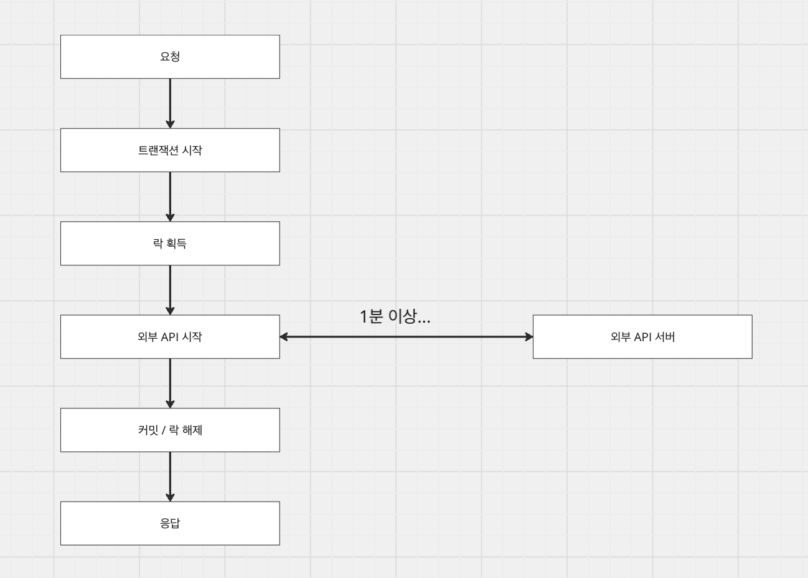

# [데이터베이스] 낙관적 락, 비관적 락

## 락

---

### 락이란

락은 여러 수행 주체가 하나의 자원에 접근할 때, 접근하는동안 외부의 영향을 받지 않게 일관성있는 상태를 유지하기 위한 장치이다. 자바의 멀티 스레드 환경도, MySQL의 멀티 스레드 환경도 여러 수행 주체(스레드, 트랜잭션)가 하나의 데이터에 접근하여 쓰기 작업을 수행할 수 있다. 여러 수행 주체가 동시에 접근하게 되면 A의 작업이 다른 수행 주체의 작업으로 덮어씌워질 수 있음을 의미한다.

즉, 락은 특정 시점에 하나의 수행 주체(스레드, 트랜잭션)만이 데이터를 쓰기 작업할 수 있도록 보장해주는 장치이다.

### 락의 단점

#### 1. 락 경합 및 성능 저하

락은 특정 시점에 하나의 수행 주체만이 접근해야하기 때문에 이 시간동안은 다른 수행 주체의 접근을 막고, 대기시켜야 한다. 요청이 많아질수록 많은 요청들은 대기 상태에 빠지게 되고, 처리량이 떨어질 수 있다.

#### 2. 데드락

락을 획득하기 위해선 리소스를 점유하고 있는 수행 주체가 락을 해제해야한다. 락이 해제가 되어야 대기하고있는 수행 주체가 락을 획득하고, 작업을 수행할 수 있다.

하지만 서로 다른 수행 주체가 리소스를 점유하고 있고, 상대방의 리소스를 점유하고자할 때 데드락이 발생하는데 이런 교착 상태는 무한 대기로 빠지게 되고 오류를 발생시킨다. (이런 상황을 없애기 위해 타임아웃 등으로 해소할 수 도 있다.)

## 비관적 락

---

### 비관적 락이란

비관적 락은 서로 다른 수행 주체 간의 경합이 무조건 발생할 것이라는 가정하에 진행된다. 따라서 데이터를 읽던, 쓰던 접근하는 순간 락을 걸어놓고 나머지 수행 주체들이 리소스에 대한 접근을 맞아놓고 시작한다. DB에선 이를 위해 공유 락 (SELECT ... FOR UPDATE), 배타 락 (SELECT ... FOR UPDATE)으로 구현되어 사용된다.

| 대기 여부 (O / X) | 읽기 락 | 쓰기 락 |
| --- | --- | --- |
| 읽기 락 | X | O |
| 쓰기 락 | O | O |

#### 1. 읽기 락

읽기 락은 읽기 락이 걸려있는 리소스만 접근이 가능하다. 쓰기 락이 걸려있는 리소스는 데이터를 변형하는 과정 중이기 때문에 접근이 어렵다.

#### 2. 쓰기 락

쓰기 락은 어떤 락이어도 대기시킨다. 무조건 다른 수행 주체의 접근을 차단시켜 데이터의 무결성을 보장하는 의미가 있다.

### 비관적 락의 단점

정합성이 중요시 여겨지는 돈이 왔다갔다하는 금융이라던지, 재고 차감이라던지 이런 사례에서는 비관적 락을 통해 정합성을 보장해야한다. 하지만 일반적으로 빠른 처리를 요구하는 OLTP 환경에서의 비관적 락은 앞서 언급한 것처럼 데드락, 낮은 처리량의 문제를 발생시킬 수 있다.

### 언제 사용하고, 어떻게 사용하는가

금융, 재고, 이벤트 선착순 등과 같이 정합성이 보장되어야 하는 상황에서는 필요하다. 다만, 사용하면서 락을 어느 시점에 걸어야하는지도 중요하게 생각해야한다. 만약 언제 응답이 올지 모르는 외부 API와 트랜잭션이 함께 걸려있는 상황이라면 외부 API 응답시간만큼 락이 길어질 위험이 있다.

외부 API 서버로부터의 응답 시간이 보장되지 않기 때문에 트랜잭션과 별개로 외부 API 서버의 호출을 할 필요가 있다. (물론 락과 별개로 트랜잭션 내에 호출할 경우 다른 요청들의 커넥션 획득이 밀리는 것도 문제..)

## 낙관적 락

---

### 낙관적 락이란

낙관적 락은 서로 다른 주체 간 경합이 발생하지 않을 것이란 가정에서 시작한다. 수행 주체는 쓰기 작업을 수행하는데 version 이라는 컬럼을 이용한다. 누군가가 이미 작업을 했다면 조회했을 당시의 version이 증가되었을 것이고, 작업이 되지않았다면 version은 그대로일 것이라는 논리로 수행된다. (Compare And Set)

### 낙관적 락과 MVCC

MVCC(Multi Version Concurrency Control)는 DB 레벨에서 제공하는 읽기와 쓰기 간 리소스 점유를 대기시키지 않는 방법이다. MVCC의 흐름은 낙관적 락과 유사한 플로우로 진행된다. 다만 MySQL에서 제공하는 언두 로그를 이용하여 MVCC를 구현하게 되는데, 이는 현재 설정된 격리 수준에 따라 달라진다. 만약 READ_UNCOMMITTED 수준이라면, 커밋되지 않은 데이터를 업데이트할 수 있다. 따라서 다른 트랜잭션에 의해 데이터가 덮어씌워지는(LOST UPDATE) 현상이 발생한다. 하지만 READ_COMMITTED 이상의 격리 수준이라면, 원본 데이터가 저장되어있는 undo 로그를 사용하므로 LOST UPDATE를 방지할 수 있다.

낙관적 락과 MVCC는 추상적인 부분에서 많은 부분이 닮았다고 생각한다. 다만 MySQL의 구현체에선 undo 로그를 활용한 동시성 제어냐, 애플리케이션 / MySQL을 함께 활용하여 동시성 제어와 재시도 전략까지 시도한 부분에선 약간의 차이를 보인다.

### 낙관적 락의 단점

#### 1. 재시도 비용

충돌이 발생할 경우 낙관적 락은 트랜잭션을 롤백한다. 이미 업데이트된 데이터이기 때문이다. 따라서 처음부터 로직을 다시 시작해야하고, 충돌이 극단적으로 잦아진다면 최악의 경우 특정 로직은 로직을 무한정 반복하게 될 수 있다. (물론 재시도 횟수, 타임아웃 등의 장치로 기아상태에 빠지는 것을 방지해야한다.)

#### 2. 재시도 로직

재시도 횟수, 대기 시간 등을 설정하여 수행 주체가 기아상태에 빠지는 것을 방지해야한다. 이 재시도 로직을 애플리케이션에서 구현해야하므로 낙관적 락을 위한 로직이 복잡해질 수 있다.

### 언제 사용하고, 어떻게 사용하는가

읽기 처리가 많고, 동시 리소스 접근이 적을 때 적합하다. 가령 유저 개인 단위의 프로필 편집, 게시물 등 여러 사용자가 동시에 접근하지 않는 케이스가 예시이다. 그리고 재시도 횟수와 타임아웃을 정하여 기아 상태에 빠지도록 처리해야한다.

