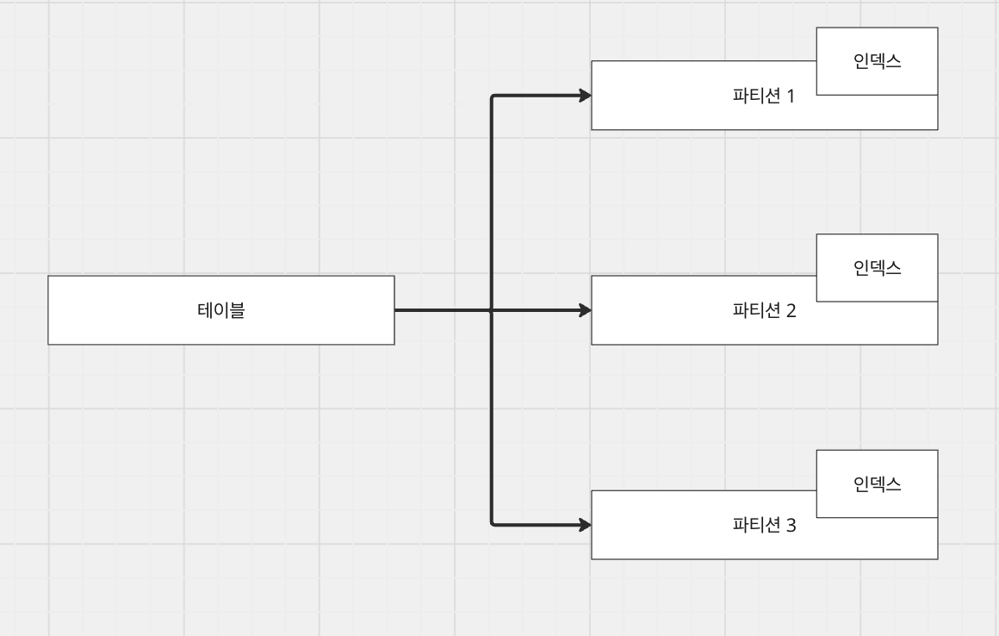

# [MySQL] 파티셔닝

## 파티셔닝?

### 1. 파티셔닝이란

파티셔닝은 하나의 테이블을 여러 개의 파티션으로 나누어 특정 기준으로 데이터를 적재하는 방법입니다. 이 방식을 통해 "데이터의 접근 범위를 full에서 range로 줄일 수 있기에 탐색 범위가 비약적으로 줄어들게 된다."



논리적으로는 하나의 테이블이지만 물리적으로는 각 파티션이 독립적인 로컬 인덱스를 가지게 됩니다. MySQL에서는 글로벌 인덱스가 아닌 파티션별 로컬 인덱스로 관리됩니다.

### 2. 사용 목적

많은 데이터를 range별로 분할하여 검색 범위를 축소합니다. 테이블 행의 갯수 제한이 없기 때문에 대량의 데이터가 적재될 수 있으며, 파티셔닝을 적용하면 "전체 데이터 / 파티셔닝 갯수로 관리되기 때문에 검색 범위를 좋힐 수 있다."

추가 이점:
- 오래되거나 불필요한 데이터가 있는 파티션을 정리 가능
- 파티션 단위로 관리되는 인덱스 크기 감소
- innoDB buffer pool에 올라갈 수 있는 인덱스 크기 개선

---

## 파티셔닝 기준

### 1. Range

```sql
partition by range (year(created_at)) (
	partition p2024 values less than (2025),
    partition p2025 values less than (2026)
)
```

특정 범위로 파티션을 나누며, 날짜나 숫자가 기준으로 사용됩니다.

### 2. List

```sql
partition by list (region) (
	partition p_seoul values in ('SEOUL'),
    partition p_busan values in ('BUSAN')
);
```

고정된 카테고리로 데이터를 분배합니다.

### 3. Hash

```sql
partition by hash(user_id) partitions 8
```

N개의 파티션으로 해시 함수 결과에 따라 분배합니다. 균등한 분배로 핫 파티션 문제가 발생하지 않습니다.

### 4. Key

```sql
partition by key(user_id) partitions 8
```

Hash와 유사하지만 PK나 Unique Key로 지정된 컬럼에만 사용 가능합니다.

---

## 파티셔닝 유의사항

### 1. 검색

DML 쿼리 수행 시 쿼리에 파티션 키가 포함되면 "파티션 프루닝이 적용되어 필요한 파티션을 대상으로만 검색을 수행한다." 이는 빠른 탐색과 메모리 효율을 제공합니다.

그러나 조회 조건에 파티션 키가 없으면 모든 파티션을 순회하며 데이터를 조회하고 병합하므로, 파티셔닝이 오히려 성능 저하를 초래할 수 있습니다.

### 2. auto increment

파티션이 적용되면 각 파티션이 독립적이므로 파티션 간 유니크 보장이 불가능합니다. 복합키(id, created_at) 형태로 PK를 구성하거나 UUID 같은 문자열을 사용해야 합니다.

### 3. 파티션 추가, 제거

ALTER DDL을 통해 파티션을 추가·제거할 수 있으나 테이블 메타데이터 락이 발생합니다. REORGANIZATION의 경우 전체를 재구성해야 하므로 실 서비스에서 큰 문제가 발생할 수 있습니다.

---

## 파티셔닝 테스트

### 1. 목표

파티셔닝 적용 여부에 따른 성능 차이를 확인합니다.

### 2. 테스트 대상

- 파티셔닝 미적용 상품 데이터 1,000만 건
- 파티셔닝 적용 상품 데이터 1,000만 건
- 파티셔닝 적용 상품 데이터의 댓글 2,000만 건

### 3. 테스트 사항

다음 4가지 API를 대상으로 TPS와 평균 Latency를 측정합니다:

1. 파티션 미적용 상품 데이터 조회
2. 파티션 적용 상품 데이터 조회
3. 상품-댓글 JOIN (파티션 키 미포함)
4. 상품-댓글 JOIN (파티션 키 포함)

EXPLAIN 예제:
```sql
mysql> explain select * from product_partitioned where id = 1 and created_at = now();
```

### 4. 테스트 결과

| API | 설명 | TPS | 평균 Latency | P95 | P90 |
|-----|------|-----|-------------|-----|-----|
| API 1 | 파티션 미적용 | 16.9 | 2.13s | 4.02s | 3.69s |
| API 2 | 파티션 적용 | 29.3 | 1.18s | 2.16s | 2.00s |
| API 3 | JOIN (키 미포함) | 28.3 | 600ms | 1.03s | 950ms |
| API 4 | JOIN (키 포함) | 28.0 | 608ms | 1.17s | 1.01s |

단독 조회는 기대값을 충족했으나, JOIN 쿼리의 경우 파티션 키 포함 여부와 관계없이 유사한 성능을 보였습니다. (쿼리 재검증 필요)
