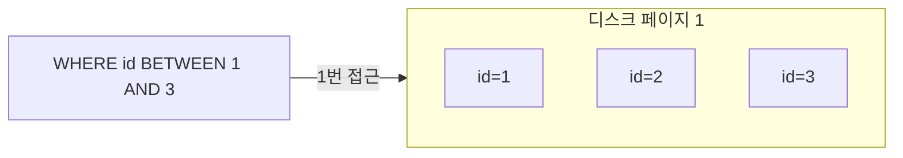
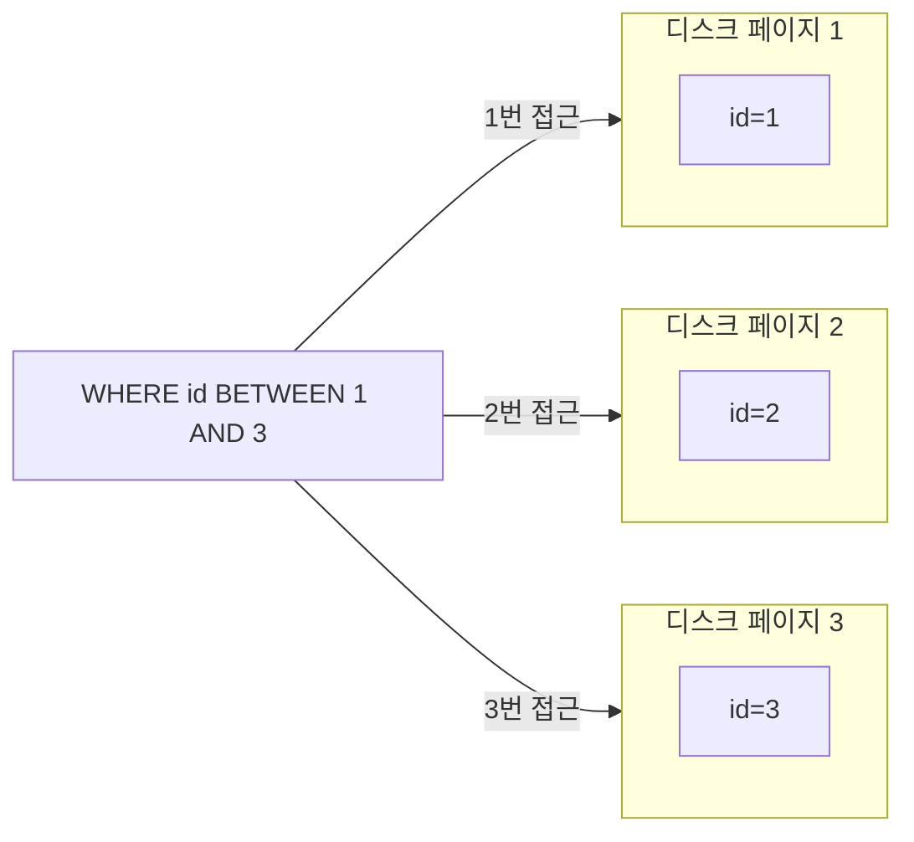
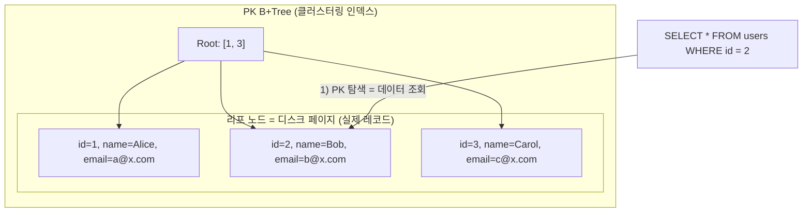
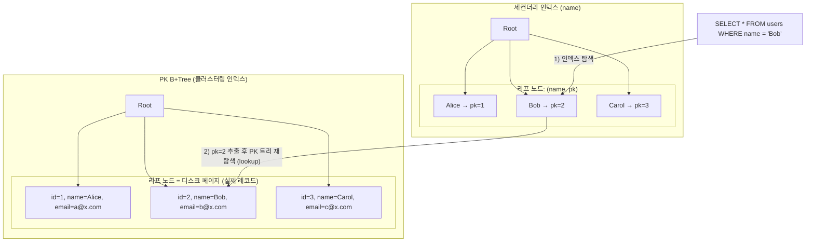
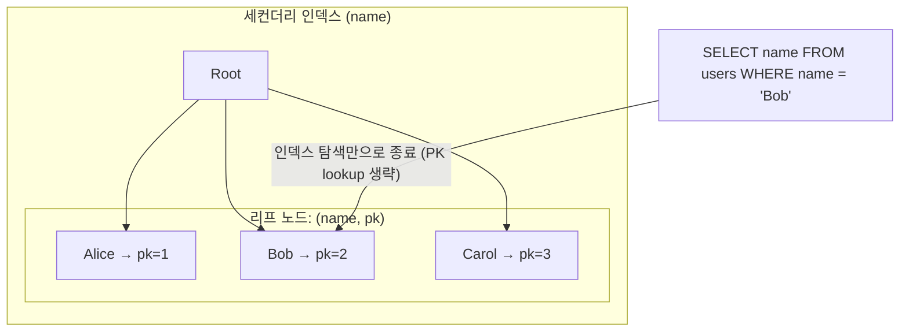
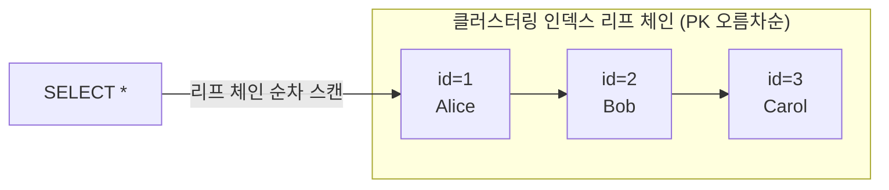
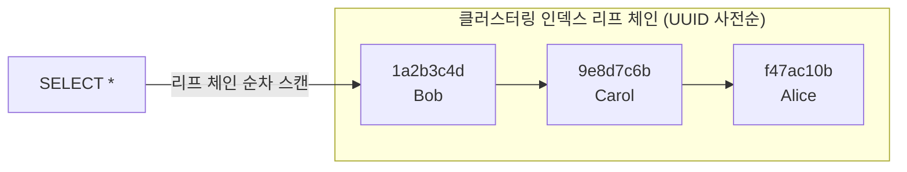

# Primary Key

## Primary Key란
---
Primary Key는 MySQL에서 사용되는 물리 레코드를 인덱싱하는 방법이다. 물리 레코드를 인덱싱하는 것이므로 일반적인 세컨더리 인덱스와 달리 리프 노드는 실제 디스크에 저장된 데이터이며, 레코드의 모든 값이 저장되어 있다. 

> pk의 리프 노드는 디스크 페이지를 접근하므로 pk 조회는 disk io를 유발하는가?

pk 조회는 디스크 페이지를 접근한다. 디스크 io를 발생시킬지라도, 인덱스는 불필요한 디스크 페이지 접근을 발생시키지 않으므로 조회 성능을 높일 수 있다. 그리고 조회된 데이터는 innodb 버퍼풀에 적재되므로 이후의 조회는 메모리 기반 탐색이 가능하다.

## 클러스터링 인덱스
---

### 클러스터링 인덱스?
mysql(InnoDB) 디스크에 저장된 데이터는 특정한 key를 기준으로 정렬되어 있다(primary key). 그리고 정렬된 key들은 군으로 묶여있는데 이를 클러스터링이라 한다. mysql에서 클러스터링 인덱스는 primary key들을 기준으로 비슷한 레코드끼리 묶어서 저장한다.

이 클러스터링 인덱스는 디스크 페이지에 여러 레코드를 하나로 묶게 되는데, 다음의 장점을 누릴 수 있다.

### 조회 이점
디스크 페이지에 여러 비슷한 레코드가 묶여있다는 것은 특정 값부터 특정 값까지 조회 시 한번의 디스크 페이지 접근만으로 여러 레코드를 조회할 수 있음을 의미한다. 즉, 페이지 단위에서 논리적 순차 접근이 가능하기 때문에 range scan이 효율적이다.



만약 레코드가 군집되지 않은 디스크 페이지를 대상으로 데이터를 조회하면 다음과 같이 N번의 디스크 페이지 접근으로 데이터를 조회하게 될 것이다.



### 단점
PK 순서를 따르지 않는 위치에 데이터가 insert되거나, 페이지가 가득 찬 상태에서 추가 insert가 일어나면 page split이 발생한다. 전체 데이터를 재정렬하는 것은 아니지만, 해당 페이지의 절반을 새 페이지로 옮기고 트리를 갱신해야 하므로 비용이 든다. 특히 PK가 랜덤한 값(UUID 등)일 경우 insert 위치가 매번 흩어지므로 page split이 자주 발생하고, 단조 증가 PK(auto_increment)에 비해 insert 성능이 크게 떨어진다.

## 세컨더리 인덱스와의 차이
---
세컨더리 인덱스는 테이블의 컬럼들을 대상으로 데이터를 찾기 쉽게 정렬을 해두는 방식이다. 세컨더리 인덱스의 리프 노드는 물리 주소가 아니라 PK 값을 저장한다. 따라서 조회 흐름은 인덱스 트리 탐색 -> 얻은 PK로 클러스터링 인덱스 재탐색 -> 데이터 방식이 된다.

즉, 세컨더리 인덱스를 통해 데이터를 조회하게 될 경우 2번의 트리 탐색을 거치게 된다. 다만 조회하려는 컬럼이 모두 인덱스 안에 포함되어 있다면, 인덱스 트리만 탐색하고 클러스터링 인덱스를 다시 타지 않아도 응답이 끝난다. 이를 커버링 인덱스라 한다.

### 예시 - PK 조회 (클러스터링 인덱스)

PK 조회는 B+Tree 리프 노드가 곧 실제 데이터 페이지이므로 한 번의 탐색으로 모든 컬럼을 가져올 수 있다.



### 예시 - 세컨더리 인덱스 조회

세컨더리 인덱스의 리프 노드에는 인덱스 컬럼 값 + PK만 저장되어 있다. 다른 컬럼이 필요하면 PK로 다시 클러스터링 인덱스를 타고 가야 한다.



### 예시 - 커버링 인덱스

조회 컬럼이 모두 인덱스 안에 포함되어 있으면 PK 트리를 다시 타지 않고 인덱스만으로 응답이 끝난다.



## PK 선택 기준
---

PK는 단순한 식별자가 아니라 클러스터링 인덱스의 정렬 키이자 모든 세컨더리 인덱스 리프 노드에 함께 저장되는 값이다. 이 두 가지 특성 때문에 PK 선택은 insert 성능, 디스크/메모리 사용량, 모든 인덱스 크기에 광범위한 영향을 준다.

### 정수형 vs 랜덤 문자열

| 구분 | 예시 | insert 위치 | page split |
|------|------|-----------|----------|
| 정수형 | auto_increment | 항상 트리의 가장 오른쪽 끝 페이지 | 거의 발생하지 않음 |
| 랜덤 문자열 | UUID v4 | 매번 트리 내부의 임의 위치 | 자주 발생 |

### 정수형 vs 랜덤 문자열 데이터 순서

`ORDER BY` 없이 `SELECT * FROM users`를 수행하면 InnoDB는 클러스터링 인덱스 리프 노드 체인을 순서대로 읽는다. 즉, 결과 순서는 PK의 정렬 순서를 그대로 따른다.

#### 정수형 PK (auto_increment)

삽입 순서대로 PK가 증가하므로 클러스터링 인덱스도 삽입 순서대로 정렬된다. 결과는 삽입 순서 = PK 오름차순처럼 보인다.

```sql
-- 삽입 순서: Alice → Bob → Carol
INSERT INTO users VALUES (1, 'Alice');
INSERT INTO users VALUES (2, 'Bob');
INSERT INTO users VALUES (3, 'Carol');

SELECT * FROM users;
```

```
+----+-------+
| id | name  |
+----+-------+
|  1 | Alice |
|  2 | Bob   |
|  3 | Carol |
+----+-------+
```



#### 랜덤 문자열 PK (UUID)

UUID는 삽입 시점과 무관한 랜덤 값이기 때문에 클러스터링 인덱스 정렬 순서가 삽입 순서와 무관하다. 결과는 UUID 사전순서로 나온다.

```sql
-- 삽입 순서: Alice → Bob → Carol
INSERT INTO users VALUES ('f47ac10b-...', 'Alice');
INSERT INTO users VALUES ('1a2b3c4d-...', 'Bob');
INSERT INTO users VALUES ('9e8d7c6b-...', 'Carol');

SELECT * FROM users;
```

```
+--------------+-------+
| id           | name  |
+--------------+-------+
| 1a2b3c4d-... | Bob   |   ← UUID 사전순으로 두 번째로 삽입된 Bob이 먼저
| 9e8d7c6b-... | Carol |
| f47ac10b-... | Alice |   ← 가장 먼저 삽입된 Alice가 마지막
+--------------+-------+
```



`SELECT *`의 결과 순서는 삽입 순서가 아니라 클러스터링 인덱스(PK) 정렬 순서다.

- 정수형 PK: 삽입 순서 ≈ PK 정렬 순서 → 결과가 직관적
- UUID PK: 삽입 순서 ≠ PK 정렬 순서 → 결과가 무작위처럼 보임