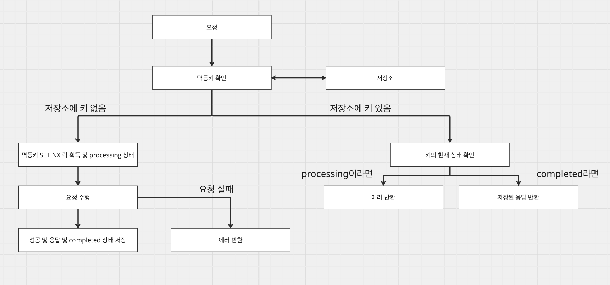

# [네트워크] HTTP 메서드와 멱등성

## HTTP 메서드

---

### HTTP 메서드란

HTTP 메서드는 클라이언트가 서버에게 어떤 동작을 수행해달라는 요청이다. REST API에서 URI(리소스)가 무엇에 해당한다면, HTTP 메서드는 어떻게할 것인가이다. 가령 [GET] /users/1은 id 1을 가진 유저를 조회하겠다라는 의미이고, [DELETE] /users/1은 id 1을 가진 유저를 삭제하겠다는 의미이다. 즉, /users/1 이라는 리소스는 동일하지만 GET, DELETE와 같은 어떻게할 것인가로 인해 동작이 완전 달라지게 된다.

### HTTP/1.1(RFC 7231)

HTTP/1.1에 대한 공식 스펙은 다음과 같다.

#### 1. GET

리소스를 조회하는 메서드이다. 서버의 상태(state)를 변경하지 않고, 본문(body)을 사용하지 않는다. 때문에 리소스에 상세 정보를 전달하기 위해선 query string에 담든, uri path내에 담든 해야한다.

**중요한 것은 서버의 상태를 변경하지 않고, 요청받은 정보를 기반으로 데이터를 조회**하는 것이다. 즉, 서버에선 요청 정보에 대한 쓰기성 작업을 수행해선 안된다. **쓰기 작업으로 인해 매번 조회할 때마다 결과가 달라지면, 멱등성이 깨지**므로 규약을 위반하게 된다. (물론 부가적인 조회 카운트, 감사 로그, 캐시 갱신 등은 괜찮다.)

```kotlin
GET /users/1 HTTP/1.1
Host: api.example.com
```

#### 2. POST

새로운 리소스를 생성할 때 사용된다. 요청 본문(body)에 리소스의 데이터를 담아 보내게 되고, 연속으로 두 번 보내면 두 개의 리소스가 생성된다. PUT과는 다른데, PUT의 경우 몇 번을 보내던 동일한 결과가 응답되어야 한다. 따라서 **POST는 멱등하다고 볼 수 없다.**

```kotlin
POST /users HTTP/1.1
Host: api.example.com
Content-Type: application/json

{
  "name": "철수",
  "email": "cs@example.com"
}
```

#### 3. PUT

앞서 설명했지만 PUT은 리소스를 수정할 때 사용된다. 더 자세하게 말하면 리소스를 통으로 대체하는 요청이다. 만약 **해당 리소스에 대한 데이터가 없다면, 새로 생성하고, 존재한다면 덮어쓴다**. 또한 전체를 업데이트해야하기 때문에 부분적인 필드만 보내지 않고, **리소스 전체를 본문에 담아 요청해야한다. **PUT 메서드는 언제 보내도 같은 결과를 응답하기 때문에 **멱등하다고 볼 수 있다.**

```kotlin
PUT /users/1 HTTP/1.1
Host: api.example.com
Content-Type: application/json

{
  "name": "철수",
  "email": "cs-new@example.com",
  "age": 28
}
```

#### 4. PATCH

리소스의 일부를 수정하는 메서드이다. 앞서 PUT은 전체 리소스를 업데이트하는 반면, PATCH는 부분적으로 필드를 업데이트한다. 만약 PATCH 메서드를 구현한 서버에서 **count, append 등과 같은 연산 작업이 수행된다면 매번 결과가 달라지므로 멱등하다고 볼 수 없다.**여기서 이상한 것은 PUT도 마찬가지로 수정을 하는데, 왜 PUT은 멱등한가이다. 그 이유는 **PUT의 의미는 리소스를 그대로 놓으라는 의미**이고, 즉 **클라이언트가 전달한 데이터가 리소스의 최종 결과**이기 때문이다. 따라서 클라이언트가 전달한 요청값이 결과값이 될 수 밖에 없으므로 **PUT은 멱등하며, PATCH는 멱등할 수도, 멱등하지 않을수도 있다. **(연산 요청이 아니라면 멱등)

```kotlin
PATCH /users/1 HTTP/1.1
Host: api.example.com
Content-Type: application/json

{
  "email": "cs-updated@example.com"
}
```

#### 5. DELETE

리소스를 삭제하는 메서드이다. 리소스를 삭제하므로 DELETE는 첫 요청에선 200을 응답받고, 이후 요청들에선 404를 응답받을 수 있다. 그럼에도 불구하고 DELETE는 멱등하다. 그 이유는 살짝 애매하긴한데 응답 코드가 어떻게 되었든, 서버의 상태는 첫 번째 요청이나 이후의 요청들이나 결과적으로 **서버의 상태가 없음이라는 동일한 상태이므로 멱등하다**라고 한다. (클라이언트는 멱등한 메서드라는 이유로 상태에 기반한 로직 작성을 하면 안될 것 같다.)

```kotlin
DELETE /users/1 HTTP/1.1
Host: api.example.com
```

#### 6. HEAD

GET과 동일한 요청이지만, 응답 본문(body)없이 헤더만 반환한다. 그 이유는 파일 크기 확인, 리소스 존재 유무 확인 등의 용도로 쓰이기 때문이다.

#### 7. OPTIONS

서버가 해당 리소스에 대해 지원하는 메서드 목록을 반환하는 메서드이다. CORS에서 preflight 요청으로 사용되며, 클라이언트가 요청을 보내기 전에 이 메서드로 요청을 보내도 되겠는가에 대한 용도로 사용된다.

HTTP 메서드가 규약이 존재한다고해서 절대적이지 않다. 상황에 따라 다양하게 쓰일 수 있는데, 벌크 형태로 리소스를 조회하고 싶을 경우 보통 /users?ids=1,2,3과 같은 형식으로 요청을 보낼 수 있다. 하지만 저 id의 길이가 URL의 한계를 넘어선(URL의 최대 길이는 일반적으로 2,083자(IE 기준))다면 오류로 인해 정상적인 요청과 응답을 할 수 없다. 따라서 이런 경우엔 POST 형태의 API를 구성하고, 요청 body에 id 배열을 보내어 처리할 수도 있다.

## 멱등성

---

### 멱등성과 안전성

앞서 HTTP 메서드들은 멱등하다, 멱등하지 않다라고 표현이 되었다. 여기서의 멱등은 요청을 연속으로 몇 번을 보내던 항상 서버의 최종 상태가 동일하다는 의미이다. 멱등성은 동일한 연산을 여러번 수행하더라도 결과가 변하지 않음을 의미한다.

| 메서드 | 멱등성 | 안전성 | 설명 |
| --- | --- | --- | --- |
| GET | O | O | 조회만 하므로 상태 변경이 없다. |
| HEAD | O | O | GET과 동일하지만 헤더만 응답한다. |
| OPTIONS | O | O | 지원 메서드 정보만 확인한다. |
| PUT | O | X | 동일한 데이터로 덮어쓴다. |
| DELETE | O | X | 리소스를 삭제한다. |
| POST | X | X | 새 리소스를 생성한다. |
| PATCH | O or X | X | 구현에 따라 다르다. |

HTTP 메서드는 리소스를 새로 생성할수도, 삭제할수도, 변경할수도 있다. 위 표의 안전성은 서버의 상태를 아예 변경하지 않는 것들을 안전하다고하며, 변경이 발생하는 메서드는 안전하지 않다고 한다. 즉, 서버의 상태가 멱등성있게 처리된다하여도 안전이 보장되는 것은 아니다.

### 멱등성이 중요한 이유

#### 1. 네트워크 장애와 재시도

멱등성이 중요한 이유는 네트워크 장애 상황에서 안전한 재시도 때문이다. 언제나 네트워크는 순단될 수 있고, 커넥션 타임아웃이 발생할 수 있고, 따닥으로 중복 요청이 발생하는등 수 많은 케이스가 존재한다. 이 상황에서 멱등성이 보장되지 못한다면, 장애가 발생할 때마다 중복 리소스가 생성될 수 있다. 하지만 멱등성이 보장된 요청이라면 중복 리소스 생성을 막을 수 있고, 언제든지 요청을 보내어도 동일한 결과를 전달받을 수 있다.

#### 2. 멱등키

POST와 같이 멱등이 보장되지 않은 메서드임에도 멱등성을 보장해야하는 경우가 존재한다. 결제, 주문 등과 같이 중복으로 요청되었을 경우 금전적으로 손실을 입는 경우가 예가 될 수 있다. 이런 중복 요청을 막기 위한 방법 중 하나가 멱등키이다.

기본 흐름은 클라이언트가 헤더에 고유 키를 포함해서 요청을 보내는 것으로 시작하고, 서버는 이 키를 이용하여 중복된 요청인지 판별한다. 세세한 흐름은 다음과 같다.



1. 클라이언트는 멱등키를 헤더에 실어 요청한다.

2. 서버는 저장소로부터 멱등키가 존재하는지 확인한다.

3. 저장소에 키가 없다면, 멱등키로 락을 잡고 processing 상태로 둔다.

4. 요청을 수행하고 성공한다면 completed 상태와 결과를 저장한다.

5. 만약 저장소에 키가 있다면 현재 processing인지, completed인지를 판단하여 응답한다.

여기서 저장소를 redis로 쓸수도, mysql로 쓸수도있는데 굳이 영구적으로 모든 멱등키를 저장하고, 지우고를 반복하는 것이 좋겠냐는 측면과 락을 빠르게 걸고 TTL까지 처리가 되는 redis가 더 좋아보이긴 하다. 다만, redis가 장애가 발생할 경우 데이터가 유실될 수 도 있으니 mysql같은 rdb를 함께 사용하는 것도 좋아보인다.

```kotlin
data class IdempotencyRecord(
    val status: Status,
    val requestHash: String,
    val responseCode: Int? = null,
    val responseBody: String? = null,
    val createdAt: Long = System.currentTimeMillis()
) {
    enum class Status {
        PROCESSING,  // 처리 중 (락 획득 상태)
        COMPLETED,   // 처리 완료 (응답 캐싱됨)
        FAILED       // 비즈니스 에러 (재시도해도 같은 실패)
    }
}

---

@Target(AnnotationTarget.FUNCTION)
@Retention(AnnotationRetention.RUNTIME)
annotation class Idempotent(
    val ttlSeconds: Long = 86400  // 기본 24시간
)

@Aspect
@Component
class IdempotencyAspect(
    private val store: IdempotencyStore,
    private val mapper: ObjectMapper
) {
    @Around("@annotation(idempotent)")
    fun handle(joinPoint: ProceedingJoinPoint, idempotent: Idempotent): Any? {
        val request = (RequestContextHolder.getRequestAttributes() as ServletRequestAttributes).request

        val key = request.getHeader("Idempotency-Key")
            ?: throw ResponseStatusException(HttpStatus.BAD_REQUEST, "Idempotency-Key 필요")

        val body = request.getAttribute("cachedBody") as? String ?: ""
        val hash = sha256(body)
        val ttl = Duration.ofSeconds(idempotent.ttlSeconds)

        // ---- before: 키 확인 + 락 획득 ----
        val existing = store.get(key)
        if (existing != null) {
            if (existing.status == "PROCESSING")
                throw ResponseStatusException(HttpStatus.CONFLICT, "처리 중")
            if (existing.requestHash != hash)
                throw ResponseStatusException(HttpStatus.UNPROCESSABLE_ENTITY, "같은 키에 다른 요청")
            // 캐싱된 응답 반환
            return ResponseEntity.status(existing.responseCode ?: 200).body(existing.responseBody)
        }

        if (!store.tryLock(key, hash))
            throw ResponseStatusException(HttpStatus.CONFLICT, "처리 중")

        // ---- proceed: 비즈니스 로직 실행 ----
        return try {
            val result = joinPoint.proceed()
            if (result is ResponseEntity<*>) {
                store.complete(key, result.statusCode.value(), mapper.writeValueAsString(result.body), ttl)
            }
            result
        } catch (e: BusinessException) {
            store.markFailed(key, 400, """{"error":"${e.message}"}""", ttl)
            throw e
        } catch (e: Exception) {
            store.release(key)  // 일시적 에러 → 재시도 허용
            throw e
        }
    }

    private fun sha256(input: String): String =
        MessageDigest.getInstance("SHA-256")
            .digest(input.toByteArray())
            .joinToString("") { "%02x".format(it) }
}

@Component
class CachingFilter : OncePerRequestFilter() {
    override fun doFilterInternal(req: HttpServletRequest, res: HttpServletResponse, chain: FilterChain) {
        val wrapped = ContentCachingRequestWrapper(req)
        chain.doFilter(wrapped, res)
    }
}
---

@Component
class IdempotencyStore(
    private val redis: StringRedisTemplate,
    private val mapper: ObjectMapper
) {
    private val prefix = "idempotency:"

    /** SET NX로 락 획득 (원자적) */
    fun tryLock(key: String, requestHash: String): Boolean {
        val record = IdempotencyRecord("PROCESSING", requestHash)
        val json = mapper.writeValueAsString(record)
        return redis.opsForValue()
            .setIfAbsent("$prefix$key", json, Duration.ofSeconds(30)) == true
    }

    /** 완료 저장 */
    fun complete(key: String, code: Int, body: String, ttl: Duration = Duration.ofHours(24)) {
        val record = get(key)?.copy(status = "COMPLETED", responseCode = code, responseBody = body) ?: return
        redis.opsForValue().set("$prefix$key", mapper.writeValueAsString(record), ttl)
    }

    /** 키 삭제 (일시적 에러 시 재시도 허용) */
    fun release(key: String) = redis.delete("$prefix$key")

    /** 조회 */
    fun get(key: String): IdempotencyRecord? {
        val json = redis.opsForValue().get("$prefix$key") ?: return null
        return mapper.readValue(json, IdempotencyRecord::class.java)
    }
}

data class PaymentRequest(val orderId: String, val amount: Long)
data class PaymentResponse(val paymentId: String, val orderId: String, val amount: Long, val status: String)

@RestController
@RequestMapping("/api/payments")
class PaymentController(
    private val store: IdempotencyStore,
    private val mapper: ObjectMapper
) {
    @PostMapping
    @Idempotent(ttlSeconds = 86400)  // 24시간 TTL
    fun createPayment(
        @RequestBody request: PaymentRequest
    ): ResponseEntity<PaymentResponse> {
        val result = paymentService.processPayment(request)
        return ResponseEntity.ok(result)
    }
}
```

## 참조

---

[https://docs.tosspayments.com/blog/what-is-idempotency](https://docs.tosspayments.com/blog/what-is-idempotency)

[https://mangkyu.tistory.com/251](https://mangkyu.tistory.com/251)
