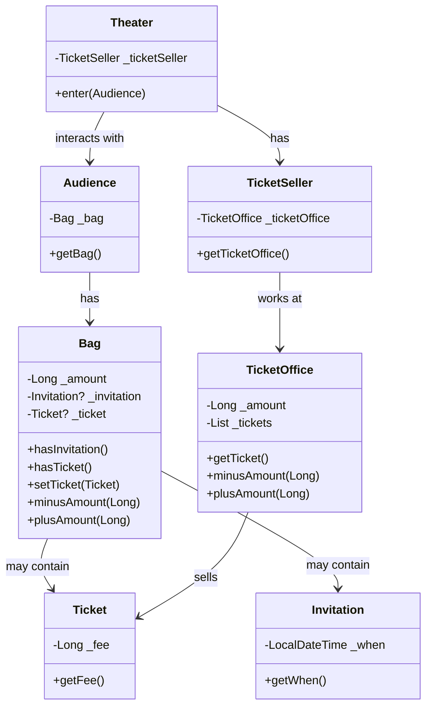

# 티켓 판매 애플리케이션
## 요구 사항
1. 이벤트 당첨 관람객, 그렇지 못한 관람객을 나눈다.
2. 이벤트 당첨 관람객은 초대장을 티켓으로 입장하고, 그렇지 못한 관람객은 티켓 구매로 입장할 수 있다.
   * 공연을 관람하는 관객들은 티켓을 소지하고 있다.
   * 이벤트 당첨 관람객은 초대장을 가지고 있고, 그렇지 못한 관람객은 구매할 수 있는 현금을 가지고 있다.
   * 즉, 관람객은 초대장, 현금, 티켓 3개를 소지한다.
3. 가방에는 이 소지품들을 담을 수 있다.
   * 가방은 관람객의 이벤트 당첨 유무에 따라 소지품의 변동이 생긴다.
   * 이벤트가 당첨되어 있다면 가방엔 초대장이 있을 것이고, 그렇지 못한 관람객은 초대장이 없고 현금만 있을 것이다.
4. 관람객은 소지품 보관을 위해 가방을 소지할 수 있다.
5. 매표소는 관람객에게 판매할 티켓과, 티켓의 판매 금액이 있어야 한다.
6. 판매원은 티켓을 교환해주거나 티켓을 판매하는 역할을 수행하기 때문에 어느 매표소에 위치할지 알아야한다.
7. 소극장은 관람객을 수용하는 장소이다.

---
## 컴포넌트 다이어그램


---
## 1차 코드의 문제점
Theater의 enter 메서드는 객체의 자율성이 보장되지 않고, 소극장에 의해 관람객과 판매원을 통제한다.

```kotlin
class Theater(private var _ticketSeller: TicketSeller) {
    fun enter(audience: Audience) {
        // 초대장이 있는 경우
        if (audience.bag.hasInvitation()) {
            val ticket = this._ticketSeller.ticketOffice.getTicket()
            audience.bag.setTicket(ticket)
        } else {
            val ticket = this._ticketSeller.ticketOffice.getTicket()
            audience.bag.minusAmount(ticket.fee)
            this._ticketSeller.ticketOffice.plusAmount(ticket.fee)
            audience.bag.setTicket(ticket)
        }
    }
}
```

코드를 해석하면 소극장은 다음과 같은 작업을 수행한다.
* 소극장이 관람객의 가방을 열어 초대장을 확인하고 티켓을 가방에 넣는다.
* 판매원으로 하여금 매표소의 티켓을 꺼내고 현금에 접근한다.

코드는 그럴 수 있겠으나 실세계에서 이해 가능한 범주를 넘어서게 된다.  
또한 하나의 메서드(책임)에서 많은 양의 정보를 기억하고 작업을 수행한다.

즉, 상식과 다른 로직과 많은 양의 정보는 코드를 읽는 사람에게 제대로 된 의사소통을 제공하지 못하게 된다.

그리고 Theater는 다양한 객체를 참조(2depth 이상의)하고 있기 때문에 변경에 취약하다라는 문제점에 노출된다.

---
## 개선
이 코드의 문제점은 다음과 같다.
* 2depth 이상의 객체 참조가 강한 결합을 발생시킨다.
* 통상적인 이해(객체를 통제하는)를 벗어난 코드 구성이다.

2depth 이상의 참조는 하나의 객체가 많은 일을 수행함을 의미한다.
소극장이 관람객의 가방의 티켓을, 판매원의 매표소의 티켓을 .. 와 같은 많은 일을 관여함을 의미한다.

따라서 각 객체들이 자신의 일을 처리할 수 있게 자율성이 보장된다면, 하나의 객체가 많은 일을 관여하지도 않게 된다.

### 객체의 자율성 보장
소극장에서 통제하는 일들을 각 객체에게 전가시키도록 한다.

#### 1. 1차 개선
- as-is
```kotlin
class Theater(private var _ticketSeller: TicketSeller) {
    fun enter(audience: Audience) {
        // 초대장이 있는 경우
        if (audience.bag.hasInvitation()) {
            val ticket = this._ticketSeller.ticketOffice.getTicket()
            audience.bag.setTicket(ticket)
        } else {
            val ticket = this._ticketSeller.ticketOffice.getTicket()
            audience.bag.minusAmount(ticket.fee)
            this._ticketSeller.ticketOffice.plusAmount(ticket.fee)
            audience.bag.setTicket(ticket)
        }
    }
}
```

- to-be
```kotlin
class Theater(private var _ticketSeller: TicketSeller) {
   fun enter(audience: Audience) {
      this._ticketSeller.sellTo(audience)
   }
}

class TicketSeller(
   private var _ticketOffice: TicketOffice
) {
   val ticketOffice get() = this._ticketOffice

   fun sellTo(audience: Audience) {
      if (audience.bag.hasInvitation()) {
         val ticket = this.ticketOffice.getTicket()
         audience.bag.setTicket(ticket)
      } else {
         val ticket = this.ticketOffice.getTicket()
         audience.bag.minusAmount(ticket.fee)
         this.ticketOffice.plusAmount(ticket.fee)
         audience.bag.setTicket(ticket)
      }
   }
}
```

인스턴스의 모든 멤버 변수들의 가시성은 private으로 외부에서 접근이 불가하고, 오로지 public으로 열려 있는 메서드를 통해서 접근이 가능하다.  
따라서 `TicketSeller`를 통해서만 `TicketOffice`에 접근이 가능하고, 관람객에게 표를 판매할 수 있다.   
이는 `Theater`의 통제에서 벗어나 `TicketSeller` 스스로 자율적으로 일을 수행함을 의미한다.

처음 `Theater`는 여러 객체들을 참조했으나, 통제하는 로직을 `TicketSeller`로 이관시킴에 따라 정말 필요한 참조와 결합만이 남게 되었다.    
`Theater`는 `TicketSeller`의 `sellTo`라는 인터페이스를 의존하고, `TicketSeller`는 `sellTo`라는 인터페이스로 `TicketOffice`를 외부에 노출시키지않고 캡슐화를 했다.   
추후 `TicketOffice`에 대한 변경 사항이 생긴다면 `TicketSeller`만 수정하면 되므로 변경에 좀 더 용이해졌다.

`TicketSeller`에서의 로직도 동일한 수순으로 각 객체들에게 자율성을 부여할 수 있다.

#### 2. 2차 개선

- as-is
```kotlin
class Audience(
    private var _bag: Bag
) {
    val bag: Bag get() = this._bag
}

class TicketSeller(
    private var _ticketOffice: TicketOffice
) {
    val ticketOffice get() = this._ticketOffice

    fun sellTo(audience: Audience) {
        if (audience.bag.hasInvitation()) {
            val ticket = this.ticketOffice.getTicket()
            audience.bag.setTicket(ticket)
        } else {
            val ticket = this.ticketOffice.getTicket()
            audience.bag.minusAmount(ticket.fee)
            this.ticketOffice.plusAmount(ticket.fee)
            audience.bag.setTicket(ticket)
        }
    }
}
```

- to-be
```kotlin
class Audience(
    private var _bag: Bag
) {
    val bag: Bag get() = this._bag
    
    fun buy(ticket: Ticket): Long {
        if (this.bag.hasInvitation()) {
            this.bag.setTicket(ticket)
            return 0L
        } else {
            this.bag.minusAmount(ticket.fee)
            this.bag.setTicket(ticket)
            return ticket.fee
        }
    }
}

class TicketSeller(
   private var _ticketOffice: TicketOffice
) {
   val ticketOffice get() = this._ticketOffice

   fun sellTo(audience: Audience) {
      this._ticketOffice.plusAmount(audience.buy(this._ticketOffice.getTicket()))
   }
}
```

Audience, TicketSeller들은 각자가 스스로 소지품을 관리하고, 표를 판매하도록 자율성이 보장되었다.   
Audience는 외부에서 나의 소지품을 접근하여 티켓을 넣는다던지, 돈을 빼간다던지와 같은 일이 사라졌고, TicketSeller는 외부에서 매표소로 접근하여 티켓을 판매한다던지와 같은 일이 사라졌다.   

전체적인 개선은 다음과 같다.
* 객체의 멤버 변수가 함부로 외부에서 접근하지 못하도록 한다.
* 오로지 메서드라는 인터페이스를 통해 상호작용하도록 한다.
* 밀접하게 연관된 객체만이 참조하도록 하여 응집도를 높인다.

이 개선을 통해 얻을 수 있는 사실은 다음과 같다.  
객체의 멤버 변수를 직접적으로 노출하거나 getter와 같이 의미없는 인터페이스로의 노출은 캡슐화를 깨트린다.  
깨진 캡슐화는 외부에서 멤버 변수를 직접적으로 참조하게 되고, 객체의 자율성을 해치며 의존성을 높이게 된다.

---
## 자율성을 보장하는 게 무조건 좋은 설계인가
Ticket 애플리케이션의 모든 객체들에게 자율성을 보장하는 코드로 리팩토링을 진행하였다.   
분명 자율성은 높아졌지만 가장 처음이었던 Theater가 전체를 의존하는 것과 달리 각 객체들이 서로 다른 객체들을 의존하는 형태로 변경되었다.  
즉, 자율성을 높인다고 의존성이 낮아지는 건 항상 참이 아니며 트레이드오프를 통해서 어떤 것이 더 나은 설계일지를 판단해야 한다.   
다만 의존성이 생긴다는 것이 항상 나쁜 것이 아니며, 오히려 이런 의존과 결합이 객체 간의 상호작용을 더욱 의미있게 해석될 수 있고, 변경에 이점을 가져다 줄 수 있다.