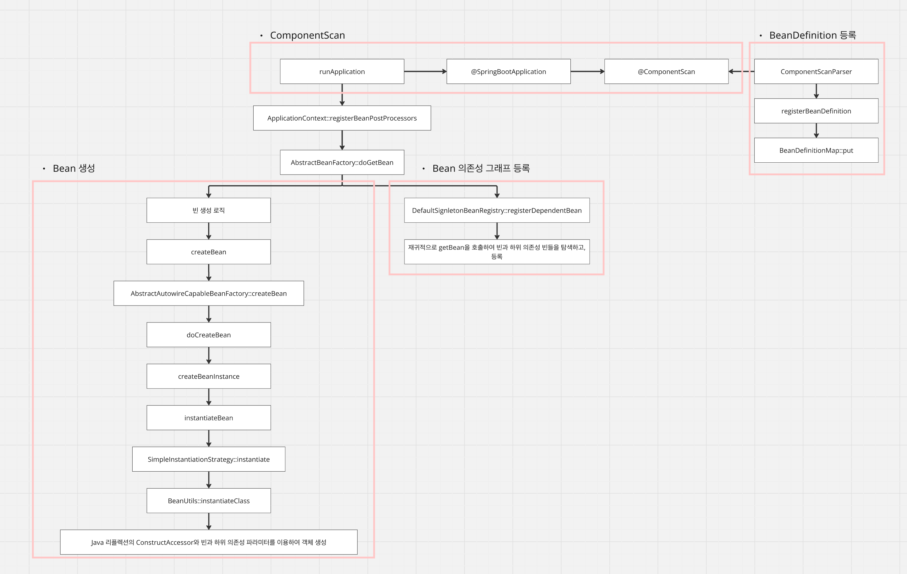

# [Spring] DI, IoC

- **tags:** #Spring #DI #IoC #DependencyInjection #InversionOfControl #Kotlin

---
### 무엇을 배웠는가?
* 클래스 간 직접 참조가 가져오는 **의존성 문제**와 그로 인한 변경의 어려움을 이해합니다.
* 인터페이스와 **의존성 주입(DI)**을 통해 결합도를 낮추는 방법을 배웁니다.
* 생성자 주입, 세터 주입, 필드 주입 등 DI의 3가지 방식과 각각의 특징을 학습합니다.
* **제어의 역전(IoC)**의 개념과 스프링 컨텍스트가 빈을 생성·관리하는 내부 동작 원리를 이해합니다.

---
### 왜 중요하고, 어떤 맥락인가?
객체지향 설계에서 클래스 간 결합도(Coupling)를 낮추는 것은 유지보수성과 테스트 용이성에 직결됩니다.

클래스가 다른 클래스를 **직접 생성**하면, 구현체가 바뀔 때마다 해당 클래스를 참조하는 모든 코드를 수정해야 합니다. 스프링의 DI와 IoC는 이 문제를 프레임워크 수준에서 해결해 주며, 개발자가 비즈니스 로직에만 집중할 수 있게 해줍니다.

---
### 상세 내용

#### 1. 의존성 (Dependency)
아래 코드처럼 `OrderService`가 `KakaoPay`를 직접 생성하면, 결제 수단을 `NaverPay`로 바꾸려 할 때 `OrderService` 코드를 직접 수정해야 합니다.

```kotlin
class OrderService {
    private val paymentService = KakaoPay() // 구현체에 직접 의존

    fun order(item: String) {
        paymentService.pay(item)
    }
}
```

이 구조는 `KakaoPay`를 참조하는 모든 코드를 변경해야 하며, 새로운 요구사항에 취약합니다.

#### 2. 의존성 주입 (Dependency Injection)
스프링은 **인터페이스**에 의존하고, 구현체를 **외부에서 주입**받는 방식으로 이 문제를 해결합니다.

```kotlin
interface PaymentService {
    fun pay(item: String)
}

@Component
class KakaoPay : PaymentService {
    override fun pay(item: String) { ... }
}

@Component
class NaverPay : PaymentService {
    override fun pay(item: String) { ... }
}
```

주입 방법은 세 가지가 있습니다.

**1) 생성자 주입 (권장)**
```kotlin
@Service
class OrderService(
    private val paymentService: PaymentService
) {
    fun order(item: String) {
        paymentService.pay(item)
    }
}
```
불변성을 보장하고, 테스트 시 Mock 객체를 쉽게 주입할 수 있어 가장 권장됩니다.

**2) 세터 주입**
```kotlin
@Service
class OrderService {
    private lateinit var paymentService: PaymentService

    @Autowired
    fun setPaymentService(paymentService: PaymentService) {
        this.paymentService = paymentService
    }
}
```
선택적 의존성에 사용할 수 있으나, 객체 생성 후 변경 가능성이 생깁니다.

**3) 필드 주입**
```kotlin
@Service
class OrderService {
    @Autowired
    private lateinit var paymentService: PaymentService
}
```
코드가 간결하지만, 테스트 시 Mock 주입이 어렵고 스프링 컨테이너 없이는 동작하지 않습니다.

#### 3. 제어의 역전 (IoC - Inversion of Control)
전통적인 방식에서는 개발자가 직접 객체를 생성하고 관리했습니다. IoC는 이 **제어권을 프레임워크(스프링 컨테이너)에게 넘기는** 원칙입니다.

스프링이 객체(빈)의 생명주기를 대신 관리하므로, 개발자는 비즈니스 로직에만 집중할 수 있습니다.

* **장점**
  * 인터페이스에 의존하므로 구현체 변경이 유연합니다.
  * Mock 객체 주입이 쉬워 단위 테스트가 용이합니다.
  * 객체 생성/관리와 비즈니스 로직의 **관심사가 분리**됩니다.

#### 4. 스프링 컨텍스트의 의존성 관리
스프링이 애플리케이션 시작 시 빈을 생성하고 의존성을 연결하는 과정은 다음과 같습니다.



1. **ComponentScan**: `@SpringBootApplication`이 지정된 패키지와 하위 패키지를 스캔합니다.
2. **BeanDefinition 등록**: `@Component`, `@Service` 등이 붙은 클래스를 `BeanDefinitionMap`에 등록합니다.
3. **의존성 그래프 분석**: `getBean`을 재귀적으로 호출하여 각 빈의 의존성을 파악합니다.
4. **빈 생성**: 리플렉션(`ConstructorAccessor`)을 통해 런타임에 인스턴스를 생성하고 주입합니다.

---
### 요약
- 클래스가 구현체를 **직접 생성**하면 변경에 취약해지며, **인터페이스 기반 DI**로 결합도를 낮출 수 있습니다.
- DI 방법 중 **생성자 주입**이 불변성과 테스트 용이성 측면에서 가장 권장됩니다.
- **IoC**는 객체 생명주기의 제어권을 프레임워크에 위임하는 원칙으로, 개발자가 비즈니스 로직에 집중하게 합니다.
- 스프링은 ComponentScan → BeanDefinition 등록 → 의존성 분석 → 리플렉션 기반 빈 생성의 순서로 의존성을 관리합니다.
