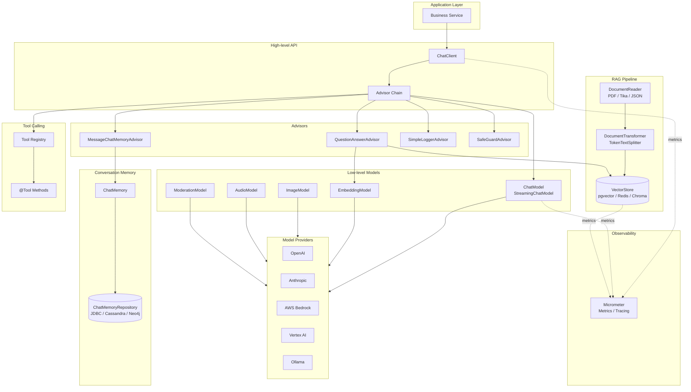
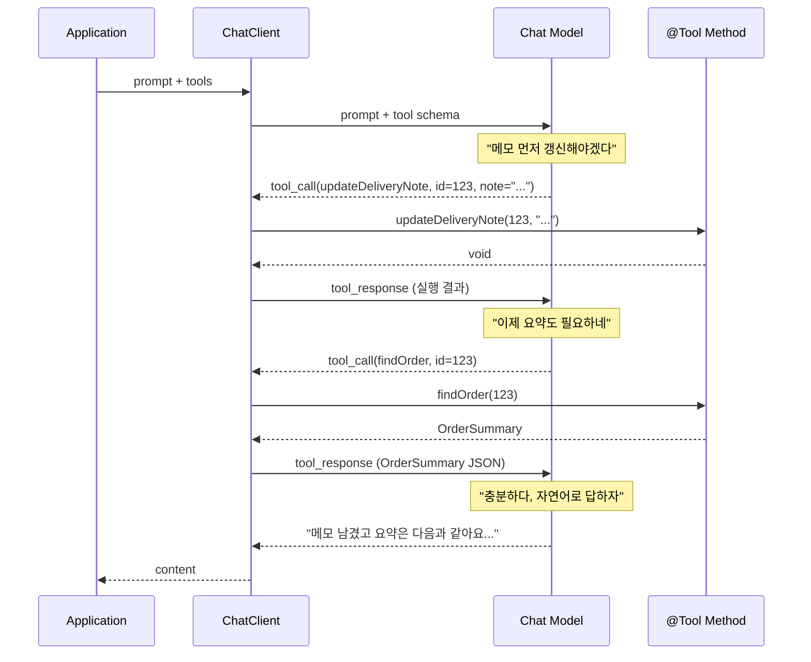
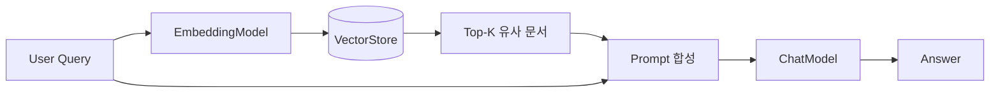
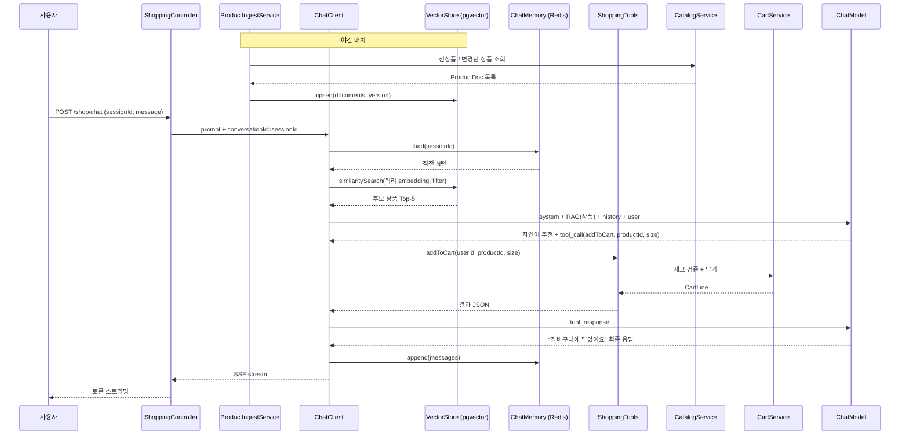

# Spring AI

## Spring AI

Spring AI는 Spring 진영의 공식 AI/LLM 통합 프레임워크다.

OpenAI, Anthropic, Google Vertex, Ollama, Bedrock 등 다양한 모델 프로바이더를 단일한 추상(`ChatModel`, `EmbeddingModel`, `ImageModel` 등)으로 묶고, 그 위에서 RAG, Tool Calling, 대화 메모리, 구조화 응답, 메트릭 같은 횡단 기능을 Spring 스타일(Bean, AutoConfiguration, Starter)로 제공한다.

> Spring AI의 목표는 "LLM이라는 외부 의존성을 데이터베이스나 메시지 큐처럼 다루게 해주는 것"이다. JPA가 RDBMS 벤더 차이를 흡수하듯, Spring AI는 모델 프로바이더 차이를 흡수한다.

## 왜 등장했는가

LLM을 직접 호출할 때 매번 마주치는 반복 작업이 있다.

1. **HTTP 통신과 직렬화**: 모델마다 SDK 또는 REST 스펙이 다르고, 응답을 도메인 객체로 매핑하는 코드가 매번 반복된다.
2. **프롬프트 조립**: 시스템 프롬프트, 유저 프롬프트, 이전 대화, RAG 컨텍스트를 매번 직접 문자열로 짜맞춰야 한다.
3. **Tool Calling**: 모델이 함수 호출 요청을 응답하면, 호출 후 결과를 다시 모델에 주입하는 루프를 수동으로 짜야 한다.
4. **RAG 파이프라인**: 문서 로딩 → 청크 분할 → 임베딩 → Vector DB 적재 → 질의 시 유사도 검색 → 프롬프트 합성을 매번 직접 구성해야 한다.
5. **메트릭 / 추적**: 토큰 사용량, 비용, 응답 지연, 실패율을 추적하는 옵저버빌리티가 필요하다.

이 반복을 Spring Boot AutoConfiguration과 Bean으로 묶어 제공하는 것이 Spring AI다. `spring-ai-openai-spring-boot-starter` 같은 스타터만 추가하면 `ChatClient`가 컨테이너에 자동 등록된다.

## 핵심 추상화

Spring AI는 모델 종류별로 인터페이스를 분리한다.

| 인터페이스 | 역할 |
| --- | --- |
| `ChatModel` | 텍스트 입력 → 텍스트 출력 (Completion) |
| `StreamingChatModel` | 스트리밍 응답 (Server-Sent Event) |
| `EmbeddingModel` | 텍스트 → 벡터 임베딩 |
| `ImageModel` | 텍스트 → 이미지 |
| `AudioTranscriptionModel` | 음성 → 텍스트 (STT) |
| `TextToSpeechModel` | 텍스트 → 음성 (TTS) |
| `ModerationModel` | 콘텐츠 안전성 검사 |

그리고 이 위에 사용자가 직접 다루는 고수준 진입점인 `ChatClient`가 존재한다.

### ChatModel vs ChatClient

* **ChatModel**: 모델 한 번 호출에 해당하는 저수준 API. `Prompt`를 받아 `ChatResponse`를 반환한다.
* **ChatClient**: `ChatModel`을 감싸는 빌더 기반 고수준 API. 시스템 프롬프트, Advisor 체인, Tool, 구조화 응답, 메모리를 한 번에 구성할 수 있다.

```kotlin
@Configuration
class ChatClientConfig {

    @Bean
    fun chatClient(chatModel: ChatModel): ChatClient =
        ChatClient.builder(chatModel)
            .defaultSystem("너는 사용자의 쇼핑을 돕는 어시스턴트야. 항상 한국어로 대답해.")
            .build()
}
```

대부분의 비즈니스 코드는 `ChatClient`만 사용하면 충분하다.

## 컴포넌트 다이어그램

Spring AI의 전체 컴포넌트 관계를 한 장으로 정리하면 다음과 같다.



* **Application Layer**: 비즈니스 서비스는 `ChatClient` 하나만 의존한다.
* **High-level API**: `ChatClient`는 Advisor 체인을 거쳐 저수준 모델을 호출한다.
* **Advisors**: 메모리 주입, RAG 검색, 로깅, 안전 가드 등 횡단 관심사를 담당한다.
* **Low-level Models**: 모델 종류별 인터페이스가 분리되어 있고, 실제 호출은 Provider 구현체가 수행한다.
* **Conversation Memory / RAG / Tools**: 각각 독립적인 컴포넌트로 Advisor를 통해 `ChatClient`에 끼어든다.
* **Observability**: 모든 핵심 컴포넌트는 Micrometer로 메트릭을 내보낸다.

## 프롬프트와 메시지

LLM에 보내는 입력은 단일 문자열이 아니라 역할이 다른 여러 메시지의 시퀀스다.

| 메시지 타입 | 역할 |
| --- | --- |
| `SystemMessage` | 모델의 페르소나, 규칙, 출력 형식 가이드 |
| `UserMessage` | 사용자 입력 |
| `AssistantMessage` | 이전 모델 응답 (대화 히스토리) |
| `ToolResponseMessage` | Tool 실행 결과 |

```kotlin
val prompt = Prompt(
    listOf(
        SystemMessage("너는 쇼핑몰의 상품 추천 어시스턴트야."),
        UserMessage("30만원 이하 겨울 패딩 3개만 추천해줘."),
    )
)

val response: ChatResponse = chatModel.call(prompt)
val text: String = response.result.output.text
```

`ChatClient`를 쓰면 메시지 조립이 빌더로 단순해진다.

```kotlin
val answer: String = chatClient.prompt()
    .system("너는 쇼핑몰의 상품 추천 어시스턴트야.")
    .user("30만원 이하 겨울 패딩 3개만 추천해줘.")
    .call()
    .content()
```

### PromptTemplate

프롬프트를 템플릿화할 수 있다.

```kotlin
val template = PromptTemplate(
    """
    아래 상품 설명을 {tone} 톤으로 다시 써줘.

    상품명: {productName}
    원본 설명: {description}

    포함해야 할 키워드: {keywords}
    """.trimIndent()
)

val prompt = template.create(
    mapOf(
        "productName" to "구스다운 롱패딩",
        "description" to "오리털 80%, 솜털 20%. 무게 850g.",
        "tone" to "따뜻하고 친근한",
        "keywords" to "가벼움, 보온성, 도심 출퇴근",
    )
)
```

## Structured Output

LLM 응답은 기본적으로 문자열이라 도메인 객체로 변환이 필요하다. Spring AI는 `entity()`로 응답을 바로 객체에 매핑한다.

```kotlin
data class ProductPick(
    val productName: String,
    val priceRange: String,
    val reasons: List<String>,
)

val result: ProductPick = chatClient.prompt()
    .user("20대 남성 출근용 백팩 추천 1개를 JSON으로 만들어줘")
    .call()
    .entity(ProductPick::class.java)
```

내부 동작은 다음과 같다.

1. `entity()`가 대상 클래스의 JSON Schema를 생성한다.
2. 시스템 프롬프트에 "이 스키마에 맞춰 응답해" 가이드를 자동 주입한다.
3. 모델 응답 텍스트를 JSON으로 파싱하여 객체로 역직렬화한다.

리스트, Map, 제네릭 타입도 `ParameterizedTypeReference`로 지원한다.

```kotlin
val picks: List<ProductPick> = chatClient.prompt()
    .user("선물용 상품 5개를 만들어줘")
    .call()
    .entity(object : ParameterizedTypeReference<List<ProductPick>>() {})
```

## Tool / Function Calling

### 이게 왜 필요한가

LLM은 텍스트 생성기다. 사용자가 "주문 123 배송 메모 좀 바꿔줘"라고 해도 LLM 자체는 DB를 조회할 수도, UPDATE 쿼리를 날릴 수도 없다. 학습 시점 이후의 정보는 모르고, 실시간 데이터에는 접근할 수 없으며, 외부 상태를 바꿀 수단도 없다.

### 핵심 흐름 3단계

```
[1] 나   → LLM : 사용자 질문 + "쓸 수 있는 함수 목록(스키마)"
[2] LLM  → 나   : "findOrder(123) 호출해줘" 라는 JSON 요청
[3] 나   → 함수 실행 → 결과를 LLM에 다시 전달 → LLM이 자연어로 마무리
```

[2]에서 LLM이 자연어로 답하면 그냥 끝나고, 함수 호출을 요청하면 그 함수를 실행한 뒤 결과를 다시 LLM에 넣어 한 번 더 호출한다. 이 사이클이 끝날 때까지 Spring AI가 자동으로 돌려준다.

### 코드 예시

먼저 LLM에게 알려줄 함수를 정의한다.

```kotlin
class OrderTools(private val orderRepository: OrderRepository) {

    @Tool(description = "주문 ID로 주문 요약을 조회한다")
    fun findOrder(
        @ToolParam(description = "주문 ID") id: Long,
    ): OrderSummary {
        return orderRepository.findSummaryById(id)
            ?: throw NoSuchElementException("Order not found: $id")
    }

    @Tool(description = "주문 배송 메모를 갱신한다")
    fun updateDeliveryNote(
        @ToolParam(description = "주문 ID") id: Long,
        @ToolParam(description = "배송 메모") note: String,
    ) {
        orderRepository.updateDeliveryNote(id, note)
    }
}
```

`@Tool` / `@ToolParam`의 `description`은 사람을 위한 주석이 아니라 **LLM에게 보내지는 사용 설명서**다. "이 함수는 뭘 하는 함수이고 인자는 뭘 의미하는지" 모델이 이 텍스트를 읽고 결정한다.

이 클래스를 `tools(...)`로 ChatClient에 넘긴다.

```kotlin
val tools = OrderTools(orderRepository)

val answer = chatClient.prompt()
    .user("주문 123에 '문 앞에 두지 말고 경비실 맡겨주세요' 메모 남기고, 주문 요약 보여줘.")
    .tools(tools)
    .call()
    .content()
```

`.call()` 한 줄 안에서 실제로 일어나는 일은 다음과 같다.

1. Spring AI가 `@Tool` 메서드들의 시그니처를 읽어 **JSON Schema**를 만든다. 모델에는 이런 식으로 들어간다.

    ```json
    [
      {
        "name": "findOrder",
        "description": "주문 ID로 주문 요약을 조회한다",
        "parameters": { "id": { "type": "integer", "description": "주문 ID" } }
      },
      {
        "name": "updateDeliveryNote",
        "description": "주문 배송 메모를 갱신한다",
        "parameters": { "id": {...}, "note": {...} }
      }
    ]
    ```

2. 모델이 사용자 메시지를 보고 "메모 갱신부터 해야겠다"고 판단하면 자연어 대신 이런 응답을 돌려준다.

    ```json
    { "tool_calls": [
        { "name": "updateDeliveryNote",
          "arguments": { "id": 123, "note": "문 앞에 두지 말고 경비실 맡겨주세요" } }
    ]}
    ```

3. Spring AI는 위 JSON을 보고 `OrderTools.updateDeliveryNote(123, "...")`를 **실제로 호출**한다. 반환값을 다시 JSON으로 직렬화해 "이게 그 함수 실행 결과야"라는 메시지로 LLM에 한 번 더 보낸다.

4. 모델이 결과를 보고 또 다른 함수가 필요하면 다시 `tool_calls`를 요청하고, 충분하면 자연어로 마무리한다. 예시 메시지에서는 메모 갱신 후 요약도 원했으니 `findOrder(123)`를 한 번 더 요청할 것이다.

5. 최종적으로 LLM이 자연어 응답을 내면 그게 `.content()`로 돌아온다.

### 시퀀스



> **주의사항**
> Tool 인자는 사용자 입력과 동등한 신뢰도로 다뤄야 한다. `@Tool` 메서드 안에서 유효성 검증·권한 체크를 반드시 수행하고, 결제·권한 변경처럼 위험한 작업은 모델 호출 결과만으로 실행되지 않도록 별도 확인 단계를 둔다.

### "LLM이 호출한다"가 아니라 "LLM이 호출을 요청한다"

Tool Calling의 목적은 LLM이 자기 힘으로 못 하는 일(DB 조회, 상태 변경, 실시간 데이터 접근)을 함수를 통해 **트리거하게** 해주는 것이다. 여기까지는 "LLM이 함수를 쓴다"고 이해해도 된다.

```
LLM          →  "findOrder(123) 불러줘"      (요청만 함. JSON 텍스트를 생성할 뿐)
애플리케이션   →  실제로 findOrder(123) 실행      (호출의 주체)
애플리케이션   →  결과를 LLM에 다시 전달
```

LLM은 함수가 존재하는 프로세스에 접근할 수 없다. 그래서 직접 실행은 불가능하고, "이 함수를 이 인자로 부르고 싶다"는 의사만 구조화된 JSON으로 내놓는다. 실제 `findOrder(123)` 코드를 돌리는 건 언제나 애플리케이션(Spring AI)이다.

이 구분이 중요한 이유는 **보안**이다. LLM이 진짜로 함수를 실행하는 거라면 잘못된 호출을 막을 방법이 없다. 실제로는 실행 직전에 애플리케이션이 한 번 가로채므로, "인자가 유효한가", "이 사용자에게 권한이 있나"를 검증하고 거부할 수 있다. 위 주의사항의 권한 체크가 가능한 것도 이 때문이다.

### MCP와의 관계

Tool Calling을 처음 접하면 "이건 MCP 서버를 위한 기능인가?"라고 헷갈리기 쉽다.

| 개념 | 정체 |
| --- | --- |
| **Tool Calling** | LLM이 함수 호출을 요청하는 메커니즘 그 자체. MCP가 없던 시절부터 존재했다. |
| **`@Tool` 메서드** | 내 애플리케이션 **프로세스 안의 로컬 함수**. 같은 JVM에서 바로 호출된다. |
| **MCP (Model Context Protocol)** | 도구를 **외부 프로세스/서버**에서 표준 프로토콜로 노출하는 방법 (예: GitHub MCP 서버). |

```
                     ┌─ 로컬 @Tool 메서드      (같은 프로세스)
LLM Tool Calling ◄───┤
   (메커니즘)         └─ MCP 서버의 도구        (다른 프로세스, 표준 프로토콜)
```

Spring AI에서 MCP Client를 붙이면 MCP 서버가 노출한 도구들을 가져와 **결국 똑같은 Tool 추상으로 변환**한다. LLM 입장에서는 그게 로컬 `@Tool`인지 MCP 서버에서 온 도구인지 구분하지 않는다 — 둘 다 똑같이 `tool_calls` JSON으로 요청할 뿐이다.

```kotlin
// 로컬 도구 + MCP 도구를 한 번에 등록
val answer = chatClient.prompt()
    .user("...")
    .tools(orderTools)                  // 내 프로세스 안의 @Tool
    .toolCallbacks(mcpToolCallbacks)    // MCP 서버에서 가져온 도구
    .call()
    .content()
```

* 내 도메인 서비스(주문, 장바구니 등)를 부른다 → 로컬 `@Tool`. MCP를 쓸 이유가 없다.
* 이미 만들어진 외부 도구 서버(GitHub, Slack, DB 탐색기 등)를 재사용하거나, 도구 제공자와 LLM 앱을 다른 팀·다른 언어로 분리하고 싶다 → MCP.

### 외부에서 `@Tool` 메서드를 호출하려면

`@Tool` 어노테이션 자체로는 외부에서 메서드를 호출할 수 없다. `@Tool`은 "이 메서드를 LLM에게 도구로 제시할 수 있다"는 **메타데이터**일 뿐, 네트워크 엔드포인트가 아니다. `@Tool`이 붙은 메서드는 그냥 평범한 Kotlin 메서드이고, 외부에 노출하려면 **별도의 전송 수단(transport)**을 따로 달아야 한다.

**길 1 — 외부 호출자가 HTTP 클라이언트라면: REST 엔드포인트**

같은 메서드에 REST 컨트롤러를 하나 더 얹는다. `@Tool`과 `@RestController`는 공존한다.

```kotlin
@Component
class OrderTools(private val orderService: OrderService) {

    @Tool(description = "주문 ID로 주문 요약을 조회한다")
    fun findOrder(
        @ToolParam(description = "주문 ID") id: Long,
    ): OrderSummary = orderService.findSummary(id)
}

@RestController
class OrderController(private val orderTools: OrderTools) {

    @GetMapping("/orders/{id}")
    fun getOrder(@PathVariable id: Long): OrderSummary =
        orderTools.findOrder(id)   // 같은 메서드를 그냥 호출
}
```

이 경로는 그냥 일반 REST API다 — `@Tool` 어노테이션은 이 호출과 무관하다. LLM용 통로(`@Tool`)와 HTTP용 통로(`@RestController`)가 따로 있고, 우연히 같은 메서드를 재사용할 뿐이다.

**길 2 — 외부 호출자가 LLM/에이전트라면: MCP Server**

외부 호출자가 Claude Desktop이나 다른 LLM 에이전트라면, 내 앱을 **MCP 서버로 띄워서** `@Tool` 메서드를 MCP 프로토콜로 노출한다.

```kotlin
// build.gradle.kts
// implementation("org.springframework.ai:spring-ai-starter-mcp-server")

@Configuration
class McpServerConfig {

    @Bean
    fun orderToolCallbacks(orderTools: OrderTools): ToolCallbackProvider =
        MethodToolCallbackProvider.builder()
            .toolObjects(orderTools)   // @Tool 메서드를 MCP 도구로 등록
            .build()
}
```

| 외부 호출자 | 붙여야 할 것 | `@Tool`의 역할 |
| --- | --- | --- |
| HTTP 클라이언트 / 다른 서비스 | `@RestController` (또는 gRPC 등) | 무관 — 그냥 메서드 재사용 |
| LLM 에이전트 / MCP 클라이언트 | MCP Server starter | `@Tool` 메서드가 그대로 MCP 도구가 됨 |
| 없음 (내 앱의 LLM만) | 아무것도 | LLM에게 제시할 도구로만 사용 |

### MCP Server로 노출했을 때의 흐름

내 앱을 MCP 서버로 띄우면 두 가지가 일어난다.

1. **`@Tool` 메서드 → JSON Schema 변환.** Spring AI가 `ToolCallbackProvider`로 등록된 메서드의 시그니처(`@Tool` description, `@ToolParam`, 파라미터 타입)를 introspection 해서 JSON Schema로 바꾼다. MCP 클라이언트가 `tools/list`를 요청하면 이 스키마 목록을 응답한다.

    ```json
    // tools/list 응답
    { "tools": [
      { "name": "findOrder",
        "description": "주문 ID로 주문 요약을 조회한다",
        "inputSchema": { "type": "object",
          "properties": { "id": { "type": "integer", "description": "주문 ID" } } } }
    ]}
    ```

2. **외부 LLM이 이 스키마로 도구를 호출.** 단, "LLM이 직접 호출"하는 게 아니다. in-process `@Tool` 때의 **"LLM은 요청만 한다"** 원칙이 그대로 반복된다. 외부 앱은 **LLM**과 **MCP 클라이언트** 두 부분으로 나뉜다.

```
[외부 앱]                                  [내 Spring AI = MCP Server]
 ├─ LLM (Anthropic / OpenAI API)
 └─ MCP Client
      │
      │ (1) tools/list 요청 ───────────────►  @Tool → JSON Schema 목록 응답
      │ ◄──────────────────────────────────
      │
      │ (2) 스키마를 자기 LLM에게 "쓸 수 있는 도구"로 전달
      │
      │ (3) LLM: "findOrder(123) 부르고 싶다"  ← 요청만 (tool_call JSON)
      │
      │ (4) tools/call findOrder{id:123} ──►  실제 findOrder(123) Kotlin 실행
      │ ◄──── 결과 ─────────────────────────  결과 반환
      │
      └ (5) 결과를 LLM에게 전달 → LLM이 자연어로 마무리
```

* **LLM**은 스키마를 보고 `"findOrder(123) 부르고 싶다"`는 요청(tool_call)만 생성한다.
* **MCP 클라이언트**가 그 요청을 받아 → 내 MCP 서버에 `tools/call` RPC를 실제로 보낸다.
* **내 MCP 서버**가 진짜 `findOrder(123)` Kotlin 메서드를 실행하고 결과를 돌려준다.

즉 in-process `@Tool` 때의 "LLM 요청 → 호스트 실행" 구조가 그대로인데, 호스트 쪽이 둘로 쪼개진 것이다 — **MCP 클라이언트**가 LLM의 요청을 받아주고, **실제 실행은 네트워크 너머 내 MCP 서버**가 한다. 스키마 조회(`tools/list`)와 실행(`tools/call`)이 MCP 프로토콜의 두 메시지로 나뉘어 있다.

## Advisors

Advisor는 `ChatClient` 호출에 끼어드는 인터셉터 체인이다. Spring MVC의 `HandlerInterceptor`나 AOP의 Advice에 해당한다.

```java
public interface CallAdvisor extends Advisor {
    ChatClientResponse adviseCall(ChatClientRequest request, CallAdvisorChain chain);
}
```

대표적인 빌트인 Advisor는 다음과 같다.

* `MessageChatMemoryAdvisor`: 대화 메모리를 자동으로 주입
* `QuestionAnswerAdvisor`: RAG (Vector Store 검색 결과를 프롬프트에 주입)
* `SimpleLoggerAdvisor`: 요청/응답 로깅
* `SafeGuardAdvisor`: 금칙어 검사

```kotlin
val chatClient = ChatClient.builder(chatModel)
    .defaultAdvisors(
        MessageChatMemoryAdvisor.builder(chatMemory).build(),
        QuestionAnswerAdvisor.builder(vectorStore).build(),
        SimpleLoggerAdvisor(),
    )
    .build()
```

Advisor 체인을 직접 구현하면 토큰 사용량 측정, 요청 후 응답 캐시, 프롬프트 변환 등을 횡단 관심사로 분리할 수 있다.

## ChatMemory

LLM은 무상태이므로 이전 대화를 기억하려면 매 요청마다 히스토리를 다시 보내줘야 한다. `ChatMemory`는 대화 단위(`conversationId`)로 메시지 히스토리를 저장/조회하는 추상이다.

| 구현체 | 저장소 |
| --- | --- |
| `InMemoryChatMemoryRepository` | JVM 힙 (테스트 용도) |
| `JdbcChatMemoryRepository` | RDBMS |
| `CassandraChatMemoryRepository` | Cassandra |
| `Neo4jChatMemoryRepository` | Neo4j |

```kotlin
@Bean
fun chatMemory(repository: ChatMemoryRepository): ChatMemory =
    MessageWindowChatMemory.builder()
        .chatMemoryRepository(repository)
        .maxMessages(20) // 직전 20개 메시지만 유지
        .build()
```

`MessageWindowChatMemory`는 최근 N개의 메시지만 유지한다. 토큰 한계와 비용 때문에 무한정 히스토리를 보낼 수 없기 때문이다.

```kotlin
val answer = chatClient.prompt()
    .user("내 이름 기억해?")
    .advisors { it.param(ChatMemory.CONVERSATION_ID, userId) }
    .call()
    .content()
```

* `CONVERSATION_ID`는 대화를 묶는 키다. 보통 유저 ID + 세션 ID 조합을 사용한다.
* 멀티 인스턴스 환경에서는 반드시 외부 저장소(`JdbcChatMemoryRepository` 등)를 써야 한다.

## RAG (Retrieval-Augmented Generation)

모델이 학습하지 못한 사내 데이터를 LLM이 활용하도록 외부 지식 검색 결과를 프롬프트에 주입하는 패턴이다.



### VectorStore

`VectorStore`는 임베딩 + 메타데이터를 저장하고 유사도 검색을 제공하는 추상이다.

| 구현체 | 저장소 |
| --- | --- |
| `PgVectorStore` | PostgreSQL + pgvector |
| `RedisVectorStore` | Redis Stack |
| `ChromaVectorStore` | Chroma |
| `MilvusVectorStore` | Milvus |
| `ElasticsearchVectorStore` | Elasticsearch |
| `WeaviateVectorStore` | Weaviate |
| `SimpleVectorStore` | 인메모리 (테스트) |

### ETL 파이프라인

문서를 VectorStore에 적재하는 과정을 ETL 파이프라인이라고 부른다.

* **DocumentReader**: 파일, URL, S3 등에서 원본 문서를 읽는다. (`PagePdfDocumentReader`, `TikaDocumentReader`, `JsonReader` 등)
* **DocumentTransformer**: 청크 분할, 메타데이터 부착, 요약. (`TokenTextSplitter`, `KeywordMetadataEnricher` 등)
* **DocumentWriter**: VectorStore에 저장. (`VectorStore`가 `DocumentWriter`를 구현)

```kotlin
@Service
class ProductKnowledgeIngestor(
    private val vectorStore: VectorStore,
) {
    fun ingest(pdfResource: Resource) {
        val reader = PagePdfDocumentReader(pdfResource)
        val splitter = TokenTextSplitter()

        val chunks: List<Document> = splitter.apply(reader.get())
        vectorStore.add(chunks)
    }
}
```

### QuestionAnswerAdvisor

RAG 호출을 직접 짜는 대신 Advisor를 사용하면 자동으로 검색 → 프롬프트 합성을 수행한다.

```kotlin
val advisor = QuestionAnswerAdvisor.builder(vectorStore)
    .searchRequest(
        SearchRequest.builder()
            .topK(5)
            .similarityThreshold(0.75)
            .build()
    )
    .build()

val answer = chatClient.prompt()
    .advisors(advisor)
    .user("반품 정책을 알려줘")
    .call()
    .content()
```

내부적으로 `QuestionAnswerAdvisor`는 다음을 수행한다.

1. 유저 질문을 `EmbeddingModel`로 임베딩
2. `VectorStore.similaritySearch`로 Top-K 문서 검색
3. 검색 결과를 시스템 프롬프트에 컨텍스트로 주입
4. 합성된 프롬프트를 `ChatModel`에 전달

> **Similarity Threshold**
> 임계치 이하의 유사도 문서는 컨텍스트에 포함되지 않는다. 너무 낮으면 무관한 문서가 섞여 환각이 늘고, 너무 높으면 컨텍스트가 비어 답을 못 한다. 보통 0.7~0.8 사이에서 튜닝한다.

## 스트리밍 응답

긴 응답을 한 번에 받지 않고 토큰 단위로 받아 사용자 화면에 즉시 표시한다. Spring AI는 `Flux<ChatResponse>` 기반의 스트리밍 API를 제공한다.

```kotlin
@RestController
class ChatStreamController(
    private val chatClient: ChatClient,
) {
    @GetMapping("/chat/stream", produces = [MediaType.TEXT_EVENT_STREAM_VALUE])
    fun stream(@RequestParam message: String): Flux<String> =
        chatClient.prompt()
            .user(message)
            .stream()
            .content()
}
```

* SSE / WebFlux와 자연스럽게 결합된다.
* 사용자 체감 응답 속도를 크게 줄이는 핵심 패턴이다.
* 대신 클라이언트가 스트림을 도중에 끊으면 중단된 시점까지의 토큰 비용은 그대로 발생한다.

## Observability

Spring AI는 Micrometer 기반의 메트릭과 트레이싱을 기본 제공한다.

* 토큰 사용량 (입력/출력)
* 응답 지연 시간
* 모델별 호출 횟수
* Tool 호출 횟수
* VectorStore 검색 지연

```yaml
management:
  tracing:
    sampling:
      probability: 1.0
  observations:
    annotations:
      enabled: true

spring:
  ai:
    chat:
      observations:
        log-prompt: false   # 프로덕션에선 false (PII 보호)
        log-completion: false
```

> 프롬프트와 응답에는 사용자 PII나 사내 기밀이 섞이기 쉽다. 로그/트레이스에 평문으로 남기지 않도록 프로덕션 환경에선 `log-prompt`, `log-completion`을 꺼둔다.

## 멀티 프로바이더 / 멀티 모델

추상이 동일하므로 프로바이더 교체는 의존성과 설정만 바꾸면 된다.

```yaml
spring:
  ai:
    openai:
      api-key: ${OPENAI_API_KEY}
      chat:
        options:
          model: gpt-4o-mini
          temperature: 0.3
    anthropic:
      api-key: ${ANTHROPIC_API_KEY}
      chat:
        options:
          model: claude-opus-4-7
```

동일 애플리케이션에서 모델을 용도별로 분리해 쓰는 패턴도 일반적이다.

```kotlin
@Configuration
class AiClientsConfig {

    @Bean
    fun draftingClient(openAiChatModel: OpenAiChatModel): ChatClient =
        ChatClient.builder(openAiChatModel)
            .defaultSystem("너는 빠른 초안 작성을 위한 보조 어시스턴트야.")
            .build()

    @Bean
    fun reviewClient(anthropicChatModel: AnthropicChatModel): ChatClient =
        ChatClient.builder(anthropicChatModel)
            .defaultSystem("너는 상품 카피의 일관성과 톤을 검토하는 시니어 리뷰어야.")
            .build()
}
```

가벼운 작업은 저렴한 모델로, 품질이 중요한 작업은 비싼 모델로 분리하여 비용/품질 트레이드오프를 맞춘다.

## 구체 사례: 이커머스 쇼핑 어시스턴트

지금까지의 컴포넌트(`ChatClient` + `QuestionAnswerAdvisor` + `MessageChatMemoryAdvisor` + `@Tool` + Structured Output)를 B2C 이커머스 시나리오에 적용해본다. 자연어로 상품을 찾고, 후속 대화로 사이즈/색상을 좁히고, 장바구니에 담고, 최종적으로 추천 카드를 받는 흐름이다.

### 시나리오

1. 사용자가 `"30만원 이하 겨울 패딩 추천해줘. 가벼운 거면 좋겠어"` 같은 자연어로 검색한다.
2. 어시스턴트는 상품 카탈로그(VectorStore)에서 의미 기반으로 후보를 찾는다.
3. 사용자가 `"두 번째 거 M사이즈로 장바구니에 담아줘"` 같이 이어서 말하면 이전 대화를 기억해 처리한다.
4. 장바구니 담기 / 재고 확인 / 쿠폰 적용은 `@Tool`로 실제 도메인 서비스에 위임한다.
5. 마지막에 "오늘 추천 받은 거 카드로 정리해줘" 라고 하면 구조화된 추천 카드를 반환해 프론트가 UI 카드로 렌더한다.

### 시퀀스 다이어그램



### 1) 상품 카탈로그 적재

상품은 **정형 데이터**라 PDF reader가 아닌 도메인 객체에서 검색용 문서를 합성한다. 핵심은 "검색에 쓰일 텍스트"와 "메타데이터(가격, 재고, 카테고리)"를 함께 적재하는 것이다.

```kotlin
@Service
class ProductIngestService(
    private val productRepository: ProductRepository,
    private val vectorStore: VectorStore,
) {
    fun ingestChanged(since: Instant) {
        val products = productRepository.findChangedSince(since)

        val documents = products.map { p ->
            val text = buildString {
                appendLine(p.name)
                appendLine("브랜드: ${p.brand}")
                appendLine("카테고리: ${p.category} / ${p.subCategory}")
                appendLine("소재: ${p.materials.joinToString()}")
                appendLine("계절: ${p.seasons.joinToString()}")
                appendLine("핏: ${p.fit}, 무게: ${p.weightGram}g")
                appendLine("설명: ${p.description}")
                appendLine("리뷰 요약: ${p.reviewSummary}")
            }
            Document.builder()
                .id("product-${p.id}")
                .text(text)
                .metadata(
                    mapOf(
                        "productId" to p.id,
                        "price" to p.price,
                        "category" to p.category,
                        "inStock" to p.inStock,
                        "version" to p.updatedAt.toEpochMilli(),
                    )
                )
                .build()
        }

        vectorStore.add(documents) // id 동일 → upsert
    }
}
```

* `id = "product-${p.id}"` 로 고정해 두면 적재가 매번 **upsert**로 동작한다. 가격이나 재고가 바뀌면 같은 키에 덮어쓴다.
* 가격/재고 같은 **휘발성이 큰 값**을 임베딩 본문에 박지 않고 metadata에만 두는 게 핵심이다. 본문에 가격을 박으면 가격이 바뀔 때마다 재임베딩 비용이 발생한다.

### 2) ChatClient 구성

```kotlin
@Configuration
class ShoppingAiConfig {

    @Bean
    fun shoppingChatClient(
        chatModel: ChatModel,
        vectorStore: VectorStore,
        chatMemory: ChatMemory,
    ): ChatClient =
        ChatClient.builder(chatModel)
            .defaultSystem(
                """
                너는 이커머스 사이트의 쇼핑 도우미야.
                - 답변은 한국어, 친근한 반말톤. 단, 결제/주소 같은 민감 정보는 절대 물어보지 마.
                - 추천 상품은 반드시 검색된 컨텍스트(productId 명시) 안에서만 골라.
                - 컨텍스트에 없는 상품을 지어내지 마.
                - 가격은 metadata.price 값을 그대로 사용해. 임의로 할인 / 쿠폰을 만들지 마.
                - 장바구니 담기, 재고 확인, 쿠폰 조회는 반드시 제공된 Tool을 사용해.
                """.trimIndent()
            )
            .defaultAdvisors(
                MessageChatMemoryAdvisor.builder(chatMemory).build(),
                QuestionAnswerAdvisor.builder(vectorStore)
                    .searchRequest(
                        SearchRequest.builder()
                            .topK(8)
                            .similarityThreshold(0.7)
                            .build()
                    )
                    .build(),
                SafeGuardAdvisor.builder()
                    .sensitiveWords(listOf("주민등록번호", "카드번호", "CVC"))
                    .build(),
                SimpleLoggerAdvisor(),
            )
            .build()
}
```

* `SafeGuardAdvisor`로 모델이 우연히 민감정보를 요구/발설하지 못하게 가드를 둔다.
* 시스템 프롬프트에 "지어내지 마" 가이드를 명시해도 환각은 100% 막을 수 없으니, 응답 후처리에서 `productId`가 실제 존재하는지 검증하는 레이어를 두는 게 안전하다.

### 3) Tool 정의

```kotlin
@Component
class ShoppingTools(
    private val cartService: CartService,
    private val inventoryService: InventoryService,
    private val couponService: CouponService,
) {
    @Tool(description = "현재 로그인된 사용자의 장바구니에 상품을 담는다. 재고가 없으면 예외를 던진다.")
    fun addToCart(
        @ToolParam(description = "사용자 ID") userId: Long,
        @ToolParam(description = "상품 ID") productId: Long,
        @ToolParam(description = "사이즈 (예: S, M, L, 270mm)") sizeOption: String,
        @ToolParam(description = "수량 1~10") quantity: Int,
    ): CartLine {
        require(quantity in 1..10) { "quantity must be 1..10" }
        return cartService.addLine(userId, productId, sizeOption, quantity)
    }

    @Tool(description = "특정 상품의 사이즈별 재고를 조회한다.")
    fun checkStock(
        @ToolParam(description = "상품 ID") productId: Long,
    ): List<StockOption> = inventoryService.findOptions(productId)

    @Tool(description = "현재 사용자에게 적용 가능한 쿠폰 목록을 조회한다.")
    fun availableCoupons(
        @ToolParam(description = "사용자 ID") userId: Long,
        @ToolParam(description = "상품 ID") productId: Long,
    ): List<CouponSummary> = couponService.findApplicable(userId, productId)
}

data class CartLine(val productId: Long, val sizeOption: String, val quantity: Int, val unitPrice: Int)
data class StockOption(val sizeOption: String, val stock: Int)
data class CouponSummary(val code: String, val discount: String, val expiresAt: ZonedDateTime)
```

* **Tool은 그 자체로 권한 검사를 해야 한다.** 모델이 `userId = 42`를 임의로 넣어 호출할 수 있으므로, `cartService` 내부에서 SecurityContext와 userId가 일치하는지 한 번 더 검증한다.
* `addToCart`처럼 **상태를 바꾸는 Tool은 멱등키**(예: `idempotencyKey`)를 받아 같은 메시지에서 중복 호출을 방지하면 좋다.

### 4) Controller

```kotlin
@RestController
@RequestMapping("/shop")
class ShoppingController(
    private val shoppingChatClient: ChatClient,
    private val shoppingTools: ShoppingTools,
) {
    @PostMapping("/chat", produces = [MediaType.TEXT_EVENT_STREAM_VALUE])
    fun chat(
        @AuthenticationPrincipal user: AppUser,
        @RequestBody request: ChatRequest,
    ): Flux<String> {
        val conversationId = "shop-${user.id}-${request.sessionId}"

        return shoppingChatClient.prompt()
            .user(
                """
                userId: ${user.id}
                userTier: ${user.tier}
                질문: ${request.message}
                """.trimIndent()
            )
            .tools(shoppingTools)
            .advisors { spec ->
                spec.param(ChatMemory.CONVERSATION_ID, conversationId)
                    .param(
                        QuestionAnswerAdvisor.FILTER_EXPRESSION,
                        "inStock == true && price <= ${request.budget ?: 1_000_000}"
                    )
            }
            .stream()
            .content()
    }
}

data class ChatRequest(
    val sessionId: String,
    val message: String,
    val budget: Int? = null,
)
```

* `userId`는 Tool 인자로 모델이 채워 넣게 두지 말고, **세션에서 직접 주입**하는 게 안전하다. 메시지에는 컨텍스트로만 전달하고 실제 사용은 Spring Security `SecurityContext`에서 꺼내는 것이 정석이다. (예시에서는 단순화)
* `FILTER_EXPRESSION` 으로 **품절 상품 / 예산 초과 상품을 검색 단계에서 제외**한다. 모델 프롬프트로 거르는 것보다 검색 단계에서 거르는 게 토큰도 절약되고 환각도 줄어든다.

### 5) 추천 카드: Structured Output

채팅 마지막에 "지금까지 추천한 상품 카드로 정리해줘" 같은 요청이 오면 구조화 응답으로 받아 프론트가 그대로 카드 UI를 그린다.

```kotlin
data class RecommendationCard(
    val sessionId: String,
    val intent: String,           // 예: "겨울 패딩 30만원 이하"
    val items: List<Item>,
    val followUpQuestions: List<String>,
) {
    data class Item(
        val productId: Long,
        val title: String,
        val price: Int,
        val whyRecommended: String,
        val matchScore: Int,      // 0~100
        val sizeOptionsToCheck: List<String>,
    )
}

@Service
class RecommendationCardService(
    private val shoppingChatClient: ChatClient,
    private val productRepository: ProductRepository,
) {
    fun summarize(user: AppUser, sessionId: String): RecommendationCard {
        val raw = shoppingChatClient.prompt()
            .user("지금까지의 대화를 종합해서 추천 카드 JSON으로 정리해줘.")
            .advisors {
                it.param(ChatMemory.CONVERSATION_ID, "shop-${user.id}-$sessionId")
            }
            .options(OpenAiChatOptions.builder().temperature(0.0).build())
            .call()
            .entity(RecommendationCard::class.java)

        // 환각 방어: productId가 실제 카탈로그에 존재하는 것만 남긴다
        val validIds = productRepository.existsAll(raw.items.map { it.productId })
        return raw.copy(items = raw.items.filter { it.productId in validIds })
    }
}
```

### 한 요청에서 일어나는 일

사용자가 `"두 번째 거 M사이즈로 담아줘"` 라고 입력했을 때 내부에서 벌어지는 일이다. 직전 대화에 후보 상품 5개가 추천된 상태라고 가정한다.

| 단계 | 컴포넌트 | 동작 |
| --- | --- | --- |
| 1 | `ShoppingController` | `conversationId = shop-42-abc`, `userId = 42` 주입 |
| 2 | `MessageChatMemoryAdvisor` | 직전 추천된 상품 5개와 대화 히스토리 로드 |
| 3 | `QuestionAnswerAdvisor` | `inStock == true && price <= 300000` 필터로 추가 컨텍스트 검색 |
| 4 | `ChatModel` | "두 번째 거" 가 직전 응답의 productId=1024 임을 해석 |
| 5 | OpenAI | `addToCart(userId=42, productId=1024, sizeOption="M", quantity=1)` tool call |
| 6 | `ShoppingTools` | `cartService.addLine(...)` 호출 |
| 7 | `CartService` | 재고 검증 → cart 테이블 insert |
| 8 | `ChatModel` | tool 결과를 받아 "M 사이즈로 장바구니에 담았어 :)" 응답 |
| 9 | `MessageChatMemoryAdvisor` | Redis에 새 메시지 append (TTL 30분) |
| 10 | `Micrometer` | 입출력 토큰, Tool 호출 횟수 메트릭 적재 |
