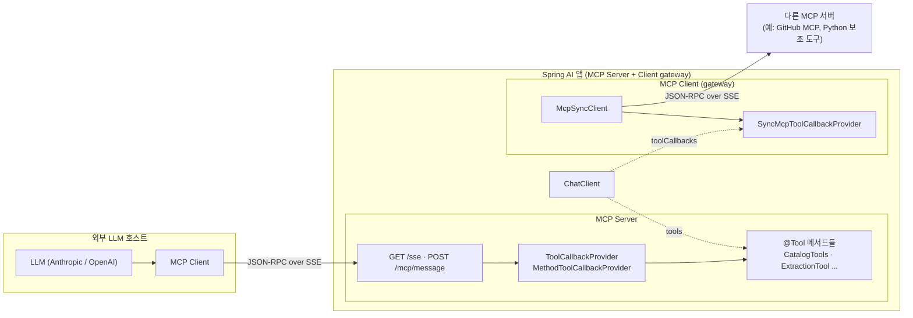
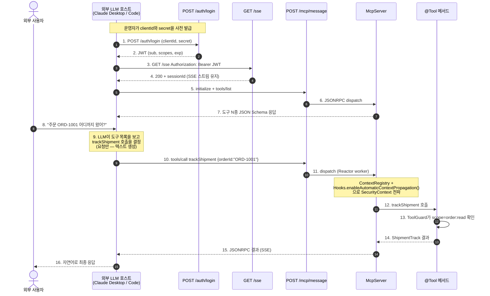

# Spring AI MCP Server

Spring AI 앱을 MCP(Model Context Protocol) 서버로 띄워, 외부 LLM 호스트(Claude Desktop, Claude Code, Cursor 등)가 내 도메인 도구를 자기 도구로 사용하게 만드는 방법을 정리한다. `@Tool` 메서드 노출, JSON-RPC 메시지 흐름, 보안, 외부 호스트 연결까지 다룬다.

---

## 1. MCP란 무엇인가

MCP는 외부 도구·리소스·프롬프트를 LLM 호스트에게 표준 형식으로 노출하기 위한 사양이다. 클라이언트와 서버 사이에 JSON-RPC 2.0 메시지를 주고받으며, 전송 계층은 STDIO 또는 SSE(HTTP) 위에서 동작한다.

| 항목 | 내용 |
| --- | --- |
| 명세 | <https://modelcontextprotocol.io/> |
| 전송 | STDIO / SSE / Streamable HTTP |
| 메시지 | JSON-RPC 2.0 (`initialize`, `tools/list`, `tools/call`, `resources/list`, `prompts/list` 등) |

MCP가 정의하는 두 역할은 다음과 같다.

- MCP Server: 도구·리소스·프롬프트를 제공하는 쪽. 예) GitHub MCP 서버, Slack MCP 서버, Spring AI 앱.
- MCP Client: 도구를 호출하는 쪽. 보통 LLM 호스트(Claude Desktop, Claude Code 등) 안에 내장돼 있다.

---

## 2. Tool Calling과 MCP의 관계

- Tool Calling: LLM이 "이 함수를 이 인자로 부르고 싶다"는 요청을 JSON으로 만들어 내는 동작 자체. [`spring_ai.md`](spring_ai.md#tool--function-calling)에서 다룬 그 과정이다.
- MCP: 호출하려는 함수가 내 앱 안에 있는 게 아니라 다른 서버에 있을 때, 그 서버와 표준 형식으로 통신하는 방법.

즉, Tool Calling은 LLM 쪽에서 일어나는 일이고, MCP는 호스트 쪽에서 그 요청을 어떻게 받아 처리하느냐의 차이다.

```
                     ┌─ 로컬 @Tool 메서드      (우리 앱 안의 함수를 그냥 호출)
LLM Tool Calling ◄───┤
   (요청 생성)        └─ MCP 서버의 도구       (다른 서버에 JSON-RPC 보내서 거기 함수를 호출)
```

| 함수 위치 | LLM 요청이 들어온다면 |
| --- | --- |
| 내 앱 안 (`@Tool`) | 같은 JVM 안의 Kotlin 메서드를 바로 호출한다 |
| 다른 서버 (MCP) | 그 서버로 `tools/call` JSON-RPC 메시지를 보내서 거기서 실행시키고 결과를 받는다 |

---

## 3. MCP vs 일반 REST API

호출자가 LLM이라는 전제가 들어가면 두 가지가 달라진다. 호출자가 사람이 아니라 모델이라는 점, 그리고 호스트가 도구의 존재를 런타임에 알아내야 한다는 점이다.

| 항목 | 일반 REST API | MCP |
| --- | --- | --- |
| 주 소비자 | 사람 / 다른 서비스 | LLM |
| 전송 | HTTP 1.1/2 (요청–응답) | JSON-RPC 2.0 over SSE / STDIO / Streamable HTTP (세션 유지) |
| 메시지 형식 | 자유 (REST / GraphQL / RPC) | JSON-RPC 메소드가 고정 (`initialize`, `tools/list`, `tools/call`, `resources/*`, `prompts/*`) |
| 도구 발견 | 사람이 OpenAPI 문서를 읽고 클라이언트를 만든다 | LLM 호스트가 `tools/list`로 런타임에 도구 목록을 가져온다 |
| 스키마 위치 | 코드와 분리된 문서(OpenAPI, README) | 런타임 응답에 포함된다 (`inputSchema`) |
| 설명 텍스트 용도 | 사람이 읽는다. 생략돼도 동작은 한다 | LLM이 "이 도구를 언제·어떻게 부를지" 판단하는 1차 근거다. 누락되면 모델이 호출하지 못한다 |
| 인증 | API Key / OAuth / 세션 | 동일하다. 보통 Bearer JWT를 쓴다. 명세가 인증 방식을 강제하지 않는다 |
| 부수 자원 | 별도 엔드포인트 설계 필요 | `resources`(파일·URL)와 `prompts`(재사용 프롬프트 템플릿)가 1급 시민이다 |
| 클라이언트 | 호출자가 직접 작성 | Claude Desktop, Cursor, VS Code Copilot 등이 이미 MCP 클라이언트를 내장하고 있다. 서버만 띄우면 된다 |

MCP는 도구 목록을 런타임에 가져오게 만들고, 도구를 한 번 만들어 두면 어느 LLM 호스트에 꽂아도 바로 동작한다.

### 3.1 OpenAPI를 대체할 수 있나, 그리고 언제 MCP를 만들어야 하나

용도에 따라 다르다. 두 방식은 호출 흐름을 누가, 언제 결정하느냐가 다르다.

OpenAPI는 개발자가 명세를 보고 코드를 작성한다. 작성된 코드 안에서만 API가 호출되므로, 호출 시점이 개발자가 의도한 시점으로 고정된다. 런타임에 호출 흐름이 바뀌지 않는다는 본질적인 제약은 아니지만 일반적인 사용 패턴이 그렇다. 호출 시점이 사람이 검증한 곳으로 묶여 있어 흐름을 예측하기 쉬워진다. 다만 "OpenAPI라서 안전하다"고 보면 안 된다. 인증·인가는 별도로 붙여야 하고, OpenAPI는 그저 호출 시점을 사람이 통제한다는 의미의 예측 가능성만 제공한다.

MCP는 LLM이 `tools/list`로 도구 목록을 받고, 어떤 도구를 어떤 인자로 부를지 런타임에 직접 결정한다. 호출 흐름이 코드에 박혀 있지 않고 사용자 요청 한 줄에 따라 달라진다. 유연하지만 두 갈래의 위험이 따라온다.

- 모델 쪽 위험: LLM이 환각이나 오해로 부르지 말아야 할 도구를 부르거나, 인자를 잘못 채우는 경우. 사용자 의도 재해석, 사용자 재확인, 파라미터 검증으로 방어한다.
- 호스트 쪽 위험: 외부 LLM 호스트가 권한 밖 도구를 시도하는 경우. 도구 진입부의 스코프 검증과 JWT로 방어한다.

두 방어 수단은 성격이 다르므로 둘 다 필요하다. 인증·인가는 OpenAPI든 MCP든 똑같이 붙여야 하고, MCP에는 거기에 더해 LLM 호출 자체에 대한 방어 수단이 한 겹 더 들어간다.

정리하면 시스템을 어떻게 구성할 것인지의 차이다.

- 호출 시점이 고정되어 있고 예측 가능성·기존 인프라(codegen, OpenAPI 문서, 캐시, CDN)와 잘 맞아야 한다면 OpenAPI를 쓴다. 호출자가 사람이 쓰는 프론트엔드, 다른 마이크로서비스, 파트너 시스템이라면 그냥 REST나 gRPC가 맞다.
- 호출자가 LLM이고, 동적 컨텍스트에 맞춰 도구를 선택해야 하며, 위 두 갈래 방어 수단을 들이는 비용을 받아들일 수 있다면 MCP를 쓴다. 외부 LLM 호스트(Claude Desktop, Cursor 등)에 직접 도구를 노출하고 싶을 때는 REST로는 불가능하므로 MCP가 사실상 유일한 선택지다.
- 도구가 자주 늘고 줄어 클라이언트 codegen을 자주 돌리기 부담스러울 때, MCP는 런타임에 도구 목록을 가져오므로 클라이언트 재빌드가 필요 없다.
- 에이전트(여러 단계 자율 LLM)가 호출자일 때도 MCP가 표준 호스트·표준 인증 흐름까지 묶여 있어 운영이 단순해진다.

두 채널을 한 도메인에 동시에 두는 것도 자연스럽다. 비즈니스 로직은 한 군데에 두고, 노출 채널만 둘로 가져가는 구조다. 인증·인가도 채널별로 다르게 붙일 수 있다(REST는 세션 쿠키, MCP는 JWT + 스코프).

```kotlin
@Service
class CatalogService(private val productRepository: ProductRepository) {
    fun search(keyword: String?, color: String?): List<ProductSummary> = ...
}

// 1) 사람·프론트엔드용 채널 — OpenAPI로 문서화, 호출 시점은 클라이언트 코드에 고정
@RestController
@RequestMapping("/api/products")
class CatalogController(private val service: CatalogService) {
    @GetMapping
    fun search(@RequestParam keyword: String?, @RequestParam color: String?) =
        service.search(keyword, color)
}

// 2) LLM 호스트용 채널 — MCP로 노출, 호출 시점은 LLM이 런타임에 결정
@Component
class CatalogTools(private val service: CatalogService) {
    @Tool(description = "의류 상품을 키워드와 색상으로 검색한다.")
    fun searchProducts(
        @ToolParam(description = "검색 키워드", required = false) keyword: String?,
        @ToolParam(description = "색상", required = false) color: String?,
    ) = service.search(keyword, color)
}
```

MCP로 모든 API를 바꾸려고 하면 안 된다. OpenAPI를 대체하는 게 아니라, OpenAPI가 다루지 못하는 영역(LLM 호스트)을 다루는 채널이다.

---

## 4. Spring AI MCP Server 셋업

### 4.1 의존성

`spring-ai-bom`으로 버전을 통합한 뒤, WebMVC 변형의 starter 하나만 추가하면 끝난다.

```kotlin
// build.gradle.kts
extra["springAiVersion"] = "1.1.6"

dependencyManagement {
    imports {
        mavenBom("org.springframework.ai:spring-ai-bom:${property("springAiVersion")}")
    }
}

dependencies {
    implementation("org.springframework.boot:spring-boot-starter-web")
    implementation("org.springframework.ai:spring-ai-starter-mcp-server-webmvc")
    // chat model, embedding, vector store 등 필요한 starter는 별도 추가
}
```

starter는 세 변형이 있다.

- `spring-ai-starter-mcp-server-webmvc`: 동기·서블릿 기반. 일반 Spring MVC 앱에 그대로 얹는다. 엔드포인트는 `GET /sse` + `POST /mcp/message`.
- `spring-ai-starter-mcp-server-webflux`: 리액티브 변형. WebFlux 기반 앱에서 사용한다.
- `spring-ai-starter-mcp-server`: 전송 없음(코어만). STDIO 전송으로 띄울 때 쓴다.

### 4.2 서버 메타데이터 설정

`spring.ai.mcp.server.*` 키로 서버 이름·버전·instructions를 노출할 수 있다. 외부 호스트가 `initialize` 단계에서 이 정보를 받는다.

```yaml
spring:
  ai:
    mcp:
      server:
        enabled: true
        name: clothing-ecommerce-mcp
        version: 0.0.1
        type: SYNC
        instructions: "의류 이커머스 상품 검색, 재고 조회, 주문 상태 조회 도구를 제공한다."
```

설정이 없어도 starter가 기본값으로 서버를 띄운다. instructions는 외부 LLM이 도구 목록을 받기 전 시스템 컨텍스트로 활용한다.

---

## 5. @Tool 메서드를 MCP 도구로 노출

핵심 빈은 `ToolCallbackProvider`다. `MethodToolCallbackProvider.builder().toolObjects(...)`가 받은 빈들의 `@Tool` 메서드를 리플렉션으로 수집해 `ToolCallback`으로 변환한다. starter의 autoconfig가 이 빈을 찾아 MCP `tools/list` 응답에 끼워 넣는다.

```kotlin
@Configuration
class McpServerConfig {

    @Bean
    fun toolCallbackProvider(
        catalogTools: CatalogTools,         // @Tool 11종 (조회 7, 쓰기 4)
        extractionTool: ExtractionTool,     // @Tool 1종 (BeanOutputConverter)
        imageGenerationTool: ImageGenerationTool, // @Tool 1종 (ImageModel)
    ): ToolCallbackProvider =
        MethodToolCallbackProvider.builder()
            .toolObjects(catalogTools, extractionTool, imageGenerationTool)
            .build()
}
```

도구 빈 자체는 평범한 `@Component`이고, 메서드에는 `@Tool`과 `@ToolParam`만 붙인다. 같은 빈이 인앱 ChatClient(`.tools(catalogTools)`)와 MCP 서버 양쪽에서 동시에 쓰인다. 별도 어댑터가 필요 없다.

```kotlin
@Component
class CatalogTools(
    private val productRepository: ProductRepository,
    private val toolGuard: ToolGuard,
) {
    @Tool(description = "의류 상품을 키워드, 카테고리, 색상, 최대 가격으로 검색해 목록을 반환한다.")
    fun searchProducts(
        @ToolParam(description = "검색 키워드", required = false) keyword: String?,
        @ToolParam(description = "카테고리", required = false) category: String?,
        @ToolParam(description = "색상", required = false) color: String?,
        @ToolParam(description = "최대 가격(원)", required = false) maxPrice: Int?,
    ): List<ProductSummary> = toolGuard.invoke(
        tool = "searchProducts",
        scope = "catalog:read",
        args = mapOf("keyword" to keyword, "category" to category),
    ) {
        productRepository.search(keyword, category, color, maxPrice).map { it.toSummary() }
    }
}
```

### 5.1 @Tool과 @McpTool의 차이 (Spring AI 1.1.x)

Spring AI 1.1.x부터 MCP 전용 어노테이션 `@McpTool`이 community 패키지로 별도 제공된다.

| 항목 | `@Tool` | `@McpTool` |
| --- | --- | --- |
| 패키지 | `org.springframework.ai.tool.annotation` | `org.springaicommunity.mcp.annotation` |
| 사용 처 | 인앱 ChatClient와 MCP 양쪽 | MCP 전용 |
| 부가 메타데이터 | 이름·설명·반환 | + `McpAnnotations`, progress 토큰, schema 옵션 |
| Provider | `MethodToolCallbackProvider` | `SyncMcpToolProvider` (1.1.x autoconfig가 자동 수집) |

```kotlin
@Component
class McpAnnotationDemo {
    @McpTool(name = "todayTip", description = "월(1~12)을 받아 그 시즌 코디 팁을 반환한다.")
    fun todayTip(
        @McpToolParam(description = "월(1~12). 비워두면 오늘", required = false) month: Int?,
    ): String { ... }
}
```

일반적으로는 `@Tool`만 써도 충분하다. `@McpTool`은 MCP 전용 기능(progress notification, MCP annotations 등)이 필요할 때, 또는 "이 도구는 MCP로만 노출하고 인앱 ChatClient에는 안 보이게 하고 싶다"는 분리가 필요할 때 쓴다.

---

## 6. tools/list와 tools/call — JSON-RPC 흐름

### 6.1 @Tool 메서드가 JSON Schema로 변환된다

Spring AI가 `@Tool` description, `@ToolParam` description, 파라미터 타입을 introspection해 JSON Schema로 바꾼다. MCP 클라이언트가 `tools/list`를 요청하면 이 스키마 목록을 응답한다.

```json
// tools/list 응답
{
  "tools": [
    {
      "name": "searchProducts",
      "description": "의류 상품을 키워드, 카테고리, 색상, 최대 가격으로 검색해 목록을 반환한다.",
      "inputSchema": {
        "type": "object",
        "properties": {
          "keyword":  { "type": "string", "description": "검색 키워드" },
          "category": { "type": "string", "description": "카테고리" },
          "color":    { "type": "string", "description": "색상" },
          "maxPrice": { "type": "integer", "description": "최대 가격(원)" }
        }
      }
    }
  ]
}
```

### 6.2 외부 LLM이 그 스키마로 도구를 호출한다

이 부분이 in-process `@Tool`과 가장 다르다. "LLM은 호출을 요청만 한다"는 원칙은 그대로지만, 그 요청을 받아 처리하는 호스트가 외부 앱과 내 MCP 서버 둘로 쪼개진다.

```
[외부 앱]                                    [내 Spring AI = MCP Server]
 ├─ LLM (Anthropic / OpenAI API)
 └─ MCP Client
      │
      │ (1) tools/list  ─────────────────►   @Tool → JSON Schema 목록 응답
      │ ◄────────────────────────────────
      │
      │ (2) 스키마를 자기 LLM에게 "쓸 수 있는 도구"로 전달
      │
      │ (3) LLM: "searchProducts(color=블랙)"      ← tool_call JSON 생성 (요청만)
      │
      │ (4) tools/call searchProducts ────►   진짜 Kotlin 메서드 실행 후 결과 반환
      │ ◄──── 결과 ────────────────────────
      │
      └ (5) 결과를 LLM에게 전달 → LLM이 자연어로 마무리
```

| 단계 | 일어나는 일 |
| --- | --- |
| (1) | MCP 클라이언트가 SSE 핸드셰이크 후 `tools/list`를 호출한다. 외부 앱이 우리 도구의 존재와 스키마를 알게 된다 |
| (2) | MCP 클라이언트가 그 스키마를 자기 LLM의 시스템 프롬프트나 도구 목록에 끼워 넣는다 |
| (3) | LLM은 여전히 텍스트만 생성한다. `tool_call` JSON 한 덩어리를 만들 뿐, 실제 호출은 아니다 |
| (4) | MCP 클라이언트가 그 요청을 받아 우리 서버로 `tools/call` JSON-RPC 메시지를 보낸다. 이 시점에 내 서버에서 진짜 Kotlin 메서드가 실행된다 |
| (5) | 결과 JSON이 LLM에 다시 전달돼, LLM이 자연어로 사용자에게 답한다 |

---

## 7. 반대 방향 — MCP 클라이언트 역할도 겸하기

같은 starter 군에 반대 방향도 있다. 우리 앱이 다른 MCP 서버의 클라이언트가 되어 외부 도구를 가져오고, 그것을 우리 ChatClient의 `toolCallbacks(...)`로 노출하는 형태다.

```kotlin
@Configuration
class McpClientConfig {

    @Bean
    fun externalMcpClient(properties: ExternalMcpProperties): McpSyncClient? {
        if (!properties.enabled) return null
        return try {
            val transport = HttpClientSseClientTransport.builder(properties.serverUrl).build()
            McpClient.sync(transport)
                .clientInfo(McpSchema.Implementation("clothing-ecommerce-app", "0.0.1"))
                .build()
                .also { it.initialize() }
        } catch (e: Exception) {
            null // 외부 서버가 꺼져 있어도 우리 앱은 정상 부팅한다
        }
    }

    @Bean
    fun externalToolCallbacks(client: McpSyncClient?): List<ToolCallback> {
        if (client == null) return emptyList()
        return SyncMcpToolCallbackProvider(client).toolCallbacks.toList()
    }
}
```

`SyncMcpToolCallbackProvider`가 어댑터 역할을 한다. MCP 도구 1개를 `ToolCallback` 1개로 변환해 `ChatClient.toolCallbacks(...)`에 그대로 꽂을 수 있다. LLM 입장에서는 로컬 `@Tool`과 외부 MCP 도구가 완전히 동등하게 보인다.

```kotlin
val answer = chatClient.prompt()
    .user(question)
    .tools(catalogTools)              // 내 프로세스의 @Tool
    .toolCallbacks(externalCallbacks) // 외부 MCP 서버에서 가져온 도구
    .call()
    .content()
```

이 패턴을 MCP gateway라 부른다. 우리 앱 하나가 외부 MCP 서버를 흡수해, 우리에게 접속한 또 다른 외부 LLM 호스트에게 외부 도구와 우리 도구를 합쳐 보여준다.

---

## 8. 컴포넌트 다이어그램



- MCP Server: 우리 `@Tool`을 외부에 노출한다.
- MCP Client gateway: 외부 MCP 서버 도구를 끌어와 우리 ChatClient와 우리 MCP 서버 양쪽에 합쳐 노출한다.
- `@Tool` 빈 하나가 인앱 ChatClient와 MCP Server 양쪽에서 공유된다. 별도 어댑터가 없다.

---

## 9. 시퀀스 — 외부 LLM 호스트 호출 흐름



짚어둘 점.

- 4단계: SSE 연결은 세션 유지된다. 후속 메시지는 `sessionId`로 묶이지만, 매 요청마다 JWT도 함께 검증된다(stateless).
- 9단계: LLM은 여전히 텍스트를 생성하는 주체일 뿐 함수를 실행하는 주체가 아니다. `@Tool` 때와 똑같다.
- 11단계: MCP 메시지 dispatch는 Reactor `boundedElastic` 워커에서 일어날 수 있다. 서블릿 스레드의 ThreadLocal `SecurityContext`가 자동 전파되지 않으므로 별도 셋업이 필요하다.

---

## 10. 보안 — JWT, 스코프, SecurityContext 전파

MCP 서버를 띄우면 외부 LLM 호스트가 우리 도구를 호출할 수 있다는 뜻이다. 공개 도메인 API와 동일한 보안 모델이 필요하다.

### 10.1 인증 — JWT 서비스 계정 패턴

외부 호스트마다 별도의 `clientId/secret`을 사전 발급하고, `/auth/login`으로 단기 JWT를 교환한다. 매 MCP 메시지(`/sse`, `/mcp/message`)의 `Authorization: Bearer ...` 헤더를 servlet filter가 검증한다.

```yaml
security:
  clients:
    - id: shopper-llm
      secret: ${SHOPPER_LLM_SECRET}
      scopes: [catalog:read, order:read, order:write]
    - id: catalog-only-llm
      secret: ${CATALOG_ONLY_SECRET}
      scopes: [catalog:read]
    - id: ops-llm
      secret: ${OPS_LLM_SECRET}
      scopes: [catalog:read, catalog:write, order:read, order:write, shipment:write]
```

### 10.2 인가 — 도구 진입부에서 스코프 검증

`ToolGuard`가 모든 `@Tool` 메서드 진입부를 감싸 세 가지를 한 번에 처리한다. 현재 `SecurityContext`의 스코프 확인, 입력 검증, 감사 로그 작성이다. 스코프가 부족하면 `AccessDeniedException`을 던지고, LLM이 그 사실을 자연어로 받아 응답한다.

```kotlin
@Tool(description = "재고를 입출고한다.")
fun restockProduct(...): RestockResult = toolGuard.invoke(
    tool = "restockProduct",
    scope = "catalog:write",     // 부족하면 AccessDeniedException
    args = ...,
) {
    // 실제 로직
}
```

도구 인자는 LLM이 채워 넣는다. 즉 사용자 입력과 동등한 신뢰도로 다뤄야 한다. 도구 진입부에서 권한·화이트리스트·멱등키를 반드시 검증한다.

### 10.3 Reactor context propagation

`spring-ai-starter-mcp-server-webmvc`도 도구 dispatch 일부가 Reactor `boundedElastic` 워커로 넘어간다. 서블릿 스레드의 ThreadLocal `SecurityContext`가 자동 전파되지 않아, 도구 안에서 `SecurityContextHolder.getContext()`가 비어 보인다.

```kotlin
@SpringBootApplication
class SpringAiPracticeApplication {
    init {
        ContextRegistry.getInstance().registerThreadLocalAccessor(
            "security.context",
            { SecurityContextHolder.getContext() },
            { ctx -> SecurityContextHolder.setContext(ctx) },
            { SecurityContextHolder.clearContext() },
        )
        Hooks.enableAutomaticContextPropagation()
    }
}
```

`Hooks.enableAutomaticContextPropagation()`을 켜면 Reactor가 ThreadLocal accessor를 자동으로 캡처하고 복원한다. 이걸 켜지 않으면 MCP 호출 시 모든 도구가 401처럼 보인다.

---

## 11. 외부 LLM 호스트 연결

### 11.1 Claude Code

```bash
TOKEN=$(curl -s -X POST localhost:8080/auth/login \
  -H 'Content-Type: application/json' \
  -d '{"clientId":"shopper-llm","clientSecret":"dev-secret-1"}' | jq -r .accessToken)

claude mcp add --transport sse clothing-ecommerce http://localhost:8080/sse \
  --header "Authorization: Bearer $TOKEN"
```

### 11.2 Claude Desktop

```json
{
  "mcpServers": {
    "clothing-ecommerce": {
      "command": "npx",
      "args": [
        "-y", "mcp-remote", "http://localhost:8080/sse",
        "--header", "Authorization: Bearer <JWT>"
      ]
    }
  }
}
```

`mcp-remote`는 stdio와 SSE를 잇는 브릿지다. Claude Desktop이 stdio만 지원하던 시절의 흔적이지만, 지금도 표준 연결 방식으로 쓰인다.

### 11.3 Python MCP 클라이언트 (학습용)

```python
async with sse_client(url="http://localhost:8080/sse",
                       headers={"Authorization": f"Bearer {token}"}) as (r, w):
    async with ClientSession(r, w) as session:
        await session.initialize()
        tools = await session.list_tools()
        result = await session.call_tool("searchProducts", {"color": "블랙"})
```

스코프가 부족한 클라이언트가 권한 밖 도구를 호출하면 `tools/call` 결과가 `"missing required scope: order:read"`로 돌아온다. 외부 LLM 입장에서는 일반적인 에러 응답이라 자연어로 매끄럽게 안내된다.

---

## 12. 운영에서 주의할 점

- Spring Boot 4.x는 비호환이다. `spring-ai-bom:1.0.x`와 `1.1.x`는 Spring Boot 3.x 전용이다. Boot 4로 올리면 바이너리 호환이 깨진다.
- Reactor context propagation을 끄면 SecurityContext가 비어 보인다. `Hooks.enableAutomaticContextPropagation()`은 필수다.
- MCP 도구는 토큰 비용을 키운다. LLM에 매번 도구 N종의 JSON Schema가 함께 전달된다. 도구가 30개를 넘어가면 입력 토큰만 수천 토큰이 된다. 도구 분류(네임스페이스)나 도구 선별 advisor로 줄여야 한다.
- 작은 로컬 모델(3B 이하)은 도구 콜링 신뢰도가 낮다. `llama3.2:3b` 정도면 데모는 되지만, 다중 인자나 한국어, 중첩 호출에서 실패가 잦다. 운영용으로는 30B 이상이거나 외부 API(Claude, GPT)를 쓴다.
- JSON Schema의 고급 키워드는 LLM이 무시할 수 있다. `oneOf`, `anyOf`, `$ref` 같은 키워드는 일부 모델이 처리하지 않는다. 도구 시그니처는 평탄한 데이터 클래스로 단순하게 유지한다.
- 상태를 바꾸는 도구에는 멱등키를 둔다. `placeOrder`, `cancelOrder`처럼 부수효과가 있는 도구는 LLM이 같은 요청을 두 번 보낼 수 있다(네트워크 재시도, 응답 토큰 분실 등). `idempotencyKey`를 인자로 받거나 서버 측에서 dedup이 필요하다.
- MCP 표준은 아직 빠르게 변한다. streamable-HTTP 전송 추가, 인증 명세 정비 등 메이저 변경이 진행 중이다. starter 버전도 같이 따라가야 한다.

---

## 같이 보면 좋은 글

- [`spring_ai.md`](spring_ai.md) — Spring AI 전반 (ChatClient, Advisors, RAG, Tool Calling 기초)
- [MCP 공식 명세](https://modelcontextprotocol.io/specification)
- [Spring AI MCP 문서](https://docs.spring.io/spring-ai/reference/api/mcp/mcp-overview.html)
