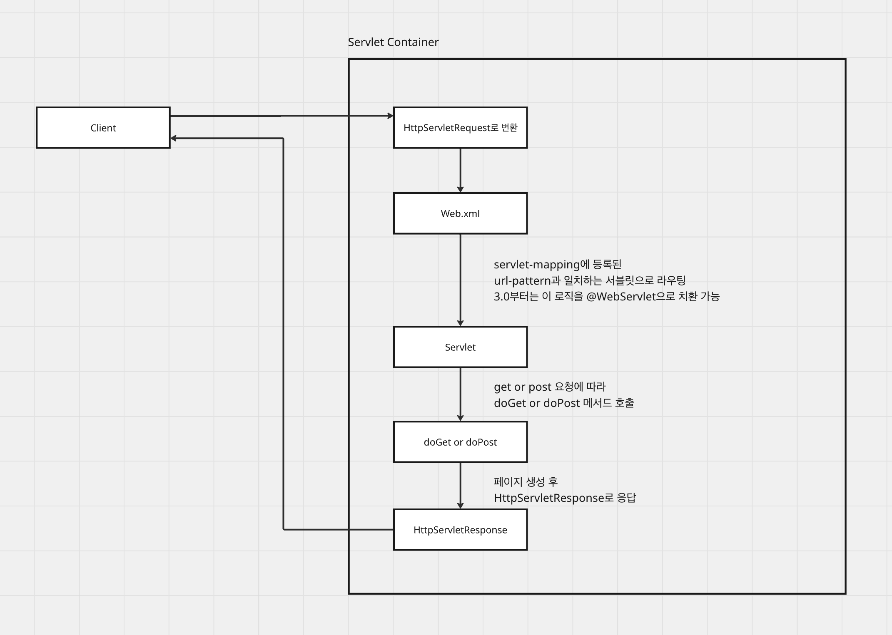
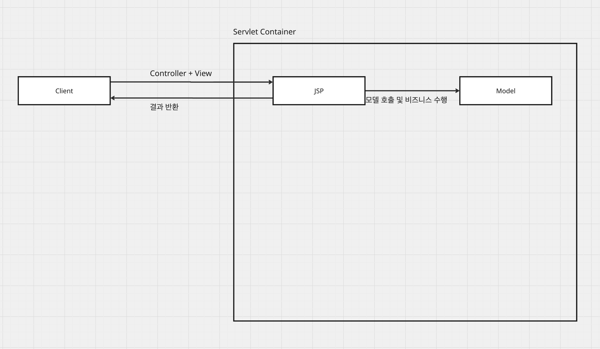
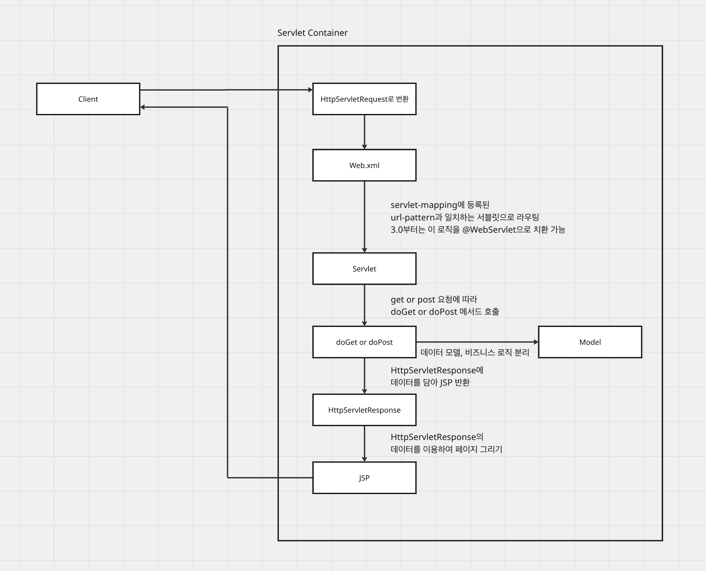
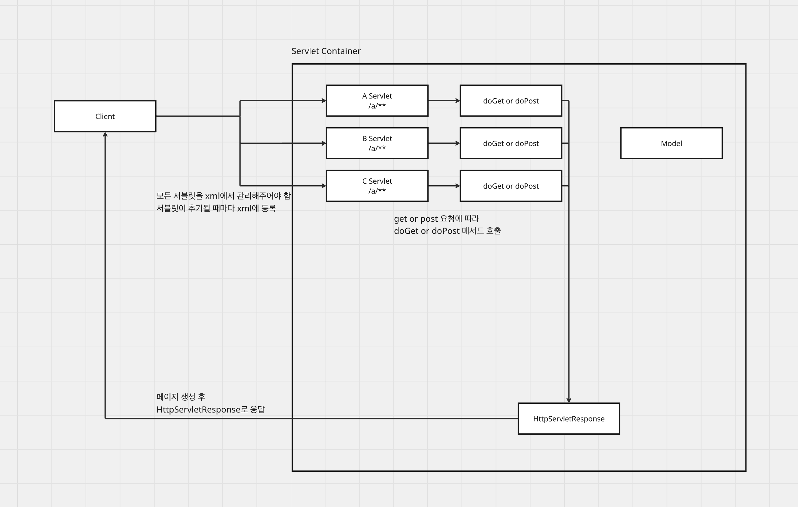
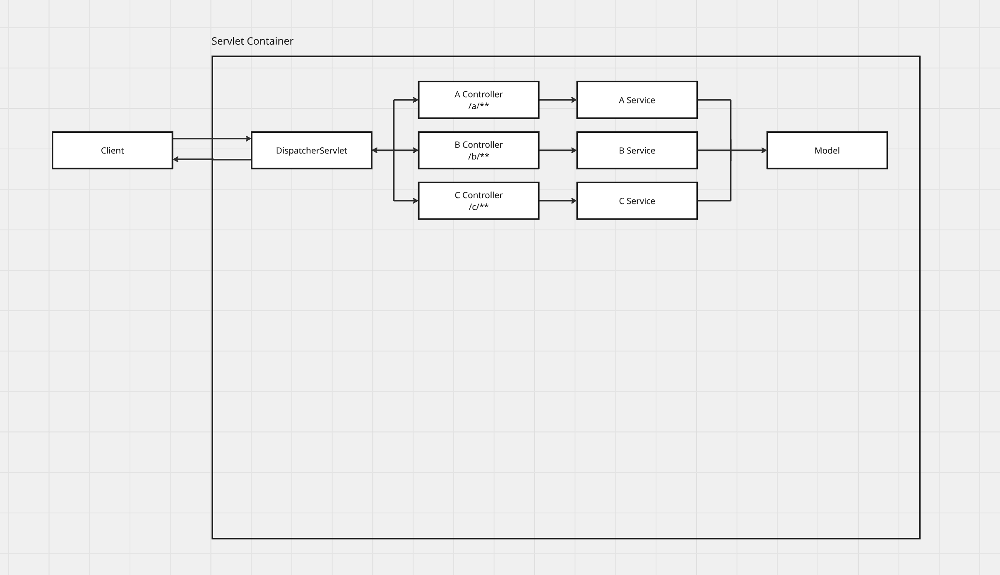
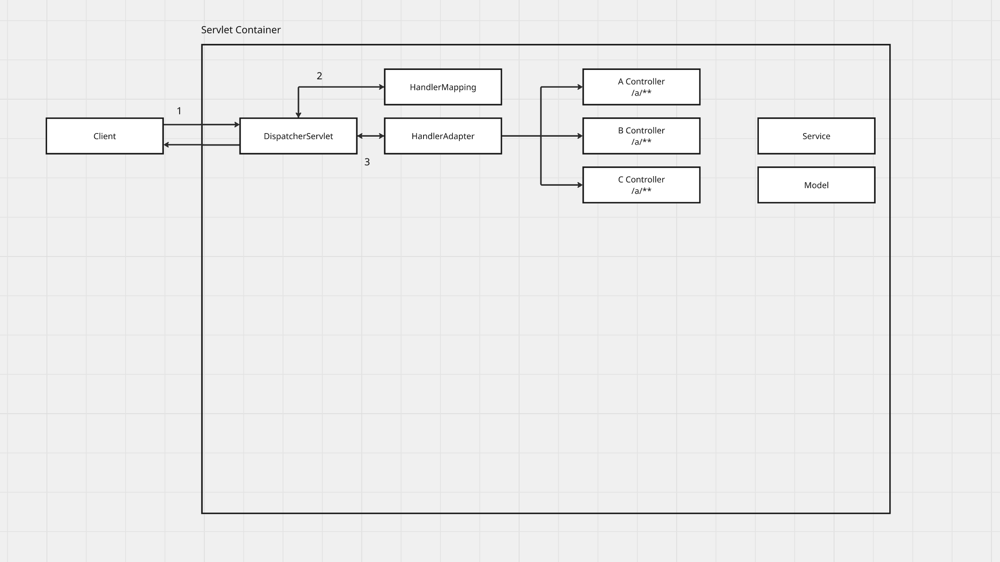
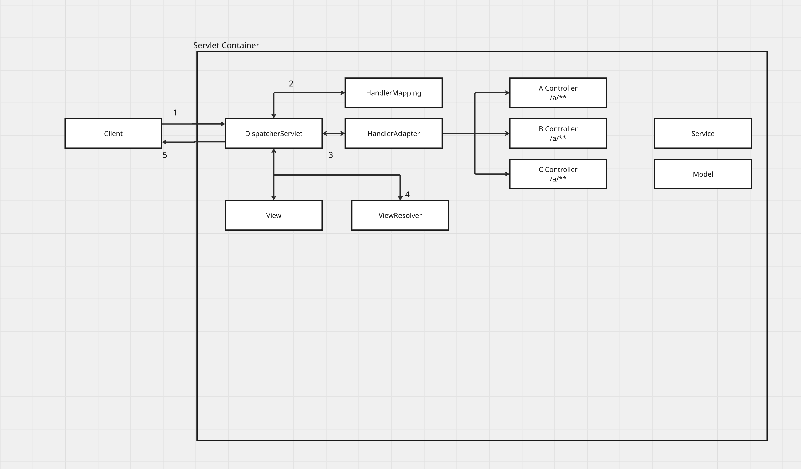

# Spring MVC의 발전 과정과 DispatcherServlet의 역할

- **Tags:** #Spring #MVC #Servlet #DispatcherServlet #Web

---

### 무엇을 배웠는가?
웹 애플리케이션 아키텍처가 초기의 단순 **Servlet**에서 **MVC1**, **MVC2** 패턴을 거쳐, 오늘날 **Spring MVC**의 **Front Controller** 패턴으로 발전해 온 과정을 학습합니다.   
특히 Spring MVC의 핵심인 `DispatcherServlet`이 `HandlerMapping`, `HandlerAdapter`, `ViewResolver`와 같은 컴포넌트들과 협력하여 요청을 처리하는 내부 동작 원리를 명확히 이해했습니다.

---

### 왜 중요하고, 어떤 맥락인가?
Spring MVC 프레임워크가 왜 지금과 같은 구조를 갖게 되었는지 이해하는 것은 매우 중요합니다. 이 구조는 과거 아키텍처의 문제점들을 해결하는 과정에서 탄생했습니다.

* **초기 Servlet**: 하나의 서블릿 클래스 안에서 비즈니스 로직, 데이터 접근, HTML 생성(View)이 모두 섞여 있었습니다. 이는 코드 가독성과 유지보수성을 해치게 됩니다.

* **MVC1 패턴**: `JSP`가 **Controller**와 **View** 역할을 모두 담당했습니다. 로직과 뷰가 여전히 강하게 결합되어 있어 여전히 유지보수가 어려웠습니다.

* **MVC2 패턴**: 마침내 **Controller(`Servlet`)**, **View(`JSP`)**, **Model(Java Beans)**이 완벽하게 분리되었습니다.

* **MVC2의 한계**: 기능이 많아질수록 **Controller 역할을 하는 서블릿이 수십 개**가 생겨났습니다. 이로 인해 서블릿마다 공통 로직(인증, 로깅 등)을 중복 작성해야 했고, 모든 서블릿을 `web.xml`에 등록하는 관리의 어려움이 발생했습니다.

Spring MVC는 이 MVC2의 한계를 **Front Controller 패턴**을 도입하여 해결했습니다.

---

### 상세 내용

#### 1. MVC2의 문제점과 Front Controller의 등장
MVC2 패턴에서는 `/login`, `/users` 등 모든 요청 URL마다 별도의 서블릿을 만들었습니다.

Spring MVC는 이 대신 **DispatcherServlet**이라는 **단 하나의 Front Controller**를 도입했습니다.

이제 `web.xml`에는 `DispatcherServlet` 단 하나만 등록하면 됩니다.  
`DispatcherServlet`이 모든 클라이언트 요청을 **대표**로 받은 뒤, 내부에서 요청을 분석하여 실제 로직을 처리할 컨트롤러에게 **위임**하는 구조입니다.

#### 2. `DispatcherServlet`의 내부 동작 흐름
`DispatcherServlet`은 모든 일을 직접 처리하는 것이 아니라, 각 기능을 전문 컴포넌트에게 위임합니다.

1.  **요청 접수**: 클라이언트의 모든 요청은 `DispatcherServlet`으로 라우팅됩니다.
2.  `HandlerMapping` (핸들러 조회)
    * `DispatcherServlet`은 요청 URL(`HttpServletRequest`)을 처리할 컨트롤러가 누구인지 모릅니다.
    * `HandlerMapping`에게 물어봅니다. `HandlerMapping`은 애플리케이션 로드 시점에 `<URL, 처리할 메서드>`의 맵을 만들어 가지고 있습니다.
    * `HandlerMapping`은 요청에 매핑되는 컨트롤러(핸들러) 정보를 찾아 `DispatcherServlet`에게 반환합니다.
3.  `HandlerAdapter` (핸들러 실행)
    * `DispatcherServlet`은 찾은 컨트롤러를 직접 실행하지 않고, `HandlerAdapter`라는 실행 대리자를 통해 컨트롤러를 호출합니다.
    * `HandlerAdapter`가 컨트롤러의 메서드를 대신 실행하고, 그 결과(Model 데이터와 View 이름)를 `ModelAndView` 객체로 받아 `DispatcherServlet`에게 반환합니다.
4.  `ViewResolver` (뷰 해석)
    * 컨트롤러는 "home"과 같은 **논리적인 View 이름**만 반환합니다. 실제 파일 경로(e.g., `/WEB-INF/views/home.jsp`)는 모릅니다.
    * `DispatcherServlet`은 `ModelAndView`에서 View 이름을 꺼내 `ViewResolver`에게 전달합니다.
    * `ViewResolver`는 논리적인 이름을 실제 물리적인 `View` 객체(경로 포함)로 변환하여 반환합니다.
5.  View 렌더링 및 응답
    * `DispatcherServlet`은 `ViewResolver`로부터 받은 `View` 객체에 `Model` 데이터를 전달하여 렌더링(HTML 페이지 생성)을 지시합니다.
    * 최종 생성된 `HttpServletResponse`를 클라이언트에게 응답합니다.

---

### 핵심
* Spring MVC는 MVC2 패턴의 문제점(중복 코드, `web.xml` 관리)을 **Front Controller 패턴**(`DispatcherServlet`)으로 해결했습니다.
* `DispatcherServlet`은 요청을 직접 처리하는 것이 아니라, `HandlerMapping`, `HandlerAdapter`, `ViewResolver` 등의 전문 컴포넌트에게 **작업을 위임**하는 **중앙 관제탑(Coordinator)** 역할을 수행합니다.
* 이러한 설계 덕분에 개발자는 URL 라우팅, 뷰 경로 관리 등의 복잡한 웹 로직에서 해방되어 **오직 컨트롤러의 비즈니스 로직 작성에만 집중**할 수 있습니다.