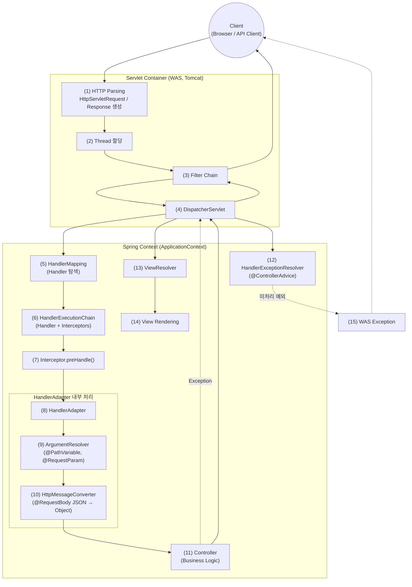

## [Spring] 웹 요청의 생명주기와 예외 전파 (Servlet부터 Spring까지)

**Tags:** #Spring #MVC #Servlet #DispatcherServlet #Filter #Interceptor #Exception

### 무엇을 배웠는가?

클라이언트의 요청이 서블릿 컨테이너(WAS)를 거쳐 **스프링 컨텍스트** 내부의 비즈니스 로직에 도달하고, 다시 응답으로 나가는 전체 흐름을 학습합니다. 그리고 각 단계에서 발생하는 **예외가 어느 범위까지 전파되는지**와 **컴포넌트 간의 계층 구조**를 이해합니다.

---

### 1. 통합 컴포넌트 다이어그램

---

### 2. 주요 컴포넌트 상세 역할 및 의미

| 컴포넌트                                             | 역할 설명                                                                                                                                                             |
| ------------------------------------------------ | ----------------------------------------------------------------------------------------------------------------------------------------------------------------- |
| **Client**                                       | 브라우저, 모바일 앱, API 클라이언트 등이 HTTP 요청을 생성합니다. URL, HTTP Method, Header, Body 등의 정보를 포함하여 서버로 전달합니다.                                                                   |
| **Servlet Container (Tomcat)**                   | TCP 요청을 수신한 뒤 HTTP 프로토콜을 파싱하여 `HttpServletRequest` / `HttpServletResponse` 객체를 생성합니다. Servlet 스펙에 따라 요청당 Thread를 할당하고, 요청을 처리할 Servlet(DispatcherServlet)을 실행합니다. |
| **Thread 할당**                                    | 요청당 하나의 Thread를 할당하여 요청 수신부터 응답 반환까지 동일한 실행 흐름을 유지합니다. 이 Thread를 기반으로 `Transaction`, `SecurityContext` 등 ThreadLocal 기반 기능들이 동작합니다.                               |
| **Filter**                                       | Servlet 레벨에서 동작하는 컴포넌트로, Spring Context 진입 전·후에 요청과 응답을 가로챌 수 있습니다. 인코딩 설정, CORS 처리, XSS 방어, Spring Security FilterChain 등의 횡단 관심사를 담당합니다.                        |
| **DispatcherServlet**                            | Spring MVC의 Front Controller로 모든 HTTP 요청의 진입점입니다. 요청을 처리할 Controller를 찾고, 실행 및 예외 처리, 응답 생성까지 전체 흐름을 제어합니다.                                                       |
| **HandlerMapping**                               | 애플리케이션 시작 시 `@Controller`, `@RequestMapping` 등의 애노테이션을 가진 Bean들을 스캔하여 URL과 Controller 메서드 간의 매핑 정보를 생성합니다. 요청이 들어오면 이 매핑 정보를 기반으로 어떤 Handler가 요청을 처리할지 결정합니다.     |
| **HandlerExecutionChain**                        | HandlerMapping의 결과물로, 실제 실행될 Controller(Handler)와 해당 요청에 적용되는 Interceptor 목록을 함께 포함합니다. DispatcherServlet은 이 체인을 기준으로 요청을 처리합니다.                                  |
| **Interceptor**                                  | Spring MVC 내부에서 Controller 실행 전(preHandle), 후(postHandle), 완료 후(afterCompletion)에 개입할 수 있는 컴포넌트입니다. 인증/인가, 로깅, 공통 검증 등 비즈니스 로직과 밀접한 횡단 관심사를 처리합니다.                |
| **HandlerAdapter**                               | DispatcherServlet과 Controller 사이의 어댑터 역할을 수행합니다. 다양한 형태의 Controller를 동일한 방식으로 호출할 수 있도록 추상화하며, 실제 Controller 메서드 실행을 담당합니다.                                       |
| **ArgumentResolver**                             | Controller 메서드의 파라미터를 분석하여 요청 값과 매핑합니다. `@PathVariable`, `@RequestParam`, `@RequestHeader` 등의 애노테이션을 해석하여 적절한 값을 주입합니다.                                           |
| **HttpMessageConverter**                         | HTTP Body와 Java 객체 간의 변환을 담당합니다. JSON → Object(`@RequestBody`), Object → JSON(`@ResponseBody`) 변환이 이 단계에서 수행됩니다.                                                  |
| **Business Logic**                               | 개발자가 작성한 Controller, Service, Repository 계층이 실행되며 실제 비즈니스 규칙과 데이터 처리를 담당합니다. 이 과정에서 트랜잭션(@Transactional), AOP, 프록시 기반 부가 기능이 함께 동작합니다.                            |
| **HandlerExceptionResolver (@ControllerAdvice)** | Controller 실행 중 발생한 예외를 처리하는 역할을 합니다. 공통 예외 처리 로직을 정의하여 일관된 오류 응답을 생성하며, 처리하지 못한 예외는 DispatcherServlet을 거쳐 WAS까지 전파됩니다.                                           |
| **ViewResolver / View**                          | Controller 처리 결과를 기반으로 View 이름을 실제 View 객체로 변환하고(JSP, Thymeleaf 등), HTML을 렌더링하거나 JSON/XML 응답을 생성하여 최종 HTTP Response를 만듭니다.                                        |

---

### 3. 예외 전파 범위와 처리 메커니즘

#### 3.1. **스프링 내부 예외**
**발생 위치**
* Controller, Service, Repository 등
* Interceptor

**처리 방식**
* 컨트롤러나 서비스에서 예외가 발생하면 **HandlerExceptionResolver**가 가로챕니다.
* `@ControllerAdvice`와 `@ExceptionHandler`가 이 시점에 개입하여 예외를 잡고 정상적인 응답(에러 메시지 등)으로 변환합니다.

#### 3.2. **스프링 외부 예외**
**발생 위치**
* Filter, DispatcherServlet 진입 이전

**처리 방식**
* **Filter**에서 발생한 예외나, 스프링 내부에서 잡지 못한 예외는 **Servlet Container**까지 올라갑니다.
* 이 영역은 스프링 컨텍스트 밖이므로 `@ControllerAdvice`가 적용되지 않습니다. WAS 설정(web.xml이나 Boot의 ErrorPage 설정)에 따른 에러 처리가 일어납니다.

---

### 요약
* 요청 흐름: Client → WAS(Filter) → DispatcherServlet → Interceptor → Controller → Service → DB → 동일 경로로 응답 반환
* 예외 처리 경계: @ControllerAdvice는 DispatcherServlet 내부(Controller·Service·Interceptor) 예외만 처리하며, Filter 예외는 WAS에서 처리
* 역할 구분: Filter = 웹/보안 경계, Interceptor = MVC 흐름 제어, DispatcherServlet = 요청·예외·응답의 중심