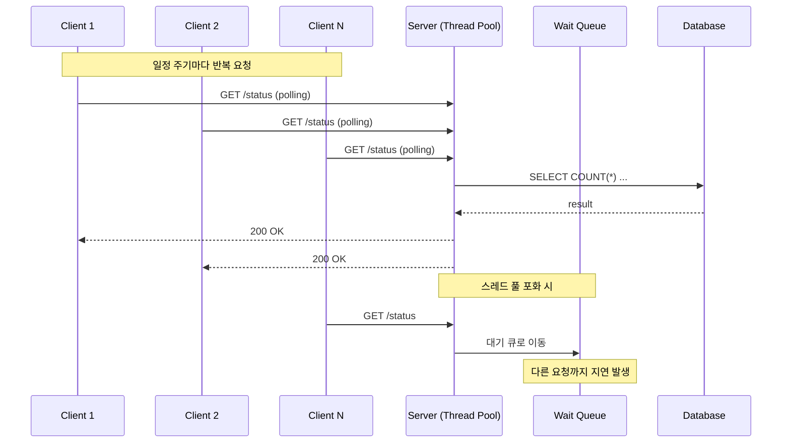
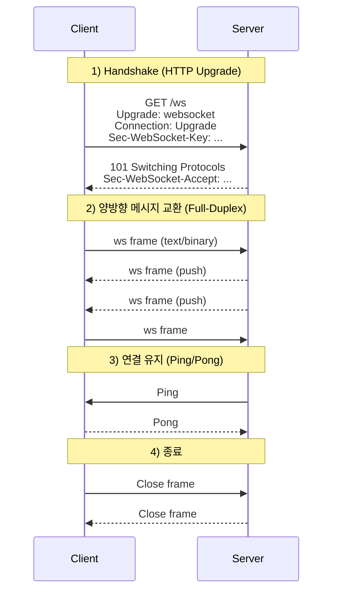
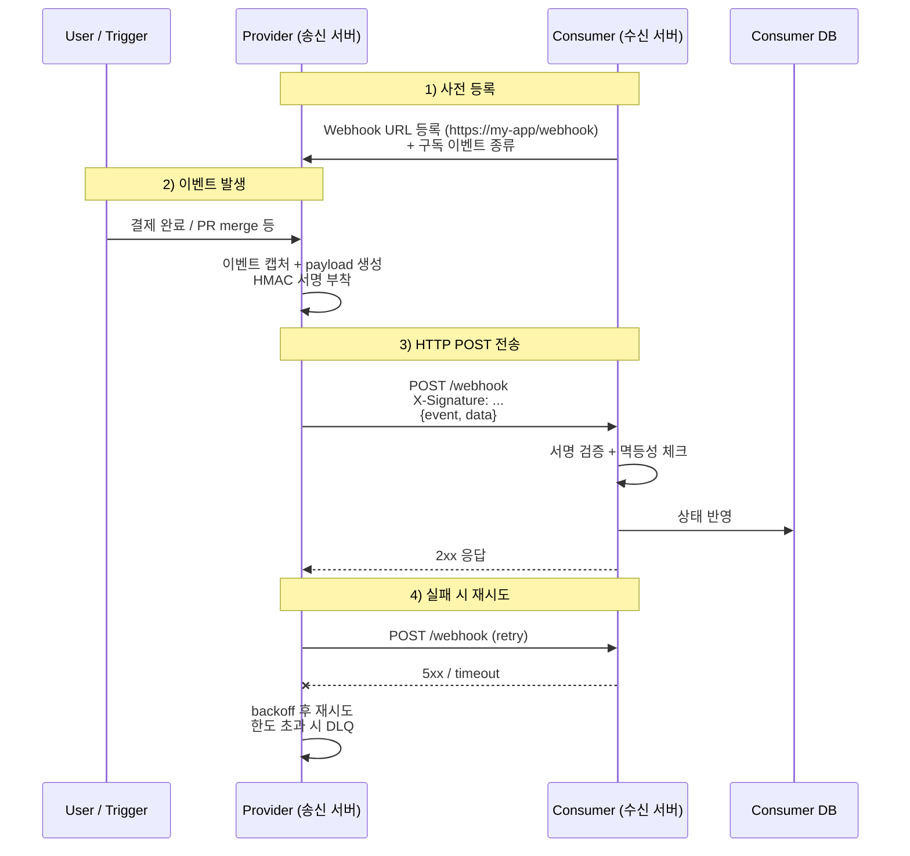
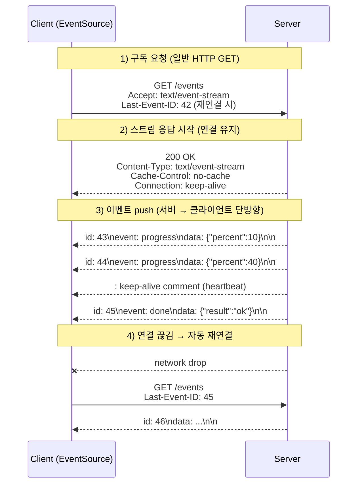

# SSE (Server Sent Event)

## 실시간 데이터 통신
---
사용자 화면에서 실시간으로 데이터가 어디까지 처리되었는지와 같은 진행률이라던지, 아무 액션을 취하지 않더라도 상대방으로부터의 응답이 화면에 자연스럽게 최신화되는 요구사항이 존재한다. 

이러한 실시간 진행상황 공유는 유저가 새로고침을 하지 않고도 최신의 데이터를 볼 수 있다는 점, 자신의 요청이 어디까지 처리되었는지 앎으로써 신뢰성이 올라간다는 점 등의 장점이 존재한다.

## Polling
---
polling은 client가 server에게 특정 시간마다 요청을 보내어 어디까지 처리되었는지 확인하는 방법이다. 간단한 HTTP 요청만으로 진행 상태를 알 수 있고, 별도 기술 구현이 필요없다는 장점이 존재한다. 하지만 계속해서 요청을 받는 서버 입장에선 부하가 생길 수 있다.

> 서버 부하?
서버는 여러 client로부터 요청을 받기 때문에 미리 스레드 풀을 구성하여 빠르게 요청을 서빙한다. 만약 polling 요청이 스레드 풀을 넘어선다면, 준비한 스레드 풀은 유휴 자원이 없기 떄문에 다른 요청을 처리할 수 없고, 대기 큐로 요청을 넘긴다. 즉, 다른 요청엔 딜레이가 생길 수 있다.
또한 이 polling 요청이 database까지 연결되어있고, count 쿼리라던지 데이터베이스에 연산을 요구한다면 database의 cpu 부하가 생길 수 있다.



여러 장단점이 존재하지만 쉽게 구현할 수 있다는 점에서 선제적으로 많이 쓰이고, 서버에 문제가 생길 소지가 있다면 다른 기술로 대체할 수 있다.

### 예제

```kotlin
@RestController
@RequestMapping("/api/jobs")
class JobStatusController(
    private val jobService: JobService,
) {
    @GetMapping("/{jobId}/status")
    fun getStatus(@PathVariable jobId: Long): JobStatusResponse {
        val job = jobService.findById(jobId)
        return JobStatusResponse(
            jobId = job.id,
            status = job.status,
            progress = job.progress,
            updatedAt = job.updatedAt,
        )
    }
}

data class JobStatusResponse(
    val jobId: Long,
    val status: JobStatus,
    val progress: Int,
    val updatedAt: ZonedDateTime,
)
```

클라이언트는 `setInterval`로 위 엔드포인트를 주기 호출해 화면을 갱신한다. 구현은 단순하지만, 동시 사용자 수 × 폴링 주기만큼 부하가 누적된다.

## WebSocket
---
웹소켓은 TCP를 기반으로 한 실시간 양방향 통신 방법이다. 기존 polling 요청은 현재 상태를 확인하기 위해 불필요하게 3-way handshake 과정을 가지고, 요청을 응답한다. 어차피 다시 요청을 보내어 현황을 파악해야함에도 말이다. 지속적인 연결, 양방향 통신에 대한 필요성으로 인해 WebSocket이 등장했다.

### 장단점

**장점**
- 실시간 양방향 통신: 한 번 연결을 맺으면 서버와 클라이언트가 자유롭게 메시지를 주고받을 수 있다. 
- 낮은 오버헤드: 매 요청마다 HTTP 헤더를 새로 붙이지 않고, 최초 핸드셰이크 이후엔 작은 프레임으로 통신한다. polling 대비 네트워크 트래픽이 크게 줄어든다.
- 낮은 지연(Latency): 3-way handshake와 HTTP 헤더 파싱 비용이 매 요청마다 발생하지 않는다.
- 표준 프로토콜: `ws://`, `wss://` 스킴이 표준화되어 있고 대부분의 브라우저·서버 프레임워크가 기본 지원한다.

**단점**
- 연결 유지 비용: 클라이언트 수만큼 서버가 소켓 연결을 유지해야 한다.
- 상태 기반(Stateful): 무상태인 HTTP와 달리 연결 상태를 서버가 관리해야 하므로, 수평 확장 시 세션 공유(Redis pub/sub 등) 부담이 따른다.
- 중간 인프라 호환성: 일부 프록시·로드밸런서·방화벽이 장기 연결과 `Upgrade` 헤더를 제대로 지원하지 않거나 idle timeout으로 끊을 수 있다. heartbeat(ping/pong)·재연결 로직이 필수다.

### 동작 과정



> **ws://, wss://**
WebSocket 전용 URI 스킴. `ws://`는 평문(기본 80 포트), `wss://`는 TLS 위에서 동작하는 암호화 연결(기본 443 포트)이다. HTTP/HTTPS와 동일한 포트를 쓰므로 기존 방화벽·프록시를 그대로 통과시키기 쉽다.

> **ws frame**
WebSocket이 핸드셰이크 이후 주고받는 최소 단위 메시지. HTTP처럼 매 요청마다 헤더를 붙이지 않고, 2~14 byte의 작은 헤더 + payload 구조로 전송한다. opcode로 text(0x1)/binary(0x2)/close(0x8)/ping(0x9)/pong(0xA)을 구분하며, 클라이언트가 보내는 프레임은 반드시 masking 처리된다.

> **Upgrade: websocket**
HTTP 요청 헤더 중 하나로, "이 연결을 HTTP에서 WebSocket 프로토콜로 바꾸자"는 의사를 서버에 전달한다. 서버가 동의하면 `101 Switching Protocols`로 응답하면서 같은 TCP 연결 위에서 프로토콜만 교체된다.

> **Connection: Upgrade**
`Upgrade` 헤더와 함께 전송되어, 이번 연결에 한해 프로토콜 전환을 시도한다는 hop-by-hop 시그널. 중간 프록시가 헤더를 보고 단순 HTTP 요청이 아니라 업그레이드 요청임을 인지해야 정상 동작한다.

> **Sec-WebSocket-Key**
클라이언트가 핸드셰이크 시 생성해서 보내는 16 byte 랜덤 값을 base64로 인코딩한 문자열. 서버는 여기에 고정된 GUID(`258EAFA5-E914-47DA-95CA-C5AB0DC85B11`)를 붙여 SHA-1 해시한 값을 `Sec-WebSocket-Accept`로 응답한다. 이를 통해 양쪽이 WebSocket 스펙을 정확히 구현하고 있음을 검증한다(보안 목적이 아니라 우연한 업그레이드 방지용).

> **Sec-WebSocket-Protocol**
하나의 WebSocket 연결 위에서 사용할 서브프로토콜(예: `chat`, `stomp`, `mqtt`, `graphql-ws`)을 협상하는 헤더. 클라이언트가 후보들을 보내면 서버는 그중 지원하는 하나를 선택해 응답한다. 같은 트랜스포트 위에서 도메인별 메시지 규약을 분리하기 위해 사용된다.

### 예제

`spring-boot-starter-websocket` 의존성을 추가한 뒤, `WebSocketHandler` 등록 + 핸들러 구현으로 양방향 통신을 구성한다.

```kotlin
@Configuration
@EnableWebSocket
class WebSocketConfig(
    private val chatHandler: ChatWebSocketHandler,
) : WebSocketConfigurer {

    override fun registerWebSocketHandlers(registry: WebSocketHandlerRegistry) {
        registry.addHandler(chatHandler, "/ws/chat")
            .setAllowedOriginPatterns("*")
    }
}

@Component
class ChatWebSocketHandler : TextWebSocketHandler() {

    private val sessions = ConcurrentHashMap<String, WebSocketSession>()

    override fun afterConnectionEstablished(session: WebSocketSession) {
        sessions[session.id] = session
    }

    override fun handleTextMessage(session: WebSocketSession, message: TextMessage) {
        val payload = message.payload
        sessions.values
            .filter { it.isOpen }
            .forEach { it.sendMessage(TextMessage(payload)) }
    }

    override fun afterConnectionClosed(session: WebSocketSession, status: CloseStatus) {
        sessions.remove(session.id)
    }
}
```

## Webhook
---
웹훅은 서버에서 특정 이벤트가 발생했을 때, 다른 애플리케이션으로 데이터를 전송해주는 콜백 기능이다. 서버에선 미리 등록해둔 url로 데이터를 보내주는 방식이다. 보통 다른 네트워크망, 다른 애플리케이션으로 데이터를 보내주기 때문에 public한 url을 등록한다.

### 장단점

**장점**
- 실시간성: 이벤트 발생 즉시 수신자에게 push 되므로 polling처럼 주기 대기 시간이 없다.
- 자원 효율: 수신자가 반복적으로 상태를 묻지 않아도 되므로 불필요한 요청과 서버 부하가 사라진다.
- 느슨한 결합: 송신자와 수신자가 HTTP 엔드포인트만 알면 되고, 서로의 내부 구현을 몰라도 통신할 수 있다. 외부 SaaS(Stripe, GitHub, Slack 등)와의 연동에 표준처럼 쓰인다.
- 단방향 단순 모델: WebSocket처럼 연결을 유지할 필요가 없다.

**단점**
- 수신자 가용성 의존: 수신 측 서버가 다운되어 있으면 이벤트가 유실될 수 있다. 송신자는 재시도(exponential backoff)와 DLQ(Dead Letter Queue) 정책을 설계해야 한다.
- 보안 검증 필요: 공개된 endpoint이므로 출처 위조 공격 위험이 있다. HMAC 서명(`X-Hub-Signature` 등), IP allowlist, mTLS 등으로 송신자를 검증해야 한다.
- 단방향: 수신자가 송신자에게 응답이나 추가 요청을 보내려면 별도 채널이 필요하다.

### 동작 방식



### 예제

**1) 송신자 (Provider) — 이벤트 발생 시 외부 URL로 POST**

```kotlin
@Service
class WebhookDispatcher(
    private val restClient: RestClient,
    @Value("\${webhook.secret}") private val secret: String,
) {
    private val log = LoggerFactory.getLogger(javaClass)

    fun dispatch(target: WebhookTarget, event: WebhookEvent) {
        val body = jacksonObjectMapper().writeValueAsString(event)
        val signature = sign(body, secret)

        runCatching {
            restClient.post()
                .uri(target.url)
                .header("X-Signature", signature)
                .header("X-Event-Id", event.id)
                .contentType(MediaType.APPLICATION_JSON)
                .body(body)
                .retrieve()
                .toBodilessEntity()
        }.onFailure {
            log.warn("webhook dispatch failed eventId=${event.id}", it)
            throw WebhookDispatchException(event.id, it)
        }
    }

    private fun sign(body: String, secret: String): String {
        val mac = Mac.getInstance("HmacSHA256")
        mac.init(SecretKeySpec(secret.toByteArray(), "HmacSHA256"))
        return Base64.getEncoder().encodeToString(mac.doFinal(body.toByteArray()))
    }
}
```

**2) 수신자 (Consumer) — 서명 검증 + 멱등성 처리**

```kotlin
@RestController
@RequestMapping("/webhook")
class WebhookController(
    private val verifier: WebhookSignatureVerifier,
    private val handler: WebhookEventHandler,
) {
    @PostMapping
    fun receive(
        @RequestHeader("X-Signature") signature: String,
        @RequestHeader("X-Event-Id") eventId: String,
        @RequestBody rawBody: String,
    ): ResponseEntity<Void> {
        verifier.verify(rawBody, signature)
        handler.handleIdempotent(eventId, rawBody)
        return ResponseEntity.ok().build()
    }
}
```

## SSE
---
SSE(Server-Sent Events)는 HTTP 위에서 서버 → 클라이언트 단방향으로 요청을 전송하는 방식이다. 클라이언트가 한 번 `GET` 요청을 보내면 서버가 connection을 끊지 않고 `text/event-stream` 형식으로 데이터를 계속 흘려보낸다. 별도 프로토콜 전환 없이 기존 HTTP/HTTPS 인프라를 그대로 사용하며, 브라우저는 표준 `EventSource` API로 손쉽게 구독할 수 있다.

> **text/event-stream**
SSE 응답에 사용되는 MIME 타입. 서버가 `Content-Type: text/event-stream`으로 응답하면 브라우저는 이 응답을 "스트림"으로 인식해 connection을 닫지 않고 데이터를 계속 받는다. 본문은 UTF-8 텍스트이며, `event:`, `id:`, `data:`, `retry:` 4개 필드를 `\n`으로 구분하고, 이벤트 단위는 빈 줄(`\n\n`)로 끊는다. 한 이벤트의 `data`는 여러 줄로 나눠 보낼 수 있다.

```text
id: 43
event: progress
data: {"percent": 10}
```

> **EventSource API**
브라우저가 기본 제공하는 SSE 클라이언트 표준 API. `new EventSource('/events')`로 구독을 시작하면 내부적으로 `Accept: text/event-stream` 헤더가 붙은 GET 요청을 보내고, 받은 데이터를 자동으로 파싱해 `onmessage`/`addEventListener('이벤트명', ...)`로 콜백을 호출해준다. 끊어지면 자동 재연결, `Last-Event-ID` 자동 첨부까지 표준이 보장한다.

### connection을 끊지 않는다면 웹소켓과의 차이는?

겉보기엔 둘 다 "한 번 연결하고 계속 데이터를 주고받는다"는 점에서 비슷하지만, 동작 모델과 사용 결이 다르다.

| 구분 | SSE | WebSocket |
|------|------|-----------|
| 프로토콜 | 표준 HTTP 위 (그냥 긴 응답) | HTTP로 시작 → `Upgrade`로 ws 프로토콜 전환 |
| 통신 방향 | 서버 → 클라이언트 **단방향** | 클라이언트 ↔ 서버 **양방향(Full-Duplex)** |
| 데이터 형식 | UTF-8 텍스트만 (`data:` 필드) | 텍스트 + 바이너리 프레임 모두 가능 |
| 재연결 | `EventSource`가 자동 + `Last-Event-ID`로 복원 | 직접 구현 필요 (보통 라이브러리에 위임) |
| 메시지 단위 | `\n\n`으로 끊는 이벤트 텍스트 | opcode 기반 frame (text/binary/ping/pong/close) |
| 인프라 호환성 | HTTP 그대로 → 프록시·CDN·방화벽 친화 | 일부 프록시/L7 LB에서 `Upgrade` 미지원 가능 |
| 인증 | 쿠키/쿼리스트링 (`EventSource`는 커스텀 헤더 불가) | 핸드셰이크 단계에서 헤더·서브프로토콜 자유 |
| 서버 구현 | 컨트롤러에서 응답 스트림에 텍스트 write | 별도 핸들러/세션 관리 (Spring `WebSocketHandler` 등) |
| 적합한 시나리오 | 알림, 진행률, 실시간 로그, 시세 push | 채팅, 게임, 협업 편집, IoT 양방향 제어 |


- 클라이언트가 서버에 굳이 메시지를 보낼 필요가 없는 일방적 push 상황이라면 SSE가 더 단순하다.
- 반대로 채팅·게임처럼 양쪽 모두 활발히 메시지를 보내야 하거나 바이너리(이미지, 오디오 청크 등)를 다뤄야 한다면 WebSocket을 사용해야 한다.
- "단방향이지만 클라이언트가 가끔 명령을 보내야 한다" 정도라면 SSE + 일반 REST 호출 조합으로도 충분히 풀 수 있다.

### 장단점

**장점**
- 표준 HTTP 기반: `Upgrade` 같은 프로토콜 전환이 필요 없어 프록시·로드밸런서·CDN 등 기존 HTTP 인프라를 그대로 활용한다.
- 자동 재연결: `EventSource`는 연결이 끊기면 클라이언트 라이브러리가 자동으로 재연결을 시도하고, `Last-Event-ID` 헤더로 어디까지 받았는지 서버에 알릴 수 있어 누락 이벤트 복원이 가능하다.
- 단순한 구현: 서버는 `Content-Type: text/event-stream` 으로 응답하고 `data: ...\n\n` 포맷으로 쓰면 끝이다.
- 단방향 push 시나리오에 최적: 알림, 진행률, 로그 스트리밍, 주식 시세 등 서버가 일방적으로 보내는 패턴엔 WebSocket보다 가볍고 안전하다.

**단점**
- 단방향: 클라이언트 → 서버 메시지를 보낼 수 없으므로, 양방향이 필요하면 별도 HTTP 요청이나 WebSocket을 병행해야 한다.
- 텍스트 전용(UTF-8): 바이너리 데이터를 그대로 못 보내고 base64 등으로 인코딩해야 한다. 음성/영상 스트리밍에는 부적합.
- 브라우저 동시 연결 제한: 같은 origin에 대해 브라우저당 보통 6개 connection 제한이 있어, 여러 탭에서 SSE를 열면 다른 요청이 막힐 수 있다.
- 연결 유지 비용: WebSocket과 마찬가지로 동시 접속자 수만큼 서버가 long-lived connection을 안고 있어야 한다.

### 동작 방식



### 예제

> **SseEmitter란?**
Spring MVC가 제공하는 비동기 SSE 응답 객체다. 컨트롤러가 `SseEmitter`를 반환하면 Spring은 즉시 응답 헤더(`Content-Type: text/event-stream`)만 내려보내고 HTTP connection을 열어둔 채 컨트롤러 스레드를 반환한다. 이후엔 다른 스레드(예: 이벤트 발생 스레드, 스케줄러, 메시지 컨슈머)가 보유한 `SseEmitter` 참조를 통해 `emitter.send(...)`로 이벤트를 푸시한다. 즉 "한 번 만들어 보관해두고, 누군가 데이터가 생겼을 때 꺼내서 쓰는" long-lived 핸들이다. `onCompletion / onTimeout / onError` 콜백으로 정리 작업을 등록하고, 타임아웃은 생성 시 ms 단위로 지정한다.

> **멀티 인스턴스 환경에서는 어떻게 해야 할까?**
- **Sticky session**: 로드밸런서에서 동일 클라이언트를 같은 인스턴스로 라우팅(`ip_hash`, `ALB` cookie sticky 등). 단순하지만 인스턴스 다운 시 끊긴다.
- **Pub/Sub 브로커 도입(권장)**: 이벤트 소스 → Redis Pub/Sub / Kafka / RabbitMQ / Postgres `LISTEN/NOTIFY` 등에 publish → 각 인스턴스가 구독해 자기 메모리에 들어있는 emitter들에게만 푸시. 어느 인스턴스에 붙든 동일한 이벤트가 흘러간다.
- **외부 SSE 게이트웨이**: 별도 SSE 전용 서비스(예: NGINX `nchan`, Mercure, AWS API Gateway WebSocket+SSE)에 fan-out을 위임하고 애플리케이션은 publish만 담당.
- **세션 / Last-Event-ID 저장소 외부화**: 재연결 시 누락 복원이 필요하면 이벤트 로그를 Redis Stream / Kafka 등에 보관하고 `Last-Event-ID` 기반 replay.

```kotlin
@Component
class RedisSseBridge(
    private val emitterRegistry: JobEmitterRegistry,
    redisConnectionFactory: RedisConnectionFactory,
) {
    private val container = ReactiveRedisMessageListenerContainer(redisConnectionFactory)

    @PostConstruct
    fun subscribe() {
        container.receive(ChannelTopic.of("job-progress"))
            .subscribe { msg ->
                val event = jacksonObjectMapper().readValue<JobProgress>(msg.message)
                emitterRegistry.broadcast(event.jobId, event.eventId, "progress", event)
            }
    }
}
```

> **왜 비동기 IO(WebFlux/Reactor)가 권장될까?**
SSE는 동시 접속자 수 = 동시에 살아있는 connection 수다. 1000명이 구독 중이면 connection 1000개가 동시에 열려 있고, 대부분의 시간엔 아무 데이터도 흐르지 않는 idle 상태로 머무른다. Tomcat 같은 전통적 thread-per-request 모델은 connection 하나에 스레드 하나를 점유시키므로, 1000개 구독 = 1000개 스레드이고, 스레드 풀을 넘어서는 다른 요청은 막힌다.
- WebFlux/Netty는 이벤트 루프 + 논블로킹 IO 기반이라 connection 수와 스레드 수가 분리된다. 수천~수만 개의 connection을 적은 수의 IO 스레드로 다룰 수 있어, "오래 열려 있지만 자주 비어 있는" SSE 패턴에 가장 잘 맞는다.
- Spring MVC + `SseEmitter`도 비동기로 처리되긴 하지만, 내부적으로 servlet async + 컨테이너 워커 스레드를 쓰기 때문에 동시성 한계를 결국 servlet 컨테이너 설정에 종속시킨다.

**1) Spring MVC — `SseEmitter` 기반**

```kotlin
@RestController
@RequestMapping("/api/jobs")
class JobProgressSseController(
    private val emitterRegistry: JobEmitterRegistry,
) {
    @GetMapping("/{jobId}/stream", produces = [MediaType.TEXT_EVENT_STREAM_VALUE])
    fun stream(@PathVariable jobId: Long): SseEmitter {
        val emitter = SseEmitter(Duration.ofMinutes(30).toMillis())

        emitter.onCompletion { emitterRegistry.remove(jobId, emitter) }
        emitter.onTimeout { emitterRegistry.remove(jobId, emitter) }
        emitter.onError { emitterRegistry.remove(jobId, emitter) }

        emitterRegistry.register(jobId, emitter)
        return emitter
    }
}

@Component
class JobEmitterRegistry {
    private val emitters = ConcurrentHashMap<Long, MutableList<SseEmitter>>()

    fun register(jobId: Long, emitter: SseEmitter) {
        emitters.computeIfAbsent(jobId) { CopyOnWriteArrayList() }.add(emitter)
    }

    fun remove(jobId: Long, emitter: SseEmitter) {
        emitters[jobId]?.remove(emitter)
    }

    fun broadcast(jobId: Long, eventId: String, eventName: String, payload: Any) {
        val targets = emitters[jobId] ?: return
        targets.forEach { emitter ->
            runCatching {
                emitter.send(
                    SseEmitter.event()
                        .id(eventId)
                        .name(eventName)
                        .data(payload, MediaType.APPLICATION_JSON)
                )
            }.onFailure { emitter.completeWithError(it) }
        }
    }
}
```

**2) Spring WebFlux — `Flux<ServerSentEvent>` 기반 (비동기 IO 권장)**

```kotlin
@RestController
@RequestMapping("/api/jobs")
class JobProgressReactiveController(
    private val progressStream: JobProgressStream,
) {
    @GetMapping("/{jobId}/stream", produces = [MediaType.TEXT_EVENT_STREAM_VALUE])
    fun stream(@PathVariable jobId: Long): Flux<ServerSentEvent<JobProgress>> {
        return progressStream.subscribe(jobId)
            .map { progress ->
                ServerSentEvent.builder<JobProgress>()
                    .id(progress.eventId)
                    .event("progress")
                    .data(progress)
                    .build()
            }
            .mergeWith(
                Flux.interval(Duration.ofSeconds(15))
                    .map { ServerSentEvent.builder<JobProgress>().comment("keep-alive").build() }
            )
    }
}

data class JobProgress(
    val eventId: String,
    val jobId: Long,
    val percent: Int,
    val updatedAt: ZonedDateTime,
)
```
