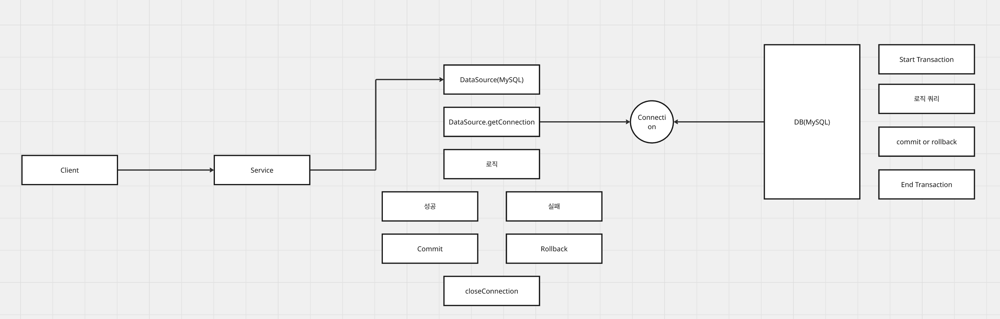
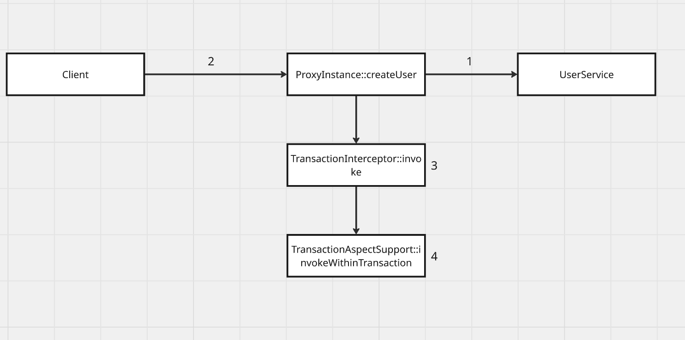

# [Spring] @Transactional의 동작 원리와 핵심 속성(전파, 격리)

- **Tags:** #Spring #SpringBoot #Transaction #AOP #Proxy #CGLib #Propagation

---
### 무엇을 배웠는가?
* Spring의 선언적 트랜잭션(`@Transactional`)이 **AOP와 프록시(Proxy)** 를 통해 어떻게 동작하는지 내부 원리를 학습합니다.
* 단순히 `@Transactional` 어노테이션을 붙이는 것 뿐이 아닌 **전파**, **격리** 수준을 이해합니다.

---
### 왜 중요하고, 어떤 맥락인가?
Spring을 사용하면 `@Transactional` 어노테이션으로 복잡한 트랜잭션 처리(커넥션 획득, commit, rollback, 반납)를 간단하게 할 수 있습니다.   
이는 Spring이 **프록시 패턴**을 이용하여 비즈니스 로직(핵심 기능)과 트랜잭션 처리(부가 기능)를 분리하기 떄문입니다.   
내부 동작 원리 이해를 통해 트랜잭션이 특정 상황에서 동작 안하는지(e.g private 메서드에 적용 불가)를 이해할 수 있습니다.   
또한, 트랜잭션 전파 등과 같은 속성을 이해하여 여러 트랜잭션이 엮여야 하는 상황에서 트랜잭션 격리, 전파 등 다양한 상황에 대응할 수 있습니다.

---
### 상세 내용
#### 1. `@Transactional`의 동작 원리: AOP 프록시
Spring은 `@Transactional`이 붙은 클래스나 메서드를 감지하면, 런타임에 해당 객체 대신 **프록시 객체**를 Bean으로 등록합니다.

1. 클라이언트가 서비스 메서드를 호출하면, 실제 객체가 아닌 **프록시 객체**가 요청을 받습니다.
2. 프록시는 `TransactionInterceptor`와 같은 부가 기능 핸들러를 호출합니다.
3. 핸들러는 실제 비즈니스 메서드 실행 전에 트랜잭션을 시작(커넥션 획득)합니다.
4. 실제 비즈니스 메서드를 호출합니다.
5. 메서드 실행 후 예외가 없으면 commit하고, 예외 발생 시 rollback합니다.
6. 마지막으로 트랜잭션을 종료합니다.

#### 2. 트랜잭션 전파 (Propagation)
propagation은 트랜잭션 경계에서 이미 진행중인 트랜잭션이 있을 때, 새로운 메서드의 트랜잭션을 어떻게 처리할지 정의합니다.

* `REQUIRED` (기본값): 이미 트랜잭션이 있으면 그 트랜잭션을 사용하고, 없으면 새로 생성합니다.
* `REQUIRES_NEW`: 부모 트랜잭션과 상관 없이 **항상 새로운 트랜잭션을 생성**하고, 독립적으로 트랜잭션이 수행됩니다.
* `SUPPORTS`: 부모 트랜잭션이 있으면 참여하지만, 없으면 트랜잭션 없이 그냥 실행합니다.
* `NOT_SUPPORTED`: 부모 트랜잭션이 있어도 참여하지 않고, 트랜잭션 없이 실행합니다.
* `MANDATORY`: 부모 트랜잭션이 **반드시 있어야** 하며, 없으면 예외가 발생합니다.
* `NEVER`: 부모 트랜잭션이 있으면 예외가 발생하고, 트랜잭션을 사용하지 않습니다.
* `NESTED`: 부모 트랜잭션이 있으면 속하지만, 자체적으로 `savepoint`를 가집니다. 중첩 트랜잭션에서 롤백이 발생해도 부모 트랜잭션에 영향을 주진 않지만 부모 트랜잭션이 롤백되면 함께 롤백됩니다.

#### 3. 트랜잭션 격리 수준 (Isolation)
isolation은 동시에 여러 트랜잭션이 수행될 때, 데이터 일관성을 어떻게 보장할지 정의합니다.

* `READ_UNCOMMITED`: 가장 낮은 수준으로 커밋되지 않은 데이터를 읽을 수 있습니다. (Dirty Read 허용)
* `READ_COMMITED`: 커밋된 데이터만 읽을 수 있으나, 동일 데이터를 두 번 조회 시 이전의 결과와 커밋된 결과가 다를 수 있습니다. (Non-repeatable Read 허용)
* `REPEATABLE_READ`: 동일 트랜잭션 내에서 동일 데이터를 여러 번 읽어도 항상 같은 결과를 보장합니다. 그러나 다른 트랜잭션에서 새로운 데이터를 삽입할 경우 새로운 데이터가 조회될 수 있습니다. (Phantom Read 허용)
* `SERIALIZABLE`: 가장 높은 수준으로 모든 트랜잭션이 순차적으로 실행되는 것처럼 동작합니다. (Dirty Read, Non-repeatable Read, Phantom Read 모두 방지)

#### 4. 기타 주요 속성
* readOnly: 읽기 전용 트랜잭션으로 설정하여 master-slave 구조에서 slave DB로 읽기 작업을 분산시킬 수 있습니다. 또한 JPA 사용 시 flush를 생략합니다.
* rollbackFor: 지정한 예외가 발생했을 때 롤백합니다.
* noRollbackFor: 지정한 예외가 발생해도 롤백하지 않습니다.
* timeout: 트랜잭션이 지정한 시간(초) 내에 완료되지 않으면 자동으로 롤백합니다.

---

### 요약
* Spring의 `@Transactional`은 AOP와 프록시 패턴을 통해 사용되므로 **프록시의 호출을 거치지 않는 내부 메서드 호출에는 트랜잭션이 적용되지 않습니다.**
* 복잡한 서비스 로직에서 **propagation**을 명시적으로 고려해야 의도치 않은 트랜잭션 동작을 막고 데이터 정합성을 지킬 수 있습니다.
* **isolation** 수준은 동시성 문제를 방지하고 데이터 일관성을 유지할 수 있습니다.
* readOnly, rollbackFor, timeout 등 다양한 속성을 통해 세밀한 트랜잭션 제어가 가능합니다.