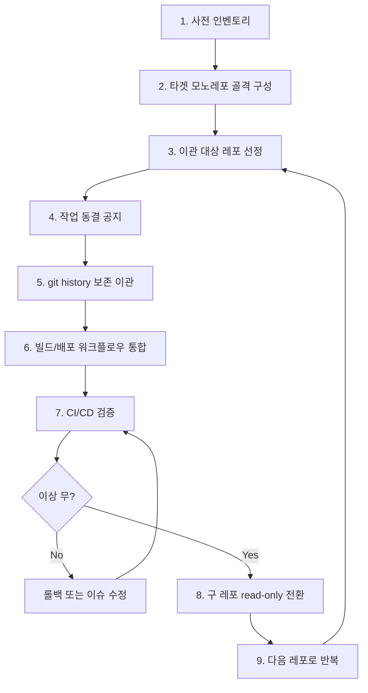

# 모노레포

## 모노레포란?
---
하나의 Git 저장소 안에 여러 개의 프로젝트(서비스, 라이브러리, 도구 등)를 함께 관리하는 코드 조직 전략이다. 각 프로젝트는 디렉토리로 구분되지만, 하나의 버전 관리 이력과 하나의 빌드 시스템을 공유한다.

### 모노레포 vs 멀티레포

| 항목 | 모노레포 | 멀티레포 |
|---|---|---|
| 저장소 수 | 1개 | 프로젝트마다 N개 |
| 코드 공유 | 직접 import (경로 참조) | 패키지 배포 후 의존 |
| 원자적 변경 | 여러 프로젝트 동시 변경을 한 PR로 가능 | 여러 PR + 버전 동기화 필요 |
| 빌드/CI | 영향받는 프로젝트만 선택적 빌드 (의존성 그래프 기반) | 레포 단위로 독립 빌드 |
| 권한 관리 | 디렉토리/CODEOWNERS 기반 | 레포 단위로 명확 |
| 저장소 크기 | 시간이 지날수록 커짐 (대용량 대응 필요) | 분산되어 작게 유지 |
| 도구 의존성 | 빌드 도구(Nx, Turborepo 등) 필수에 가까움 | 표준 도구로 충분 |

### 모노레포 장단점

**장점**
* **원자적 변경(Atomic Change)**: API 변경과 모든 호출부 수정이 하나의 커밋·PR로 묶인다. 멀티레포에서 흔한 "라이브러리 버전 미스매치"가 구조적으로 발생하지 않는다.
* **코드 공유 비용 감소**: 공통 모듈을 npm/maven 같은 레지스트리에 배포하지 않고 디렉토리 import로 즉시 재사용할 수 있다.
* **일관된 도구 체계**: 린터·포매터·테스트 러너·빌드 설정을 한 곳에서 강제할 수 있어 표준화가 쉽다.
* **전체 가시성**: 검색, 정적 분석, 리팩토링 도구를 코드베이스 전체에 적용할 수 있다.

**단점**
* **저장소 비대화**: clone·fetch·IDE 인덱싱 비용이 커지고, 일정 규모 이상이면 Git LFS, sparse checkout, partial clone 같은 보조 기술이 필요하다.
* **빌드 시스템 복잡도**: "변경 영향 범위만 빌드"하려면 의존성 그래프를 인식하는 빌드 도구(Nx, Turborepo, Bazel)가 필요하다.
* **권한·소유권의 모호함**: 누가 어디까지 수정 가능한지 CODEOWNERS·브랜치 정책으로 명시하지 않으면 충돌이 잦아진다.
* **CI 비용 증가**: 무지성으로 전체 빌드를 돌리면 비용이 폭증합니다. affected-only 빌드와 원격 캐시가 필요하다.

## 모노레포와 AI Context 상호작용
---
AI 코딩 에이전트(Claude Code, Cursor 등)는 "어떤 코드까지를 한 번에 볼 수 있느냐"가 결과 품질을 좌우한다. 

* **유리한 점**
  * 호출자–피호출자, 인터페이스–구현이 같은 트리에 있어 에이전트가 변경 영향 범위를 직접 추적할 수 있다. 멀티레포라면 "이 함수가 어디에서 쓰이는지 모르겠다"로 끝나지만 모노레포에서는 grep 한 번으로 검색 가능하다.
  * 컨벤션 문서(CLAUDE.md, AGENTS.md, harness-rules 등)를 루트 한 곳에 두면 모든 하위 프로젝트가 같은 규칙을 따르게 강제할 수 있다.
  * 리팩토링, 마이그레이션처럼 여러 서비스에 동시에 손을 대야 하는 작업이 한 세션 안에서 완결된다.
* **불리한 점**
  * 컨텍스트 윈도우가 한정되어 있어, 레포 전체를 무차별 로딩하면 토큰 예산을 빠르게 소진한다. `.gitignore`/`.claudeignore` 또는 sparse loading 전략이 필요합니다.
  * 디렉토리 컨벤션이 흐트러져 있으면 에이전트가 "이 모듈은 어디에 둬야 하는지" 판단을 못하므로 디렉토리 규칙을 명시하고, 타이트하게 가져가야한다.
  * CODEOWNERS·보안 경계가 약하면 에이전트가 의도치 않은 영역까지 수정하기 쉽다.

> 정리하면 모노레포는 AI 친화적인 구조에 가깝지만, "스코프 제한"과 "컨벤션 문서화"가 반드시 동반되어야 한다.

## 멀티레포 -> 모노레포 이관
---

### 이관 플로우

### 단계별 상세

1. **사전 인벤토리**
   * 이관 대상 레포 목록과 각 레포의 배포 애플리케이션 수를 모두 조사한다. 멀티 모듈 구성이라면 모듈별 배포 단위까지 식별한다.
   * 외부 의존(이미지 레지스트리, 사내 라이브러리, 시크릿) 위치를 정리한다.
2. **타겟 모노레포 골격 구성**
   * 루트 디렉토리 규칙, 빌드 도구(Nx/Turborepo/Gradle composite build 등), 공통 CI 워크플로우, CODEOWNERS를 먼저 확정한다.
3. **이관 대상 레포 선정**
   * 팀 내에서 순서를 정하면 된다. 
   * 의존성이 적고 독립적인 레포: 공통 라이브러리 → 말단 서비스 → 핵심 서비스 혹은 당장 작업이 활발한 서비스
   * 의존성이 많고 작업이 활발한 레포: 핵심 서비스 혹은 당장 작업이 활발한 서비스 → 공통 라이브러리 → 말단 서비스
4. **작업 동결 공지**
   * 특정 날짜를 기점으로 해당 레포의 신규 작업을 중지한다. 진행 중 PR은 머지 또는 중단을 결정한다.
   * 동결 없이 진행하면 이관 중 누락된 커밋이 발생한다.
5. **git history 보존 이관**
   * `git subtree add` 또는 `git filter-repo`로 히스토리를 유지하면서 옮긴다. 단순 복사는 blame·log를 잃게 되어 권장되지 않는다.
   * 주요 브랜치(dev, main, release)와 태그를 함께 이관한다.
   * **`git subtree add`**: 다른 레포를 현재 레포의 하위 디렉토리로 병합하면서 커밋 히스토리를 함께 가져오는 명령어. 사용 예 — `git subtree add --prefix=apps/service-a https://github.com/org/service-a.git main`. `--squash` 옵션을 빼면 원본 커밋이 그대로 보존되고, 이관 후에도 양방향 `pull`/`push`로 동기화가 가능해 점진 이관에 적합하다.
   * **`git filter-repo`**: 레포 히스토리를 재작성하는 도구(과거 `git filter-branch`의 공식 대체). 특정 디렉토리만 추출하거나 경로를 재배치하거나 민감 파일을 히스토리에서 제거할 때 사용한다. 사용 예 — `git filter-repo --to-subdirectory-filter apps/service-a` 를 실행하면 레포 전체 히스토리가 `apps/service-a/` 하위로 들어간 형태로 재작성되어 모노레포에 그대로 머지하기 쉬워진다. **히스토리 재작성**이므로 원본 레포 백업 후 사용해야 한다.
6. **빌드/배포 워크플로우 통합**
   * GitHub Actions YML을 모노레포 컨벤션으로 재작성하고, `paths` 필터로 영향 범위만 실행되게 한다.
   * 멀티 모듈 레포였다면 배포 애플리케이션이 많아 이 단계가 가장 오래 걸리지만, 다른 단계와 독립적으로 진행할 수 있다.
7. **CI/CD 검증**
   * dev/staging 환경에 실제 배포해 산출물(이미지 태그, 아티팩트 경로)이 기존과 동등한지 확인한다.
   * 차이가 발견되면 6단계로 돌아가 수정한다.
8. **구 레포 read-only 전환**
   * GitHub 설정에서 archive 처리하고, README에 신규 레포 위치를 명시한다.
9. **다음 레포로 반복**
   * 한 번에 모든 레포를 옮기지 않고 점진적으로 진행해야 롤백 비용이 작다.

### 주의사항

* **시크릿·환경변수 재설정**: 레포가 바뀌면 GitHub Secrets, Environments도 새로 구성해야 한다.
* **외부 참조 업데이트**: 모니터링 도구·이슈 트래커·문서의 레포 URL을 함께 변경한다.
* **의존성 버전 충돌**: 여러 레포가 같은 라이브러리의 서로 다른 버전을 쓰고 있었다면, 모노레포 통합 시점에 단일 버전으로 통합해야 한다.